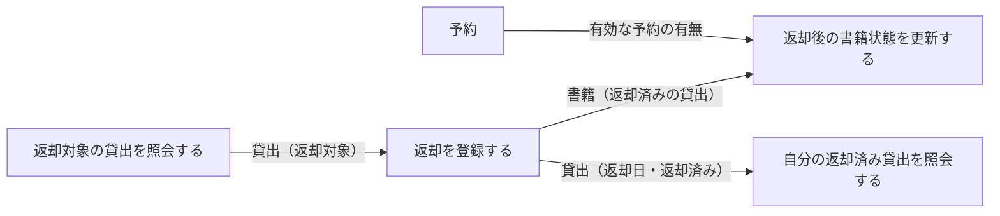
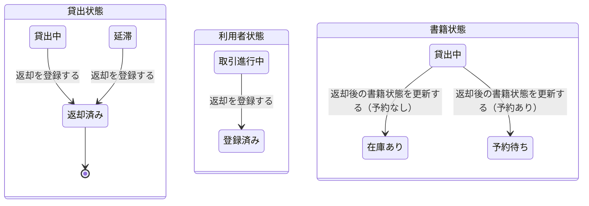

# 書籍を返却するフロー

## 概要

利用者が借りた書籍を窓口へ返し、司書が返却を受け付けて返却後の在庫を整えるまでの業務フロー。返却登録で貸出状態と利用者状態が遷移し、その後の在庫整理で返却後状態決定条件に従い書籍状態を在庫あり／予約待ちに振り分ける。

## 所属 UC 一覧

| UC名 | アクター | 主な操作 | 関連情報 |
|------|---------|---------|---------|
| [返却対象の貸出を照会する](返却対象の貸出を照会する/spec.md) | 利用者（提供者） | 返却対象貸出確認画面で返却する貸出を確認する | 書籍、貸出、利用者 |
| [返却を登録する](返却を登録する/spec.md) | 司書（提供者） | 窓口返却受付画面で返却を受け付け、返却日を記録する | 書籍、貸出、利用者 |
| [返却後の書籍状態を更新する](返却後の書籍状態を更新する/spec.md) | 司書（提供者） | 返却後在庫整理画面で予約有無に応じて書籍状態を更新する | 書籍、予約 |
| [自分の返却済み貸出を照会する](自分の返却済み貸出を照会する/spec.md) | 利用者（受益者） | 返却完了確認画面で返却が完了したことを確認する | 書籍、貸出、利用者アカウント |

## UC 横断データフロー

返却対象の特定 → 返却登録 → 在庫整理、という順に進み、利用者は最後に返却完了を確認する。

### データフロー図

### 情報 CRUD マトリクス

| 情報名 | 返却対象の貸出を照会する | 返却を登録する | 返却後の書籍状態を更新する | 自分の返却済み貸出を照会する |
|--------|:----------------------:|:-------------:|:-------------------------:|:---------------------------:|
| 貸出 | R | U | | R |
| 書籍 | R | R | U | R |
| 利用者 | R | U | | |
| 予約 | | | R | |
| 利用者アカウント | | | | R |

> 「返却を登録する」の利用者 U は、進行中の取引がなくなった場合の利用者状態（取引進行中 → 登録済み）の更新を指す。

## 状態遷移全体図

返却を起点に貸出状態・利用者状態・書籍状態が遷移する。

### 状態遷移 UC マッピング

| 状態モデル | 遷移元 | 遷移先 | 担当 UC |
|-----------|--------|--------|--------|
| 貸出状態 | 貸出中 | 返却済み | [返却を登録する](返却を登録する/spec.md) |
| 貸出状態 | 延滞 | 返却済み | [返却を登録する](返却を登録する/spec.md) |
| 利用者状態 | 取引進行中 | 登録済み | [返却を登録する](返却を登録する/spec.md) |
| 書籍状態 | 貸出中 | 在庫あり | [返却後の書籍状態を更新する](返却後の書籍状態を更新する/spec.md) |
| 書籍状態 | 貸出中 | 予約待ち | [返却後の書籍状態を更新する](返却後の書籍状態を更新する/spec.md) |
| 貸出状態（参照） | 貸出中 / 延滞 / 返却済み | （遷移なし） | [返却対象の貸出を照会する](返却対象の貸出を照会する/spec.md), [自分の返却済み貸出を照会する](自分の返却済み貸出を照会する/spec.md) |

## BUC 内共有条件一覧

| 条件名 | 条件の説明 | 適用 UC |
|--------|----------|--------|
| 個人情報参照可否条件 | 貸出履歴・予約状況の照会は、ログイン中の利用者本人に紐づく貸出・予約のみを対象とする。他の利用者の貸出・予約は表示しない | 返却対象の貸出を照会する, 自分の返却済み貸出を照会する |

単独適用の条件（詳細は各 UC Spec を参照）:

| 条件名 | 条件の説明 | 適用 UC |
|--------|----------|--------|
| 督促通知対象条件 | 貸出状態が「貸出中」または「延滞」であり、かつ返却期限を経過した貸出を督促対象とする。督促時に貸出状態を「延滞」へ遷移させ、貸出状態が「返却済み」になった時点で督促を停止する | 返却を登録する |
| 返却後状態決定条件 | 返却受付時に対象書籍への有効な予約（予約状態が「予約中」）が存在する場合は書籍状態を「予約待ち」とし、存在しない場合は「在庫あり」とする | 返却後の書籍状態を更新する |

## BUC 内共有バリエーション一覧

| バリエーション名 | 値 | 適用 UC |
|----------------|---|--------|
| 貸出期間区分 | 標準、短期、長期 | 返却対象の貸出を照会する, 返却を登録する, 自分の返却済み貸出を照会する |

単独適用のバリエーション:

| バリエーション名 | 値 | 適用 UC |
|----------------|---|--------|
| 通知種別 | 取置き案内、返却期限リマインド、延滞督促 | 返却を登録する（返却済みへの遷移で「延滞督促」の対象から外す） |
| 通知タイミング区分 | 期限前リマインド、期限当日、期限超過督促 | 返却を登録する（督促通知対象条件の判定基準） |
| 資料種別 | 紙書籍、電子書籍 | 返却後の書籍状態を更新する（対象書籍の資料種別を表示） |
