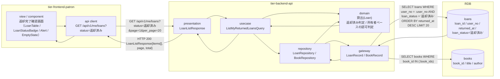
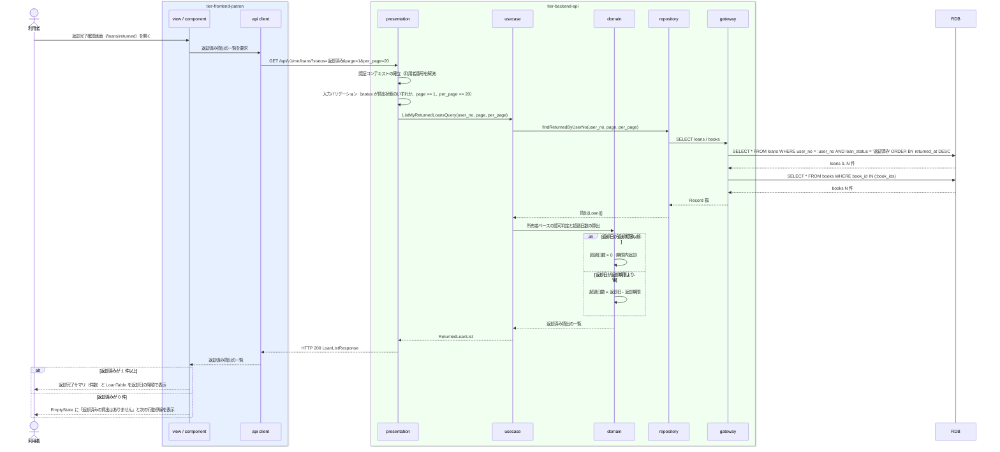

# 自分の返却済み貸出を照会する

## 概要

利用者が、返却が完了したことを利用者ポータルの Web 画面で確認する。返却日と返却済みとなった貸出記録を一覧で表示する。個人情報参照可否条件により、ログイン中の利用者本人に紐づく貸出のみを対象とする。参照のみで状態遷移は発生しない。

## データフロー



| レイヤー | データモデル | 変換内容 |
|---------|------------|---------|
| FE view | 返却済み貸出の一覧（書籍タイトル・返却期限・返却日・貸出状態） | 返却日の降順で表示し、直近の返却完了を先頭に置く。完了サマリ（件数）を上部に示す |
| FE api client | GET `/api/v1/me/loans?status=返却済み` | アクセストークン付与、trace_id 発行、参照系リトライ（最大 2 回） |
| BE presentation | LoanListResponse(items[], page, per_page, total) | 認証コンテキストの確立、ページネーションパラメータの検証 |
| BE usecase | ListMyReturnedLoansQuery(user_no, page, per_page) | 読み取り専用 Query。認証コンテキストの利用者番号を必ず条件に含める |
| BE domain | 貸出(Loan) | 貸出状態が「返却済み」の貸出のみを対象とし、所有者ベースの認可判定を強制する |
| BE gateway | LoanRecord / BookRecord | `loans` の SELECT（ページネーション）と `books` の一括 SELECT |
| Response | { items: [{ loan_id, book{...}, loan_date, due_date, returned_at, overdue_days, loan_status }], page, per_page, total } | 返却完了の確認に使う |

## 処理フロー



## バリエーション一覧

| バリエーション名 | 値 | 処理内容 | 適用 tier | 適用箇所 |
|----------------|---|---------|----------|---------|
| 貸出期間区分 | 標準 / 短期 / 長期 | 一覧の各行に貸出期間区分を表示し、返却期限の根拠として示す | tier-frontend-patron, tier-backend-api | 返却完了確認画面 / LoanListResponse.items[].loan_period_type |

## 分岐条件一覧

| 条件名 | 判定ルール | 適用 tier | 適用箇所 | BDD Scenario |
|--------|----------|----------|---------|-------------|
| 個人情報参照可否条件 | 貸出の照会は、ログイン中の利用者本人に紐づく貸出のみを対象とする。他の利用者の貸出は表示しない | tier-backend-api, tier-frontend-patron | domain の所有者ベース認可判定 / 画面の導線制約 | 自分の返却済み貸出だけが表示される |

照会対象は貸出状態が「返却済み」の貸出に限る。貸出状態が「貸出中」「延滞」の貸出は本 UC の対象外とする。

## 計算ルール一覧

| 計算名 | 入力情報 | 計算式/ロジック | 出力情報 | 適用 tier |
|--------|---------|---------------|---------|----------|
| 超過日数の算出 | 貸出.返却期限（due_date）、貸出.返却日（returned_at） | `overdue_days = max(0, returned_at - due_date)`（日数）。期限内返却は 0 | 超過日数 | tier-backend-api |
| 返却済み一覧の表示順 | 貸出.返却日（returned_at） | 返却日の降順で並べる。直近の返却完了が先頭に来る | 一覧の表示順 | tier-backend-api |

## 状態遷移一覧

| 状態モデル | 遷移元 | 遷移先 | トリガー | 事前条件 | 事後処理 | 適用 tier |
|-----------|--------|--------|---------|---------|---------|----------|
| 貸出状態 | 返却済み | 返却済み（遷移なし） | 自分の返却済み貸出を照会する | 貸出が本人に紐づき、貸出状態が「返却済み」 | なし（返却済みの貸出は過去の貸出履歴・貸出統計の集計対象として保持される） | tier-backend-api |

## 関連 RDRA モデル

| モデル種別 | 要素名 | 関連 |
|-----------|--------|------|
| 業務 | 蔵書利用業務 | このUCが属する業務 |
| BUC | 書籍を返却するフロー | このUCを含むBUC |
| アクター | 利用者 | 返却完了を確認するアクター（受益者） |
| 情報 | 貸出 | 参照する情報（返却日・貸出状態） |
| 情報 | 書籍 | 返却した書籍（タイトル・著者） |
| 情報 | 利用者アカウント | 本人限定参照の判定に使う |
| 状態 | 貸出状態 | 返却済みの貸出のみを対象とする |
| 条件 | 個人情報参照可否条件 | 適用される条件 |
| 画面 | 返却完了確認画面 | 利用者ポータルの対象画面 |

## E2E 完了条件（BDD）

### 正常系

```gherkin
Feature: 自分の返却済み貸出を照会する

  Scenario: 自分の返却済み貸出だけが表示される
    Given 利用者「田中太郎」（利用者番号 "U-000123"）が利用者ポータルにログイン済み
    And 貸出「L-000001」（書籍「吾輩は猫である」、返却日 2026-09-10、貸出状態 "返却済み"）が利用者「田中太郎」に紐づいて存在する
    And 貸出「L-000009」（書籍「三四郎」、貸出状態 "返却済み"）が利用者「佐藤次郎」（利用者番号 "U-000456"）に紐づいて存在する
    When 利用者「田中太郎」が返却完了確認画面（/loans/returned）を開く
    Then 貸出「L-000001」（書籍「吾輩は猫である」、返却日「2026年9月10日」）が一覧に表示される
    And 貸出「L-000009」（書籍「三四郎」）は表示されない
    And LoanStatusBadge に「返却済み」が表示される

  Scenario: 返却済み貸出は返却日の降順で表示される
    Given 利用者「田中太郎」（利用者番号 "U-000123"）がログイン済み
    And 貸出「L-000001」（返却日 2026-09-10、貸出状態 "返却済み"）と貸出「L-000002」（返却日 2026-08-20、貸出状態 "返却済み"）が存在する
    When 利用者が返却完了確認画面（/loans/returned）を開く
    Then 一覧の 1 行目に貸出「L-000001」（返却日「2026年9月10日」）が表示される
    And 一覧の 2 行目に貸出「L-000002」（返却日「2026年8月20日」）が表示される

  Scenario: 延滞返却も超過日数とともに返却済みとして表示される
    Given 利用者「田中太郎」（利用者番号 "U-000123"）がログイン済み
    And 貸出「L-000003」（返却期限 2026-08-30、返却日 2026-09-02、貸出状態 "返却済み"）が存在する
    When 利用者が返却完了確認画面（/loans/returned）を開く
    Then 貸出「L-000003」が LoanStatusBadge「返却済み」つきで表示される
    And 「3 日超過して返却」と事実として表示される
```

### 異常系

```gherkin
  Scenario: 貸出中の貸出は返却済み一覧に含まれない
    Given 利用者「田中太郎」（利用者番号 "U-000123"）がログイン済み
    And 貸出「L-000004」（書籍「三四郎」、貸出状態 "貸出中"）だけが利用者「田中太郎」に紐づいて存在する
    When 利用者が返却完了確認画面（/loans/returned）を開く
    Then 一覧に貸出「L-000004」は表示されない
    And EmptyState に「返却済みの貸出はありません」が表示される

  Scenario: 返却済みが 0 件のとき次の行動導線を提示する
    Given 利用者「田中太郎」（利用者番号 "U-000123"）がログイン済み
    And 利用者「田中太郎」に返却済みの貸出が 1 件も存在しない
    When 利用者が返却完了確認画面（/loans/returned）を開く
    Then EmptyState に「返却済みの貸出はありません」が表示される
    And 現在の貸出一覧画面（/loans）への導線が表示される

  Scenario: 未ログインでは照会できない
    Given 利用者がログインしていない
    When 利用者が返却完了確認画面（/loans/returned）を開く
    Then ログイン画面へリダイレクトされる
```

## ティア別仕様

- [利用者ポータル](tier-frontend-patron.md)
- [バックエンド API](tier-backend-api.md)

### 統合 API Spec

- [OpenAPI Spec](../../_cross-cutting/api/openapi.yaml)（全 UC 統合、Contract First 開発用）
