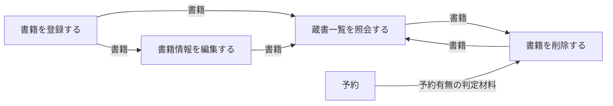
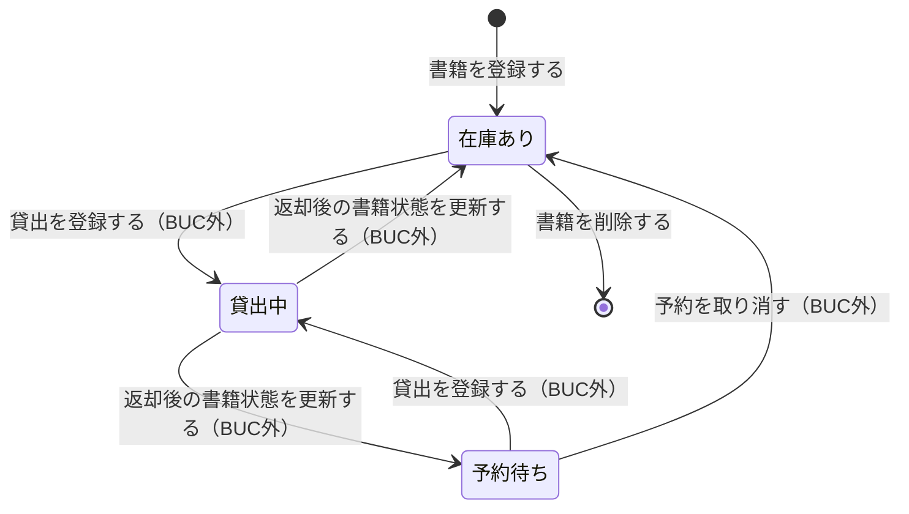

# 蔵書を管理するフロー

## 概要

司書が図書館の蔵書を一元管理する業務フロー。書籍の受入登録・書誌情報の訂正・除籍（削除）・登録状況の確認を通じて、蔵書と書籍状態の最新性を保つ。ここで登録された書籍が、蔵書利用業務（検索・貸出・返却）と分析業務の基盤データになる。

## 所属 UC 一覧

| UC名 | アクター | 主な操作 | 関連情報 |
|------|---------|---------|---------|
| [蔵書一覧を照会する](蔵書一覧を照会する/spec.md) | 司書（受益者） | 蔵書管理台帳画面で登録済み書籍を一覧・絞り込み表示する | 書籍 |
| [書籍を登録する](書籍を登録する/spec.md) | 司書（提供者） | 書籍受入登録画面でタイトル・著者・ISBN・出版社・ジャンル・資料種別を登録する | 書籍 |
| [書籍情報を編集する](書籍情報を編集する/spec.md) | 司書（提供者） | 書誌情報訂正画面で登録済み書籍の書誌情報を訂正する | 書籍 |
| [書籍を削除する](書籍を削除する/spec.md) | 司書（提供者） | 除籍手続画面で蔵書削除可否条件を満たす書籍を蔵書から外す | 書籍、予約 |

## UC 横断データフロー

BUC 内の UC 間で情報がどう流れるかを示す。書籍情報は「書籍を登録する」で生成され、以降の全 UC が同じ書籍を参照・更新する。

### データフロー図

### 情報 CRUD マトリクス

| 情報名 | 書籍を登録する | 蔵書一覧を照会する | 書籍情報を編集する | 書籍を削除する |
|--------|:-------------:|:-----------------:|:-----------------:|:-------------:|
| 書籍 | C | R | U | D |
| 予約 | | | | R |

## 状態遷移全体図

書籍状態の全遷移パスを示す。本 BUC が担当するのは開始（登録）と終端（削除）で、中間の貸出中・予約待ちへの遷移は蔵書利用業務・予約管理業務の UC が担当する。

### 状態遷移 UC マッピング

| 状態モデル | 遷移元 | 遷移先 | 担当 UC |
|-----------|--------|--------|--------|
| 書籍状態 | （初期） | 在庫あり | [書籍を登録する](書籍を登録する/spec.md) |
| 書籍状態 | 在庫あり | （終端） | [書籍を削除する](書籍を削除する/spec.md) |
| 書籍状態 | 在庫あり | 貸出中 | 貸出を登録する（蔵書利用業務／書籍を貸し出すフロー） |
| 書籍状態 | 貸出中 | 在庫あり / 予約待ち | 返却後の書籍状態を更新する（蔵書利用業務／書籍を返却するフロー） |
| 書籍状態 | 予約待ち | 貸出中 | 貸出を登録する（蔵書利用業務／書籍を貸し出すフロー） |
| 書籍状態 | 予約待ち | 在庫あり | 予約を取り消す（予約管理業務／書籍を予約するフロー） |

> 「書籍情報を編集する」「蔵書一覧を照会する」は書籍状態を遷移させない（編集は書誌属性のみ、照会は参照のみ）。

## BUC 内共有条件一覧

複数 UC で共有される条件と、単独 UC でのみ適用される条件を区別して示す。

| 条件名 | 条件の説明 | 適用 UC |
|--------|----------|--------|
| 資料種別利用可否条件 | 資料種別が「紙書籍」の蔵書のみ初期リリースで登録・貸出の対象とする。「電子書籍」を指定した場合は未対応である旨を案内し登録しない | 書籍を登録する, 書籍情報を編集する |

単独適用の条件（詳細は各 UC Spec を参照）:

| 条件名 | 条件の説明 | 適用 UC |
|--------|----------|--------|
| 蔵書削除可否条件 | 対象書籍の書籍状態が「在庫あり」であり、かつ予約状態が「予約中」「取置き中」の予約が存在しない場合に限り削除を許可する | 書籍を削除する |

## BUC 内共有バリエーション一覧

| バリエーション名 | 値 | 適用 UC |
|----------------|---|--------|
| 資料種別 | 紙書籍、電子書籍 | 書籍を登録する, 書籍情報を編集する, 蔵書一覧を照会する |
| ジャンル | 文学、人文、社会科学、自然科学、技術、芸術、児童、その他 | 書籍を登録する, 書籍情報を編集する, 蔵書一覧を照会する |

> 「書籍を削除する」はバリエーションによる分岐を持たない。
