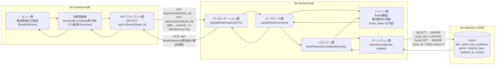
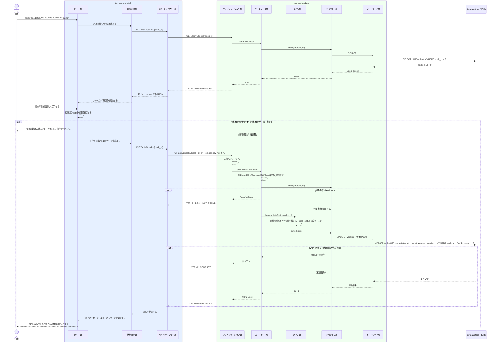

# 書籍情報を編集する

## 概要

司書が書誌情報訂正画面で、登録済み書籍のタイトル・著者・ISBN・出版社・ジャンル・資料種別の誤りや変更を反映し、システムが保持するデータを単一の正として維持する。資料種別は資料種別利用可否条件により「紙書籍」のみ有効とする。書籍状態は本 UC では変更しない。

## データフロー



| レイヤー | データモデル | 変換内容 |
|---------|------------|---------|
| FE ビュー層 | 現行の書誌情報と入力値、変更項目の差分表示 | 変更した項目だけを保存前に確認表示する |
| FE 状態管理層 | BookEditFormState(current, draft, dirtyFields[], version, submitting) | 差分算出と楽観ロック用 version の保持 |
| FE API クライアント層 | GET → PUT /api/v1/books/{book_id} | 認証トークン付与・冪等キー付与・trace_id 発行 |
| BE プレゼンテーション層 | UpdateBookRequest(title, author, isbn?, publisher, genre, material_type, version) | 必須・長さ・列挙値バリデーション + UpdateBookCommand 変換 |
| BE ユースケース層 | UpdateBookCommand | トランザクション境界・冪等キー検証・監査ログ出力 |
| BE ドメイン層 | Book（集約ルート AG-001） | 書誌属性のみ更新し、book_status は不変に保つ。資料種別利用可否条件を強制する |
| BE ゲートウェイ層 | BookRecord ⇔ books テーブル | UPDATE（version による楽観ロック、updated_at を更新時刻に設定） |
| Response | BookResponse(更新後の全書誌属性) | 完了メッセージと台帳の再取得に使う |

## 処理フロー



## バリエーション一覧

| バリエーション名 | 値 | 処理内容 | 適用 tier | 適用箇所 |
|----------------|---|---------|----------|---------|
| 資料種別 | 紙書籍、電子書籍 | 「紙書籍」のみ有効。「電子書籍」への変更は未対応として案内し保存しない | tier-frontend-staff / tier-backend-api | 書誌情報訂正画面の ToggleGroup / PUT /api/v1/books/{book_id} の material_type 検証 |
| ジャンル | 文学、人文、社会科学、自然科学、技術、芸術、児童、その他 | 訂正対象の必須項目。ToggleGroup（single）で選択させる | tier-frontend-staff / tier-backend-api | 書誌情報訂正画面 / UpdateBookRequest.genre |

## 分岐条件一覧

| 条件名 | 判定ルール | 適用 tier | 適用箇所 | BDD Scenario |
|--------|----------|----------|---------|-------------|
| 資料種別利用可否条件 | 資料種別が「紙書籍」のときのみ保存を許可する。「電子書籍」は未対応である旨を案内し保存しない | tier-frontend-staff / tier-backend-api | 書誌情報訂正画面 / Book.updateBibliography | 資料種別を電子書籍へ変更できない |
| 対象書籍の存在確認 | book_id に一致する書籍が存在しないときは 404 とする | tier-backend-api | ユースケース層の findById | 存在しない書籍IDの編集を拒否する |
| 楽観ロック競合 | version が一致しないときは更新せず 409 とする | tier-backend-api | ゲートウェイ層の UPDATE ... WHERE version = ? | 他の司書の更新と競合したとき保存を止める |
| 変更なし送信 | 差分がない場合は保存ボタンを無効にする | tier-frontend-staff | 書誌情報訂正画面 | 変更がないときは保存できない |

## 計算ルール一覧

| 計算名 | 入力情報 | 計算式/ロジック | 出力情報 | 適用 tier |
|--------|---------|---------------|---------|----------|
| 変更差分の算出 | 現行の書誌情報、入力値 | 項目ごとに current ≠ draft の項目を dirtyFields として抽出する | 保存前に表示する変更項目一覧 | tier-frontend-staff |
| 更新日時の設定 | 更新処理の実行時刻 | updated_at = 更新時刻（registered_at は変更しない） | 書籍.更新日時 | tier-backend-api |

## 状態遷移一覧

| 状態モデル | 遷移元 | 遷移先 | トリガー | 事前条件 | 事後処理 | 適用 tier |
|-----------|--------|--------|---------|---------|---------|----------|
| 書籍状態 | （遷移なし） | （遷移なし） | 書籍情報を編集する（書誌属性のみ更新） | 対象書籍が存在すること | book_status は変更せず、updated_at のみ更新する | tier-backend-api |

## 関連 RDRA モデル

| モデル種別 | 要素名 | 関連 |
|-----------|--------|------|
| 業務 | 蔵書管理業務 | このUCが属する業務 |
| BUC | 蔵書を管理するフロー | このUCを含むBUC |
| アクター | 司書 | 操作するアクター（提供者） |
| 情報 | 書籍 | 更新する情報 |
| 状態 | 書籍状態 | 表示のみ（本 UC では遷移しない） |
| 条件 | 資料種別利用可否条件 | 適用される条件 |
| バリエーション | 資料種別、ジャンル | 入力項目の選択肢 |
| 画面 | 書誌情報訂正画面 | 操作する画面 |

## E2E 完了条件（BDD）

### 正常系

```gherkin
Feature: 書籍情報を編集する

  Scenario: 誤った著者名を訂正する
    Given 司書「山田花子」が司書ポータルにログイン済み
    And 蔵書に「吾輩は猫である」（著者「夏目 漱右」、書籍状態「在庫あり」）が登録されている
    When 司書が書誌情報訂正画面で著者を「夏目漱石」に訂正して保存する
    Then 「更新しました」と表示され、蔵書管理台帳画面の著者が「夏目漱石」になり、書籍状態は「在庫あり」のまま変わらない

  Scenario: 保存前に変更項目を確認する
    Given 司書「山田花子」が「吾輩は猫である」の書誌情報訂正画面を開いている
    When 司書が出版社を「新潮社」から「岩波書店」に変更する
    Then 変更項目として「出版社: 新潮社 → 岩波書店」だけが確認表示される
```

### 異常系

```gherkin
  Scenario: 資料種別を電子書籍へ変更できない
    Given 司書「山田花子」が「吾輩は猫である」（資料種別「紙書籍」）の書誌情報訂正画面を開いている
    When 司書が資料種別「電子書籍」を選択する
    Then 「電子書籍は現在未対応です。紙書籍のみ登録できます」と案内され、保存ボタンが押せない

  Scenario: 存在しない書籍IDの編集を拒否する
    Given 司書「山田花子」がログイン済み
    When 司書が削除済みの書籍ID「BK-999」の書誌情報訂正画面を開く
    Then 「対象の書籍が見つかりません」と表示され、蔵書管理台帳画面への導線が示される

  Scenario: 他の司書の更新と競合したとき保存を止める
    Given 司書「山田花子」が「吾輩は猫である」の書誌情報訂正画面を開いている
    And 別の司書「鈴木次郎」が同じ書籍のタイトルを先に更新している
    When 司書「山田花子」が著者を訂正して保存する
    Then 「他の担当者が更新しました。最新の内容を読み込んで操作し直してください」と表示され、更新は行われない
```

## ティア別仕様

- [司書ポータル](tier-frontend-staff.md)
- [バックエンド API](tier-backend-api.md)

### 統合 API Spec

- [OpenAPI Spec](../../../_cross-cutting/api/openapi.yaml)（全 UC 統合、Contract First 開発用）
