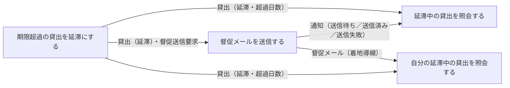
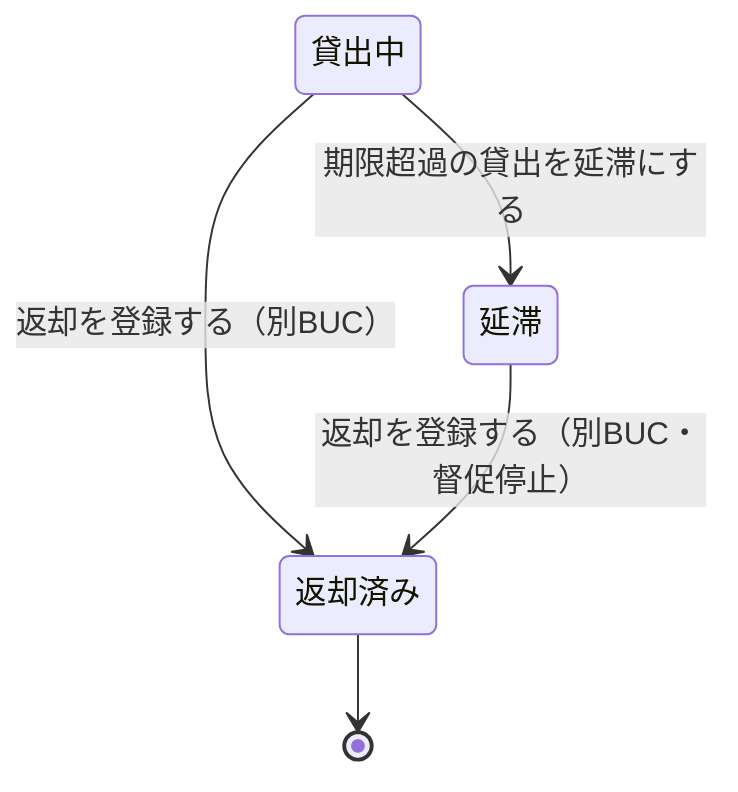
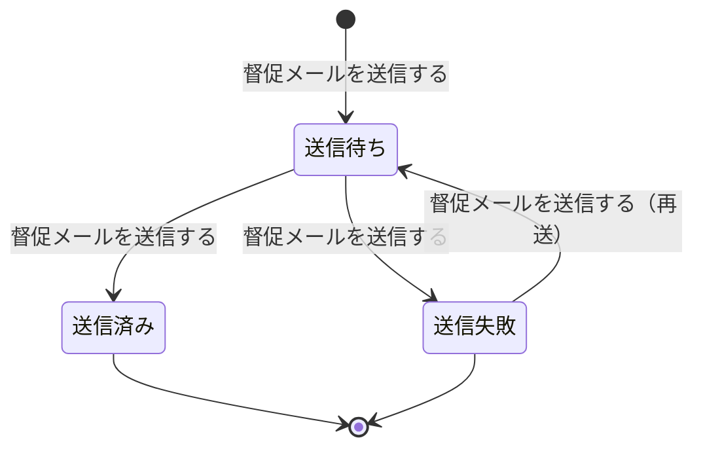

# 延滞を督促するフロー

## 概要

返却期限超過判定日次タイマーで期限を超過した貸出を抽出して貸出状態を「延滞」へ遷移させ、メール配信サービス経由で督促メールを送信する BUC。司書は延滞状況一覧画面で督促の実施状況と未達を把握し、督促を受けた利用者は自分の延滞中の貸出を確認して返却する。貸出状態が「返却済み」になった時点で督促は停止する。

## 所属 UC 一覧

| UC名 | アクター | 主な操作 | 関連情報 |
|------|---------|---------|---------|
| [期限超過の貸出を延滞にする](期限超過の貸出を延滞にする/spec.md) | 司書（提供者・タイマー起動） | 返却期限を超過した貸出中の貸出を抽出し、貸出状態を「延滞」へ遷移させて督促送信要求を生成する | 貸出 |
| [延滞中の貸出を照会する](延滞中の貸出を照会する/spec.md) | 司書（受益者） | 貸出状態が「延滞」の貸出を超過日数の降順で一覧し、直近督促の通知状態と未返却の書籍を把握する | 貸出、書籍、利用者、通知 |
| [督促メールを送信する](督促メールを送信する/spec.md) | 司書（提供者）／利用者（受信者） | 通知を「送信待ち」で作成し、メール配信サービスへ延滞督促メール送信依頼を発行して結果を記録する | 通知、貸出、利用者 |
| [自分の延滞中の貸出を照会する](自分の延滞中の貸出を照会する/spec.md) | 利用者（提供者） | 本人の延滞中の貸出と超過日数を Web 画面で確認し、返却対象を特定する | 貸出、書籍、利用者アカウント |

## UC 横断データフロー

「期限超過の貸出を延滞にする」が貸出状態を延滞へ遷移させ、その結果を「延滞中の貸出を照会する」と「督促メールを送信する」が参照する。「督促メールを送信する」が作成した通知の通知状態を「延滞中の貸出を照会する」が督促実施状況として合成表示し、督促メールの着地点として利用者が「自分の延滞中の貸出を照会する」で同じ貸出を参照する。

### データフロー図

「延滞中の貸出を照会する」は照会専用であり、督促の再送はデータフローではなく画面遷移で行う（UC2 の一覧で未達を把握し、督促送信画面（UC3）へ遷移して送信・再送を実施する）。

### 情報 CRUD マトリクス

| 情報名 | 期限超過の貸出を延滞にする | 延滞中の貸出を照会する | 督促メールを送信する | 自分の延滞中の貸出を照会する |
|--------|:-------------------------:|:---------------------:|:-------------------:|:---------------------------:|
| 貸出 | U | R | R | R |
| 通知 | | R | C / U | |
| 書籍 | | R | | R |
| 利用者 | | R | R | |
| 利用者アカウント | | | | R |

## 状態遷移全体図

本 BUC は貸出状態（貸出中 → 延滞）と通知状態の送信進行を遷移させる。返却済みへの遷移は BUC「書籍を返却するフロー」が担当し、その時点で督促が停止する。

### 状態遷移 UC マッピング

| 状態モデル | 遷移元 | 遷移先 | 担当 UC |
|-----------|--------|--------|--------|
| 貸出状態 | 貸出中 | 延滞 | [期限超過の貸出を延滞にする](期限超過の貸出を延滞にする/spec.md) |
| 貸出状態 | 延滞 | （再遷移しない） | [期限超過の貸出を延滞にする](期限超過の貸出を延滞にする/spec.md) |
| 貸出状態 | 延滞 | （遷移なし・送信時の再判定に参照） | [督促メールを送信する](督促メールを送信する/spec.md) |
| 貸出状態 | 延滞 | （遷移なし・表示対象に参照） | [延滞中の貸出を照会する](延滞中の貸出を照会する/spec.md), [自分の延滞中の貸出を照会する](自分の延滞中の貸出を照会する/spec.md) |
| 通知状態 | （未生成） | 送信待ち | [督促メールを送信する](督促メールを送信する/spec.md) |
| 通知状態 | 送信待ち | 送信済み | [督促メールを送信する](督促メールを送信する/spec.md) |
| 通知状態 | 送信待ち | 送信失敗 | [督促メールを送信する](督促メールを送信する/spec.md) |
| 通知状態 | 送信失敗 | 送信待ち | [督促メールを送信する](督促メールを送信する/spec.md) |
| 通知状態 | （参照のみ） | （参照のみ） | [延滞中の貸出を照会する](延滞中の貸出を照会する/spec.md) |

## BUC 内共有条件一覧

2 つ以上の UC で適用される条件を示す。

| 条件名 | 条件の説明 | 適用 UC |
|--------|----------|--------|
| 督促通知対象条件 | 貸出状態が「貸出中」または「延滞」であり、かつ返却期限を経過した貸出を督促対象とする。督促時に貸出状態を「延滞」へ遷移させ、貸出状態が「返却済み」になった時点で督促を停止する | 期限超過の貸出を延滞にする, 延滞中の貸出を照会する, 督促メールを送信する |

単一 UC のみで適用される条件（詳細は各 UC Spec を参照）。

| 条件名 | 適用 UC |
|--------|--------|
| 個人情報参照可否条件 | 自分の延滞中の貸出を照会する |

## BUC 内共有バリエーション一覧

2 つ以上の UC で適用されるバリエーションを示す。

| バリエーション名 | 値 | 適用 UC |
|----------------|---|--------|
| 通知種別 | 延滞督促 | 期限超過の貸出を延滞にする, 延滞中の貸出を照会する, 督促メールを送信する, 自分の延滞中の貸出を照会する |
| 通知タイミング区分 | 期限超過督促 | 期限超過の貸出を延滞にする, 延滞中の貸出を照会する, 督促メールを送信する |
| 貸出期間区分 | 標準 / 短期 / 長期 | 期限超過の貸出を延滞にする, 延滞中の貸出を照会する, 自分の延滞中の貸出を照会する |
| 利用者区分 | 一般 / 学生 / 団体 | 延滞中の貸出を照会する, 督促メールを送信する |
