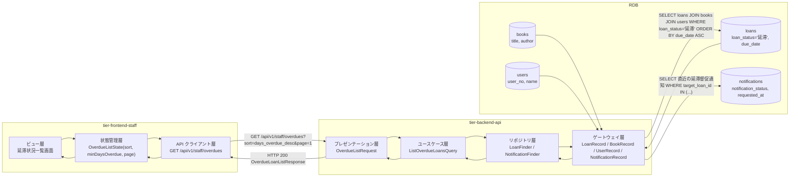
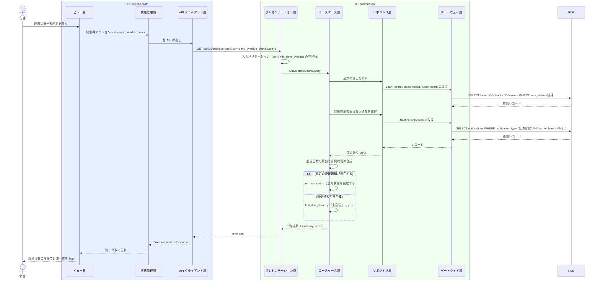

# 延滞中の貸出を照会する

## 概要

司書が貸出状態「延滞」の貸出を一覧で確認し、督促の実施状況（直近の督促通知の通知状態）と未返却の書籍を把握する。超過日数の降順を既定ソートとし、長期延滞から着手できるようにする。督促送信画面への導線を持つ。

## データフロー



| レイヤー | データモデル | 変換内容 |
|---------|------------|---------|
| FE ビュー | 並び替え・超過日数の絞り込み・ページ操作 | 既定ソート「超過日数の降順」を初期値として保持する |
| FE 状態管理 | OverdueListState | 検索条件と結果を保持し、URL クエリと同期する |
| BE プレゼンテーション | OverdueListRequest(sort, min_days_overdue, page, per_page) | 許容値チェック + Query 変換 |
| BE リポジトリ | LoanFinder / NotificationFinder | 延滞の貸出と、対象貸出ごとの直近督促通知を取得する |
| BE ユースケース | ListOverdueLoansQuery | 超過日数を算出し、督促状況（未送信 / 送信済み / 送信失敗）を合成する |
| Response | OverdueLoanListResponse(summary, total, items[]) | 延滞総数・未達件数と明細を一覧表示に使う |

## 処理フロー



## バリエーション一覧

| バリエーション名 | 値 | 処理内容 | 適用 tier | 適用箇所 |
|----------------|---|---------|----------|---------|
| 通知種別 | 延滞督促 | 督促状況の合成対象を延滞督促の通知に限定する | tier-backend-api | ListOverdueLoansQuery |
| 通知タイミング区分 | 期限超過督促 | 直近督促の抽出条件に使う | tier-backend-api | NotificationFinder |
| 貸出期間区分 | 標準 / 短期 / 長期 | 返却期限の算出済み値を表示するだけで分岐しない | tier-frontend-staff | 一覧の表示列 |
| 利用者区分 | 一般 / 学生 / 団体 | 一覧の表示列に含めるが絞り込みには使わない | tier-frontend-staff | 一覧の表示列 |

## 分岐条件一覧

| 条件名 | 判定ルール | 適用 tier | 適用箇所 | BDD Scenario |
|--------|----------|----------|---------|-------------|
| 督促通知対象条件 | 貸出状態が「延滞」の貸出を督促の実施状況把握の対象とする。貸出状態が「返却済み」になった貸出は一覧から外れる（督促を停止する） | tier-backend-api | ListOverdueLoansQuery の検索条件 | 返却済みの貸出は一覧に含まれない |
| 督促状況の判定 | 対象貸出の直近の延滞督促通知が無ければ「未送信」、あれば通知状態（送信待ち / 送信済み / 送信失敗）を表示する | tier-backend-api | 督促状況の合成 | 督促未送信の貸出を未送信として表示する |
| 既定ソート | 並び替えの既定は超過日数の降順（= 返却期限の昇順）とする | tier-frontend-staff / tier-backend-api | 延滞状況一覧画面 / ORDER BY 句 | 超過日数の降順で表示する |
| 未達の強調 | 直近督促の通知状態が「送信失敗」の件数が 1 件以上のとき警告として表示する | tier-frontend-staff | 延滞状況一覧画面の Alert | 督促未達がある場合に警告する |

## 計算ルール一覧

| 計算名 | 入力情報 | 計算式/ロジック | 出力情報 | 適用 tier |
|--------|---------|---------------|---------|----------|
| 超過日数の算出 | 貸出.返却期限、基準日 | `超過日数 = 基準日 - 返却期限`（日単位、1 以上） | 超過日数（days_overdue） | tier-backend-api |
| 延滞総件数の集計 | 貸出.貸出状態 | `overdue_total = count(貸出状態 = '延滞')` | サマリの総件数 | tier-backend-api |
| 督促未達件数の集計 | 直近督促通知.通知状態 | `dun_failed = count(直近督促の通知状態 = '送信失敗')` | サマリの未達件数 | tier-backend-api |
| 督促未送信件数の集計 | 直近督促通知の有無 | `dun_not_sent = count(直近督促通知が存在しない延滞貸出)` | サマリの未送信件数 | tier-backend-api |

## 状態遷移一覧

| 状態モデル | 遷移元 | 遷移先 | トリガー | 事前条件 | 事後処理 | 適用 tier |
|-----------|--------|--------|---------|---------|---------|----------|
| 貸出状態 | 延滞 | 延滞（遷移なし） | 延滞中の貸出を照会する | 貸出状態が「延滞」 | 状態は変更しない（照会のみ） | tier-backend-api |
| 通知状態 | （参照のみ） | （参照のみ） | 延滞中の貸出を照会する | 直近の延滞督促通知が存在すること | 通知状態を表示に使うだけで変更しない | tier-backend-api |

## 関連 RDRA モデル

| モデル種別 | 要素名 | 関連 |
|-----------|--------|------|
| 業務 | 貸出期限管理業務 | このUCが属する業務 |
| BUC | 延滞を督促するフロー | このUCを含むBUC |
| アクター | 司書 | 延滞状況一覧画面で延滞と督促実施状況を確認する（受益者） |
| 情報 | 貸出 | 照会対象。貸出状態・返却期限を参照する |
| 情報 | 書籍 | 未返却の書籍のタイトル・著者を参照する |
| 情報 | 利用者 | 延滞している利用者の氏名・利用者区分を参照する |
| 情報 | 通知 | 直近の延滞督促の通知状態を参照する |
| 状態 | 貸出状態 | 「延滞」の貸出のみを表示する |
| 状態 | 通知状態 | 督促の実施状況（送信待ち / 送信済み / 送信失敗）を表示する |
| 条件 | 督促通知対象条件 | 一覧の対象範囲に適用する |
| 画面 | 延滞状況一覧画面 | 司書が延滞状況を確認する画面 |

## E2E 完了条件（BDD）

### 正常系

```gherkin
Feature: 延滞中の貸出を照会する

  Scenario: 延滞中の貸出を超過日数の降順で確認する
    Given 貸出「L-3001」が貸出状態「延滞」・返却期限「2026-08-20」である
    And 貸出「L-3002」が貸出状態「延滞」・返却期限「2026-08-30」である
    And 司書「山田司書」が司書ポータルにログインしている
    When 司書が延滞状況一覧画面を開く
    Then 貸出「L-3001」（超過 13 日）が貸出「L-3002」（超過 3 日）より上に表示される

  Scenario: 督促の実施状況を確認する
    Given 貸出「L-3001」に対する延滞督促の通知「N-4001」が通知状態「送信済み」で記録されている
    When 司書が延滞状況一覧画面を開く
    Then 貸出「L-3001」の行に督促状況「送信済み」が NotificationStatusBadge で表示される

  Scenario: 督促未送信の貸出を識別する
    Given 貸出「L-3003」が貸出状態「延滞」で延滞督促の通知が 1 件も記録されていない
    When 司書が延滞状況一覧画面を開く
    Then 貸出「L-3003」の行に督促状況「未送信」が表示される
```

### 異常系

```gherkin
  Scenario: 返却済みの貸出は一覧に含まれない
    Given 貸出「L-3004」が貸出状態「返却済み」で返却期限「2026-08-25」である
    When 司書が延滞状況一覧画面を開く
    Then 貸出「L-3004」は一覧に表示されない

  Scenario: 延滞が 0 件のとき空状態を表示する
    Given 貸出状態が「延滞」の貸出が 1 件も存在しない
    When 司書が延滞状況一覧画面を開く
    Then 「延滞中の貸出はありません」の EmptyState が表示される

  Scenario: 利用者ロールでは到達できない
    Given 利用者「田中太郎」が利用者ポータルにログインしている
    When 利用者が /staff/overdues へアクセスする
    Then HTTP 403 が返り一覧は表示されない

  Scenario: 督促未達があるとき警告を表示する
    Given 延滞の貸出のうち直近督促の通知状態が「送信失敗」の貸出が 2 件ある
    When 司書が延滞状況一覧画面を開く
    Then Alert(destructive) に「督促未達 2 件」が表示される
```

## ティア別仕様

- [司書ポータル](tier-frontend-staff.md)
- [バックエンド API](tier-backend-api.md)

### 統合 API Spec

- [OpenAPI Spec](../../_cross-cutting/api/openapi.yaml)（全 UC 統合、Contract First 開発用）
- [AsyncAPI Spec](../../_cross-cutting/api/asyncapi.yaml)（全 UC 統合、非同期イベントがある場合のみ）
