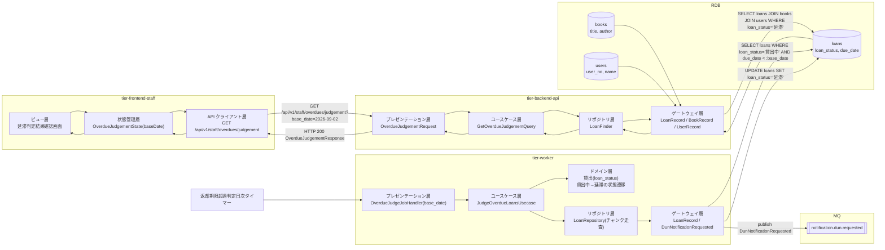
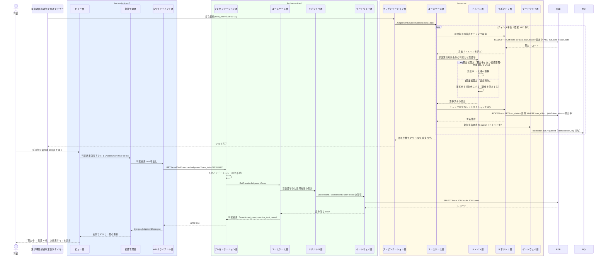

# 期限超過の貸出を延滞にする

## 概要

返却期限超過判定日次タイマーで返却期限を超過した貸出を抽出し、貸出状態を「貸出中」から「延滞」へ遷移させる。遷移した貸出から延滞督促の通知送信要求を生成し、司書は延滞判定結果確認画面で遷移件数と対象を確認する。貸出状態が「返却済み」になった貸出は督促を停止する。

## データフロー



| レイヤー | データモデル | 変換内容 |
|---------|------------|---------|
| Timer → WK プレゼンテーション | 実行パラメータ(base_date, chunk_size) | 未指定時は実行日をシステム日付から解決する |
| WK ユースケース | JudgeOverdueLoansUsecase | チャンク単位のトランザクション境界で状態遷移を確定する |
| WK ドメイン | 貸出(loan_status) | 督促通知対象条件を適用し、貸出中 → 延滞の遷移を実行する |
| WK ゲートウェイ | DunNotificationRequested | 遷移した貸出 1 件につき督促送信要求 1 件へ変換して publish する |
| FE ビュー | 判定結果サマリと対象一覧 | 遷移件数（貸出中 → 延滞）と延滞総数を結果サマリとして表示する |
| BE プレゼンテーション | OverdueJudgementRequest(base_date, page, per_page) | 日付形式の検証 + Query 変換 |
| Response | OverdueJudgementResponse(transitioned_count, overdue_total, items[]) | 判定結果の確認に使う |

## 処理フロー



## バリエーション一覧

| バリエーション名 | 値 | 処理内容 | 適用 tier | 適用箇所 |
|----------------|---|---------|----------|---------|
| 通知種別 | 延滞督促 | 生成する送信要求の通知種別を固定する | tier-worker | DunNotificationRequested |
| 通知タイミング区分 | 期限超過督促 | 督促送信要求の通知タイミング区分を固定する | tier-worker | DunNotificationRequested |
| 貸出期間区分 | 標準 / 短期 / 長期 | 返却期限の算出済み値を参照するだけで判定では分岐しない | tier-backend-api | 一覧の表示列 |

## 分岐条件一覧

| 条件名 | 判定ルール | 適用 tier | 適用箇所 | BDD Scenario |
|--------|----------|----------|---------|-------------|
| 督促通知対象条件 | 貸出状態が「貸出中」であり、かつ返却期限を経過している貸出を督促対象とし、貸出状態を「延滞」へ遷移させる | tier-worker | JudgeOverdueLoansUsecase / ドメイン層の状態遷移 | 期限超過の貸出を延滞へ遷移させる |
| 督促通知対象条件（停止） | 貸出状態が「返却済み」になった時点で督促を停止する（遷移も送信要求生成も行わない） | tier-worker | チャンク走査の SELECT 条件と UPDATE の WHERE 条件 | 返却済みの貸出は延滞にしない |
| 状態遷移の整合性保証 | 許可された遷移（貸出中 → 延滞）のみを実行する。既に「延滞」の貸出は再遷移させない | tier-worker | ドメイン層（arch LP-009） | 既に延滞の貸出を二重遷移しない |
| 重複実行検知 | 同一 base_date のジョブ実行 ID が既に完了している場合は再実行せず終了する（arch SR-018） | tier-worker | OverdueJudgeJobHandler | 同一日の再実行で督促送信要求を二重生成しない |

## 計算ルール一覧

| 計算名 | 入力情報 | 計算式/ロジック | 出力情報 | 適用 tier |
|--------|---------|---------------|---------|----------|
| 超過日数の算出 | 貸出.返却期限、基準日 | `超過日数 = 基準日 - 返却期限`（日単位、1 以上） | 超過日数（days_overdue） | tier-worker / tier-backend-api |
| 期限超過の判定 | 貸出.返却期限、基準日、貸出状態 | `貸出状態 = '貸出中' かつ 返却期限 < 基準日` が真なら延滞へ遷移する | 遷移対象フラグ | tier-worker |
| 当日遷移件数の算出 | 日次ジョブ実行結果（基準日、遷移対象貸出ID一覧） | `transitioned_count = count(日次ジョブ実行結果.遷移対象貸出ID)`。返却期限からの逆算は行わない（ジョブ遅延時にまとめて遷移した貸出が漏れるため） | 結果サマリの遷移件数 | tier-backend-api |
| 冪等キーの生成 | 通知種別、対象貸出ID、通知タイミング区分、基準日 | `sha256(通知種別 + ':' + 対象貸出ID + ':' + 通知タイミング区分 + ':' + 基準日)` を決定的に生成する | 冪等キー（idempotency_key） | tier-worker |

## 状態遷移一覧

| 状態モデル | 遷移元 | 遷移先 | トリガー | 事前条件 | 事後処理 | 適用 tier |
|-----------|--------|--------|---------|---------|---------|----------|
| 貸出状態 | 貸出中 | 延滞 | 期限超過の貸出を延滞にする | 返却期限を経過していること | 督促メールの送信要求を publish する（コミット後） | tier-worker |
| 貸出状態 | 返却済み | （遷移しない） | 期限超過の貸出を延滞にする | 返却済みの貸出は対象外 | 督促を停止する | tier-worker |
| 貸出状態 | 延滞 | 延滞（再遷移しない） | 期限超過の貸出を延滞にする | 既に延滞であること | 送信要求は冪等キーで重複抑止する | tier-worker |

## 関連 RDRA モデル

| モデル種別 | 要素名 | 関連 |
|-----------|--------|------|
| 業務 | 貸出期限管理業務 | このUCが属する業務 |
| BUC | 延滞を督促するフロー | このUCを含むBUC |
| アクター | 司書 | 延滞判定結果確認画面で判定結果を確認する（提供者） |
| 情報 | 貸出 | 判定対象。貸出状態を遷移させる |
| 状態 | 貸出状態 | 貸出中 → 延滞 |
| 条件 | 督促通知対象条件 | 抽出・遷移条件として適用する |
| バリエーション | 通知種別 | 延滞督促 |
| バリエーション | 通知タイミング区分 | 期限超過督促 |
| 画面 | 延滞判定結果確認画面 | 判定結果を司書が確認する画面 |
| タイマー | 返却期限超過判定日次タイマー | 判定処理の起動契機 |

## E2E 完了条件（BDD）

### 正常系

```gherkin
Feature: 期限超過の貸出を延滞にする

  Scenario: 返却期限を超過した貸出を延滞へ遷移させる
    Given 貸出「L-3001」の貸出状態が「貸出中」で返却期限が「2026-09-01」である
    When 返却期限超過判定日次タイマーが「2026-09-02」に起動する
    Then 貸出「L-3001」の貸出状態が「延滞」になり延滞督促の送信要求が生成される

  Scenario: 司書が延滞判定の結果サマリを確認する
    Given 「2026-09-02」の判定で貸出 3 件が「貸出中」から「延滞」へ遷移している
    And 司書「山田司書」が司書ポータルにログインしている
    When 司書が延滞判定結果確認画面を開く
    Then 「貸出中 → 延滞 3 件」の結果サマリと対象貸出の一覧が表示される
```

### 異常系

```gherkin
  Scenario: 返却済みの貸出は延滞にしない
    Given 貸出「L-3002」の貸出状態が「返却済み」で返却期限が「2026-08-30」である
    When 返却期限超過判定日次タイマーが「2026-09-02」に起動する
    Then 貸出「L-3002」の貸出状態は「返却済み」のままで送信要求は生成されない

  Scenario: 返却期限当日の貸出は延滞にしない
    Given 貸出「L-3003」の貸出状態が「貸出中」で返却期限が「2026-09-02」である
    When 返却期限超過判定日次タイマーが「2026-09-02」に起動する
    Then 貸出「L-3003」の貸出状態は「貸出中」のままである

  Scenario: 既に延滞の貸出を二重遷移しない
    Given 貸出「L-3004」の貸出状態が既に「延滞」である
    When 返却期限超過判定日次タイマーが「2026-09-02」に起動する
    Then 貸出「L-3004」に対する UPDATE は行われず状態遷移ログも出力されない

  Scenario: 同一日の再実行で督促送信要求を二重生成しない
    Given 「2026-09-02」の返却期限超過判定ジョブが完了済みである
    When 同じ base_date「2026-09-02」でジョブが再実行される
    Then 既存の冪等キーが検知され新たな送信要求は publish されない

  Scenario: 判定対象が 0 件のとき結果サマリを 0 件で表示する
    Given 「2026-09-02」に期限超過した貸出が 1 件も無い
    When 司書が延滞判定結果確認画面を開く
    Then 「貸出中 → 延滞 0 件」と EmptyState が表示される
```

## ティア別仕様

- [司書ポータル](tier-frontend-staff.md)
- [バックエンド API](tier-backend-api.md)
- [バックエンドワーカー](tier-worker.md)

### 統合 API Spec

- [OpenAPI Spec](../../_cross-cutting/api/openapi.yaml)（全 UC 統合、Contract First 開発用）
- [AsyncAPI Spec](../../_cross-cutting/api/asyncapi.yaml)（全 UC 統合、非同期イベントがある場合のみ）
