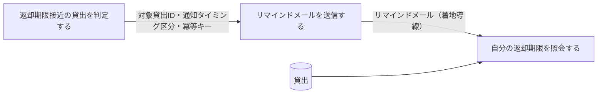
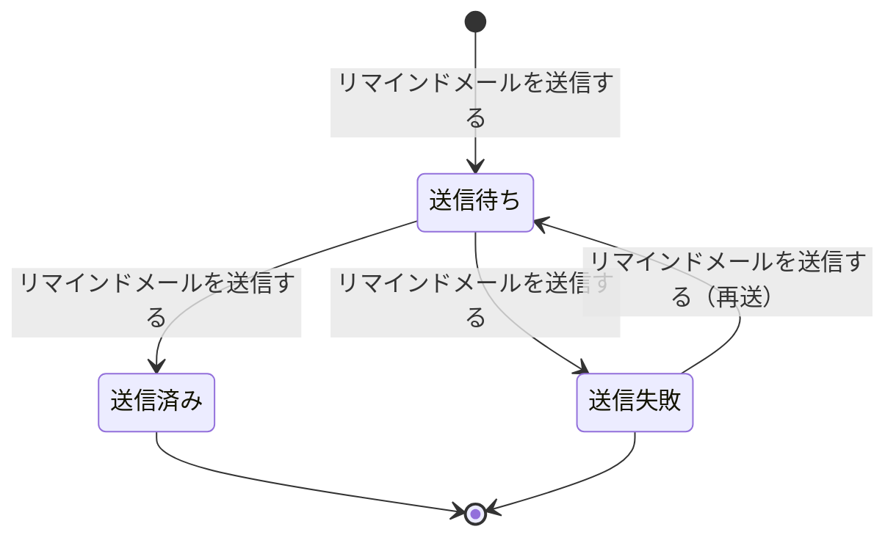
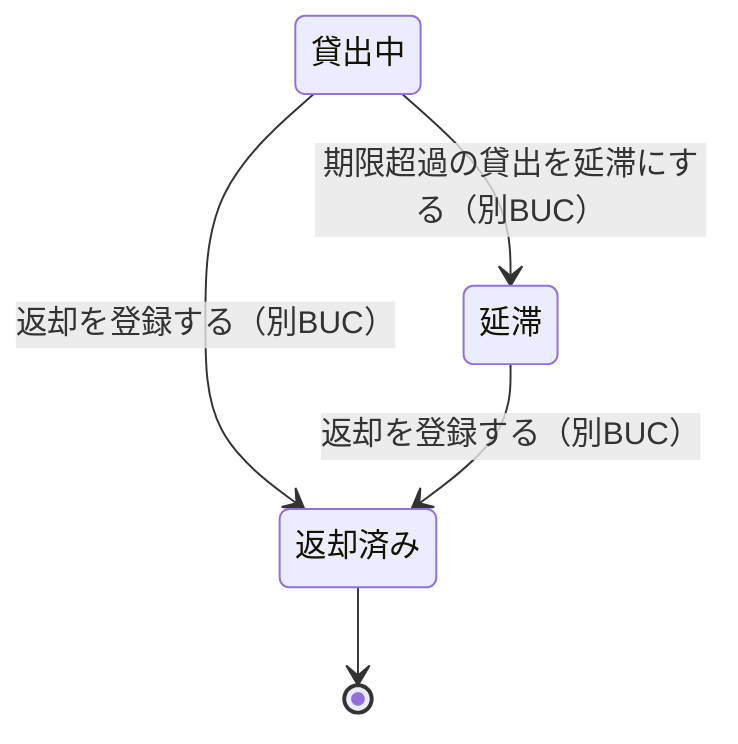

# 返却期限をリマインドするフロー

## 概要

返却期限接近判定日次タイマーで返却期限が近づいた貸出中の貸出を抽出し、メール配信サービス経由でリマインドメールを送信する BUC。リマインドを受けた利用者は自分の返却期限を Web 画面で確認して返却を準備する。返却済みの貸出は対象外とする。

## 所属 UC 一覧

| UC名 | アクター | 主な操作 | 関連情報 |
|------|---------|---------|---------|
| [返却期限接近の貸出を判定する](返却期限接近の貸出を判定する/spec.md) | 司書（提供者・タイマー起動） | 返却期限までの残日数がリマインド基準日数以内の貸出中の貸出を抽出し、送信要求を生成する | 貸出、利用者、書籍 |
| [リマインドメールを送信する](リマインドメールを送信する/spec.md) | 司書（提供者）／利用者（受信者） | 通知を「送信待ち」で作成し、メール配信サービスへ返却期限リマインドメール送信依頼を発行して結果を記録する | 通知、貸出、利用者 |
| [自分の返却期限を照会する](自分の返却期限を照会する/spec.md) | 利用者（受益者） | 本人の返却期限が近づいた貸出と残日数を Web 画面で確認する | 貸出、書籍、利用者アカウント |

## UC 横断データフロー

「返却期限接近の貸出を判定する」が対象貸出と通知タイミング区分を確定して送信要求を生成し、「リマインドメールを送信する」がそれを消費して通知を作成・送信する。利用者はメールの着地点として「自分の返却期限を照会する」で同じ貸出を参照する。

### データフロー図

### 情報 CRUD マトリクス

| 情報名 | 返却期限接近の貸出を判定する | リマインドメールを送信する | 自分の返却期限を照会する |
|--------|:---------------------------:|:-------------------------:|:-----------------------:|
| 貸出 | R | R | R |
| 利用者 | R | R | |
| 書籍 | R | | R |
| 通知 | | C / U | |
| 利用者アカウント | | | R |

## 状態遷移全体図

本 BUC は通知状態の送信進行のみを遷移させる。貸出状態は抽出・表示の条件に使うだけで遷移させない（貸出中 → 延滞は BUC「延滞を督促するフロー」が担当する）。

### 状態遷移 UC マッピング

| 状態モデル | 遷移元 | 遷移先 | 担当 UC |
|-----------|--------|--------|--------|
| 通知状態 | （未生成） | 送信待ち | [リマインドメールを送信する](リマインドメールを送信する/spec.md) |
| 通知状態 | 送信待ち | 送信済み | [リマインドメールを送信する](リマインドメールを送信する/spec.md) |
| 通知状態 | 送信待ち | 送信失敗 | [リマインドメールを送信する](リマインドメールを送信する/spec.md) |
| 通知状態 | 送信失敗 | 送信待ち | [リマインドメールを送信する](リマインドメールを送信する/spec.md) |
| 貸出状態 | 貸出中 | （遷移なし・抽出条件に参照） | [返却期限接近の貸出を判定する](返却期限接近の貸出を判定する/spec.md) |
| 貸出状態 | 貸出中 | （遷移なし・送信時の再判定に参照） | [リマインドメールを送信する](リマインドメールを送信する/spec.md) |
| 貸出状態 | 貸出中 | （遷移なし・表示対象に参照） | [自分の返却期限を照会する](自分の返却期限を照会する/spec.md) |

## BUC 内共有条件一覧

2 つ以上の UC で適用される条件を示す。

| 条件名 | 条件の説明 | 適用 UC |
|--------|----------|--------|
| リマインド通知対象条件 | 貸出状態が「貸出中」であり、かつ返却期限までの残日数が通知タイミング区分で定めたリマインド基準日数以内の貸出を通知対象とする。貸出状態が「返却済み」の貸出は対象外とする | 返却期限接近の貸出を判定する, リマインドメールを送信する |

単一 UC のみで適用される条件（詳細は各 UC Spec を参照）。

| 条件名 | 適用 UC |
|--------|--------|
| 個人情報参照可否条件 | 自分の返却期限を照会する |

## BUC 内共有バリエーション一覧

2 つ以上の UC で適用されるバリエーションを示す。

| バリエーション名 | 値 | 適用 UC |
|----------------|---|--------|
| 通知タイミング区分 | 期限前リマインド / 期限当日 | 返却期限接近の貸出を判定する, リマインドメールを送信する, 自分の返却期限を照会する |
| 通知種別 | 返却期限リマインド | 返却期限接近の貸出を判定する, リマインドメールを送信する |
| 貸出期間区分 | 標準 / 短期 / 長期 | 返却期限接近の貸出を判定する, 自分の返却期限を照会する |

単一 UC のみで適用されるバリエーション（詳細は各 UC Spec を参照）。

| バリエーション名 | 適用 UC |
|----------------|--------|
| 利用者区分 | リマインドメールを送信する |
