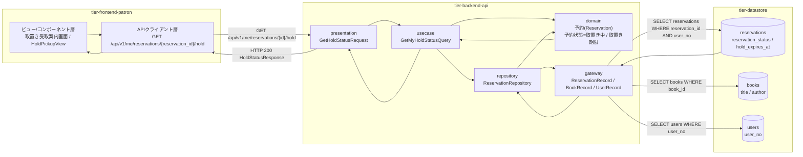
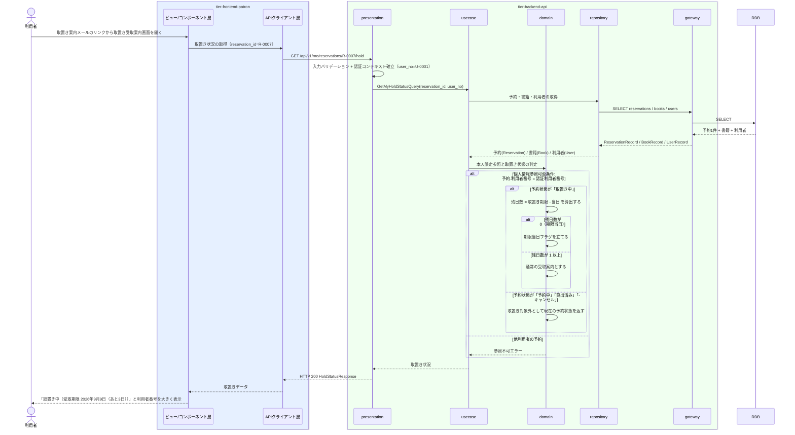

# 自分の取置き状況を照会する

## 概要

取置き案内を受け取った利用者が、取置き可能となった書籍と取置き中の予約 1 件の詳細を Web 画面で確認し、来館して貸出を受ける準備をする UC。個人情報参照可否条件により、ログイン中の利用者本人に紐づく予約のみを照会対象とする。

## データフロー



| レイヤー | データモデル | 変換内容 |
|---------|------------|---------|
| FE ビュー/コンポーネント層 | 取置き受取案内画面（書籍・取置き期限・残日数・提示用の利用者番号） | 取置き期限を残日数と日付の両方の表示へ変換し、期限当日は強調表示に切り替える |
| FE APIクライアント層 | GetHoldStatusRequest(reservation_id) | 認証トークンの添付、trace_id の発行、タイムアウトとリトライ |
| BE presentation | GetHoldStatusRequest(reservation_id) | 形式バリデーション、認証コンテキスト（user_no）の確立、Query へ変換 |
| BE usecase | GetMyHoldStatusQuery(reservation_id, user_no) | 本人限定参照の適用、読み取り専用トランザクション |
| BE domain | 予約(Reservation)（予約状態・取置き期限） | 所有者ベースの認可判定、取置き中かどうかの判定、残日数の算出 |
| BE gateway | ReservationRecord / BookRecord / UserRecord | reservations / books / users の SELECT |
| Response | HoldStatusResponse(reservation_status, hold_expires_at, days_remaining, book, user_no) | 取置き案内カードの表示データへ変換 |

## 処理フロー



## バリエーション一覧

| バリエーション名 | 値 | 処理内容 | 適用 tier | 適用箇所 |
|----------------|---|---------|----------|---------|
| 資料種別 | 紙書籍 / 電子書籍 | 取置き対象書籍の資料種別を表示する | tier-frontend-patron | 取置き受取案内画面 |
| ジャンル | 文学 / 人文 / 社会科学 / 自然科学 / 技術 / 芸術 / 児童 / その他 | 取置き対象書籍の分類として表示する | tier-frontend-patron | 取置き受取案内画面 |

## 分岐条件一覧

| 条件名 | 判定ルール | 適用 tier | 適用箇所 | BDD Scenario |
|--------|----------|----------|---------|-------------|
| 個人情報参照可否条件 | 予約状況の照会は、ログイン中の利用者本人に紐づく予約のみを対象とする。他の利用者の予約は表示しない | tier-backend-api, tier-frontend-patron | GET /api/v1/me/reservations/{id}/hold / 取置き受取案内画面 | 他利用者の取置き状況は照会できない |
| 取置き期限の当日判定 | 取置き期限の残日数が 0 の場合は期限当日として強調表示に切り替える | tier-frontend-patron, tier-backend-api | 取置き受取案内画面（HoldPickupCard の deadline-today） | 取置き期限当日は強調表示になる |

## 計算ルール一覧

| 計算名 | 入力情報 | 計算式/ロジック | 出力情報 | 適用 tier |
|--------|---------|---------------|---------|----------|
| 取置き残日数の算出 | 予約.取置き期限、当日 | 残日数 = 取置き期限の日付 - 当日の日付（日単位） | 取置き受取案内画面の残日数 | tier-backend-api |
| 期限当日の判定 | 残日数 | 残日数が 0 のとき期限当日として扱う | HoldPickupCard の variant（deadline-today） | tier-frontend-patron |

## 状態遷移一覧

| 状態モデル | 遷移元 | 遷移先 | トリガー | 事前条件 | 事後処理 | 適用 tier |
|-----------|--------|--------|---------|---------|---------|----------|
| 予約状態 | 取置き中 | （遷移なし） | 自分の取置き状況を照会する | 本人の予約であること | 参照のみ。状態は変化しない | tier-backend-api |

## 関連 RDRA モデル

| モデル種別 | 要素名 | 関連 |
|-----------|--------|------|
| 業務 | 予約管理業務 | このUCが属する業務 |
| BUC | 予約者へ通知するフロー | このUCを含むBUC |
| アクティビティ | 取置き可能の連絡を受け取る | このUCが実現するアクティビティ |
| アクター | 利用者 | 操作するアクター（立場: 受益者） |
| 画面 | 取置き受取案内画面 | 操作画面 |
| 情報 | 予約 | 参照する情報 |
| 情報 | 書籍 | 取置き対象として参照する情報 |
| 情報 | 利用者アカウント | 本人限定参照の判定に使う情報 |
| 状態 | 予約状態 | 表示する状態（取置き中） |
| 条件 | 個人情報参照可否条件 | 適用される条件 |

## 受け入れ基準トレーサビリティ

| 受け入れ基準 ID | 役割 | 対応する BDD Scenario |
|---|---|---|
| SPEC-002-04#2 | 補助 | 取置き中の予約で受取案内が表示される |
| SPEC-004-02#2 | 補助 | 取置き中の予約で受取案内が表示される |

受け入れ基準 ID の定義は `_cross-cutting/traceability-matrix.md`「USDM 受け入れ基準 ↔ UC 対応表」を正本とする。

## E2E 完了条件（BDD）

### 正常系

```gherkin
Feature: 自分の取置き状況を照会する

  Scenario: 取置き中の予約で受取案内が表示される
    Given 利用者「田中太郎」（利用者番号 U-0001）がログイン済み
    And 利用者 U-0001 の予約 R-0007 の予約状態が「取置き中」で取置き期限（API 上は ISO 8601 の 2026-09-09）である
    And 当日が 2026-09-06 である
    When 利用者が取置き受取案内画面 /reservations/holds/R-0007 を開く
    Then 書籍「吾輩は猫である」と「取置き中」バッジが表示される
    And 「受取期限 2026年9月9日（あと3日）」が表示される
    And 窓口提示用の利用者番号 U-0001 が大きく表示される

  Scenario: 取置き期限当日は強調表示になる
    Given 利用者「佐藤花子」（利用者番号 U-0002）の予約 R-0100 の予約状態が「取置き中」で取置き期限（API 上は ISO 8601 の 2026-09-06）である
    And 当日が 2026-09-06 である
    When 利用者が取置き受取案内画面 /reservations/holds/R-0100 を開く
    Then HoldPickupCard が deadline-today の表示になる
    And 「本日が受取期限」という Alert(warning) が表示される
```

### 異常系

```gherkin
  Scenario: 他利用者の取置き状況は照会できない
    Given 利用者「田中太郎」（利用者番号 U-0001）がログイン済み
    And 予約 R-0500 は利用者番号 U-0002 の予約である
    When 利用者が取置き受取案内画面 /reservations/holds/R-0500 を開く
    Then HTTP 404 が返り「対象の予約が見つかりません」と表示される
    And 他利用者の氏名・連絡先は一切表示されない

  Scenario: 取置き中でない予約では受取案内を表示しない
    Given 利用者「田中太郎」の予約 R-0007 の予約状態が「予約中」である
    When 利用者が取置き受取案内画面 /reservations/holds/R-0007 を開く
    Then 「まだ取置きされていません」と現在の予約状態「予約中」が表示される
    And 予約順位確認画面への導線が表示される

  Scenario: 未ログインでは照会できない
    Given 利用者がログインしていない
    When 利用者が取置き受取案内画面 /reservations/holds/R-0007 を開く
    Then HTTP 401 が返りログイン画面へ誘導される
    And 取置き情報は表示されない
```

## ティア別仕様

- [利用者ポータル](tier-frontend-patron.md)
- [バックエンド API](tier-backend-api.md)

### 統合 API Spec

- [OpenAPI Spec](../../../_cross-cutting/api/openapi.yaml)（全 UC 統合、Contract First 開発用）
