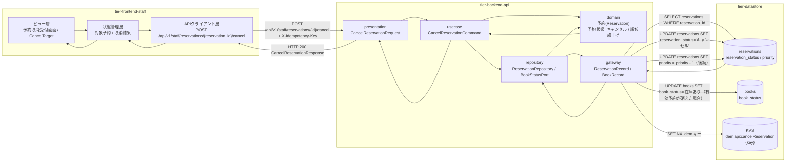
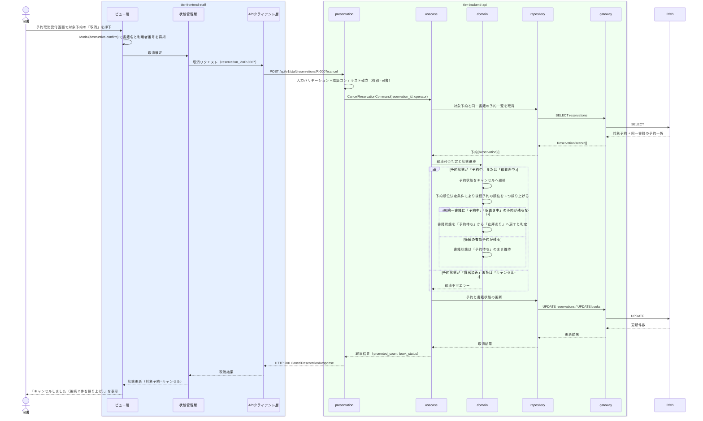

# 予約を取り消す

## 概要

利用者からの申し出を受けて司書が窓口で予約を取り消す UC。予約状態を「キャンセル」へ遷移させ、同一書籍の後続予約の予約順位を繰り上げる。取消の結果、対象書籍に有効な予約が無くなった場合は書籍状態を「予約待ち」から「在庫あり」へ戻す。

> 注: RDRA の BUC.tsv では本 UC のアクターは「司書」（画面: 予約取消受付画面）であるため、司書ポータル（tier-frontend-staff）で仕様化する。design-event.yaml の screens では同画面が portal=patron に割り当てられている（既知のねじれ。todo 登録済み）。画面名は RDRA の「予約取消受付画面」を正とする。

## データフロー



| レイヤー | データモデル | 変換内容 |
|---------|------------|---------|
| FE ビュー層 | 予約取消受付画面（対象予約の書籍名・利用者番号・予約状態・予約順位の表示、取消実行ボタン） | 司書の取消操作を確認モーダル経由で取消リクエストへ変換 |
| FE 状態管理層 | 対象予約 / 取消結果 | 取消後の予約状態と繰り上げ件数をキャッシュ更新し、一覧を再取得する |
| FE APIクライアント層 | CancelReservationRequest(reason 任意) + X-Idempotency-Key(UUID) | 冪等キーの付与、認証トークンの添付、trace_id の発行 |
| BE presentation | CancelReservationRequest(reservation_id, reason) | 形式バリデーション、認証コンテキスト（役割=司書）の確立、CancelReservationCommand へ変換 |
| BE usecase | CancelReservationCommand(reservation_id, operator, idempotency_key) | 冪等キー検証、トランザクション境界の設定、監査ログ出力（arch CLR-009） |
| BE domain | 予約(Reservation)（予約状態・予約順位） | 予約状態の「予約中 / 取置き中 → キャンセル」遷移、後続予約の順位繰り上げ、書籍状態の戻し要否判定 |
| BE gateway | ReservationRecord / BookRecord | reservations の UPDATE（対象と後続）、books の UPDATE（在庫ありへの復帰） |
| Response | CancelReservationResponse(reservation_id, reservation_status, promoted_count, book_status) | 取消結果と繰り上げ件数を司書向けの完了サマリへ変換 |

## 処理フロー



## バリエーション一覧

| バリエーション名 | 値 | 処理内容 | 適用 tier | 適用箇所 |
|----------------|---|---------|----------|---------|
| 資料種別 | 紙書籍 / 電子書籍 | 取消対象予約の書籍の資料種別を確認情報として表示する | tier-frontend-staff | 予約取消受付画面 |

## 分岐条件一覧

| 条件名 | 判定ルール | 適用 tier | 適用箇所 | BDD Scenario |
|--------|----------|----------|---------|-------------|
| 予約順位決定条件 | 予約状態が「貸出済み」「キャンセル」になった予約は順位の対象から除外し、後続の予約を繰り上げる | tier-backend-api | CancelReservationCommand（順位の再計算） | 予約中の予約を取り消すと後続の順位が繰り上がる |
| 返却後状態決定条件（適用の裏返し） | 対象書籍に予約状態が「予約中」の有効な予約が存在しなくなった場合、書籍状態を「予約待ち」から「在庫あり」へ戻す | tier-backend-api | CancelReservationCommand（書籍状態の復帰判定） | 最後の予約を取り消すと書籍状態が在庫ありへ戻る |

## 計算ルール一覧

| 計算名 | 入力情報 | 計算式/ロジック | 出力情報 | 適用 tier |
|--------|---------|---------------|---------|----------|
| 後続予約の順位繰り上げ | 予約.予約順位、予約.予約状態 | 同一 book_id かつ予約状態が「予約中」「取置き中」で、取消対象より大きい予約順位を持つ予約について priority を 1 減算する | 予約.予約順位 | tier-backend-api |
| 繰り上げ件数 | 更新した予約の件数 | 順位を繰り上げた予約の件数を promoted_count として返す | 取消完了サマリ | tier-backend-api |

## 状態遷移一覧

| 状態モデル | 遷移元 | 遷移先 | トリガー | 事前条件 | 事後処理 | 適用 tier |
|-----------|--------|--------|---------|---------|---------|----------|
| 予約状態 | 予約中 | キャンセル | 予約を取り消す | 対象予約が存在し予約状態が「予約中」 | 同一トランザクションで `hold_expires_at` = NULL を設定し（`hold_started_at` は変更しない）、後続予約の予約順位を繰り上げる | tier-backend-api |
| 予約状態 | 取置き中 | キャンセル | 予約を取り消す | 取置き期限超過または利用者の申し出 | 同一トランザクションで `hold_expires_at` = NULL を設定し（`hold_started_at` は取置きの実績として変更しない）、後続予約の予約順位を繰り上げ、次順位者への取置きへ引き継ぐ | tier-backend-api |
| 書籍状態 | 予約待ち | 在庫あり | 予約を取り消す | 対象書籍に「予約中」「取置き中」の予約が残らない | 一般の貸出対象へ戻す | tier-backend-api |
| 利用者状態 | 取引進行中 | 登録済み | 予約を取り消す | 当該利用者に貸出中・延滞の貸出と予約中・取置き中の予約が残らないこと | 利用者削除可否条件を満たす状態へ戻す | tier-backend-api |

## 関連 RDRA モデル

| モデル種別 | 要素名 | 関連 |
|-----------|--------|------|
| 業務 | 予約管理業務 | このUCが属する業務 |
| BUC | 書籍を予約するフロー | このUCを含むBUC |
| アクティビティ | 予約の取消を受け付ける | このUCが実現するアクティビティ |
| アクター | 司書 | 操作するアクター（立場: 提供者） |
| 画面 | 予約取消受付画面 | 操作画面 |
| 情報 | 予約 | 更新する情報 |
| 情報 | 書籍 | 書籍状態を更新する情報 |
| 情報 | 利用者 | 取消申し出者として参照し、利用者状態を更新する情報 |
| 状態 | 予約状態 | キャンセルへの状態遷移 |
| 状態 | 書籍状態 | 予約待ちから在庫ありへの状態遷移 |
| 状態 | 利用者状態 | 取引進行中 → 登録済み（他に進行中の貸出・予約が残らない場合に遷移する） |
| 条件 | 予約順位決定条件 | 適用される条件 |

## 受け入れ基準トレーサビリティ

| 受け入れ基準 ID | 役割 | 対応する BDD Scenario |
|---|---|---|
| — | 補助専任 | （当該 UC の E2E シナリオ全件） |

受け入れ基準 ID の定義は `_cross-cutting/traceability-matrix.md`「USDM 受け入れ基準 ↔ UC 対応表」を正本とする。

## E2E 完了条件（BDD）

### 正常系

```gherkin
Feature: 予約を取り消す

  Scenario: 予約中の予約を取り消すと後続の順位が繰り上がる
    Given 司書「山田司書」がログイン済み
    And 書籍「吾輩は猫である」（書籍ID B-0001）に予約順位 1・2・3 の「予約中」予約が 3 件ある
    And 予約順位 1 の予約は予約ID R-0007（利用者番号 U-0001）である
    When 司書が予約取消受付画面で予約 R-0007 の取消を確定する
    Then 予約 R-0007 の予約状態が「キャンセル」になる
    And 残り 2 件の予約順位が 1 と 2 へ繰り上がる
    And 画面に「キャンセルしました（後続 2 件を繰り上げ）」が表示される

  Scenario: 最後の予約を取り消すと書籍状態が在庫ありへ戻る
    Given 書籍「坊っちゃん」（書籍ID B-0002）の書籍状態が「予約待ち」
    And 書籍 B-0002 の有効な予約は取置き中の予約 R-0100 のみである
    When 司書が予約 R-0100 の取消を確定する
    Then 予約 R-0100 の予約状態が「キャンセル」になる
    And 書籍 B-0002 の書籍状態が「在庫あり」になる

  Scenario: 進行中の取引が無くなった利用者の利用者状態が登録済みへ戻る
    Given 利用者「田中太郎」（利用者番号 U-0001）の利用者状態が「取引進行中」である
    And 利用者 U-0001 の有効な取引は予約 R-0007（予約状態「予約中」）のみである
    When 司書が予約 R-0007 の取消を確定する
    Then 予約 R-0007 の予約状態が「キャンセル」になる
    And 利用者 U-0001 の利用者状態が「取引進行中」から「登録済み」になる
```

### 異常系

```gherkin
  Scenario: 貸出済みの予約は取り消せない
    Given 予約 R-0200 の予約状態が「貸出済み」
    When 司書が予約 R-0200 の取消を確定する
    Then HTTP 409 が返り「この予約はすでに貸出済みのため取り消せません」と表示される
    And 予約状態は「貸出済み」のまま変わらない

  Scenario: 既にキャンセル済みの予約を再度取り消しても状態は変わらない
    Given 予約 R-0300 の予約状態が「キャンセル」
    When 司書が予約 R-0300 の取消を確定する
    Then HTTP 409 が返り「この予約はすでにキャンセル済みです」と表示される
    And 後続予約の予約順位は変化しない

  Scenario: 存在しない予約の取消は受け付けられない
    Given 司書「山田司書」がログイン済み
    When 司書が予約ID「R-9999」の取消を送信する
    Then HTTP 404 が返り「対象の予約が見つかりません」と表示される
    And reservations は更新されない
```

## ティア別仕様

- [司書ポータル](tier-frontend-staff.md)
- [バックエンド API](tier-backend-api.md)

### 統合 API Spec

- [OpenAPI Spec](../../../_cross-cutting/api/openapi.yaml)（全 UC 統合、Contract First 開発用）
