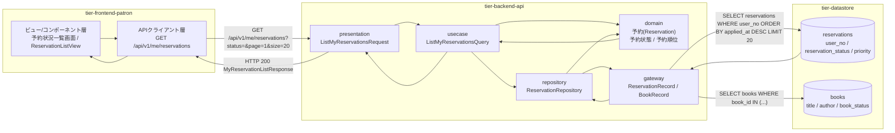
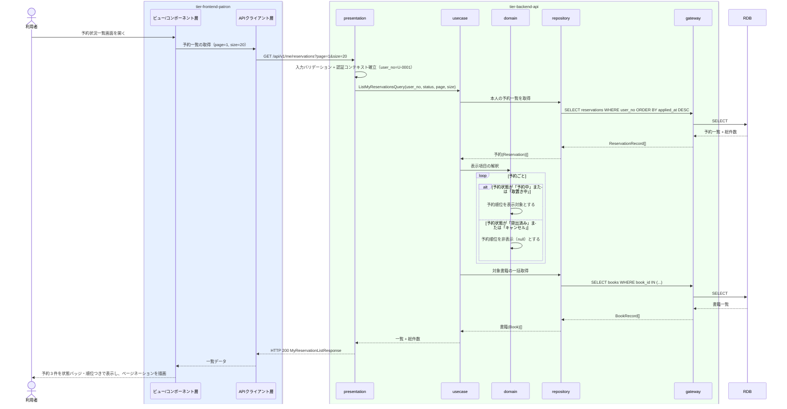

# 自分の予約状況を照会する

## 概要

利用者が予約中の書籍と予約順位を一覧で確認する UC。個人情報参照可否条件により、ログイン中の利用者本人に紐づく予約のみを対象とし、他の利用者の予約は表示しない。一覧はページネーション（20 件/頁）で分割する。

## データフロー



| レイヤー | データモデル | 変換内容 |
|---------|------------|---------|
| FE ビュー/コンポーネント層 | 予約状況一覧画面（書籍・予約状態・予約順位・申込日時のテーブル） | 予約状態を ReservationStatusBadge、予約順位を ReservationQueueTracker の表示へ変換 |
| FE APIクライアント層 | ListMyReservationsRequest(status, page, size) | 認証トークンの添付、trace_id の発行、タイムアウトとリトライ |
| BE presentation | ListMyReservationsRequest(status, page, size) | 形式バリデーション（page ≧ 1、size ≦ 100、status はバリエーション値）、認証コンテキスト（user_no）の確立 |
| BE usecase | ListMyReservationsQuery(user_no, status, page, size) | 本人限定参照の適用、読み取り専用トランザクション、ページネーション |
| BE domain | 予約(Reservation)（予約状態・予約順位・取置き期限） | 所有者ベースの認可判定、順位対象外（貸出済み / キャンセル）の順位を非表示にする判定 |
| BE gateway | ReservationRecord / BookRecord | reservations の SELECT（user_no で絞り込み）、books の一括 SELECT |
| Response | MyReservationListResponse(items[], total, page, size, active_count) | 一覧行と総件数をページネーション表示のデータへ変換 |

## 処理フロー



## バリエーション一覧

| バリエーション名 | 値 | 処理内容 | 適用 tier | 適用箇所 |
|----------------|---|---------|----------|---------|
| ジャンル | 文学 / 人文 / 社会科学 / 自然科学 / 技術 / 芸術 / 児童 / その他 | 一覧行に予約対象書籍のジャンルを表示する | tier-frontend-patron | 予約状況一覧画面 |
| 資料種別 | 紙書籍 / 電子書籍 | 一覧行に予約対象書籍の資料種別を表示する | tier-frontend-patron | 予約状況一覧画面 |

## 分岐条件一覧

| 条件名 | 判定ルール | 適用 tier | 適用箇所 | BDD Scenario |
|--------|----------|----------|---------|-------------|
| 個人情報参照可否条件 | 予約状況の照会は、ログイン中の利用者本人に紐づく予約のみを対象とする。他の利用者の予約は表示しない | tier-backend-api, tier-frontend-patron | GET /api/v1/me/reservations / 予約状況一覧画面 | 他利用者の予約は一覧に含まれない |
| 予約順位決定条件 | 予約状態が「貸出済み」「キャンセル」の予約は順位の対象から除外する。一覧では順位を表示しない | tier-backend-api | 一覧行の予約順位の設定 | キャンセル済みの予約は順位が表示されない |

## 計算ルール一覧

| 計算名 | 入力情報 | 計算式/ロジック | 出力情報 | 適用 tier |
|--------|---------|---------------|---------|----------|
| 総ページ数の算出 | 総件数、1 ページ件数 | ceil(総件数 / size)。size の既定は 20（design 決定） | ページネーションの総ページ数 | tier-frontend-patron |
| 有効予約件数の算出 | 予約.予約状態 | 予約状態が「予約中」「取置き中」の件数を数え、サマリとして表示する | 予約状況一覧画面のサマリ | tier-backend-api |

## 状態遷移一覧

| 状態モデル | 遷移元 | 遷移先 | トリガー | 事前条件 | 事後処理 | 適用 tier |
|-----------|--------|--------|---------|---------|---------|----------|
| 予約状態 | 予約中 / 取置き中 / 貸出済み / キャンセル | （遷移なし） | 自分の予約状況を照会する | 本人の予約であること | 参照のみ。状態は変化しない | tier-backend-api |

## 関連 RDRA モデル

| モデル種別 | 要素名 | 関連 |
|-----------|--------|------|
| 業務 | 利用照会業務 | このUCが属する業務 |
| BUC | 予約状況を確認するフロー | このUCを含むBUC |
| アクティビティ | 予約中の書籍と順位を確認する | このUCが実現するアクティビティ |
| アクター | 利用者 | 操作するアクター（立場: 受益者） |
| 画面 | 予約状況一覧画面 | 操作画面 |
| 情報 | 予約 | 参照する情報 |
| 情報 | 書籍 | 予約対象として参照する情報 |
| 情報 | 利用者アカウント | 本人限定参照の判定に使う情報 |
| 状態 | 予約状態 | 表示する状態 |
| 条件 | 個人情報参照可否条件 | 適用される条件 |
| 条件 | 予約順位決定条件 | 適用される条件 |

## 受け入れ基準トレーサビリティ

| 受け入れ基準 ID | 役割 | 対応する BDD Scenario |
|---|---|---|
| SPEC-004-02#1 | 主担当 | 自分の予約が状態と順位つきで一覧表示される |
| SPEC-002-03#3 | 補助 | 自分の予約が状態と順位つきで一覧表示される |

受け入れ基準 ID の定義は `_cross-cutting/traceability-matrix.md`「USDM 受け入れ基準 ↔ UC 対応表」を正本とする。

## E2E 完了条件（BDD）

### 正常系

```gherkin
Feature: 自分の予約状況を照会する

  Scenario: 自分の予約が状態と順位つきで一覧表示される
    Given 利用者「田中太郎」（利用者番号 U-0001）がログイン済み
    And 利用者 U-0001 は「予約中」の予約 2 件と「取置き中」の予約 1 件を持つ
    When 利用者が予約状況一覧画面 /reservations を開く
    Then 予約が 3 件表示される
    And 各行に予約状態バッジ（予約中 / 取置き中）と予約順位が表示される
    And 有効な予約件数として 3 件が表示される

  Scenario: 予約状態で絞り込める
    Given 利用者「田中太郎」は「予約中」2 件・「キャンセル」1 件の予約を持つ
    When 利用者が予約状態「予約中」で絞り込む
    Then 予約中の 2 件のみが表示される
    And キャンセルの予約は表示されない

  Scenario: 21 件以上の予約はページ分割される
    Given 利用者「佐藤花子」（利用者番号 U-0002）は予約を 25 件持つ
    When 利用者が予約状況一覧画面 /reservations を開く
    Then 1 ページ目に 20 件が表示される
    And ページネーションで 2 ページ目に残り 5 件が表示される
```

### 異常系

```gherkin
  Scenario: 予約が 1 件も無い場合に空状態を表示する
    Given 利用者「鈴木一郎」（利用者番号 U-0003）は予約を 1 件も持たない
    When 利用者が予約状況一覧画面 /reservations を開く
    Then 「予約はありません」という EmptyState が表示される
    And 蔵書検索画面への導線が表示される

  Scenario: 他利用者の予約は一覧に含まれない
    Given 利用者「田中太郎」（利用者番号 U-0001）がログイン済み
    And 利用者番号 U-0002 の予約が 5 件存在する
    When 利用者が予約状況一覧画面 /reservations を開く
    Then 利用者 U-0001 の予約のみが表示される
    And 利用者 U-0002 の予約は 1 件も表示されない

  Scenario: 未ログインでは照会できない
    Given 利用者がログインしていない
    When 利用者が予約状況一覧画面 /reservations を開く
    Then HTTP 401 が返りログイン画面へ誘導される
    And 予約情報は表示されない
```

## ティア別仕様

- [利用者ポータル](tier-frontend-patron.md)
- [バックエンド API](tier-backend-api.md)

### 統合 API Spec

- [OpenAPI Spec](../../../_cross-cutting/api/openapi.yaml)（全 UC 統合、Contract First 開発用）
