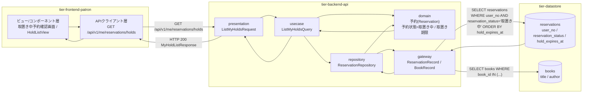
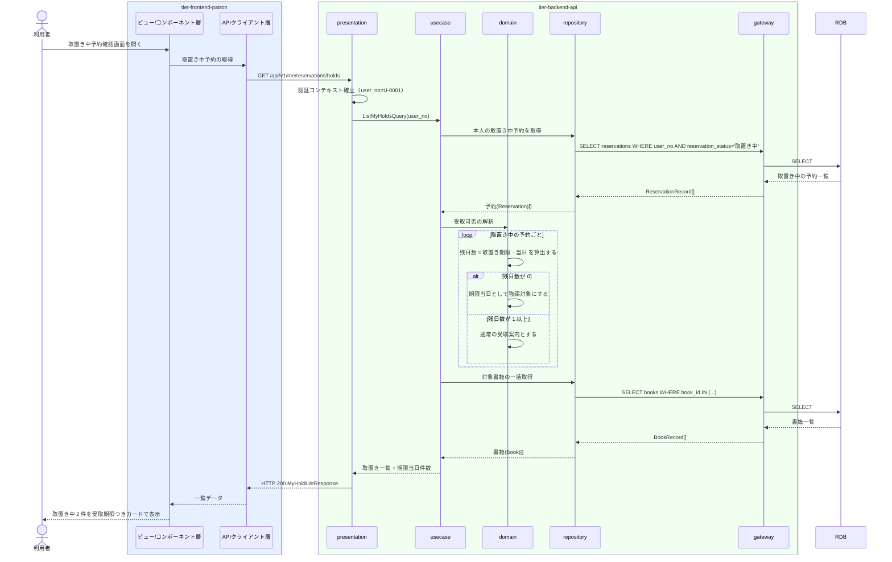

# 自分の取置き中の予約を照会する

## 概要

利用者が取置き中の予約と受取可能な書籍を一覧で確認し、来館の要否を判断する UC。個人情報参照可否条件により、ログイン中の利用者本人に紐づく予約のみを対象とする。取置き案内メールからの着地点となる画面（`/reservations/holds`）に対応する。

## データフロー



| レイヤー | データモデル | 変換内容 |
|---------|------------|---------|
| FE ビュー/コンポーネント層 | 取置き中予約確認画面（取置きカードの一覧、受取期限と残日数） | 取置き期限を残日数と日付の両方へ変換し、期限当日のカードを `deadline-today` に切り替える |
| FE APIクライアント層 | ListMyHoldsRequest() | 認証トークンの添付、trace_id の発行、タイムアウトとリトライ |
| BE presentation | ListMyHoldsRequest() | 認証コンテキスト（user_no）の確立、Query へ変換 |
| BE usecase | ListMyHoldsQuery(user_no) | 本人限定参照の適用、読み取り専用トランザクション |
| BE domain | 予約(Reservation)（予約状態・取置き期限） | 所有者ベースの認可判定、取置き中の抽出、残日数の算出 |
| BE gateway | ReservationRecord / BookRecord | reservations の SELECT（user_no と取置き中で絞り込み）、books の一括 SELECT |
| Response | MyHoldListResponse(items[], total, expiring_today_count) | 取置きカード一覧と期限当日件数の表示データへ変換 |

## 処理フロー



## バリエーション一覧

| バリエーション名 | 値 | 処理内容 | 適用 tier | 適用箇所 |
|----------------|---|---------|----------|---------|
| 資料種別 | 紙書籍 / 電子書籍 | 取置き対象書籍の資料種別をカードに表示する | tier-frontend-patron | 取置き中予約確認画面 |
| ジャンル | 文学 / 人文 / 社会科学 / 自然科学 / 技術 / 芸術 / 児童 / その他 | 取置き対象書籍の分類として表示する | tier-frontend-patron | 取置き中予約確認画面 |

## 分岐条件一覧

| 条件名 | 判定ルール | 適用 tier | 適用箇所 | BDD Scenario |
|--------|----------|----------|---------|-------------|
| 個人情報参照可否条件 | 予約状況の照会は、ログイン中の利用者本人に紐づく予約のみを対象とする。他の利用者の予約は表示しない | tier-backend-api, tier-frontend-patron | GET /api/v1/me/reservations/holds / 取置き中予約確認画面 | 他利用者の取置きは一覧に含まれない |
| 取置き期限の当日判定 | 取置き期限の残日数が 0 の場合は期限当日として強調表示に切り替える | tier-frontend-patron, tier-backend-api | 取置きカードの variant（deadline-today） | 期限当日の取置きが強調表示される |

## 計算ルール一覧

| 計算名 | 入力情報 | 計算式/ロジック | 出力情報 | 適用 tier |
|--------|---------|---------------|---------|----------|
| 取置き残日数の算出 | 予約.取置き期限、当日 | 残日数 = 取置き期限の日付 - 当日の日付（日単位） | 各カードの残日数 | tier-backend-api |
| 期限当日件数の集計 | 残日数 | 残日数が 0 の取置き件数を数える | 画面上部の注意喚起件数 | tier-backend-api |

## 状態遷移一覧

| 状態モデル | 遷移元 | 遷移先 | トリガー | 事前条件 | 事後処理 | 適用 tier |
|-----------|--------|--------|---------|---------|---------|----------|
| 予約状態 | 取置き中 | （遷移なし） | 自分の取置き中の予約を照会する | 本人の予約であること | 参照のみ。状態は変化しない | tier-backend-api |

## 関連 RDRA モデル

| モデル種別 | 要素名 | 関連 |
|-----------|--------|------|
| 業務 | 利用照会業務 | このUCが属する業務 |
| BUC | 予約状況を確認するフロー | このUCを含むBUC |
| アクティビティ | 取置きの受取可否を確認する | このUCが実現するアクティビティ |
| アクター | 利用者 | 操作するアクター（立場: 提供者） |
| 画面 | 取置き中予約確認画面 | 操作画面 |
| 情報 | 予約 | 参照する情報 |
| 情報 | 書籍 | 取置き対象として参照する情報 |
| 情報 | 利用者アカウント | 本人限定参照の判定に使う情報 |
| 状態 | 予約状態 | 表示する状態（取置き中） |
| 条件 | 個人情報参照可否条件 | 適用される条件 |

## 受け入れ基準トレーサビリティ

| 受け入れ基準 ID | 役割 | 対応する BDD Scenario |
|---|---|---|
| SPEC-004-02#2 | 主担当 | 取置き中の予約が受取期限つきで一覧表示される |
| SPEC-002-04#2 | 補助 | 取置き中の予約が受取期限つきで一覧表示される |

受け入れ基準 ID の定義は `_cross-cutting/traceability-matrix.md`「USDM 受け入れ基準 ↔ UC 対応表」を正本とする。

## E2E 完了条件（BDD）

### 正常系

```gherkin
Feature: 自分の取置き中の予約を照会する

  Scenario: 取置き中の予約が受取期限つきで一覧表示される
    Given 利用者「田中太郎」（利用者番号 U-0001）がログイン済み
    And 利用者 U-0001 は予約状態「取置き中」の予約を 2 件持つ
    And 当日が 2026-09-06 で取置き期限はそれぞれ 2026-09-09 と 2026-09-12（API の ISO 8601 形式）である
    When 利用者が取置き中予約確認画面 /reservations/holds を開く
    Then 取置きカードが 2 件表示される
    And それぞれに受取期限「2026年9月9日」「2026年9月12日」が表示される
    And それぞれに残日数「あと3日」「あと6日」が表示される

  Scenario: 期限当日の取置きが強調表示される
    Given 利用者「佐藤花子」（利用者番号 U-0002）は取置き期限が当日の予約を 1 件持つ
    When 利用者が取置き中予約確認画面 /reservations/holds を開く
    Then 該当カードが deadline-today で表示される
    And 上部に「本日が受取期限の取置きが 1 件あります」という Alert(warning) が表示される
```

### 異常系

```gherkin
  Scenario: 取置き中の予約が無い場合に空状態を表示する
    Given 利用者「鈴木一郎」（利用者番号 U-0003）は取置き中の予約を持たない
    When 利用者が取置き中予約確認画面 /reservations/holds を開く
    Then 「取置き中の予約はありません」という EmptyState が表示される
    And 予約状況一覧画面 /reservations への導線が表示される

  Scenario: 他利用者の取置きは一覧に含まれない
    Given 利用者「田中太郎」（利用者番号 U-0001）がログイン済み
    And 利用者番号 U-0002 の取置き中の予約が 3 件存在する
    When 利用者が取置き中予約確認画面 /reservations/holds を開く
    Then 利用者 U-0001 の取置き中の予約のみが表示される
    And 利用者 U-0002 の予約は 1 件も表示されない

  Scenario: 未ログインでは照会できない
    Given 利用者がログインしていない
    When 利用者が取置き中予約確認画面 /reservations/holds を開く
    Then HTTP 401 が返りログイン画面へ誘導される
    And 取置き情報は表示されない
```

## ティア別仕様

- [利用者ポータル](tier-frontend-patron.md)
- [バックエンド API](tier-backend-api.md)

### 統合 API Spec

- [OpenAPI Spec](../../../_cross-cutting/api/openapi.yaml)（全 UC 統合、Contract First 開発用）
