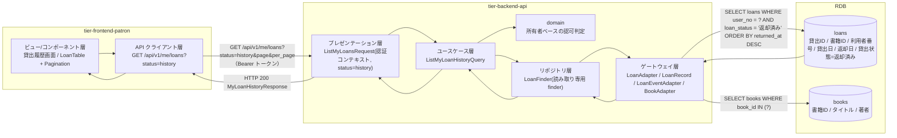
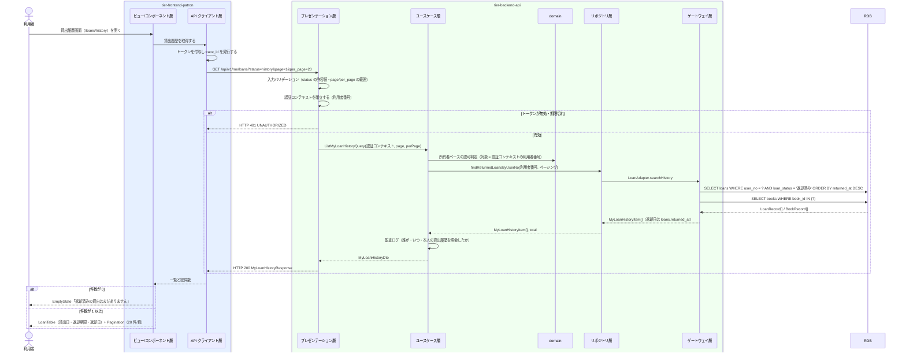

# 自分の貸出履歴を照会する

## 概要

利用者が返却済みの貸出を貸出日・返却日とともに Web 画面（貸出履歴画面）で確認する。個人情報参照可否条件により、参照範囲は自分の貸出に限定される。返却日は返却登録イベントの発生日時から射影して表示する。

## データフロー



| レイヤー | データモデル | 変換内容 |
|---------|------------|---------|
| FE ビュー層 | 貸出履歴画面（LoanTable / Pagination） | 返却済みのみを扱う旨を空状態のメッセージで明示する。`showUser` は false |
| FE API クライアント層 | ListMyLoansRequest(status=history, page, per_page) | トークンの付与と trace_id の発行。利用者番号をクライアントから送らない |
| BE presentation | 認証コンテキスト（利用者番号）+ status / page / per_page の検証 | 認証コンテキストを組み立て Query へ変換（LP-003） |
| BE usecase | ListMyLoanHistoryQuery | Query。repository の読み取り専用 finder を使う（LP-008） |
| BE domain | 所有者ベースの認可判定 | 取得対象の利用者番号が認証コンテキストと一致することを強制する（LP-011） |
| BE gateway | SELECT loans + books | 返却日は loans.returned_at を直接参照し、書籍のタイトル・著者を結合する |
| Response | MyLoanHistoryResponse(items[], total, page, per_page) | 貸出ID・書籍タイトル・貸出日・返却期限・返却日 |

## 処理フロー



## バリエーション一覧

| バリエーション名 | 値 | 処理内容 | 適用 tier | 適用箇所 |
|----------------|---|---------|----------|---------|
| 貸出期間区分 | 標準 / 短期 / 長期 | 履歴行に貸出期間区分を併記し、返却期限の算出根拠を示す | tier-frontend-patron | 貸出履歴画面（LoanTable の列） |
| 貸出期間区分 | 標準 / 短期 / 長期 | `loan_period_type` をレスポンスに含める | tier-backend-api | GET /api/v1/me/loans?status=history |

## 分岐条件一覧

| 条件名 | 判定ルール | 適用 tier | 適用箇所 | BDD Scenario |
|--------|----------|----------|---------|-------------|
| 個人情報参照可否条件 | 参照範囲はログイン中の利用者本人の貸出のみ。利用者番号をリクエストで受け取らない | tier-backend-api | domain の所有者ベース認可判定 / GET /api/v1/me/loans | 他人の貸出履歴へ到達できない |
| 本人限定参照の UI 制約（LP-025） | 他利用者の貸出へ到達する導線を画面に持たない。`LoanTable` の `showUser` は false | tier-frontend-patron | 貸出履歴画面 | 利用者列が表示されない |
| 貸出履歴の抽出 | 貸出状態が「返却済み」の貸出のみを対象とする。貸出中・延滞は対象外（現在の貸出の対象） | tier-backend-api | GET /api/v1/me/loans?status=history | 貸出中の貸出は履歴に出ない |

## 計算ルール一覧

| 計算名 | 入力情報 | 計算式/ロジック | 出力情報 | 適用 tier |
|--------|---------|---------------|---------|----------|
| 返却日の射影 | 貸出（返却登録イベント） | returned_date = 該当貸出の `LOAN_RETURNED` イベントの occurred_at を日付へ射影する | returned_date | tier-backend-api |
| 総頁数 | 総件数 | ceil(total / per_page)、per_page = 20 既定 | Pagination の頁数 | tier-frontend-patron |

## 状態遷移一覧

| 状態モデル | 遷移元 | 遷移先 | トリガー | 事前条件 | 事後処理 | 適用 tier |
|-----------|--------|--------|---------|---------|---------|----------|
| 貸出状態 | 返却済み | 返却済み | 自分の貸出履歴を照会する（参照のみ） | 利用者としてログイン済み | なし（状態遷移を伴わない照会 UC。返却済みの貸出は貸出統計の集計対象として保持される） | tier-backend-api |

## 関連 RDRA モデル

| モデル種別 | 要素名 | 関連 |
|-----------|--------|------|
| 業務 | 利用照会業務 | このUCが属する業務 |
| BUC | 貸出履歴を確認するフロー | このUCを含むBUC |
| アクティビティ | 過去に借りた書籍を振り返る | このUCが実現するアクティビティ |
| アクター | 利用者 | 操作するアクター（立場: 提供者） |
| 情報 | 貸出 | 照会する情報 |
| 情報 | 書籍 | 履歴行に表示する書籍のタイトル・著者 |
| 情報 | 利用者アカウント | 本人限定参照の判定に使う情報 |
| 状態 | 貸出状態 | 抽出対象の状態（返却済み） |
| 条件 | 個人情報参照可否条件 | 本人限定参照の根拠 |
| バリエーション | 貸出期間区分 | 返却期限の算出根拠として表示する区分 |
| 画面 | 貸出履歴画面 | このUCの画面 |

## 受け入れ基準トレーサビリティ

| 受け入れ基準 ID | 役割 | 対応する BDD Scenario |
|---|---|---|
| SPEC-004-01#1 | 主担当 | 返却済みの貸出が貸出日・返却日とともに表示される |
| SPEC-004-01#3 | 主担当 | 他人の貸出履歴へ到達できない |

受け入れ基準 ID の定義は `_cross-cutting/traceability-matrix.md`「USDM 受け入れ基準 ↔ UC 対応表」を正本とする。

## E2E 完了条件（BDD）

### 正常系

```gherkin
Feature: 自分の貸出履歴を照会する

  Scenario: 返却済みの貸出が貸出日・返却日とともに表示される
    Given 利用者「田中太郎（U-000123）」が利用者ポータルにログイン済みである
    And 利用者「U-000123」に書籍「坊っちゃん」の貸出（貸出日 2026-08-01 / 返却日 2026-08-14（API の ISO 8601 形式） / 返却済み）がある
    When 利用者が貸出履歴画面（/loans/history）を開く
    Then 一覧に「坊っちゃん」が表示される
    And 貸出日の列に「2026/08/01」、返却日の列に「2026/08/14」が表示される

  Scenario: 返却日の新しい順に並ぶ
    Given 利用者「田中太郎」に返却日「2026-08-14」と「2026-07-01」（API の ISO 8601 形式）の返却済み貸出がある
    When 利用者が貸出履歴画面を開く
    Then 1 行目の返却日の列が「2026/08/14」である
    And 2 行目の返却日の列が「2026/07/01」である

  Scenario: 21 件目以降を次頁で確認できる
    Given 利用者「田中太郎」に返却済みの貸出が 25 件ある
    When 利用者が貸出履歴画面で Pagination の 2 頁目を選択する
    Then 5 件が表示される
    And Pagination に「2 / 2」が表示される

  Scenario: 貸出中の貸出は履歴に出ない
    Given 利用者「田中太郎」に貸出状態「貸出中」の貸出が 1 件ある
    And 返却済みの貸出が 1 件ある
    When 利用者が貸出履歴画面を開く
    Then 一覧の件数が 1 である
    And 表示された貸出の貸出状態が「返却済み」である
```

### 異常系

```gherkin
  Scenario: 返却済みの貸出が無いとき空状態を案内する
    Given 利用者「鈴木三郎（U-000300）」に返却済みの貸出が 0 件である
    When 利用者が貸出履歴画面（/loans/history）を開く
    Then EmptyState に「返却済みの貸出はまだありません」と表示される
    And 現在の貸出との違いが説明される

  Scenario: 未ログインではログイン画面へ誘導される
    Given 利用者がログインしていない
    When 利用者が貸出履歴画面（/loans/history）を開く
    Then HTTP 401 が返る
    And ログイン画面へ誘導される

  Scenario: 他人の貸出履歴へ到達できない
    Given 利用者「田中太郎（U-000123）」がログイン済みである
    And 利用者「佐藤次郎（U-000200）」に返却済みの貸出がある
    When 利用者が GET /api/v1/me/loans?status=history を実行する
    Then レスポンスに利用者番号「U-000200」の貸出が含まれない
    And 他の利用者番号を指定するパラメータが API に存在しない

  Scenario: 取得に失敗したときエラーを表示する
    Given 利用者「田中太郎」がログイン済みである
    And バックエンド API が HTTP 500 を返す状態である
    When 利用者が貸出履歴画面を開く
    Then Alert(destructive) に「貸出履歴を取得できませんでした」と表示される
    And 内部の例外内容やスタックトレースは表示されない
```

## ティア別仕様

- [利用者ポータル](tier-frontend-patron.md)
- [バックエンド API](tier-backend-api.md)

### 統合 API Spec

- [OpenAPI Spec](../../../_cross-cutting/api/openapi.yaml)（全 UC 統合、Contract First 開発用）
