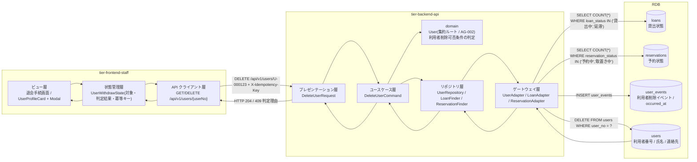

# 利用者を削除する

## 概要

司書が退会する利用者を登録から外す。利用者削除可否条件により、貸出状態が「貸出中」「延滞」の貸出、および予約状態が「予約中」「取置き中」の予約が残る利用者は削除できない。削除可否の判定は domain 層が強制し、フロントエンドは判定結果を表示するだけとする。

## データフロー



| レイヤー | データモデル | 変換内容 |
|---------|------------|---------|
| FE ビュー層 | 退会手続画面（対象の登録内容 + 進行中取引の件数） | 対象と影響を提示して確認を取る（LR-030）。削除可否はバックエンドの応答を表示する |
| FE 状態管理層 | UserWithdrawState(userNo, detail, deletable, reasons, submitting, idempotencyKey) | 利用者名簿から利用者番号を引き継ぎ、削除成功後は一覧キャッシュを無効化する |
| BE presentation | DeleteUserRequest(userNo) | パスパラメータの形式検証と認証コンテキストの確立。削除可否判定は行わない（LP-001） |
| BE usecase | DeleteUserCommand | 冪等キー検証、トランザクション境界の設定、監査ログの出力 |
| BE domain | User（AG-002 集約ルート） | 利用者削除可否条件を強制し、未充足ならドメイン例外を送出する |
| BE gateway | SELECT 進行中件数 / INSERT user_events / DELETE users | 判定材料を取得し、削除イベントを追記してスナップショットを削除する |
| Response | 204 No Content、または 409（未充足理由の一覧） | 削除完了、または削除できない根拠を司書へ提示する |

## 処理フロー

```mermaid
sequenceDiagram
  actor Staff as 司書

  box rgb(230,240,255) tier-frontend-staff
    participant View as ビュー層
    participant State as 状態管理層
    participant APIClient as API クライアント層
  end

  box rgb(240,255,240) tier-backend-api
    participant Pres as プレゼンテーション層
    participant UC as ユースケース層
    participant Domain as domain
    participant Repo as リポジトリ層
    participant GW as ゲートウェイ層
  end

  participant DB as RDB

  Staff->>View: 利用者名簿から対象を選び退会手続画面を開く
  View->>State: 対象の利用者番号を引き継ぐ
  State->>APIClient: GET /api/v1/users/U-000123
  APIClient->>Pres: GET /api/v1/users/U-000123
  Pres->>UC: GetUserQuery(userNo)
  UC->>Repo: findByUserNo + 進行中件数の集計
  Repo->>GW: UserAdapter / LoanAdapter / ReservationAdapter
  GW->>DB: SELECT users / COUNT(loans) / COUNT(reservations)
  DB-->>GW: UserRecord / 件数
  GW-->>UC: UserDetail(deletable, active_loan_count, active_reservation_count)
  UC-->>Pres: UserDetailDto
  Pres-->>APIClient: HTTP 200 UserDetailResponse
  APIClient-->>State: 判定結果と件数
  State-->>View: 削除可否と根拠を表示
  alt deletable が false
    View-->>Staff: Alert(warning)「進行中の貸出 1 件・予約 0 件のため削除できません」
  else deletable が true
    Staff->>View: 「退会させる」を押す
    View->>View: Modal(destructive-confirm) で対象名を再掲する
    Staff->>View: 確定する
    View->>State: 削除要求（送信中にして二重送信を禁止）
    State->>APIClient: DELETE /api/v1/users/U-000123
    APIClient->>Pres: DELETE /api/v1/users/U-000123 + X-Idempotency-Key
    Pres->>Pres: 認証コンテキストを確立する（役割=司書）
    Pres->>UC: DeleteUserCommand(userNo, idempotencyKey)
    UC->>Repo: findByUserNo + 進行中件数の再取得
    Repo-->>UC: User, 件数
    UC->>Domain: user.withdraw(activeLoanCount, activeReservationCount)
    alt 利用者削除可否条件が未充足
      Domain-->>UC: ドメイン例外（進行中取引あり）
      UC-->>Pres: 409 CONFLICT（未充足理由）
    else 条件を充足
      Domain->>Domain: 利用者状態「登録済み」から削除へ遷移させる
      UC->>Repo: UserRepository.delete(User)
      Repo->>GW: UserAdapter.delete
      GW->>DB: INSERT user_events / DELETE users
      DB-->>GW: 削除件数 1
      GW-->>Repo: 完了
      Repo-->>UC: 完了
      UC->>UC: 監査ログ（誰が・いつ・利用者 U-000123 を削除したか）
      UC-->>Pres: 完了
      Pres-->>APIClient: HTTP 204 No Content
    end
    APIClient-->>State: 結果
    State-->>View: 送信中を解除し、利用者一覧のキャッシュを無効化する
    View-->>Staff: Alert(success)「利用者 U-000123 を退会させました」
  end
```



## バリエーション一覧

| バリエーション名 | 値 | 処理内容 | 適用 tier | 適用箇所 |
|----------------|---|---------|----------|---------|
| 利用者区分 | 一般 / 学生 / 団体 | 削除対象の確認表示に区分を併記する（誤削除防止のための識別情報） | tier-frontend-staff | 退会手続画面の UserProfileCard |

## 分岐条件一覧

| 条件名 | 判定ルール | 適用 tier | 適用箇所 | BDD Scenario |
|--------|----------|----------|---------|-------------|
| 利用者削除可否条件 | 対象利用者に貸出状態が「貸出中」「延滞」の貸出、および予約状態が「予約中」「取置き中」の予約が存在しない場合に限り削除を許可する | tier-backend-api | domain の `user.withdraw` / DELETE /api/v1/users/{userNo} | 進行中の貸出がある利用者は削除できない |
| 利用者削除可否条件（表示） | バックエンドの判定結果（`deletable`）を表示するだけとし、フロント側で独自判定しない（LR-030） | tier-frontend-staff | 退会手続画面 | 削除不可のとき理由が件数つきで表示される |
| 個人情報参照可否条件 | 削除 API は司書ロールのみ到達可 | tier-backend-api | DELETE /api/v1/users/{userNo} | 利用者ロールでは削除できない |
| 対象利用者の存在 | 指定した利用者番号のレコードが存在しない場合は 404 を返す | tier-backend-api | DELETE /api/v1/users/{userNo} | 存在しない利用者番号では 404 になる |

## 計算ルール一覧

| 計算名 | 入力情報 | 計算式/ロジック | 出力情報 | 適用 tier |
|--------|---------|---------------|---------|----------|
| 進行中貸出件数 | 貸出（貸出状態） | COUNT(loans WHERE user_no = ? AND loan_status IN ('貸出中','延滞')) | active_loan_count | tier-backend-api |
| 進行中予約件数 | 予約（予約状態） | COUNT(reservations WHERE user_no = ? AND reservation_status IN ('予約中','取置き中')) | active_reservation_count | tier-backend-api |
| 削除可否 | 進行中貸出件数、進行中予約件数 | deletable = (active_loan_count = 0 AND active_reservation_count = 0) | deletable | tier-backend-api |

## 状態遷移一覧

| 状態モデル | 遷移元 | 遷移先 | トリガー | 事前条件 | 事後処理 | 適用 tier |
|-----------|--------|--------|---------|---------|---------|----------|
| 利用者状態 | 登録済み | （終了） | 利用者を削除する | 貸出中・延滞の貸出と予約中・取置き中の予約が存在しない | 利用者情報を登録から除く。削除イベントを追記する | tier-backend-api |
| 利用者状態 | 取引進行中 | 取引進行中 | 利用者を削除する（拒否） | 進行中の貸出または予約が存在する | 削除を拒否し 409 と未充足理由を返す | tier-backend-api |

## 関連 RDRA モデル

| モデル種別 | 要素名 | 関連 |
|-----------|--------|------|
| 業務 | 利用者管理業務 | このUCが属する業務 |
| BUC | 利用者を管理するフロー | このUCを含むBUC |
| アクティビティ | 退会する利用者を登録から外す | このUCが実現するアクティビティ |
| アクター | 司書 | 操作するアクター（立場: 提供者） |
| 情報 | 利用者 | 削除する情報 |
| 情報 | 貸出 | 削除可否判定に参照する情報 |
| 情報 | 予約 | 削除可否判定に参照する情報 |
| 状態 | 利用者状態 | 登録済みからの終了遷移 |
| 状態 | 貸出状態 | 判定に使う状態（貸出中 / 延滞） |
| 状態 | 予約状態 | 判定に使う状態（予約中 / 取置き中） |
| 条件 | 利用者削除可否条件 | 削除可否の判定ルール |
| 画面 | 退会手続画面 | このUCの画面 |

## 受け入れ基準トレーサビリティ

| 受け入れ基準 ID | 役割 | 対応する BDD Scenario |
|---|---|---|
| SPEC-001-02#3 | 主担当 | 進行中取引のない利用者を退会させる |

受け入れ基準 ID の定義は `_cross-cutting/traceability-matrix.md`「USDM 受け入れ基準 ↔ UC 対応表」を正本とする。

## E2E 完了条件（BDD）

### 正常系

```gherkin
Feature: 利用者を削除する

  Scenario: 進行中取引のない利用者を退会させる
    Given 司書「山田花子」が司書ポータルにログイン済みである
    And 利用者「田中太郎（U-000123）」に貸出中・延滞の貸出が 0 件、予約中・取置き中の予約が 0 件である
    When 司書が退会手続画面（/staff/users/U-000123/withdraw）で「退会させる」を確定する
    Then HTTP 204 が返る
    And 利用者「U-000123」が利用者名簿画面に表示されなくなる
    And Alert(success) に「利用者 U-000123 を退会させました」が表示される

  Scenario: 削除前に対象と影響が提示される
    Given 司書が退会手続画面（/staff/users/U-000123/withdraw）を開いている
    When 司書が「退会させる」を押す
    Then Modal(destructive-confirm) に氏名「田中太郎」と利用者番号「U-000123」が再掲される
    And 確定ボタンに初期フォーカスが当たっていない

  Scenario: 返却後は削除できるようになる
    Given 利用者「佐藤次郎（U-000200）」に貸出状態「貸出中」の貸出が 1 件ある
    And 司書がその貸出の返却を登録して貸出状態が「返却済み」になっている
    When 司書が退会手続画面（/staff/users/U-000200/withdraw）を開く
    Then 進行中の貸出件数が 0 と表示される
    And 「退会させる」ボタンが活性である
```

### 異常系

```gherkin
  Scenario: 進行中の貸出がある利用者は削除できない
    Given 利用者「佐藤次郎（U-000200）」に貸出状態「貸出中」の貸出が 1 件ある
    When 司書が退会手続画面（/staff/users/U-000200/withdraw）を開く
    Then Alert(warning) に「進行中の貸出が 1 件あるため削除できません」と表示される
    And 「退会させる」ボタンが不活性である

  Scenario: 取置き中の予約がある利用者は削除できない
    Given 利用者「鈴木三郎（U-000300）」に予約状態「取置き中」の予約が 1 件ある
    And 司書ロールのトークンを保持している
    When DELETE /api/v1/users/U-000300 を実行する
    Then HTTP 409 が返る
    And code が「BUSINESS_RULE_VIOLATION」である
    And 未充足理由に「予約中・取置き中の予約が 1 件あります」が含まれる

  Scenario: 存在しない利用者番号では 404 になる
    Given 司書ロールのトークンを保持している
    When DELETE /api/v1/users/U-999999 を実行する
    Then HTTP 404 が返る
    And code が「NOT_FOUND」である

  Scenario: 利用者ロールでは削除できない
    Given 利用者「田中太郎」のトークンを保持している
    When DELETE /api/v1/users/U-000200 を実行する
    Then HTTP 403 が返る
    And code が「FORBIDDEN」である

  Scenario: 同一冪等キーの再送で 204 が返る
    Given 司書が冪等キー「22222222-2222-2222-2222-222222222222」で利用者「U-000123」を削除済みである
    When 同じ冪等キーで DELETE /api/v1/users/U-000123 を再送する
    Then HTTP 204 が返る
    And 追加の削除イベントは追記されない
```

## ティア別仕様

- [司書ポータル](tier-frontend-staff.md)
- [バックエンド API](tier-backend-api.md)

### 統合 API Spec

- [OpenAPI Spec](../../../_cross-cutting/api/openapi.yaml)（全 UC 統合、Contract First 開発用）
