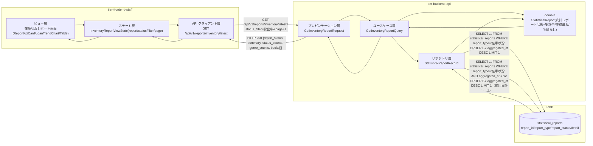
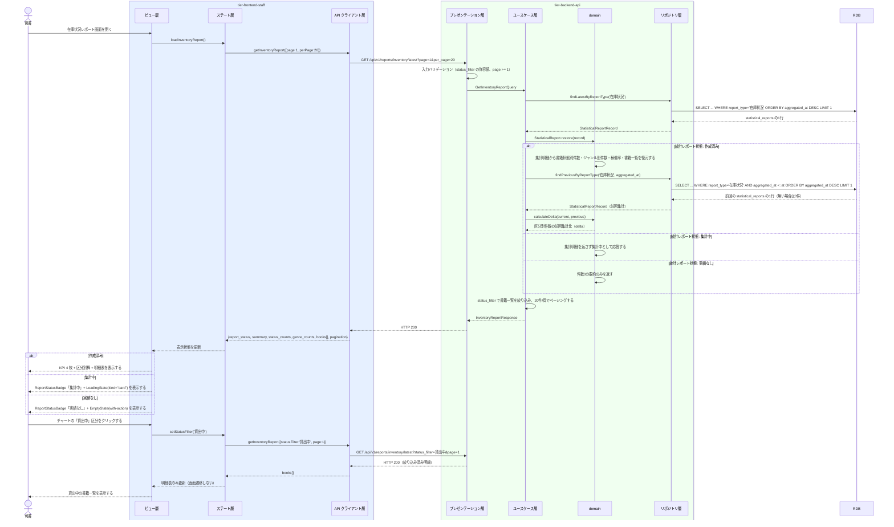

# 在庫状況レポートを参照する

## 概要

司書が在庫状況レポート画面で、書籍状態（在庫あり／貸出中／予約待ち）の区分ごとの件数と該当書籍一覧を参照し、蔵書の稼働状況を把握する。集計済みの統計レポートを読み取り専用で表示し、KPI カード 4 枚 + チャート 1 枚 + 明細表の 3 層で提示する（`_cross-cutting/ux-ui/data-visualization.md`）。

## データフロー



| レイヤー | データモデル | 変換内容 |
|---------|------------|---------|
| BE プレゼンテーション層 | GetInventoryReportRequest(report_id?, status_filter?, page, per_page) | クエリパラメータ検証（書籍状態の許容値、ページ番号）と Query 変換 |
| BE ユースケース層 | GetInventoryReportQuery | 対象レポートの特定（report_id 指定 or 最新）と明細のページング |
| BE リポジトリ層 | SELECT statistical_reports | report_type='在庫状況' の最新 1 件、または report_id 指定の 1 件 |
| BE domain | StatisticalReport | 集計明細(JSON) を書籍状態別件数・ジャンル別件数・稼働率・書籍一覧へ復元する |
| Response | InventoryReportResponse(report_status, summary, status_counts, genre_counts, books[], pagination) | KPI カード・チャート・明細表の表示元 |
| FE ステート層 | InventoryReportViewState | statusFilter（チャートのドリルダウン）とページ番号を保持 |
| FE ビュー層 | KPI 4 枚 / 区分別棒 / 明細表 | 統計レポート状態に応じて LoadingState(kind="card") / EmptyState / 通常表示を切り替える |

## 処理フロー



## バリエーション一覧

| バリエーション名 | 値 | 処理内容 | 適用 tier | 適用箇所 |
|----------------|---|---------|----------|---------|
| レポート種別 | 在庫状況 / 人気書籍ランキング / 期間別貸出統計 | 本画面は「在庫状況」のレポートのみを表示対象とする | tier-frontend-staff, tier-backend-api | 在庫状況レポート画面 / GET /api/v1/reports/inventory/latest |
| ジャンル | 文学 / 人文 / 社会科学 / 自然科学 / 技術 / 芸術 / 児童 / その他 | ジャンル別蔵書件数を明細表で提示する（8 区分のためチャートにしない） | tier-frontend-staff | 在庫状況レポート画面の明細表 |

## 分岐条件一覧

| 条件名 | 判定ルール | 適用 tier | 適用箇所 | BDD Scenario |
|--------|----------|----------|---------|-------------|
| 在庫状況集計条件 | 書籍状態（在庫あり／貸出中／予約待ち）の区分ごとの件数と書籍一覧を表示対象とする | tier-backend-api, tier-frontend-staff | GetInventoryReportQuery / 在庫状況レポート画面 | 区分別件数と書籍一覧を表示する |
| 統計レポート状態による表示切替 | 集計中は LoadingState(kind="card")、作成済みは KPI・チャート・明細、実績なしは EmptyState を表示する | tier-frontend-staff | 在庫状況レポート画面 | 集計中はスケルトンを表示する / 実績なしは空状態を表示する |
| レポート未存在 | report_type='在庫状況' の統計レポートが 1 件も無い場合は 404 を返す | tier-backend-api | GET /api/v1/reports/inventory/latest | レポートが未作成のとき404を返す |

## 計算ルール一覧

| 計算名 | 入力情報 | 計算式/ロジック | 出力情報 | 適用 tier |
|--------|---------|---------------|---------|----------|
| 前回集計比（件数差） | 統計レポート（集計明細.status_counts、直前の統計レポート） | 今回の区分別件数 − 前回集計の区分別件数 | 統計レポート（表示用 delta） | tier-backend-api |
| 稼働率の表示 | 統計レポート（集計明細.utilization_rate） | 集計済みの値を百分率（小数第1位）で表示する。分母=蔵書総数、分子=貸出中件数を補足文言に明示する | 表示値 | tier-frontend-staff |
| 明細ページ数 | 統計レポート（集計明細.books[] の件数） | ceil(絞り込み後件数 ÷ 20) | ページネーション総ページ数 | tier-backend-api |

## 状態遷移一覧

| 状態モデル | 遷移元 | 遷移先 | トリガー | 事前条件 | 事後処理 | 適用 tier |
|-----------|--------|--------|---------|---------|---------|----------|
| 統計レポート状態 | 作成済み | （終了） | 司書が在庫状況レポート画面で参照する | 統計レポート状態が「作成済み」である | 選書・購入判断（複本購入・除籍候補の抽出）に活用される | tier-frontend-staff |

本 UC は参照系であり、統計レポート状態を遷移させない。

## 関連 RDRA モデル

| モデル種別 | 要素名 | 関連 |
|-----------|--------|------|
| 業務 | 蔵書分析業務 | このUCが属する業務 |
| BUC | 在庫状況を把握するフロー | このUCを含むBUC |
| アクター | 司書 | レポートを参照するアクター（受益者） |
| 情報 | 統計レポート | 参照する情報 |
| 情報 | 書籍 | 集計明細に含まれる書籍一覧の元情報 |
| 状態 | 統計レポート状態 | 集計中／作成済み／実績なしで表示を切り替える |
| 状態 | 書籍状態 | 区分表示（BookStatusBadge）に使う |
| 条件 | 在庫状況集計条件 | 適用される条件 |
| バリエーション | レポート種別 | 在庫状況のレポートを対象とする |
| バリエーション | ジャンル | ジャンル別蔵書件数の表示軸 |
| 画面 | 在庫状況レポート画面 | 参照する画面 |

## 受け入れ基準トレーサビリティ

| 受け入れ基準 ID | 役割 | 対応する BDD Scenario |
|---|---|---|
| SPEC-005-01#1 | 主担当 | 区分別件数と書籍一覧を表示する |
| SPEC-005-01#1 | 主担当 | ジャンル別蔵書件数を明細表で確認する |

受け入れ基準 ID の定義は `_cross-cutting/traceability-matrix.md`「USDM 受け入れ基準 ↔ UC 対応表」を正本とする。

## E2E 完了条件（BDD）

### 正常系

```gherkin
Feature: 在庫状況レポートを参照する

  Scenario: 区分別件数と書籍一覧を表示する
    Given 統計レポート「RPT-0001」がレポート種別「在庫状況」・統計レポート状態「作成済み」で存在する
    And 集計明細に 蔵書総数 120・在庫あり 80・貸出中 30・予約待ち 10 が記録されている
    When 司書「山田花子」が在庫状況レポート画面 /staff/reports/inventory を開く
    Then KPI カードに 蔵書総数 120・在庫あり 80・貸出中 30・稼働率 25.0% が表示される
    And 区分別棒グラフに 在庫あり 80・貸出中 30・予約待ち 10 が時間順ではなく区分順で表示される
    And 明細表の1ページ目に書籍が 20 件表示される

  Scenario: チャートの区分をクリックして明細を絞り込む
    Given 司書「山田花子」が在庫状況レポート画面を表示している
    When 司書が区分別棒グラフの「貸出中」をクリックする
    Then 明細表が書籍状態「貸出中」の 30 件で絞り込まれる
    And 画面遷移は発生しない

  Scenario: ジャンル別蔵書件数を明細表で確認する
    Given 統計レポート「RPT-0001」の集計明細に ジャンル「文学」45 件・「技術」30 件が記録されている
    When 司書が在庫状況レポート画面のジャンル別明細を開く
    Then ジャンル 8 区分の件数が表として表示され、円グラフは表示されない
```

### 異常系

```gherkin
  Scenario: 集計中はスケルトンを表示する
    Given 統計レポート「RPT-0003」が統計レポート状態「集計中」で存在する
    When 司書が在庫状況レポート画面を開く
    Then ReportStatusBadge に「集計中」が表示され、KPI とチャートの領域が LoadingState(kind="card") になる

  Scenario: 実績なしは空状態を表示する
    Given 統計レポート「RPT-0002」が統計レポート状態「実績なし」で存在する
    When 司書が在庫状況レポート画面を開く
    Then EmptyState に「集計対象の蔵書がありません」と「集計期間を変更して再集計する」が表示される

  Scenario: レポートが未作成のとき404を返す
    Given レポート種別「在庫状況」の統計レポートが 1 件も存在しない
    When 司書が GET /api/v1/reports/inventory/latest を実行する
    Then HTTP 404 が返り、画面に「まだ集計されていません。集計を実行してください」が表示される

  Scenario: 利用者ロールではレポートを参照できない
    Given 利用者「田中太郎」が利用者ロールのトークンを持っている
    When 利用者が GET /api/v1/reports/inventory/latest を実行する
    Then HTTP 403 が返り、集計明細は返らない
```

## ティア別仕様

- [司書ポータル](tier-frontend-staff.md)
- [バックエンド API](tier-backend-api.md)

### 統合 API Spec

- [OpenAPI Spec](../../../_cross-cutting/api/openapi.yaml)（全 UC 統合、Contract First 開発用）
- [AsyncAPI Spec](../../../_cross-cutting/api/asyncapi.yaml)（全 UC 統合、非同期イベントがある場合のみ）
