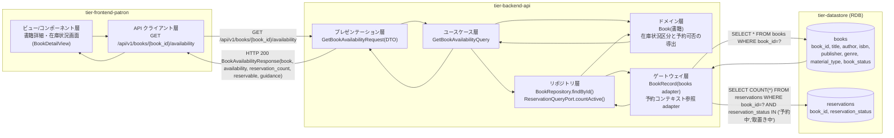
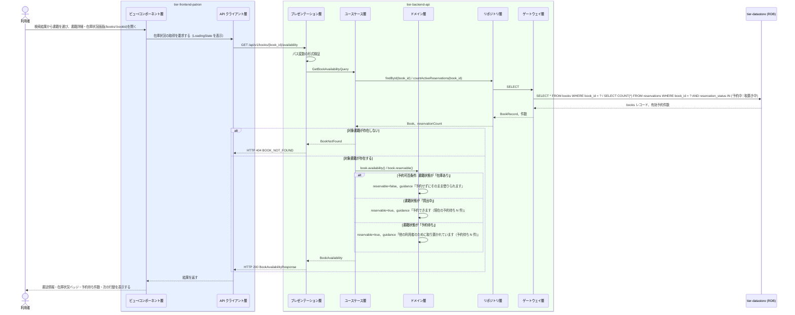

# 書籍詳細と在庫状況を照会する

## 概要

利用者が検索結果から選んだ書籍について、書誌情報と書籍状態（在庫あり／貸出中／予約待ち）を書籍詳細・在庫状況画面で確認する。来館前に貸出可否と予約要否を判断できるよう、在庫状況区分と予約の待ち状況、次に取れる行動（そのまま借りられる／予約する）を併せて提示する。

## データフロー



| レイヤー | データモデル | 変換内容 |
|---------|------------|---------|
| FE ビュー/コンポーネント層 | 書誌情報・在庫状況区分・予約件数・次の行動の案内文 | `BookCard` / `BookStatusBadge` / `ReservationQueueTracker` / `Alert` へ割り当てる |
| FE API クライアント層 | GET /api/v1/books/{book_id}/availability | 認証トークン付与・trace_id 発行・タイムアウト/リトライ |
| BE プレゼンテーション層 | GetBookAvailabilityRequest(book_id) | パス変数の形式検証 + Query 変換 |
| BE ユースケース層 | GetBookAvailabilityQuery | 読み取り専用（Query 側） |
| BE ドメイン層 | Book（集約ルート AG-001） | 書籍状態から在庫状況区分を導出し、予約可否条件に基づく reservable と案内文を決める |
| BE リポジトリ層 | BookRepository / ReservationQueryPort | 予約件数は予約コンテキスト（BC-004）の公開インターフェース経由で取得する |
| BE ゲートウェイ層 | BookRecord ⇔ books テーブル、予約件数の SELECT | レコードを Book へ復元する |
| Response | BookAvailabilityResponse(book, availability, reservation_count, reservable, guidance) | 詳細表示・予約導線の出し分けに使う |

## 処理フロー



## バリエーション一覧

| バリエーション名 | 値 | 処理内容 | 適用 tier | 適用箇所 |
|----------------|---|---------|----------|---------|
| ジャンル | 文学、人文、社会科学、自然科学、技術、芸術、児童、その他 | 書誌情報の表示項目 | tier-frontend-patron / tier-backend-api | 書籍詳細・在庫状況画面の BookCard / BookAvailabilityResponse.book.genre |
| 資料種別 | 紙書籍、電子書籍 | 書誌情報の表示項目 | tier-frontend-patron / tier-backend-api | 書籍詳細・在庫状況画面の BookCard / BookAvailabilityResponse.book.material_type |

## 分岐条件一覧

| 条件名 | 判定ルール | 適用 tier | 適用箇所 | BDD Scenario |
|--------|----------|----------|---------|-------------|
| 書籍検索条件 | 一致した書籍について書籍状態に基づく在庫状況区分（在庫あり／貸出中／予約待ち）を併せて表示する | tier-frontend-patron / tier-backend-api | 書籍詳細・在庫状況画面 / Book.availability | 在庫ありの書籍で貸出可能と分かる |
| 予約可否条件（表示上の出し分け） | 書籍状態が「貸出中」「予約待ち」のときのみ予約導線を出す。「在庫あり」のときは予約せず借りられる旨を肯定形で案内する | tier-frontend-patron / tier-backend-api | 書籍詳細・在庫状況画面の予約ボタン / Book.reservable | 在庫ありの書籍では予約導線を出さない / 貸出中の書籍で予約導線を出す |
| 対象書籍の存在確認 | book_id に一致する書籍が存在しないときは 404 とする | tier-backend-api | ユースケース層の findById | 存在しない書籍の照会でエラーを案内する |

## 計算ルール一覧

| 計算名 | 入力情報 | 計算式/ロジック | 出力情報 | 適用 tier |
|--------|---------|---------------|---------|----------|
| 在庫状況区分の決定 | 書籍.書籍状態 | 在庫あり → 在庫あり、貸出中 → 貸出中、予約待ち → 予約待ち | availability | tier-backend-api |
| 予約待ち件数の算出 | 予約.予約状態、予約.書籍ID | count(予約 where 書籍ID = 対象 かつ 予約状態 ∈ {予約中, 取置き中}) | reservation_count | tier-backend-api |
| 案内文の決定 | 書籍.書籍状態、reservation_count | 在庫あり → 「予約せずにそのまま借りられます」、貸出中 → 「予約できます（現在の予約待ち N 件）」、予約待ち → 「他の利用者のために取り置かれています（予約待ち N 件）」 | guidance | tier-backend-api |

## 状態遷移一覧

| 状態モデル | 遷移元 | 遷移先 | トリガー | 事前条件 | 事後処理 | 適用 tier |
|-----------|--------|--------|---------|---------|---------|----------|
| 書籍状態 | （遷移なし） | （遷移なし） | 書籍詳細と在庫状況を照会する（参照のみ） | 対象書籍が存在すること | なし（表示のみ） | tier-backend-api |
| 予約状態 | （遷移なし） | （遷移なし） | 書籍詳細と在庫状況を照会する（参照のみ） | なし | なし（予約待ち件数の集計に使うだけ） | tier-backend-api |

## 関連 RDRA モデル

| モデル種別 | 要素名 | 関連 |
|-----------|--------|------|
| 業務 | 蔵書利用業務 | このUCが属する業務 |
| BUC | 書籍を検索するフロー | このUCを含むBUC |
| アクター | 利用者 | 操作するアクター（提供者） |
| 情報 | 書籍 | 参照する情報 |
| 情報 | 予約 | 予約待ち件数の参照に使う情報 |
| 状態 | 書籍状態 | 在庫状況区分として表示する |
| 状態 | 予約状態 | 「予約中」「取置き中」の件数を数える |
| 条件 | 書籍検索条件 | 適用される条件 |
| 条件 | 予約可否条件 | 予約導線の出し分け（表示上の参照。受付判定は「予約を登録する」UC） |
| バリエーション | ジャンル、資料種別 | 書誌情報の表示項目 |
| 画面 | 書籍詳細・在庫状況画面 | 操作する画面 |

## 受け入れ基準トレーサビリティ

| 受け入れ基準 ID | 役割 | 対応する BDD Scenario |
|---|---|---|
| SPEC-001-03#2 | 主担当 | 在庫ありの書籍で貸出可能と分かる |
| SPEC-002-03#2 | 補助 | 在庫ありの書籍では予約導線を出さない |
| SPEC-006-01#1 | 補助 | 在庫ありの書籍で貸出可能と分かる |

受け入れ基準 ID の定義は `_cross-cutting/traceability-matrix.md`「USDM 受け入れ基準 ↔ UC 対応表」を正本とする。

## E2E 完了条件（BDD）

### 正常系

```gherkin
Feature: 書籍詳細と在庫状況を照会する

  Scenario: 在庫ありの書籍で貸出可能と分かる
    Given 利用者「田中太郎」が利用者ポータルにログイン済み
    And 「吾輩は猫である」の書籍状態が「在庫あり」である
    When 利用者が検索結果から「吾輩は猫である」を選んで書籍詳細・在庫状況画面を開く
    Then 書誌情報（タイトル・著者・ISBN・出版社・ジャンル・資料種別）と「在庫あり」バッジが表示され、「予約せずにそのまま借りられます」と案内される

  Scenario: 貸出中の書籍で予約導線を出す
    Given 「坊っちゃん」の書籍状態が「貸出中」で、予約状態「予約中」の予約が2件ある
    When 利用者「田中太郎」が「坊っちゃん」の書籍詳細・在庫状況画面を開く
    Then 「貸出中」バッジと「現在の予約待ち 2 件」が表示され、予約申込への導線が表示される

  Scenario: 予約待ちの書籍で取置き中である旨を示す
    Given 「こころ」の書籍状態が「予約待ち」で、予約状態「取置き中」の予約が1件ある
    When 利用者「田中太郎」が「こころ」の書籍詳細・在庫状況画面を開く
    Then 「予約待ち」バッジと予約の進行状況が表示され、他の利用者のために取り置かれている旨が案内される
```

### 異常系

```gherkin
  Scenario: 在庫ありの書籍では予約導線を出さない
    Given 「吾輩は猫である」の書籍状態が「在庫あり」である
    When 利用者「田中太郎」が「吾輩は猫である」の書籍詳細・在庫状況画面を開く
    Then 予約申込ボタンが表示されず、「予約せずにそのまま借りられます」と肯定形で案内される

  Scenario: 存在しない書籍の照会でエラーを案内する
    Given 「BK-999」の書籍が除籍されて存在しない
    When 利用者「田中太郎」が /books/BK-999 を開く
    Then 「対象の書籍が見つかりません」と表示され、蔵書検索画面への導線が示される

  Scenario: 在庫状況の取得に失敗したとき再試行できる
    Given バックエンド API が 500 を返す状態である
    When 利用者「田中太郎」が書籍詳細・在庫状況画面を開く
    Then 「在庫状況を取得できませんでした」というエラー表示と再試行ボタンが表示される
```

## ティア別仕様

- [利用者ポータル](tier-frontend-patron.md)
- [バックエンド API](tier-backend-api.md)

### 統合 API Spec

- [OpenAPI Spec](../../../_cross-cutting/api/openapi.yaml)（全 UC 統合、Contract First 開発用）
