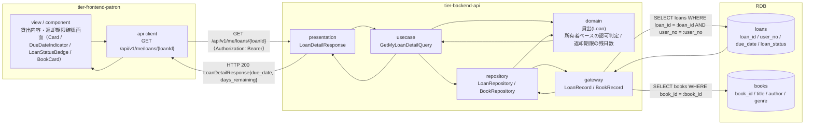
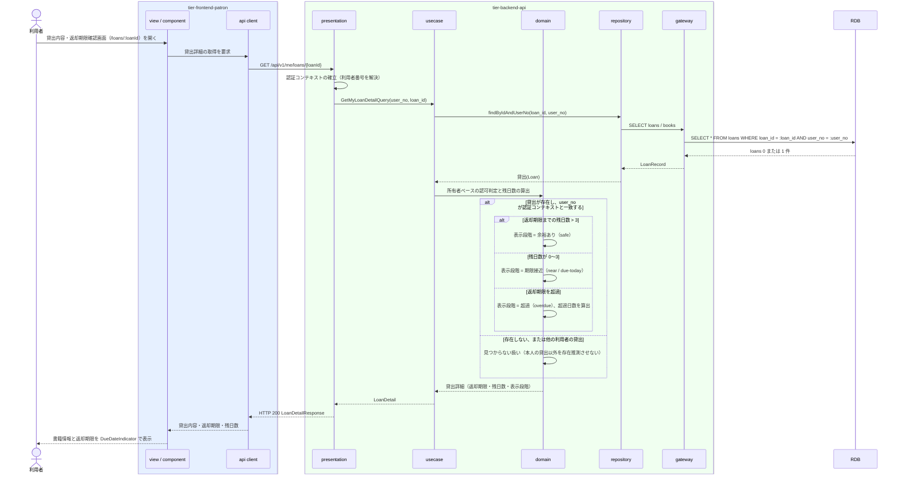

# 自分の貸出内容と返却期限を照会する

## 概要

利用者が、貸し出された書籍の内容と自動設定された返却期限を利用者ポータルの Web 画面で確認する。個人情報参照可否条件により、ログイン中の利用者本人に紐づく貸出のみを対象とする。参照のみで状態遷移は発生しない。

## データフロー



| レイヤー | データモデル | 変換内容 |
|---------|------------|---------|
| FE view | 書籍のタイトル・著者、貸出日、貸出期間区分、返却期限、残日数 | 返却期限を DueDateIndicator の 3 段階（余裕あり / 期限接近 / 超過）で視覚化し、日数を文言でも示す |
| FE api client | GET `/api/v1/me/loans/{loanId}` | アクセストークン付与、trace_id 発行、参照系リトライ（指数バックオフ最大 2 回） |
| BE presentation | LoanDetailResponse(loan_id, book, loan_date, loan_period_type, due_date, days_remaining, loan_status) | 認証コンテキストの確立、PII 最小化 |
| BE usecase | GetMyLoanDetailQuery(user_no, loan_id) | 読み取り専用 Query。認証コンテキストの利用者番号を必ず条件に含める |
| BE domain | 貸出(Loan) | 所有者ベースの認可判定（LP-011）。貸出の user_no が認証コンテキストと一致することを強制する |
| BE gateway | LoanRecord / BookRecord | `loans` / `books` の SELECT |
| Response | { loan_id, book{...}, loan_date, loan_period_type, due_date, days_remaining, loan_status } | 貸出内容と返却期限の表示に使う |

## 処理フロー



## バリエーション一覧

| バリエーション名 | 値 | 処理内容 | 適用 tier | 適用箇所 |
|----------------|---|---------|----------|---------|
| 貸出期間区分 | 標準 / 短期 / 長期 | 貸出に適用された貸出期間区分を表示し、返却期限の根拠として示す | tier-frontend-patron, tier-backend-api | 貸出内容・返却期限確認画面 / LoanDetailResponse.loan_period_type |

## 分岐条件一覧

| 条件名 | 判定ルール | 適用 tier | 適用箇所 | BDD Scenario |
|--------|----------|----------|---------|-------------|
| 個人情報参照可否条件 | 貸出の照会は、ログイン中の利用者本人に紐づく貸出のみを対象とする。他の利用者の貸出は表示しない | tier-backend-api, tier-frontend-patron | domain の所有者ベース認可判定 / 画面の導線制約 | 自分の貸出内容と返却期限を確認できる / 他の利用者の貸出は参照できない |

## 計算ルール一覧

| 計算名 | 入力情報 | 計算式/ロジック | 出力情報 | 適用 tier |
|--------|---------|---------------|---------|----------|
| 返却期限までの残日数 | 貸出.返却期限（due_date）、参照日（本日） | `days_remaining = due_date - 本日`（日数）。0 は期限当日、負値は超過日数を表す | 残日数 / 超過日数 | tier-backend-api |
| 返却期限の表示段階 | 残日数 | 残日数 > 3 → 余裕あり（safe）、1〜3 → 期限接近（near）、0 → 期限当日（due-today）、負値 → 超過（overdue） | DueDateIndicator の表示段階 | tier-frontend-patron |

## 状態遷移一覧

| 状態モデル | 遷移元 | 遷移先 | トリガー | 事前条件 | 事後処理 | 適用 tier |
|-----------|--------|--------|---------|---------|---------|----------|
| 貸出状態 | 貸出中 | 貸出中（遷移なし） | 自分の貸出内容と返却期限を照会する | 貸出が本人に紐づく | なし（参照のみ） | tier-backend-api |
| 貸出状態 | 延滞 | 延滞（遷移なし） | 自分の貸出内容と返却期限を照会する | 貸出が本人に紐づき、期限を超過している | なし（延滞への遷移は別 UC で発生する） | tier-backend-api |

## 関連 RDRA モデル

| モデル種別 | 要素名 | 関連 |
|-----------|--------|------|
| 業務 | 蔵書利用業務 | このUCが属する業務 |
| BUC | 書籍を貸し出すフロー | このUCを含むBUC |
| アクター | 利用者 | 照会するアクター（受益者） |
| 情報 | 貸出 | 参照する情報（貸出日・貸出期間区分・返却期限・貸出状態） |
| 情報 | 書籍 | 貸出対象の書籍（タイトル・著者・ジャンル） |
| 情報 | 利用者アカウント | 本人限定参照の判定に使う |
| 状態 | 貸出状態 | 貸出中 / 延滞 / 返却済みの表示に使う |
| 条件 | 個人情報参照可否条件 | 適用される条件 |
| バリエーション | 貸出期間区分 | 返却期限の根拠として表示する |
| 画面 | 貸出内容・返却期限確認画面 | 利用者ポータルの対象画面 |

## 受け入れ基準トレーサビリティ

| 受け入れ基準 ID | 役割 | 対応する BDD Scenario |
|---|---|---|
| SPEC-003-01#2 | 主担当 | 自分の貸出内容と返却期限を確認できる |
| SPEC-004-01#2 | 補助 | 自分の貸出内容と返却期限を確認できる |

受け入れ基準 ID の定義は `_cross-cutting/traceability-matrix.md`「USDM 受け入れ基準 ↔ UC 対応表」を正本とする。

## E2E 完了条件（BDD）

### 正常系

```gherkin
Feature: 自分の貸出内容と返却期限を照会する

  Scenario: 自分の貸出内容と返却期限を確認できる
    Given 利用者「田中太郎」（利用者番号 "U-000123"）が利用者ポータルにログイン済み
    And 貸出「L-000001」（書籍「吾輩は猫である」、貸出日 2026-09-02、貸出期間区分 "標準"、返却期限 2026-09-16、貸出状態 "貸出中"）が利用者「田中太郎」に紐づいて存在する
    And 本日が 2026-09-02 である
    When 利用者が貸出内容・返却期限確認画面（/loans/L-000001）を開く
    Then 書籍「吾輩は猫である」と返却期限「2026年9月16日」が表示される
    And DueDateIndicator に「あと14日」が余裕あり（safe）として表示される
    And LoanStatusBadge に「貸出中」が表示される

  Scenario: 返却期限が近い貸出は期限接近として表示される
    Given 利用者「田中太郎」（利用者番号 "U-000123"）がログイン済み
    And 貸出「L-000002」の返却期限が 2026-09-04 で貸出状態が "貸出中" である
    And 本日が 2026-09-02 である
    When 利用者が貸出内容・返却期限確認画面（/loans/L-000002）を開く
    Then DueDateIndicator に「あと2日」が期限接近（near）として表示される

  Scenario: 期限を超過した貸出は超過日数とともに表示される
    Given 利用者「田中太郎」（利用者番号 "U-000123"）がログイン済み
    And 貸出「L-000003」の返却期限が 2026-08-30 で貸出状態が "延滞" である
    And 本日が 2026-09-02 である
    When 利用者が貸出内容・返却期限確認画面（/loans/L-000003）を開く
    Then DueDateIndicator に「3日超過」が超過（overdue）として表示される
    And LoanStatusBadge に「延滞」が表示される
```

### 異常系

```gherkin
  Scenario: 他の利用者の貸出は参照できない
    Given 利用者「田中太郎」（利用者番号 "U-000123"）がログイン済み
    And 貸出「L-000009」が利用者「佐藤次郎」（利用者番号 "U-000456"）に紐づいて存在する
    When 利用者「田中太郎」が貸出内容・返却期限確認画面（/loans/L-000009）を開く
    Then HTTP 404 が返り「該当する貸出が見つかりません」と表示される
    And 他の利用者の貸出内容は一切表示されない

  Scenario: 存在しない貸出IDでは見つからない旨を表示する
    Given 利用者「田中太郎」（利用者番号 "U-000123"）がログイン済み
    When 利用者が貸出内容・返却期限確認画面（/loans/L-999999）を開く
    Then HTTP 404 が返り「該当する貸出が見つかりません」と表示される

  Scenario: 未ログインでは照会できない
    Given 利用者がログインしていない
    When 利用者が貸出内容・返却期限確認画面（/loans/L-000001）を開く
    Then ログイン画面へリダイレクトされる
```

## ティア別仕様

- [利用者ポータル](tier-frontend-patron.md)
- [バックエンド API](tier-backend-api.md)

### 統合 API Spec

- [OpenAPI Spec](../../_cross-cutting/api/openapi.yaml)（全 UC 統合、Contract First 開発用）
