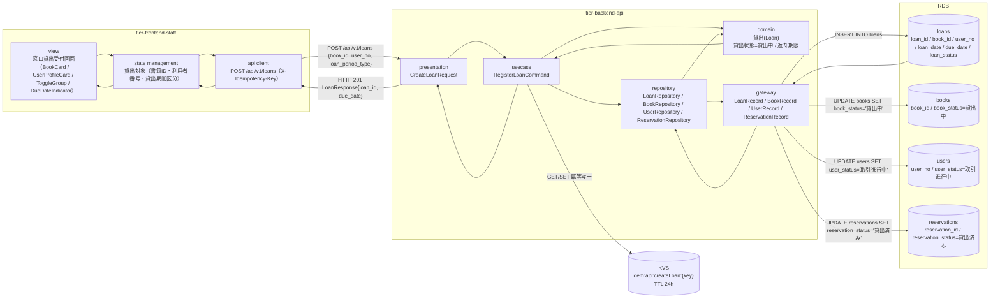
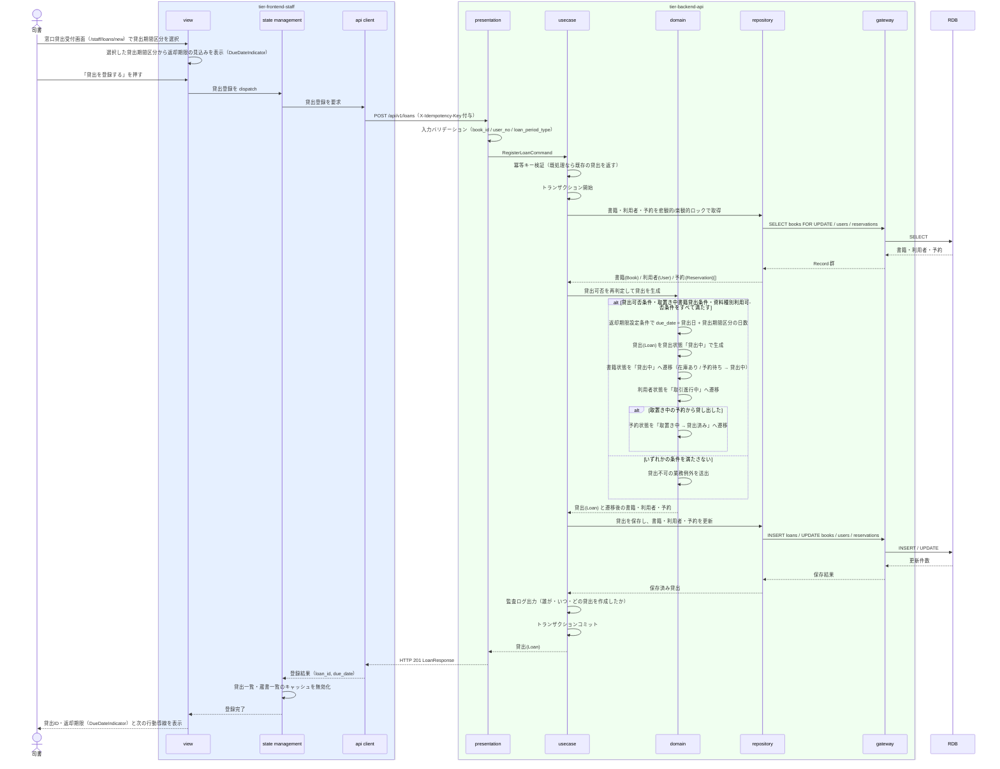

# 貸出を登録する

## 概要

司書が窓口で貸出を受け付け、貸出記録を作成する。貸出状態を「貸出中」とし、貸出日を起点に指定された貸出期間区分の日数を加算した返却期限を自動設定する。あわせて書籍状態を「貸出中」へ、利用者状態を「取引進行中」へ遷移させ、取置き中の予約から貸し出した場合は予約状態を「貸出済み」へ遷移させる。

## データフロー



| レイヤー | データモデル | 変換内容 |
|---------|------------|---------|
| FE view | 書籍ID・利用者番号・貸出期間区分の指定、返却期限の事前確認 | 貸出期間区分（ToggleGroup）の選択に応じた返却期限を DueDateIndicator で登録前に確認させる |
| FE state | { bookId, userNo, loanPeriodType, createdLoan } | 判定画面から引き継いだ書籍ID・利用者番号を保持し、登録後は貸出一覧・蔵書一覧のキャッシュを無効化する |
| FE api client | POST `/api/v1/loans` + `X-Idempotency-Key` | 冪等キー付与（LR-032）、司書トークン付与、trace_id 発行。再送時も同一キーを使う |
| BE presentation | CreateLoanRequest(book_id, user_no, loan_period_type) | 必須・形式チェック、認証コンテキストの確立、201 への HTTP ステータス変換 |
| BE usecase | RegisterLoanCommand | トランザクション境界。冪等キーを KVS（`idem:api:createLoan:{idempotency_key}`、TTL 24h）で GET/SET して検証、貸出可否の再判定、4 エンティティの更新、監査ログ出力 |
| BE domain | 貸出(Loan) | 返却期限設定条件で due_date を算出し、貸出状態「貸出中」で生成。書籍状態・利用者状態・予約状態の遷移整合を強制する |
| BE gateway | LoanRecord / BookRecord / UserRecord / ReservationRecord | `loans` の INSERT、`books` / `users` / `reservations` の UPDATE |
| Response | { loan_id, book_id, user_no, loan_date, loan_period_type, due_date, loan_status, book_status } | 登録結果の確認と返却期限の提示に使う |

## 処理フロー



## バリエーション一覧

| バリエーション名 | 値 | 処理内容 | 適用 tier | 適用箇所 |
|----------------|---|---------|----------|---------|
| 貸出期間区分 | 標準 / 短期 / 長期 | 返却期限設定条件の適用単位。選択した区分の日数を貸出日に加算して返却期限を算出する | tier-backend-api, tier-frontend-staff | domain の返却期限算出 / 窓口貸出受付画面の ToggleGroup |
| 利用者区分 | 一般 / 学生 / 団体 | 利用者区分ごとの既定貸出期間区分と選択可能な貸出期間区分の集合をバックエンドが正本として検証し、窓口貸出受付画面はその対応表を初期選択と選択可否（選択不可の区分は disabled）に反映する | tier-frontend-staff, tier-backend-api | 窓口貸出受付画面の初期選択 / 返却期限設定条件 |
| 資料種別 | 紙書籍 / 電子書籍 | 「紙書籍」のみ登録・貸出の対象とする。「電子書籍」は登録を拒否する | tier-backend-api | domain の資料種別判定 |

## 分岐条件一覧

| 条件名 | 判定ルール | 適用 tier | 適用箇所 | BDD Scenario |
|--------|----------|----------|---------|-------------|
| 貸出可否条件 | 書籍状態が「在庫あり」であり、かつ貸出先が登録済みで利用者状態が「登録済み」または「取引進行中」の利用者であるときに限り貸出を登録する。書籍状態が「貸出中」の場合は登録を拒否しエラーを返す | tier-backend-api | RegisterLoanCommand / domain の貸出生成 | 在庫ありの書籍を登録済み利用者へ貸し出せる / 貸出中の書籍への貸出登録は拒否される |
| 取置き中書籍貸出条件 | 書籍状態が「予約待ち」の場合、予約状態が「取置き中」かつ予約順1位の利用者に対してのみ貸出を登録する | tier-backend-api | domain の予約整合判定 | 取置き中の書籍を予約順1位の利用者へ貸し出せる |
| 返却期限設定条件 | 貸出記録の作成時に、貸出日を起点として利用者区分に対応する貸出期間区分の日数を加算した日を返却期限として自動設定する。対応表（一般=既定 標準 / 選択可 標準・短期、学生=既定 長期 / 選択可 長期・標準・短期、団体=既定 長期 / 選択可 長期・標準・短期）はバックエンドのドメイン規則として保持し、要求の `loan_period_type` が対象利用者の選択可能集合に含まれない場合は 409 `LOAN_PERIOD_TYPE_MISMATCH` で拒否する。窓口貸出受付画面の ToggleGroup は既定区分を初期選択し、選択可能集合に含まれない区分を disabled にする（UI 側の提示であり、検証の正本ではない） | tier-backend-api | domain の返却期限算出 | 貸出登録時に返却期限が自動設定される / 選択可能集合に含まれない貸出期間区分は 409 で拒否される / 一般利用者へ短期の貸出期間区分で貸し出せる |

## 計算ルール一覧

| 計算名 | 入力情報 | 計算式/ロジック | 出力情報 | 適用 tier |
|--------|---------|---------------|---------|----------|
| 返却期限の自動設定 | 貸出.貸出日（loan_date）、利用者.利用者区分（user_category）、貸出.貸出期間区分（loan_period_type） | `due_date = loan_date + 貸出期間区分に対応する日数`。貸出期間区分は利用者区分ごとの選択可能集合に含まれる区分でなければならず、バックエンドが対応表で検証してから加算する（集合外は 409 `LOAN_PERIOD_TYPE_MISMATCH` で拒否）。窓口貸出受付画面の ToggleGroup 初期選択は同じ対応表の UI 側の提示（返却期限設定条件） | 貸出.返却期限（due_date） | tier-backend-api |

貸出期間区分に対応する日数:

| 貸出期間区分 | 日数 |
|-------------|------|
| 標準 | 14 日 |
| 短期 | 7 日 |
| 長期 | 28 日 |

利用者区分ごとの貸出期間区分（バックエンドのドメイン規則。FE の初期選択・選択可否もこの表に従う）:

| 利用者区分 | 既定の貸出期間区分 | 選択可能な貸出期間区分 |
|-----------|------------------|--------------------|
| 一般 | 標準 | 標準 / 短期 |
| 学生 | 長期 | 長期 / 標準 / 短期 |
| 団体 | 長期 | 長期 / 標準 / 短期 |

短期は運用上どの利用者区分でも選択できる（RDRA バリエーション「貸出期間区分」の 3 値をすべて到達可能に保つ）。一般利用者に対する長期のみ選択不可とし、要求されたときは 409 `LOAN_PERIOD_TYPE_MISMATCH` で拒否する。

例: 貸出日 2026-09-02 + 標準（14 日） = 返却期限 2026-09-16。

## 状態遷移一覧

| 状態モデル | 遷移元 | 遷移先 | トリガー | 事前条件 | 事後処理 | 適用 tier |
|-----------|--------|--------|---------|---------|---------|----------|
| 貸出状態 | （なし） | 貸出中 | 貸出を登録する | 貸出可否条件を満たす | 返却期限を自動設定する（返却期限設定条件） | tier-backend-api |
| 書籍状態 | 在庫あり | 貸出中 | 貸出を登録する | 書籍状態が「在庫あり」 | 検索結果の在庫表示・在庫状況レポートの区分が変わる | tier-backend-api |
| 書籍状態 | 予約待ち | 貸出中 | 貸出を登録する | 取置き対象である予約順1位の利用者への貸出 | 対応する予約を「貸出済み」へ遷移させる | tier-backend-api |
| 利用者状態 | 登録済み | 取引進行中 | 貸出を登録する | 利用者が登録済み | 利用者削除可否条件により削除できなくなる | tier-backend-api |
| 予約状態 | 取置き中 | 貸出済み | 貸出を登録する | 取り置かれた書籍を該当利用者へ貸し出した | `reservation_status = '貸出済み'` と `hold_expires_at = NULL` を同一 UPDATE 文で更新する（`hold_started_at` は変更しない）。予約が成立して完了し、予約状況照会・取置き期限切れ判定の対象から外れる | tier-backend-api |

状態遷移の遷移元・遷移先・同時更新列は `_cross-cutting/datastore/rdb-schema.yaml` の
`state_transition_rules`「予約状態遷移規則」を唯一の正本とし、本 UC ではその行を参照するだけとする。

## 関連 RDRA モデル

| モデル種別 | 要素名 | 関連 |
|-----------|--------|------|
| 業務 | 蔵書利用業務 | このUCが属する業務 |
| BUC | 書籍を貸し出すフロー | このUCを含むBUC |
| アクター | 司書 | 貸出を登録するアクター（提供者） |
| アクター | 利用者 | 貸出先の利用者（受益者） |
| 情報 | 貸出 | 作成する情報（貸出ID・貸出日・貸出期間区分・返却期限・貸出状態） |
| 情報 | 書籍 | 貸出対象の書籍（書籍状態を更新する） |
| 情報 | 利用者 | 貸出先の利用者（利用者状態を更新する） |
| 情報 | 予約 | 取置き中の予約から貸し出した場合に予約状態を更新する |
| 状態 | 貸出状態 | 貸出中で開始する |
| 状態 | 書籍状態 | 在庫あり / 予約待ち → 貸出中 |
| 状態 | 利用者状態 | 登録済み → 取引進行中 |
| 状態 | 予約状態 | 取置き中 → 貸出済み |
| 条件 | 貸出可否条件 | 適用される条件 |
| 条件 | 返却期限設定条件 | 適用される条件 |
| 条件 | 取置き中書籍貸出条件 | 予約待ち書籍を予約順1位の利用者へ貸し出す判定に使う |
| 条件 | 資料種別利用可否条件 | 資料種別による貸出可否の判定に使う |
| バリエーション | 貸出期間区分 | 返却期限の算出単位 |
| バリエーション | 利用者区分 | 一般 / 学生 / 団体。既定の貸出期間区分の選択に使う |
| バリエーション | 資料種別 | 紙書籍 / 電子書籍。資料種別利用可否条件の判定に使う |
| 画面 | 窓口貸出受付画面 | 司書ポータルの対象画面 |

## 受け入れ基準トレーサビリティ

| 受け入れ基準 ID | 役割 | 対応する BDD Scenario |
|---|---|---|
| SPEC-002-01#1 | 主担当 | 在庫ありの書籍を登録済み利用者へ貸し出せる |
| SPEC-002-01#2 | 主担当 | 貸出中の書籍への貸出登録は拒否される |
| SPEC-003-01#1 | 主担当 | 貸出登録時に返却期限が自動設定される |
| SPEC-006-01#2 | 補助 | 電子書籍への貸出登録は拒否される |

受け入れ基準 ID の定義は `_cross-cutting/traceability-matrix.md`「USDM 受け入れ基準 ↔ UC 対応表」を正本とする。

## E2E 完了条件（BDD）

### 正常系

```gherkin
Feature: 貸出を登録する

  Scenario: 在庫ありの書籍を登録済み利用者へ貸し出せる
    Given 書籍「吾輩は猫である」（書籍ID "B-000001"、書籍状態 "在庫あり"、資料種別 "紙書籍"）が存在する
    And 利用者「田中太郎」（利用者番号 "U-000123"、利用者状態 "登録済み"、利用者区分 "一般"）が存在する
    And 司書「山田花子」が司書ポータルにログイン済みで、貸出可否判定の結果が「貸出可」である
    When 司書が窓口貸出受付画面で貸出期間区分「標準」を選択して貸出を登録する
    Then 貸出が貸出状態 "貸出中" で作成され、貸出IDが表示される
    And 書籍「吾輩は猫である」の書籍状態が "貸出中" になる
    And 利用者「田中太郎」の利用者状態が "取引進行中" になる

  Scenario: 貸出登録時に返却期限が自動設定される
    Given 書籍ID "B-000001" が書籍状態 "在庫あり" で存在する
    And 利用者番号 "U-000123" の利用者が利用者区分 "一般" で存在する
    And 本日が 2026-09-02 である
    When 司書が貸出期間区分「標準」（14 日）で貸出を登録する
    Then 返却期限が API 上 "2026-09-16" として自動設定される
    And DueDateIndicator に「2026年9月16日（あと14日）」と表示される

  Scenario: 利用者区分に対応しない貸出期間区分の指定は拒否される
    Given 書籍ID "B-000001" が書籍状態 "在庫あり" で存在する
    And 利用者番号 "U-000123" の利用者が利用者区分 "一般" で存在する
    When 司書が貸出期間区分「長期」で貸出を登録する
    Then 貸出は作成されず、利用者区分に対応しない貸出期間区分として拒否される

  Scenario: 取置き中の書籍を予約順1位の利用者へ貸し出せる
    Given 書籍「坊っちゃん」（書籍ID "B-000002"、書籍状態 "予約待ち"）が存在する
    And 利用者「田中太郎」（利用者番号 "U-000123"）の予約が予約順位 1、予約状態 "取置き中" で存在する
    When 司書が書籍ID "B-000002" と利用者番号 "U-000123" で貸出を登録する
    Then 貸出が貸出状態 "貸出中" で作成される
    And 書籍「坊っちゃん」の書籍状態が "貸出中" になる
    And 利用者「田中太郎」の予約の予約状態が "貸出済み" になる
```

### 異常系

```gherkin
  Scenario: 貸出中の書籍への貸出登録は拒否される
    Given 書籍「こころ」（書籍ID "B-000003"、書籍状態 "貸出中"）が存在する
    And 利用者「田中太郎」（利用者番号 "U-000123"、利用者状態 "登録済み"）が存在する
    When 司書が書籍ID "B-000003" と利用者番号 "U-000123" で貸出を登録する
    Then HTTP 409 が返り「この書籍は貸出中のため貸し出せません」と表示される
    And 貸出記録は作成されず、書籍状態は "貸出中" のまま変わらない

  Scenario: 取置き中の書籍を他の利用者へ貸し出そうとすると拒否される
    Given 書籍ID "B-000002" が書籍状態 "予約待ち" で、利用者番号 "U-000123" の予約が予約状態 "取置き中" で存在する
    And 利用者「佐藤次郎」（利用者番号 "U-000456"、利用者状態 "登録済み"）が存在する
    When 司書が書籍ID "B-000002" と利用者番号 "U-000456" で貸出を登録する
    Then HTTP 409 が返り「この書籍は他の利用者へ取置き中です」と表示される
    And 貸出記録は作成されない

  Scenario: 未登録の利用者への貸出登録は拒否される
    Given 書籍ID "B-000001" が書籍状態 "在庫あり" で存在する
    And 利用者番号 "U-999999" の利用者が登録されていない
    When 司書が書籍ID "B-000001" と利用者番号 "U-999999" で貸出を登録する
    Then HTTP 404 が返り「該当する利用者が見つかりません」と表示される
    And 貸出記録は作成されない

  Scenario: 電子書籍への貸出登録は拒否される
    Given 書籍「デジタル読本」（書籍ID "B-000004"、資料種別 "電子書籍"）が存在する
    And 利用者「田中太郎」（利用者番号 "U-000123"、利用者状態 "登録済み"）が存在する
    When 司書が書籍ID "B-000004" と利用者番号 "U-000123" で貸出を登録する
    Then HTTP 409 が返り「電子書籍は現在ご利用いただけません」と表示される
    And 貸出記録は作成されない

  Scenario: 同一の冪等キーによる再送では貸出が二重作成されない
    Given 司書が書籍ID "B-000001" と利用者番号 "U-000123" で貸出を登録し、貸出ID "L-000001" が作成された
    When 同じ内容・同じ冪等キーで貸出登録リクエストを再送する
    Then HTTP 201 が返り、貸出ID "L-000001" が返る
    And 貸出記録は 1 件のままで、書籍状態も "貸出中" のまま変わらない

  Scenario: 同一の冪等キーで異なる内容を送ると 409 で拒否される
    Given 司書が冪等キー "idem-0001" で書籍ID "B-000001" と利用者番号 "U-000123" の貸出を登録済みである
    When 同じ冪等キー "idem-0001" で書籍ID "B-000005" と利用者番号 "U-000123" の貸出登録リクエストを送る
    Then HTTP 409 が返り、code が "IDEMPOTENCY_KEY_CONFLICT" である
    And 貸出記録は 1 件のままで、書籍ID "B-000005" の書籍状態は変わらない

  Scenario: 取置き中の予約から貸し出すと取置き期限がクリアされる
    Given 書籍ID "B-000002" が書籍状態 "予約待ち" で、利用者番号 "U-000123" の予約 "R-000001" が予約状態 "取置き中"、取置き期限あり で存在する
    When 司書が書籍ID "B-000002" と利用者番号 "U-000123" で貸出を登録する
    Then 予約 "R-000001" の予約状態が "貸出済み" になる
    And 予約 "R-000001" の取置き期限が未設定になり、取置き開始日時は取置き時の値のまま残る
```

## ティア別仕様

- [司書ポータル](tier-frontend-staff.md)
- [バックエンド API](tier-backend-api.md)

### 統合 API Spec

- [OpenAPI Spec](../../_cross-cutting/api/openapi.yaml)（全 UC 統合、Contract First 開発用）
- [UC 間 API 依存マップ](../../_cross-cutting/api/uc-api-dependencies.md)（所有 operation と cross-UC 依存の分離ルール）

### 本 UC が利用する API

| 区分 | operationId | 所有 UC | 契約 |
|------|------------|--------|------|
| 所有 | `createLoan` | 貸出を登録する（本 UC） | `_cross-cutting/api/openapi.yaml` |
| 利用（任意） | `checkLoanEligibility` | 書籍の貸出可否を判定する | `_cross-cutting/api/openapi.yaml` |
| 利用（任意） | `getBookAvailability` | 書籍詳細と在庫状況を照会する | `_cross-cutting/api/openapi.yaml` |
| 利用（任意） | `getLoanTarget` | 利用者番号で貸出対象利用者を特定する | `_cross-cutting/api/openapi.yaml` |

機械可読な定義は `_api-summary.yaml` の `endpoints:`（所有）と `consumes:`（利用）が正本。
