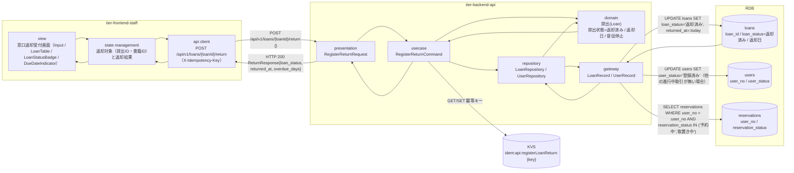
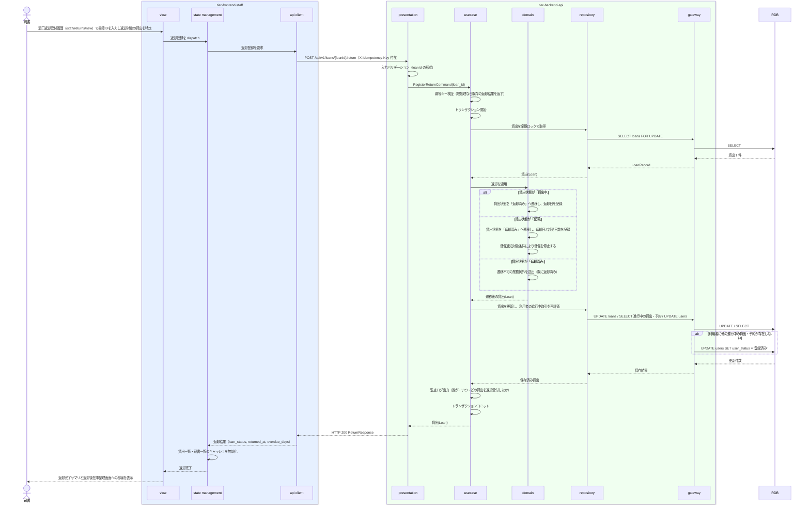

# 返却を登録する

## 概要

司書が窓口で返却を受け付け、貸出記録の貸出状態を「返却済み」へ遷移させて返却日を記録する。延滞していた貸出は返却済みへの遷移により督促を停止する。あわせて利用者に他の進行中の取引がなくなった場合は利用者状態を「取引進行中」から「登録済み」へ戻す。返却後の書籍状態の決定は後続 UC「返却後の書籍状態を更新する」が担う。

## データフロー



| レイヤー | データモデル | 変換内容 |
|---------|------------|---------|
| FE view | 返却対象の特定（貸出ID / 書籍IDの入力）、返却結果の表示 | 延滞返却は責めずに事実（超過日数）だけ示す |
| FE state | { loanId, bookId, returnResult } | 窓口フロー（返却対象照会 → 返却登録 → 返却後状態更新）で引き継ぐ（LP-030）。登録後は貸出一覧・蔵書一覧のキャッシュを無効化する |
| FE api client | POST `/api/v1/loans/{loanId}/return` + `X-Idempotency-Key` | 冪等キー付与（LR-032）、司書トークン付与、trace_id 発行 |
| BE presentation | RegisterReturnRequest(loan_id) | パスパラメータの形式チェック、認証コンテキストの確立 |
| BE usecase | RegisterReturnCommand | トランザクション境界。冪等キー検証、貸出状態の遷移、利用者状態の再評価、監査ログ出力 |
| BE domain | 貸出(Loan) | 貸出状態「貸出中 / 延滞 → 返却済み」の遷移整合を強制し、返却日を記録する。返却済みへ遷移した時点で督促を停止する |
| BE gateway | LoanRecord / UserRecord | `loans` の UPDATE と `users` の UPDATE |
| Response | { loan_id, book_id, user_no, loan_status, returned_at, overdue_days, previous_loan_status } | 返却完了の確認と、返却後在庫整理画面への引き継ぎに使う |

## 処理フロー



## バリエーション一覧

| バリエーション名 | 値 | 処理内容 | 適用 tier | 適用箇所 |
|----------------|---|---------|----------|---------|
| 通知種別 | 取置き案内 / 返却期限リマインド / 延滞督促 | 返却済みへの遷移により、通知種別「延滞督促」の対象から外す（督促通知対象条件） | tier-backend-api | domain の督促停止判定 |
| 貸出期間区分 | 標準 / 短期 / 長期 | 返却完了サマリに貸出期間区分と返却期限を表示し、超過日数の根拠として示す | tier-frontend-staff | 窓口返却受付画面 |

## 分岐条件一覧

| 条件名 | 判定ルール | 適用 tier | 適用箇所 | BDD Scenario |
|--------|----------|----------|---------|-------------|
| 督促通知対象条件 | 貸出状態が「貸出中」または「延滞」であり返却期限を経過した貸出を督促対象とする。貸出状態が「返却済み」になった時点で督促を停止する | tier-backend-api | domain の督促停止判定 | 延滞中の貸出を返却すると督促が停止する |

返却の受付可否は貸出状態の遷移定義に従う。貸出状態が「貸出中」または「延滞」の貸出のみ返却済みへ遷移でき、「返却済み」の貸出は再度返却できない。

## 計算ルール一覧

| 計算名 | 入力情報 | 計算式/ロジック | 出力情報 | 適用 tier |
|--------|---------|---------------|---------|----------|
| 返却日の記録 | 返却受付日（サーバのシステム日付、JST） | `returned_at = 返却受付日`。貸出状態が「返却済み」へ遷移した時点の日付を記録する | 貸出.返却日（returned_at） | tier-backend-api |
| 超過日数の算出 | 貸出.返却期限（due_date）、返却日（returned_at） | `overdue_days = max(0, returned_at - due_date)`（日数）。期限内返却は 0 | 超過日数 | tier-backend-api |

## 状態遷移一覧

| 状態モデル | 遷移元 | 遷移先 | トリガー | 事前条件 | 事後処理 | 適用 tier |
|-----------|--------|--------|---------|---------|---------|----------|
| 貸出状態 | 貸出中 | 返却済み | 返却を登録する | 返却期限内に司書が返却を受け付ける | 返却日を記録する。以降は貸出履歴・貸出統計の集計対象として保持される | tier-backend-api |
| 貸出状態 | 延滞 | 返却済み | 返却を登録する | 延滞中の書籍が返却される | 返却日と超過日数を記録し、督促を停止する | tier-backend-api |
| 利用者状態 | 取引進行中 | 登録済み | 返却を登録する | 利用者に他の進行中の貸出（貸出中 / 延滞）・予約（予約中 / 取置き中）が存在しない | 利用者削除可否条件を満たすようになる | tier-backend-api |

## 関連 RDRA モデル

| モデル種別 | 要素名 | 関連 |
|-----------|--------|------|
| 業務 | 蔵書利用業務 | このUCが属する業務 |
| BUC | 書籍を返却するフロー | このUCを含むBUC |
| アクター | 司書 | 返却を登録するアクター（提供者） |
| アクター | 利用者 | 書籍を返却する利用者（受益者） |
| 情報 | 貸出 | 更新する情報（貸出状態・返却日） |
| 情報 | 書籍 | 返却対象の書籍（状態更新は後続 UC が担う） |
| 情報 | 利用者 | 進行中取引の有無により利用者状態を更新する |
| 状態 | 貸出状態 | 貸出中 / 延滞 → 返却済み |
| 状態 | 利用者状態 | 取引進行中 → 登録済み |
| 条件 | 督促通知対象条件 | 適用される条件（返却済みで督促停止） |
| 画面 | 窓口返却受付画面 | 司書ポータルの対象画面 |

## 受け入れ基準トレーサビリティ

| 受け入れ基準 ID | 役割 | 対応する BDD Scenario |
|---|---|---|
| SPEC-002-02#1 | 主担当 | 期限内の貸出を返却登録できる |
| SPEC-003-03#2 | 主担当 | 延滞中の貸出を返却すると督促が停止する |
| SPEC-002-02#2 | 補助 | 期限内の貸出を返却登録できる |

受け入れ基準 ID の定義は `_cross-cutting/traceability-matrix.md`「USDM 受け入れ基準 ↔ UC 対応表」を正本とする。

## E2E 完了条件（BDD）

### 正常系

```gherkin
Feature: 返却を登録する

  Scenario: 期限内の貸出を返却登録できる
    Given 貸出「L-000001」（書籍「吾輩は猫である」、利用者「田中太郎」、返却期限 2026-09-16、貸出状態 "貸出中"）が存在する
    And 司書「山田花子」が司書ポータルにログイン済み
    And 本日が 2026-09-10 である
    When 司書が窓口返却受付画面で貸出「L-000001」の返却を登録する
    Then 貸出「L-000001」の貸出状態が "返却済み" になる
    And 返却日 2026-09-10 が記録される
    And 超過日数が 0 として表示される

  Scenario: 延滞中の貸出を返却すると督促が停止する
    Given 貸出「L-000003」（利用者「田中太郎」、返却期限 2026-08-30、貸出状態 "延滞"）が存在する
    And 本日が 2026-09-02 である
    When 司書が窓口返却受付画面で貸出「L-000003」の返却を登録する
    Then 貸出「L-000003」の貸出状態が "返却済み" になる
    And 超過日数が「3日超過」として表示される
    And 貸出「L-000003」は督促通知の対象から外れる

  Scenario: 最後の進行中取引を返却すると利用者状態が登録済みへ戻る
    Given 利用者「田中太郎」（利用者番号 "U-000123"、利用者状態 "取引進行中"）が存在する
    And 利用者「田中太郎」の進行中の取引が貸出「L-000001」（貸出状態 "貸出中"）1 件だけである
    When 司書が貸出「L-000001」の返却を登録する
    Then 貸出「L-000001」の貸出状態が "返却済み" になる
    And 利用者「田中太郎」の利用者状態が "登録済み" になる

  Scenario: 他の進行中取引が残っていれば利用者状態は取引進行中のままとなる
    Given 利用者「田中太郎」（利用者番号 "U-000123"、利用者状態 "取引進行中"）が存在する
    And 利用者「田中太郎」に貸出「L-000001」（貸出状態 "貸出中"）と予約「R-000001」（予約状態 "予約中"）が存在する
    When 司書が貸出「L-000001」の返却を登録する
    Then 貸出「L-000001」の貸出状態が "返却済み" になる
    And 利用者「田中太郎」の利用者状態は "取引進行中" のまま変わらない
```

### 異常系

```gherkin
  Scenario: 既に返却済みの貸出は再度返却できない
    Given 貸出「L-000004」（貸出状態 "返却済み"）が存在する
    When 司書が貸出「L-000004」の返却を登録する
    Then HTTP 409 が返り「この貸出は既に返却済みです」と表示される
    And 返却日は変更されない

  Scenario: 存在しない貸出IDでは返却登録できない
    Given 貸出「L-999999」が存在しない
    When 司書が貸出「L-999999」の返却を登録する
    Then HTTP 404 が返り「該当する貸出が見つかりません」と表示される

  Scenario: 同一の冪等キーによる再送では返却が二重登録されない
    Given 司書が貸出「L-000001」の返却を登録し、返却日 2026-09-10 が記録された
    When 同じ冪等キーで同じ返却登録リクエストを再送する
    Then HTTP 200 が返り、返却日は 2026-09-10 のまま変わらない
    And 利用者状態が二重に更新されない
```

## ティア別仕様

- [司書ポータル](tier-frontend-staff.md)
- [バックエンド API](tier-backend-api.md)

### 統合 API Spec

- [OpenAPI Spec](../../_cross-cutting/api/openapi.yaml)（全 UC 統合、Contract First 開発用）
