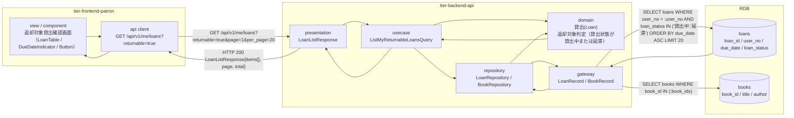
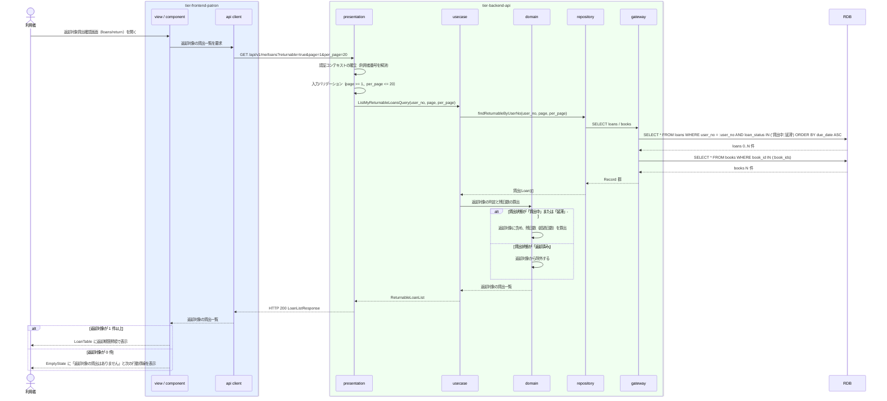

# 返却対象の貸出を照会する

## 概要

利用者が返却する書籍に対応する自分の貸出中（延滞を含む）の貸出記録を特定し、窓口での返却受付の対象とする。個人情報参照可否条件により、ログイン中の利用者本人に紐づく貸出のみを対象とする。参照のみで状態遷移は発生しない。

## データフロー



| レイヤー | データモデル | 変換内容 |
|---------|------------|---------|
| FE view | 返却対象の貸出一覧（書籍タイトル・返却期限・残日数・貸出状態） | 返却期限の昇順で表示し、超過分は DueDateIndicator（overdue）で先頭側に目立たせる |
| FE api client | GET `/api/v1/me/loans?returnable=true` | アクセストークン付与、trace_id 発行、参照系リトライ（最大 2 回） |
| BE presentation | LoanListResponse(items[], page, per_page, total) | 認証コンテキストの確立、ページネーションパラメータの検証 |
| BE usecase | ListMyReturnableLoansQuery(user_no, page, per_page) | 読み取り専用 Query。認証コンテキストの利用者番号を必ず条件に含める |
| BE domain | 貸出(Loan) | 返却対象は貸出状態が「貸出中」または「延滞」の貸出。所有者ベースの認可判定を強制する |
| BE gateway | LoanRecord / BookRecord | `loans` の SELECT（ページネーション）と `books` の一括 SELECT |
| Response | { items: [{ loan_id, book{...}, due_date, days_remaining, loan_status }], page, per_page, total } | 返却対象の特定と窓口提示に使う |

## 処理フロー



## バリエーション一覧

| バリエーション名 | 値 | 処理内容 | 適用 tier | 適用箇所 |
|----------------|---|---------|----------|---------|
| 貸出期間区分 | 標準 / 短期 / 長期 | 一覧の各行に貸出期間区分を表示し、返却期限の根拠として示す | tier-frontend-patron, tier-backend-api | 返却対象貸出確認画面 / LoanListResponse.items[].loan_period_type |

## 分岐条件一覧

| 条件名 | 判定ルール | 適用 tier | 適用箇所 | BDD Scenario |
|--------|----------|----------|---------|-------------|
| 個人情報参照可否条件 | 貸出の照会は、ログイン中の利用者本人に紐づく貸出のみを対象とする。他の利用者の貸出は表示しない | tier-backend-api, tier-frontend-patron | domain の所有者ベース認可判定 / 画面の導線制約 | 自分の返却対象の貸出だけが表示される |

返却対象は貸出状態が「貸出中」または「延滞」の貸出に限る。貸出状態が「返却済み」の貸出は返却対象から除外する（貸出状態の遷移定義に基づく）。

## 計算ルール一覧

| 計算名 | 入力情報 | 計算式/ロジック | 出力情報 | 適用 tier |
|--------|---------|---------------|---------|----------|
| 返却期限までの残日数 | 貸出.返却期限（due_date）、参照日（サーバのシステム日付） | `days_remaining = due_date - 参照日`（日数）。負値は超過日数を表す | 残日数 / 超過日数 | tier-backend-api |
| 返却対象の表示順 | 貸出.返却期限（due_date） | 返却期限の昇順で並べる。超過している貸出が先頭に来る | 一覧の表示順 | tier-backend-api |

## 状態遷移一覧

| 状態モデル | 遷移元 | 遷移先 | トリガー | 事前条件 | 事後処理 | 適用 tier |
|-----------|--------|--------|---------|---------|---------|----------|
| 貸出状態 | 貸出中 | 貸出中（遷移なし） | 返却対象の貸出を照会する | 貸出が本人に紐づく | なし（「返却済み」への遷移は「返却を登録する」で発生する） | tier-backend-api |
| 貸出状態 | 延滞 | 延滞（遷移なし） | 返却対象の貸出を照会する | 貸出が本人に紐づき、返却期限を超過している | なし（参照のみ） | tier-backend-api |

## 関連 RDRA モデル

| モデル種別 | 要素名 | 関連 |
|-----------|--------|------|
| 業務 | 蔵書利用業務 | このUCが属する業務 |
| BUC | 書籍を返却するフロー | このUCを含むBUC |
| アクター | 利用者 | 返却対象を照会するアクター（提供者） |
| 情報 | 貸出 | 参照する情報（返却期限・貸出状態） |
| 情報 | 書籍 | 返却対象書籍（タイトル・著者） |
| 情報 | 利用者 | 本人限定参照の対象となる利用者 |
| 状態 | 貸出状態 | 貸出中 / 延滞を返却対象とする |
| 条件 | 個人情報参照可否条件 | 適用される条件 |
| 画面 | 返却対象貸出確認画面 | 利用者ポータルの対象画面 |

## 受け入れ基準トレーサビリティ

| 受け入れ基準 ID | 役割 | 対応する BDD Scenario |
|---|---|---|
| SPEC-002-02#1 | 補助 | 返却対象は返却期限の昇順で表示される |

受け入れ基準 ID の定義は `_cross-cutting/traceability-matrix.md`「USDM 受け入れ基準 ↔ UC 対応表」を正本とする。

## E2E 完了条件（BDD）

### 正常系

```gherkin
Feature: 返却対象の貸出を照会する

  Scenario: 自分の返却対象の貸出だけが表示される
    Given 利用者「田中太郎」（利用者番号 "U-000123"）が利用者ポータルにログイン済み
    And 貸出「L-000001」（書籍「吾輩は猫である」、返却期限 2026-09-16、貸出状態 "貸出中"）が利用者「田中太郎」に紐づいて存在する
    And 貸出「L-000009」（書籍「三四郎」、貸出状態 "貸出中"）が利用者「佐藤次郎」（利用者番号 "U-000456"）に紐づいて存在する
    When 利用者「田中太郎」が返却対象貸出確認画面（/loans/return）を開く
    Then 貸出「L-000001」（書籍「吾輩は猫である」）が一覧に表示される
    And 貸出「L-000009」（書籍「三四郎」）は表示されない

  Scenario: 返却対象は返却期限の昇順で表示される
    Given 利用者「田中太郎」（利用者番号 "U-000123"）がログイン済み
    And 貸出「L-000003」（返却期限 2026-08-30、貸出状態 "延滞"）と貸出「L-000001」（返却期限 2026-09-16、貸出状態 "貸出中"）が存在する
    And 本日が 2026-09-02 である
    When 利用者が返却対象貸出確認画面（/loans/return）を開く
    Then 一覧の 1 行目に貸出「L-000003」が返却期限 "2026/08/30" と「3日超過」として表示される
    And 一覧の 2 行目に貸出「L-000001」が返却期限 "2026/09/16" と「あと14日」として表示される

  Scenario: 延滞中の貸出も返却対象として表示される
    Given 利用者「田中太郎」（利用者番号 "U-000123"）がログイン済み
    And 貸出「L-000003」（返却期限 2026-08-30、貸出状態 "延滞"）が存在する
    When 利用者が返却対象貸出確認画面（/loans/return）を開く
    Then 貸出「L-000003」が LoanStatusBadge「延滞」つきで一覧に表示される
```

### 異常系

```gherkin
  Scenario: 返却済みの貸出は返却対象に含まれない
    Given 利用者「田中太郎」（利用者番号 "U-000123"）がログイン済み
    And 貸出「L-000004」（書籍「三四郎」、貸出状態 "返却済み"）だけが利用者「田中太郎」に紐づいて存在する
    When 利用者が返却対象貸出確認画面（/loans/return）を開く
    Then 一覧に貸出「L-000004」は表示されない
    And EmptyState に「返却対象の貸出はありません」が表示される

  Scenario: 返却対象が 0 件のとき次の行動導線を提示する
    Given 利用者「田中太郎」（利用者番号 "U-000123"）がログイン済み
    And 利用者「田中太郎」に貸出中・延滞の貸出が 1 件も存在しない
    When 利用者が返却対象貸出確認画面（/loans/return）を開く
    Then EmptyState に「返却対象の貸出はありません」が表示される
    And 蔵書検索画面（/search）への導線が表示される

  Scenario: 未ログインでは照会できない
    Given 利用者がログインしていない
    When 利用者が返却対象貸出確認画面（/loans/return）を開く
    Then ログイン画面へリダイレクトされる
```

## ティア別仕様

- [利用者ポータル](tier-frontend-patron.md)
- [バックエンド API](tier-backend-api.md)

### 統合 API Spec

- [OpenAPI Spec](../../_cross-cutting/api/openapi.yaml)（全 UC 統合、Contract First 開発用）
