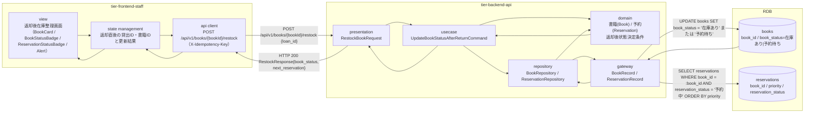
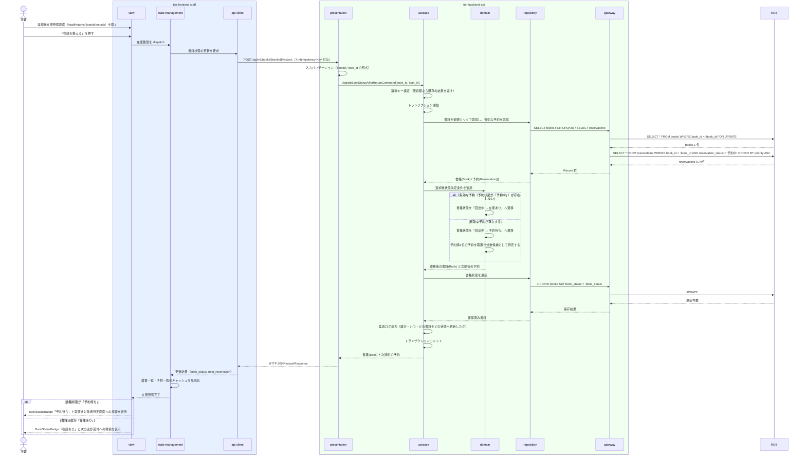

# 返却後の書籍状態を更新する

## 概要

司書が返却受付後の在庫を整える。返却された書籍に有効な予約（予約状態が「予約中」）が存在しない場合は書籍状態を「在庫あり」へ、存在する場合は「予約待ち」へ遷移させ、予約順1位の利用者のために取り置く。予約待ちへ遷移した場合は取置き対象者特定への導線を提示する。取置き通知の送信は後続の別 UC が担う。

## データフロー



| レイヤー | データモデル | 変換内容 |
|---------|------------|---------|
| FE view | 対象書籍の提示、遷移後の書籍状態、次順位の予約者の有無 | 「予約待ち」になった場合は取置き対象者特定への導線をその場に出す |
| FE state | { loanId, bookId, restockResult } | 返却登録画面から引き継いだ貸出ID・書籍IDを保持し、更新後は蔵書一覧・予約一覧のキャッシュを無効化する |
| FE api client | POST `/api/v1/books/{bookId}/restock` + `X-Idempotency-Key` | 冪等キー付与（LR-032）、司書トークン付与、trace_id 発行 |
| BE presentation | RestockBookRequest(book_id, loan_id) | パスパラメータ・ボディの形式チェック、認証コンテキストの確立 |
| BE usecase | UpdateBookStatusAfterReturnCommand | トランザクション境界。冪等キー検証、有効な予約の確認、書籍状態の遷移、監査ログ出力 |
| BE domain | 書籍(Book) / 予約(Reservation) | 返却後状態決定条件を適用し、書籍状態「貸出中 → 在庫あり / 予約待ち」の遷移整合を強制する |
| BE gateway | BookRecord / ReservationRecord | `reservations` の SELECT と `books` の UPDATE |
| Response | { book_id, book_status, previous_book_status, active_reservation_count, next_reservation{ reservation_id, priority, user_no } } | 在庫整理の結果確認と、取置き対象者特定への引き継ぎに使う |

## 処理フロー



## バリエーション一覧

| バリエーション名 | 値 | 処理内容 | 適用 tier | 適用箇所 |
|----------------|---|---------|----------|---------|
| 資料種別 | 紙書籍 / 電子書籍 | 対象書籍の資料種別を表示する。初期リリースの在庫整理対象は「紙書籍」のみ | tier-frontend-staff | 返却後在庫整理画面の BookCard |

## 分岐条件一覧

| 条件名 | 判定ルール | 適用 tier | 適用箇所 | BDD Scenario |
|--------|----------|----------|---------|-------------|
| 返却後状態決定条件 | 返却受付時に対象書籍への有効な予約（予約状態が「予約中」）が存在する場合は書籍状態を「予約待ち」とし、存在しない場合は「在庫あり」とする | tier-backend-api | domain の返却後状態決定 | 予約がない書籍は在庫ありへ戻る / 予約がある書籍は予約待ちへ遷移する |
| 取置き通知対象条件（後続 UC への引き継ぎ） | 書籍状態が「予約待ち」となった書籍について、予約順1位かつ予約状態が「予約中」の予約1件を取置き通知の対象とする | tier-backend-api, tier-frontend-staff | 次順位の予約の特定 / 取置き対象者特定画面への導線 | 予約待ちへ遷移した書籍で予約順1位が特定される |

## 計算ルール一覧

| 計算名 | 入力情報 | 計算式/ロジック | 出力情報 | 適用 tier |
|--------|---------|---------------|---------|----------|
| 予約順1位の特定 | 予約.予約申込日時（applied_at）、予約.予約順位（priority）、予約.予約状態 | 予約状態が「予約中」の予約を priority 昇順（同値時は applied_at 昇順）に並べ、先頭 1 件を取置き対象候補とする（予約順位決定条件の参照利用） | 次順位の予約（reservation_id / priority / user_no） | tier-backend-api |

## 状態遷移一覧

| 状態モデル | 遷移元 | 遷移先 | トリガー | 事前条件 | 事後処理 | 適用 tier |
|-----------|--------|--------|---------|---------|---------|----------|
| 書籍状態 | 貸出中 | 在庫あり | 返却後の書籍状態を更新する | 対象書籍に予約状態が「予約中」の予約が存在しない | 一般の貸出対象となる。検索結果の在庫表示が「在庫あり」になる | tier-backend-api |
| 書籍状態 | 貸出中 | 予約待ち | 返却後の書籍状態を更新する | 対象書籍に予約状態が「予約中」の予約が存在する | 予約順1位の利用者のために取り置く。取置き通知の対象になる | tier-backend-api |

## 関連 RDRA モデル

| モデル種別 | 要素名 | 関連 |
|-----------|--------|------|
| 業務 | 蔵書利用業務 | このUCが属する業務 |
| BUC | 書籍を返却するフロー | このUCを含むBUC |
| アクター | 司書 | 返却後の在庫を整えるアクター（提供者） |
| 情報 | 書籍 | 更新する情報（書籍状態） |
| 情報 | 予約 | 有効な予約の有無と予約順1位の特定に使う |
| 状態 | 書籍状態 | 貸出中 → 在庫あり / 予約待ち |
| 状態 | 予約状態 | 予約中の予約の有無を判定に使う |
| 条件 | 返却後状態決定条件 | 適用される条件 |
| 条件 | 取置き通知対象条件 | 後続 UC への引き継ぎで参照する条件 |
| 画面 | 返却後在庫整理画面 | 司書ポータルの対象画面 |

## 受け入れ基準トレーサビリティ

| 受け入れ基準 ID | 役割 | 対応する BDD Scenario |
|---|---|---|
| SPEC-002-02#2 | 主担当 | 予約がない書籍は在庫ありへ戻る |
| SPEC-002-04#1 | 補助 | 予約がある書籍は予約待ちへ遷移し予約順1位が特定される |

受け入れ基準 ID の定義は `_cross-cutting/traceability-matrix.md`「USDM 受け入れ基準 ↔ UC 対応表」を正本とする。

## E2E 完了条件（BDD）

### 正常系

```gherkin
Feature: 返却後の書籍状態を更新する

  Scenario: 予約がない書籍は在庫ありへ戻る
    Given 書籍「吾輩は猫である」（書籍ID "B-000001"、書籍状態 "貸出中"）が返却受付済みである
    And 書籍「吾輩は猫である」に予約状態が "予約中" の予約が存在しない
    And 司書「山田花子」が司書ポータルにログイン済み
    When 司書が返却後在庫整理画面で書籍「吾輩は猫である」の在庫を整える
    Then 書籍「吾輩は猫である」の書籍状態が "在庫あり" になる
    And BookStatusBadge に「在庫あり」が表示される

  Scenario: 予約がある書籍は予約待ちへ遷移し予約順1位が特定される
    Given 書籍「坊っちゃん」（書籍ID "B-000002"、書籍状態 "貸出中"）が返却受付済みである
    And 利用者「田中太郎」（利用者番号 "U-000123"）の予約「R-000001」が予約順位 1、予約状態 "予約中" で存在する
    When 司書が返却後在庫整理画面で書籍「坊っちゃん」の在庫を整える
    Then 書籍「坊っちゃん」の書籍状態が "予約待ち" になる
    And 予約順1位の利用者として「田中太郎」（利用者番号 "U-000123"）が提示される
    And 取置き対象者特定画面への導線が表示される

  Scenario: 複数の予約がある場合は予約順1位が取置き対象候補になる
    Given 書籍「坊っちゃん」（書籍ID "B-000002"、書籍状態 "貸出中"）が返却受付済みである
    And 利用者番号 "U-000123" の予約「R-000001」が予約順位 1、予約状態 "予約中" で存在する
    And 利用者番号 "U-000456" の予約「R-000002」が予約順位 2、予約状態 "予約中" で存在する
    When 司書が返却後在庫整理画面で書籍「坊っちゃん」の在庫を整える
    Then 書籍「坊っちゃん」の書籍状態が "予約待ち" になる
    And 取置き対象候補として予約「R-000001」（利用者番号 "U-000123"）が提示される
```

### 異常系

```gherkin
  Scenario: キャンセル済みの予約しかない書籍は在庫ありへ戻る
    Given 書籍「坊っちゃん」（書籍ID "B-000002"、書籍状態 "貸出中"）が返却受付済みである
    And 書籍「坊っちゃん」の予約「R-000003」が予約状態 "キャンセル" で存在する
    And 予約状態が "予約中" の予約は存在しない
    When 司書が返却後在庫整理画面で書籍「坊っちゃん」の在庫を整える
    Then 書籍「坊っちゃん」の書籍状態が "在庫あり" になる
    And 取置き対象者特定画面への導線は表示されない

  Scenario: 貸出中でない書籍の在庫整理は拒否される
    Given 書籍「吾輩は猫である」（書籍ID "B-000001"、書籍状態 "在庫あり"）が存在する
    When 司書が書籍「吾輩は猫である」の在庫を整える
    Then HTTP 409 が返り「この書籍は貸出中ではないため在庫整理できません」と表示される
    And 書籍状態は "在庫あり" のまま変わらない

  Scenario: 存在しない書籍IDでは在庫整理できない
    Given 書籍ID "B-999999" の書籍が存在しない
    When 司書が書籍ID "B-999999" の在庫を整える
    Then HTTP 404 が返り「該当する書籍が見つかりません」と表示される

  Scenario: 同一の冪等キーによる再送では書籍状態が二重更新されない
    Given 司書が書籍「坊っちゃん」（書籍ID "B-000002"）の在庫を整え、書籍状態が "予約待ち" になった
    When 同じ冪等キーで同じ在庫整理リクエストを再送する
    Then HTTP 200 が返り、書籍状態は "予約待ち" のまま変わらない
    And 予約の予約状態は変更されない
```

## ティア別仕様

- [司書ポータル](tier-frontend-staff.md)
- [バックエンド API](tier-backend-api.md)

### 統合 API Spec

- [OpenAPI Spec](../../_cross-cutting/api/openapi.yaml)（全 UC 統合、Contract First 開発用）
