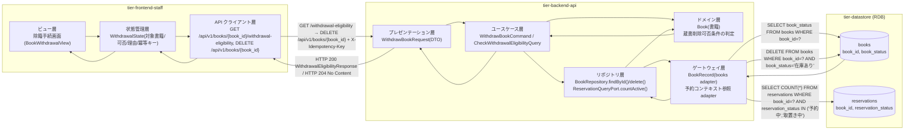
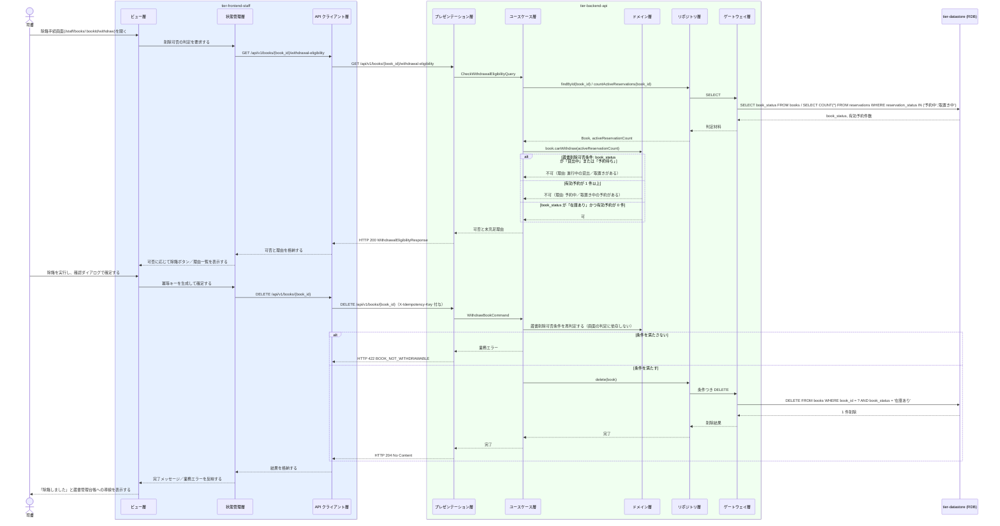

# 書籍を削除する

## 概要

司書が除籍手続画面で、対象書籍を蔵書から削除（除籍）する。蔵書削除可否条件により、書籍状態が「在庫あり」であり、かつ予約状態が「予約中」「取置き中」の予約が存在しない場合に限り削除を許可する。書籍状態が「貸出中」「予約待ち」の書籍は進行中の取引が追跡できなくなるため削除できない。

## データフロー



| レイヤー | データモデル | 変換内容 |
|---------|------------|---------|
| FE ビュー層 | 対象書籍の書誌情報・書籍状態、削除可否と未充足理由 | 削除不可のとき理由を根拠つきで並べる |
| FE 状態管理層 | WithdrawalState(book, eligibility, submitting, idempotencyKey) | 確認 Modal の開閉と冪等キーの保持 |
| FE API クライアント層 | GET .../withdrawal-eligibility → DELETE /api/v1/books/{book_id} | 認証トークン付与・冪等キー付与・trace_id 発行 |
| BE プレゼンテーション層 | WithdrawBookRequest(book_id) | パス変数の形式検証 + Command/Query 変換 |
| BE ユースケース層 | CheckWithdrawalEligibilityQuery / WithdrawBookCommand | トランザクション境界・冪等キー検証・監査ログ出力 |
| BE ドメイン層 | Book（集約ルート AG-001） | 蔵書削除可否条件（book_status = 在庫あり かつ 有効予約 0 件）の強制 |
| BE リポジトリ層 | BookRepository / ReservationQueryPort | 予約件数は予約コンテキスト（BC-004）の公開インターフェース経由で取得する |
| BE ゲートウェイ層 | BookRecord ⇔ books テーブル | 条件つき DELETE と予約件数の SELECT |
| Response | WithdrawalEligibilityResponse / 204 No Content | 可否と未充足理由の提示、削除完了の提示 |

## 処理フロー



## バリエーション一覧

| バリエーション名 | 値 | 処理内容 | 適用 tier | 適用箇所 |
|----------------|---|---------|----------|---------|
| （該当なし） | - | 本 UC はバリエーションによる分岐を持たない（除籍手続画面の `variants` も定義されていない） | - | - |

## 分岐条件一覧

| 条件名 | 判定ルール | 適用 tier | 適用箇所 | BDD Scenario |
|--------|----------|----------|---------|-------------|
| 蔵書削除可否条件 | 対象書籍の書籍状態が「在庫あり」であり、かつ予約状態が「予約中」「取置き中」の予約が存在しない場合に限り削除を許可する | tier-frontend-staff / tier-backend-api | 除籍手続画面の可否表示 / Book.canWithdraw（ドメイン層） | 貸出中の書籍は除籍できない / 予約がある書籍は除籍できない |
| 対象書籍の存在確認 | book_id に一致する書籍が存在しないときは 404 とする | tier-backend-api | ユースケース層の findById | 存在しない書籍の除籍を拒否する |
| 破壊的操作の確認 | 除籍は `Modal(destructive-confirm)` で対象書籍名を再掲したうえで確定させる（直接 URL 遷移で完了させない） | tier-frontend-staff | 除籍手続画面 | 確認ダイアログを経ずに除籍できない |

## 計算ルール一覧

| 計算名 | 入力情報 | 計算式/ロジック | 出力情報 | 適用 tier |
|--------|---------|---------------|---------|----------|
| 有効予約件数の算出 | 予約.予約状態、予約.書籍ID | count(予約 where 書籍ID = 対象 かつ 予約状態 ∈ {予約中, 取置き中}) | 削除可否判定に使う有効予約件数 | tier-backend-api |
| 未充足理由の組み立て | 書籍.書籍状態、有効予約件数 | 書籍状態が在庫あり以外なら「進行中の取引がある」、有効予約 ≥ 1 なら「予約が残っている」を理由に加える | 削除不可理由の一覧 | tier-backend-api |

## 状態遷移一覧

| 状態モデル | 遷移元 | 遷移先 | トリガー | 事前条件 | 事後処理 | 適用 tier |
|-----------|--------|--------|---------|---------|---------|----------|
| 書籍状態 | 在庫あり | （終了・蔵書から除かれる） | 書籍を削除する | 書籍状態が「在庫あり」かつ予約状態「予約中」「取置き中」の予約が存在しない（蔵書削除可否条件） | books から該当行を削除し、蔵書一覧・検索の対象から外れる | tier-backend-api |

## 関連 RDRA モデル

| モデル種別 | 要素名 | 関連 |
|-----------|--------|------|
| 業務 | 蔵書管理業務 | このUCが属する業務 |
| BUC | 蔵書を管理するフロー | このUCを含むBUC |
| アクター | 司書 | 操作するアクター（提供者） |
| 情報 | 書籍 | 削除する情報 |
| 情報 | 予約 | 削除可否判定で参照する情報 |
| 状態 | 書籍状態 | 「在庫あり」からの終了遷移 |
| 状態 | 予約状態 | 「予約中」「取置き中」の有無を判定する |
| 条件 | 蔵書削除可否条件 | 適用される条件 |
| 画面 | 除籍手続画面 | 操作する画面 |

## 受け入れ基準トレーサビリティ

| 受け入れ基準 ID | 役割 | 対応する BDD Scenario |
|---|---|---|
| SPEC-001-01#3 | 主担当 | 在庫ありで予約のない書籍を除籍する |

受け入れ基準 ID の定義は `_cross-cutting/traceability-matrix.md`「USDM 受け入れ基準 ↔ UC 対応表」を正本とする。

## E2E 完了条件（BDD）

### 正常系

```gherkin
Feature: 書籍を削除する

  Scenario: 在庫ありで予約のない書籍を除籍する
    Given 司書「山田花子」が司書ポータルにログイン済み
    And 「吾輩は猫である」の書籍状態が「在庫あり」で、予約状態が「予約中」「取置き中」の予約が0件である
    When 司書が除籍手続画面で除籍を実行し、確認ダイアログで「除籍する」を押す
    Then 「除籍しました」と表示され、蔵書管理台帳画面から「吾輩は猫である」が消える
```

### 異常系

```gherkin
  Scenario: 貸出中の書籍は除籍できない
    Given 司書「山田花子」が司書ポータルにログイン済み
    And 「坊っちゃん」の書籍状態が「貸出中」である
    When 司書が「坊っちゃん」の除籍手続画面を開く
    Then 「貸出中のため除籍できません」という理由が表示され、除籍ボタンが押せない

  Scenario: 予約がある書籍は除籍できない
    Given 「こころ」の書籍状態が「予約待ち」で、予約状態「取置き中」の予約が1件ある
    When 司書が「こころ」の除籍手続画面を開く
    Then 「予約待ちのため除籍できません」「取置き中の予約が1件あります」という理由が並んで表示され、除籍ボタンが押せない

  Scenario: 確認ダイアログを経ずに除籍できない
    Given 司書「山田花子」が「吾輩は猫である」の除籍手続画面を開いている
    When 司書が除籍ボタンを押す
    Then 対象書籍名「吾輩は猫である」を再掲した確認ダイアログが開き、確定するまで削除は行われない

  Scenario: 判定後に状態が変わった書籍の除籍を拒否する
    Given 司書「山田花子」が「吾輩は猫である」の除籍手続画面で除籍可能と表示されている
    And 別の司書が同じ書籍の貸出を登録して書籍状態が「貸出中」になっている
    When 司書が確認ダイアログで「除籍する」を押す
    Then 「貸出中のため除籍できません」と表示され、書籍は削除されない
```

## ティア別仕様

- [司書ポータル](tier-frontend-staff.md)
- [バックエンド API](tier-backend-api.md)

### 統合 API Spec

- [OpenAPI Spec](../../../_cross-cutting/api/openapi.yaml)（全 UC 統合、Contract First 開発用）
