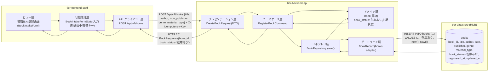
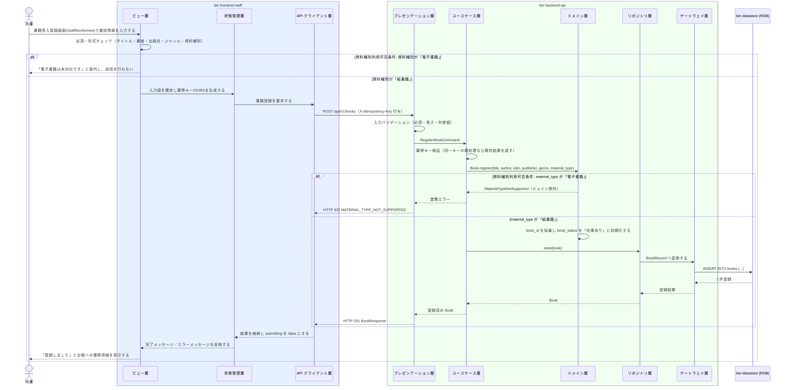

# 書籍を登録する

## 概要

司書が新規に受け入れた書籍のタイトル・著者・ISBN・出版社・ジャンル・資料種別を書籍受入登録画面から登録し、書籍状態を「在庫あり」として蔵書に追加する。資料種別は資料種別利用可否条件により初期リリースでは「紙書籍」のみ有効とし、「電子書籍」は未対応として案内する。

## データフロー



| レイヤー | データモデル | 変換内容 |
|---------|------------|---------|
| FE ビュー層 | タイトル・著者・ISBN・出版社（`Input`）、ジャンル・資料種別（`ToggleGroup`） | 入力値を BookIntakeFormState へ反映し、形式チェックを行う |
| FE 状態管理層 | BookIntakeFormState(title, author, isbn, publisher, genre, material_type, submitting, idempotencyKey) | 送信時に冪等キー（UUID）を生成し二重送信を防ぐ |
| FE API クライアント層 | POST /api/v1/books + `X-Idempotency-Key` | 認証トークン付与・trace_id 発行・タイムアウト |
| BE プレゼンテーション層 | CreateBookRequest(title, author, isbn?, publisher, genre, material_type) | 必須・長さ・列挙値バリデーション + RegisterBookCommand 変換 |
| BE ユースケース層 | RegisterBookCommand | トランザクション境界の設定・冪等キー検証・監査ログ出力 |
| BE ドメイン層 | Book（集約ルート AG-001） | 書籍ID 採番、book_status を「在庫あり」で初期化、資料種別利用可否条件の強制 |
| BE ゲートウェイ層 | BookRecord ⇔ books テーブル | INSERT（registered_at / updated_at に登録時刻を設定） |
| Response | BookResponse(book_id, title, ..., book_status) | 登録完了メッセージと台帳への遷移導線に使う |

## 処理フロー



## バリエーション一覧

| バリエーション名 | 値 | 処理内容 | 適用 tier | 適用箇所 |
|----------------|---|---------|----------|---------|
| 資料種別 | 紙書籍、電子書籍 | 「紙書籍」のみ登録可。「電子書籍」選択時は未対応を即時案内しルート分岐で送信を止める | tier-frontend-staff / tier-backend-api | 書籍受入登録画面の ToggleGroup / POST /api/v1/books の material_type 検証 |
| ジャンル | 文学、人文、社会科学、自然科学、技術、芸術、児童、その他 | 登録時の必須項目。ToggleGroup（single）で選択させる | tier-frontend-staff / tier-backend-api | 書籍受入登録画面 / CreateBookRequest.genre |

## 分岐条件一覧

| 条件名 | 判定ルール | 適用 tier | 適用箇所 | BDD Scenario |
|--------|----------|----------|---------|-------------|
| 資料種別利用可否条件 | 資料種別が「紙書籍」のときのみ登録を許可する。「電子書籍」を指定した場合は未対応である旨を案内し登録しない | tier-frontend-staff / tier-backend-api | 書籍受入登録画面 / Book.register（ドメイン層） | 電子書籍を選ぶと未対応として登録しない |
| 必須項目未入力 | タイトル・著者・出版社・ジャンル・資料種別のいずれかが未入力なら送信しない | tier-frontend-staff / tier-backend-api | 書籍受入登録画面 / CreateBookRequest の必須検証 | 必須項目が未入力のとき登録できない |
| 冪等キーの重複 | 同一 `X-Idempotency-Key` の再送は新規登録せず初回結果を返す | tier-backend-api | ユースケース層の冪等キー検証 | 二重送信しても書籍は1件しか登録されない |

## 計算ルール一覧

| 計算名 | 入力情報 | 計算式/ロジック | 出力情報 | 適用 tier |
|--------|---------|---------------|---------|----------|
| 書籍ID 採番 | なし（登録操作） | 一意な識別子を採番する（重複しない値） | 書籍.書籍ID | tier-backend-api |
| 登録日時・更新日時の設定 | 登録処理の実行時刻 | registered_at = updated_at = 登録時刻 | 書籍.登録日時 / 書籍.更新日時 | tier-backend-api |

## 状態遷移一覧

| 状態モデル | 遷移元 | 遷移先 | トリガー | 事前条件 | 事後処理 | 適用 tier |
|-----------|--------|--------|---------|---------|---------|----------|
| 書籍状態 | （初期） | 在庫あり | 書籍を登録する | 資料種別が「紙書籍」であること（資料種別利用可否条件） | books に book_status='在庫あり' で INSERT し、蔵書一覧・検索の対象になる | tier-backend-api |

## 関連 RDRA モデル

| モデル種別 | 要素名 | 関連 |
|-----------|--------|------|
| 業務 | 蔵書管理業務 | このUCが属する業務 |
| BUC | 蔵書を管理するフロー | このUCを含むBUC |
| アクター | 司書 | 操作するアクター（提供者） |
| 情報 | 書籍 | 登録する情報 |
| 状態 | 書籍状態 | 「在庫あり」で開始する |
| 条件 | 資料種別利用可否条件 | 適用される条件 |
| バリエーション | 資料種別、ジャンル | 入力項目の選択肢 |
| 画面 | 書籍受入登録画面 | 操作する画面 |

## 受け入れ基準トレーサビリティ

| 受け入れ基準 ID | 役割 | 対応する BDD Scenario |
|---|---|---|
| SPEC-001-01#1 | 主担当 | 紙書籍を受け入れて登録する |
| SPEC-006-01#1 | 主担当 | 紙書籍を受け入れて登録する |
| SPEC-006-01#2 | 主担当 | 電子書籍を選ぶと未対応として登録しない |

受け入れ基準 ID の定義は `_cross-cutting/traceability-matrix.md`「USDM 受け入れ基準 ↔ UC 対応表」を正本とする。

## E2E 完了条件（BDD）

### 正常系

```gherkin
Feature: 書籍を登録する

  Scenario: 紙書籍を受け入れて登録する
    Given 司書「山田花子」が司書ポータルにログイン済み
    When 司書が書籍受入登録画面でタイトル「吾輩は猫である」、著者「夏目漱石」、ISBN「9784101010014」、出版社「新潮社」、ジャンル「文学」、資料種別「紙書籍」を入力して登録する
    Then 「登録しました」と表示され、蔵書管理台帳画面に「吾輩は猫である」が書籍状態「在庫あり」で追加される

  Scenario: ISBN を省略して登録する
    Given 司書「山田花子」が書籍受入登録画面を開いている
    When 司書が ISBN を空欄のままタイトル「図書館note」、著者「佐藤一郎」、出版社「自費出版」、ジャンル「その他」、資料種別「紙書籍」を入力して登録する
    Then 「登録しました」と表示され、ISBN が未設定の書籍が書籍状態「在庫あり」で登録される
```

### 異常系

```gherkin
  Scenario: 電子書籍を選ぶと未対応として登録しない
    Given 司書「山田花子」が書籍受入登録画面を開いている
    When 司書が資料種別「電子書籍」を選択する
    Then 「電子書籍は現在未対応です。紙書籍のみ登録できます」と案内され、登録ボタンが押せない

  Scenario: 必須項目が未入力のとき登録できない
    Given 司書「山田花子」が書籍受入登録画面を開いている
    When 司書がタイトルを空欄のまま著者「夏目漱石」だけを入力して登録しようとする
    Then 「タイトルを入力してください」というエラーが該当項目に表示され、登録されない

  Scenario: 二重送信しても書籍は1件しか登録されない
    Given 司書「山田花子」が書籍受入登録画面で「坊っちゃん」の入力を完了している
    When 司書が登録ボタンを2回連続で押す
    Then 蔵書に登録される「坊っちゃん」は1件だけになる
```

## ティア別仕様

- [司書ポータル](tier-frontend-staff.md)
- [バックエンド API](tier-backend-api.md)

### 統合 API Spec

- [OpenAPI Spec](../../../_cross-cutting/api/openapi.yaml)（全 UC 統合、Contract First 開発用）
