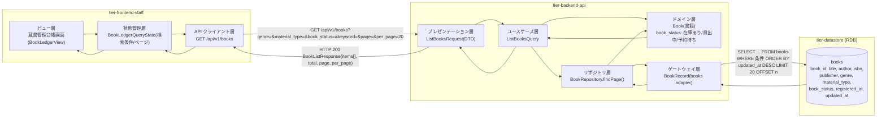
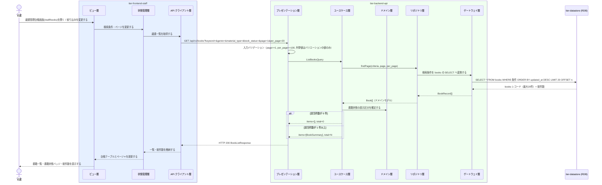

# 蔵書一覧を照会する

## 概要

司書が蔵書管理台帳画面で、登録済みの書籍をタイトル・著者・ISBN・出版社・ジャンル・資料種別とともに一覧表示する。書籍状態（在庫あり／貸出中／予約待ち）を併せて示し、一元管理されている蔵書の最新状態を確認できるようにする。

## データフロー



| レイヤー | データモデル | 変換内容 |
|---------|------------|---------|
| FE ビュー層 | 蔵書管理台帳画面の絞り込み入力（キーワード / ジャンル / 資料種別 / 書籍状態）とページ番号 | BookSearchFilter の選択値を BookLedgerQueryState へ反映する |
| FE 状態管理層 | BookLedgerQueryState(keyword, genre[], material_type[], book_status[], page) | クエリ文字列へ直列化し、条件変更時は page を 1 に戻す |
| FE API クライアント層 | GET /api/v1/books のクエリパラメータ | 認証トークン付与・trace_id 発行・タイムアウト/リトライ |
| BE プレゼンテーション層 | ListBooksRequest(keyword, genre[], material_type[], book_status[], page, per_page) | 形式・列挙値バリデーション + ListBooksQuery 変換 |
| BE ユースケース層 | ListBooksQuery | 読み取り専用（Query 側）。トランザクションは読み取り整合のみ |
| BE リポジトリ層 | BookRepository.findPage(criteria, page, per_page) | 検索条件を仕様オブジェクトへ変換 |
| BE ゲートウェイ層 | BookRecord ⇔ books テーブル | SELECT 結果を Book エンティティへ復元 |
| Response | BookListResponse(items[BookSummary], total, page, per_page) | 台帳テーブル行と BookStatusBadge の表示に使う |

## 処理フロー



## バリエーション一覧

| バリエーション名 | 値 | 処理内容 | 適用 tier | 適用箇所 |
|----------------|---|---------|----------|---------|
| ジャンル | 文学、人文、社会科学、自然科学、技術、芸術、児童、その他 | 一覧の絞り込み条件（複数選択）と一覧列の表示 | tier-frontend-staff / tier-backend-api | 蔵書管理台帳画面の BookSearchFilter / GET /api/v1/books の genre |
| 資料種別 | 紙書籍、電子書籍 | 一覧の絞り込み条件（複数選択）と一覧列の表示 | tier-frontend-staff / tier-backend-api | 蔵書管理台帳画面の BookSearchFilter / GET /api/v1/books の material_type |

## 分岐条件一覧

| 条件名 | 判定ルール | 適用 tier | 適用箇所 | BDD Scenario |
|--------|----------|----------|---------|-------------|
| 該当 0 件の分岐 | 絞り込み結果の total が 0 のとき、テーブルではなく EmptyState を表示する | tier-frontend-staff | 蔵書管理台帳画面 | 絞り込み結果が0件のとき理由と次の行動を示す |
| ページ分割 | total が per_page(20) を超えるとき Pagination を表示する（無限スクロールは使わない） | tier-frontend-staff / tier-backend-api | 蔵書管理台帳画面 / GET /api/v1/books | 21件以上の蔵書をページ送りで確認する |

## 計算ルール一覧

| 計算名 | 入力情報 | 計算式/ロジック | 出力情報 | 適用 tier |
|--------|---------|---------------|---------|----------|
| ページオフセット算出 | page, per_page | offset = (page - 1) × per_page | SELECT の OFFSET 値 | tier-backend-api |
| 総ページ数算出 | total, per_page | total_pages = ceil(total ÷ per_page) | Pagination の頁数 | tier-frontend-staff |

## 状態遷移一覧

| 状態モデル | 遷移元 | 遷移先 | トリガー | 事前条件 | 事後処理 | 適用 tier |
|-----------|--------|--------|---------|---------|---------|----------|
| 書籍状態 | （遷移なし） | （遷移なし） | 蔵書一覧を照会する（参照のみ） | 司書としてログイン済み | なし（書籍状態は表示のみ） | tier-backend-api |

## 関連 RDRA モデル

| モデル種別 | 要素名 | 関連 |
|-----------|--------|------|
| 業務 | 蔵書管理業務 | このUCが属する業務 |
| BUC | 蔵書を管理するフロー | このUCを含むBUC |
| アクター | 司書 | 操作するアクター（受益者） |
| 情報 | 書籍 | 参照する情報 |
| 状態 | 書籍状態 | 一覧に表示する状態（在庫あり／貸出中／予約待ち） |
| バリエーション | ジャンル、資料種別 | 絞り込み条件・表示項目 |
| 画面 | 蔵書管理台帳画面 | 操作する画面 |

## 受け入れ基準トレーサビリティ

| 受け入れ基準 ID | 役割 | 対応する BDD Scenario |
|---|---|---|
| SPEC-001-01#1 | 補助 | 登録済みの蔵書を一覧で確認する |
| SPEC-001-01#2 | 補助 | 登録済みの蔵書を一覧で確認する |
| SPEC-001-01#3 | 補助 | 登録済みの蔵書を一覧で確認する |

受け入れ基準 ID の定義は `_cross-cutting/traceability-matrix.md`「USDM 受け入れ基準 ↔ UC 対応表」を正本とする。

## E2E 完了条件（BDD）

### 正常系

```gherkin
Feature: 蔵書一覧を照会する

  Scenario: 登録済みの蔵書を一覧で確認する
    Given 司書「山田花子」が司書ポータルにログイン済み
    And 蔵書に「吾輩は猫である」（在庫あり）と「坊っちゃん」（貸出中）が登録されている
    When 司書が蔵書管理台帳画面（/staff/books）を開く
    Then 「吾輩は猫である」がタイトル・著者・ISBN・出版社・ジャンル・資料種別とともに表示され、書籍状態バッジが「在庫あり」になる
    And 「坊っちゃん」の書籍状態バッジが「貸出中」になる

  Scenario: ジャンルで蔵書を絞り込む
    Given 司書「山田花子」が蔵書管理台帳画面を開いている
    And 蔵書に文学ジャンルの書籍が2件、技術ジャンルの書籍が1件登録されている
    When 司書がジャンル「文学」を選択して絞り込む
    Then 文学ジャンルの2件だけが一覧に表示され、総件数に「2 件」と表示される

  Scenario: 21件以上の蔵書をページ送りで確認する
    Given 司書「山田花子」が蔵書管理台帳画面を開いている
    And 蔵書が25件登録されている
    When 司書がページャの「2」を押す
    Then 21件目から25件目の書籍が表示される
```

### 異常系

```gherkin
  Scenario: 絞り込み結果が0件のとき理由と次の行動を示す
    Given 司書「山田花子」が蔵書管理台帳画面を開いている
    And 児童ジャンルの書籍が1件も登録されていない
    When 司書がジャンル「児童」を選択して絞り込む
    Then 「条件に一致する蔵書がありません」と絞り込み条件の解除導線が表示される

  Scenario: 蔵書一覧の取得に失敗したとき再試行できる
    Given 司書「山田花子」が蔵書管理台帳画面を開いている
    And バックエンド API が 500 を返す状態である
    When 司書が一覧を再読み込みする
    Then 「蔵書一覧を取得できませんでした」というエラー表示と再試行ボタンが表示される
```

## ティア別仕様

- [司書ポータル](tier-frontend-staff.md)
- [バックエンド API](tier-backend-api.md)

### 統合 API Spec

- [OpenAPI Spec](../../../_cross-cutting/api/openapi.yaml)（全 UC 統合、Contract First 開発用）
