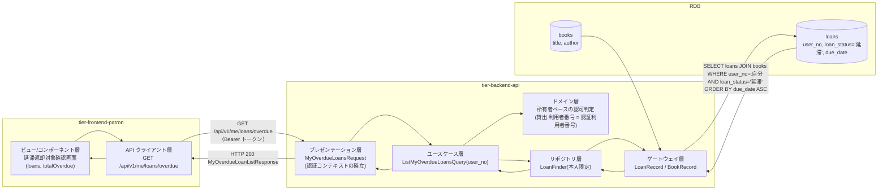
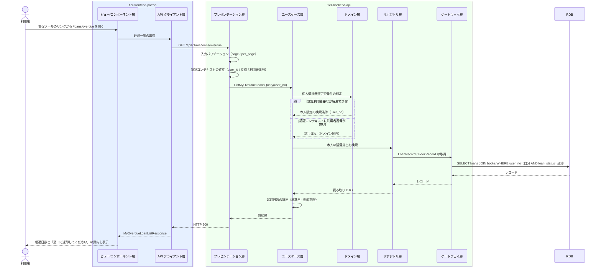

# 自分の延滞中の貸出を照会する

## 概要

督促メールを受けた利用者が、自分の延滞中の貸出と超過日数を Web 画面で確認し、返却の対象を特定する。ログイン中の利用者本人に紐づく貸出のみを対象とし（個人情報参照可否条件）、責める文言を避けて超過日数と「窓口で返却してください」の 1 アクションだけを示す。督促メールからの着地点となる画面である。

## データフロー



| レイヤー | データモデル | 変換内容 |
|---------|------------|---------|
| FE ビュー | 延滞貸出の表示 | 超過日数を DueDateIndicator（`overdue`）へ渡し、返却の 1 アクションを提示する |
| FE API クライアント | アクセストークンの付与、trace_id の発行 | 認証ヘッダを付与して照会 API を呼び出す |
| BE プレゼンテーション | MyOverdueLoansRequest(page, per_page) | 認証コンテキスト（user_id / 役割 / 利用者番号）の確立 |
| BE ドメイン | 所有者ベースの認可判定 | 認証利用者番号と貸出の利用者番号の一致を強制する |
| BE リポジトリ | LoanFinder（本人限定の読み取り専用 finder） | 利用者番号で必ず絞り込み、貸出状態「延滞」に限定する |
| Response | MyOverdueLoanListResponse(base_date, total, items[]) | 超過日数つきの延滞一覧として表示する |

## 処理フロー



## バリエーション一覧

| バリエーション名 | 値 | 処理内容 | 適用 tier | 適用箇所 |
|----------------|---|---------|----------|---------|
| 貸出期間区分 | 標準 / 短期 / 長期 | 返却期限の算出済み値を表示するだけで分岐しない | tier-frontend-patron | 一覧の表示列 |
| 通知種別 | 延滞督促 | 督促メールのリンク元を示すだけで画面の分岐には使わない | tier-frontend-patron | 着地点の文脈表示 |

## 分岐条件一覧

| 条件名 | 判定ルール | 適用 tier | 適用箇所 | BDD Scenario |
|--------|----------|----------|---------|-------------|
| 個人情報参照可否条件 | 照会対象はログイン中の利用者本人に紐づく貸出のみ。他の利用者の貸出は表示しない | tier-backend-api（domain 層で判定） | ListMyOverdueLoansQuery / LoanFinder | 他の利用者の延滞は含まれない |
| 延滞の抽出条件 | 貸出状態が「延滞」の貸出のみを表示する。「貸出中」「返却済み」は含めない | tier-backend-api | ListMyOverdueLoansQuery | 返却済みの貸出は表示しない |
| 表示順の決定 | 超過日数の降順（返却期限の昇順）で表示する | tier-backend-api | ORDER BY 句 | 超過日数の大きい順に表示する |
| 本人限定の UI 制約 | 他利用者のデータへ到達する導線を画面上に置かない（arch SP-004） | tier-frontend-patron | 延滞返却対象確認画面 | 他利用者への導線を持たない |

## 計算ルール一覧

| 計算名 | 入力情報 | 計算式/ロジック | 出力情報 | 適用 tier |
|--------|---------|---------------|---------|----------|
| 超過日数の算出 | 貸出.返却期限、基準日 | `超過日数 = 基準日 - 返却期限`（日単位、1 以上） | 超過日数（days_overdue） | tier-backend-api |
| 返却対象冊数の集計 | 本人の延滞貸出 | `total = count(貸出状態 = '延滞' かつ 利用者番号 = 自分)` | 持参すべき冊数 | tier-backend-api |
| 表示状態の決定 | 超過日数 | 超過日数が 1 以上のとき DueDateIndicator の state を `overdue` にする | DueDateIndicator の state | tier-frontend-patron |

## 状態遷移一覧

| 状態モデル | 遷移元 | 遷移先 | トリガー | 事前条件 | 事後処理 | 適用 tier |
|-----------|--------|--------|---------|---------|---------|----------|
| 貸出状態 | 延滞 | 延滞（遷移なし） | 自分の延滞中の貸出を照会する | 本人の貸出であること | 状態は変更しない（照会のみ） | tier-backend-api |

## 関連 RDRA モデル

| モデル種別 | 要素名 | 関連 |
|-----------|--------|------|
| 業務 | 貸出期限管理業務 | このUCが属する業務 |
| BUC | 延滞を督促するフロー | このUCを含むBUC |
| アクター | 利用者 | 自分の延滞中の貸出を照会する（提供者） |
| 情報 | 貸出 | 照会対象。貸出状態・返却期限を参照する |
| 情報 | 書籍 | 延滞中の書籍のタイトル・著者を参照する |
| 情報 | 利用者アカウント | 役割と利用者番号から本人限定参照を判定する |
| 状態 | 貸出状態 | 「延滞」の貸出のみを表示する |
| 条件 | 個人情報参照可否条件 | 本人限定参照の判定に適用する |
| 画面 | 延滞返却対象確認画面 | 利用者が返却対象を特定する画面 |

## 受け入れ基準トレーサビリティ

| 受け入れ基準 ID | 役割 | 対応する BDD Scenario |
|---|---|---|
| SPEC-003-03#2 | 補助 | 自分の延滞中の貸出と超過日数を確認する |

受け入れ基準 ID の定義は `_cross-cutting/traceability-matrix.md`「USDM 受け入れ基準 ↔ UC 対応表」を正本とする。

## E2E 完了条件（BDD）

### 正常系

```gherkin
Feature: 自分の延滞中の貸出を照会する

  Scenario: 自分の延滞中の貸出と超過日数を確認する
    Given 利用者「田中太郎」（利用者番号 U-0001）が利用者ポータルにログインしている
    And 田中太郎の貸出「L-3001」が書籍「坊っちゃん」・返却期限「2026-09-01」・貸出状態「延滞」である
    When 田中太郎が督促メールのリンクから延滞返却対象確認画面を開く
    Then 「坊っちゃん」が返却期限「2026/09/01」・「1日超過」として表示され「窓口で返却してください」の案内が表示される

  Scenario: 返却対象の冊数を明示する
    Given 利用者「田中太郎」の延滞中の貸出が 2 件ある
    When 田中太郎が延滞返却対象確認画面を開く
    Then 「返却対象 2 冊」の件数が表示される
```

### 異常系

```gherkin
  Scenario: 他の利用者の延滞は表示しない
    Given 利用者「田中太郎」（利用者番号 U-0001）がログインしている
    And 利用者「佐藤花子」（利用者番号 U-0002）の貸出「L-3009」が貸出状態「延滞」である
    When 田中太郎が延滞返却対象確認画面を開く
    Then 貸出「L-3009」は一覧に表示されない

  Scenario: 返却済みの貸出は表示しない
    Given 利用者「田中太郎」の貸出「L-3002」が貸出状態「返却済み」で返却期限「2026-08-30」である
    When 田中太郎が延滞返却対象確認画面を開く
    Then 貸出「L-3002」は一覧に表示されない

  Scenario: 延滞が無いとき空状態を表示する
    Given 利用者「田中太郎」に貸出状態が「延滞」の貸出が 1 件も無い
    When 田中太郎が延滞返却対象確認画面を開く
    Then 「返却期限を過ぎた貸出はありません」の EmptyState が表示される

  Scenario: 未ログインのとき照会できない
    Given ログインしていない状態でブラウザを開いている
    When /loans/overdue へアクセスする
    Then HTTP 401 が返りログイン画面へ誘導される
```

## ティア別仕様

- [利用者ポータル](tier-frontend-patron.md)
- [バックエンド API](tier-backend-api.md)

### 統合 API Spec

- [OpenAPI Spec](../../_cross-cutting/api/openapi.yaml)（全 UC 統合、Contract First 開発用）
- [AsyncAPI Spec](../../_cross-cutting/api/asyncapi.yaml)（全 UC 統合、非同期イベントがある場合のみ）
