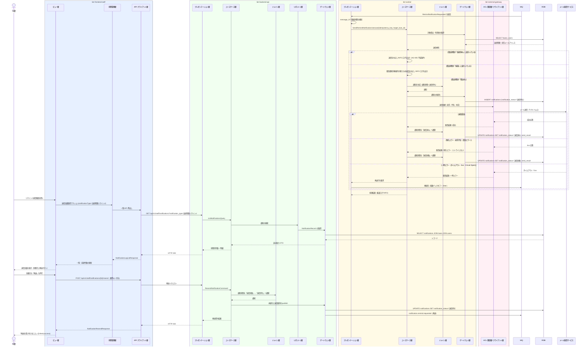

# リマインドメールを送信する

## 概要

返却期限接近判定で生成された送信要求を消費し、通知レコードを「送信待ち」で作成したうえで、外部システム「メール配信サービス」と連携して対象利用者へ返却期限のリマインドメールを送信する。送信結果に応じて通知状態を「送信済み」または「送信失敗」へ遷移させ、司書はリマインド送信画面で送信実績と未達を追跡し、失敗した通知を再送できる。

## データフロー

```mermaid
graph LR
  subgraph FE["tier-frontend-staff"]
    FE_View["ビュー層\nリマインド送信画面"]
    FE_State["状態管理層\nNotificationLogState(notificationType, status)"]
    FE_API["API クライアント層\nGET /api/v1/staff/notifications\nPOST /api/v1/staff/notifications/{id}/resend"]
    FE_View --> FE_State --> FE_API
  end
  subgraph BE["tier-backend-api"]
    BE_Pres["プレゼンテーション層\nNotificationLogRequest / ResendNotificationRequest"]
    BE_UC["ユースケース層\nListNotificationsQuery / ResendNotificationCommand"]
    BE_Domain["ドメイン層\n通知(notification_status)\n送信失敗→送信待ち"]
    BE_Repo["リポジトリ層\nNotificationRepository"]
    BE_GW["ゲートウェイ層\nNotificationRecord / RemindNotificationRequested"]
    BE_Pres --> BE_UC --> BE_Domain
    BE_UC --> BE_Repo --> BE_GW
  end
  subgraph WK["tier-worker"]
    WK_Pres["プレゼンテーション層\nRemindNotificationConsumer"]
    WK_UC["ユースケース層\nSendRemindNotificationUsecase"]
    WK_Domain["ドメイン層\n通知(notification_status)\n送信待ち→送信済み/送信失敗"]
    WK_Repo["リポジトリ層\nNotificationRepository / LoanFinder / UserFinder"]
    WK_GW["ゲートウェイ層\nNotificationRecord / MailSendRequest"]
    WK_Pres --> WK_UC --> WK_Domain
    WK_UC --> WK_Repo --> WK_GW
  end
  subgraph EG["tier-external-gateway"]
    EG_Translator["ACL 翻訳層\n送信依頼→メール配信サービス API モデル"]
    EG_Client["クライアント層\nメール配信サービス呼出し"]
    EG_Translator --> EG_Client
  end
  subgraph MQ["MQ"]
    MQ_Remind[["notification.remind.requested"]]
    MQ_DLQ[["notification.remind.requested.dlq"]]
  end
  subgraph DB["RDB"]
    DB_Notif[("notifications\nnotification_status, send_result")]
    DB_Loan[("loans\ndue_date, loan_status")]
    DB_User[("users\nemail, name")]
  end
  MQ_Remind --> WK_Pres
  WK_GW -->|"SELECT loans / users（宛先と本文差込値の解決）"| DB_Loan
  DB_User --> WK_GW
  WK_GW -->|"INSERT notifications (notification_status='送信待ち')"| DB_Notif
  WK_GW -->|"送信依頼（宛先・件名・本文）"| EG_Translator
  EG_Client -->|"配信結果（成功 / 恒久エラー / 一時エラー）"| WK_GW
  WK_GW -->|"UPDATE notifications SET notification_status, send_result"| DB_Notif
  WK_Pres -->|"リトライ上限超過"| MQ_DLQ
  FE_API -->|"GET /api/v1/staff/notifications?notification_type=返却期限リマインド"| BE_Pres
  FE_API -->|"POST /api/v1/staff/notifications/{id}/resend"| BE_Pres
  BE_GW -->|"SELECT / UPDATE notifications"| DB_Notif
  BE_GW -->|"publish RemindNotificationRequested（再送）"| MQ_Remind
  DB_Notif --> BE_GW --> BE_Repo --> BE_UC --> BE_Pres -->|"HTTP 200 NotificationLogListResponse"| FE_API --> FE_State --> FE_View
```



| レイヤー | データモデル | 変換内容 |
|---------|------------|---------|
| MQ → WK プレゼンテーション | RemindNotificationRequested | メッセージのデシリアライズと重複消費検知（message_id / idempotency_key） |
| WK リポジトリ | 貸出・利用者の解決 | 対象貸出から返却期限、利用者から宛先メールアドレス・氏名を取得する |
| WK ドメイン | 通知（通知状態） | 「送信待ち」で生成し、配信結果に応じて「送信済み」「送信失敗」へ遷移させる |
| WK ゲートウェイ → 外部連携 | MailSendRequest(宛先, 件名, 本文) | 通知種別・通知タイミング区分に対応する文面へ変換する |
| 外部連携 ACL 翻訳層 | メール配信サービスの送信依頼/配信結果 | 外部モデルを通知コンテキストの通知状態へ翻訳する |
| FE ビュー | 送信実績の一覧・再送操作 | 送信待ち / 送信済み / 送信失敗の件数と失敗行の再送導線に変換する |
| BE プレゼンテーション | NotificationLogRequest / ResendNotificationRequest | バリエーション値の許容値チェック + Query / Command 変換 |
| Response | NotificationLogListResponse(summary, items[]) | 状態別件数と未達一覧の表示に使う |

## 処理フロー



## バリエーション一覧

| バリエーション名 | 値 | 処理内容 | 適用 tier | 適用箇所 |
|----------------|---|---------|----------|---------|
| 通知種別 | 返却期限リマインド | 送信するメールの文面テンプレートと一覧のフィルター値を固定する | tier-worker / tier-backend-api / tier-frontend-staff | SendRemindNotificationUsecase / GET /api/v1/staff/notifications / リマインド送信画面 |
| 通知タイミング区分 | 期限前リマインド | メール本文の残日数は `あと{N}日` 表記（`ui-design.md`「日付・期限の表示規約」）で組み立てる | tier-worker | メール本文の組み立て |
| 通知タイミング区分 | 期限当日 | 「本日が返却期限です」の文面を使う | tier-worker | メール本文の組み立て |
| 利用者区分 | 一般 / 学生 / 団体 | 文面の分岐には使わない（宛名の表示のみ） | tier-worker | メール本文の宛名 |

## 分岐条件一覧

| 条件名 | 判定ルール | 適用 tier | 適用箇所 | BDD Scenario |
|--------|----------|----------|---------|-------------|
| リマインド通知対象条件 | 送信時点で貸出状態が「貸出中」であること。「返却済み」に変わっていれば送信を中止する | tier-worker | SendRemindNotificationUsecase | 返却済みになった貸出のリマインドを送信しない |
| 重複消費の検知 | 同一 message_id / 冪等キーの再配信は通知を再生成せず、前回の通知状態を返す（arch SR-018） | tier-worker | RemindNotificationConsumer | 同一メッセージの再配信で二重送信しない |
| 恒久エラーの非リトライ | メール配信サービスの 4xx（宛先不正・認証エラー）はリトライせず通知状態を「送信失敗」にする（arch SR-029） | tier-external-gateway / tier-worker | 配信結果の翻訳 | 宛先不正のときリトライせず送信失敗にする |
| リトライ上限と DLQ 退避 | 一時エラーの再試行が上限（既定 5 回）を超えたメッセージは DLQ へ退避し、通知状態を「送信失敗」にしてアラートを通知する（arch SR-020） | tier-worker | RemindNotificationConsumer | 再試行上限超過で DLQ へ退避する |
| 再送可否 | 通知状態が「送信失敗」の通知のみ再送を受け付ける。「送信済み」「送信待ち」は 409 で拒否する | tier-backend-api | ResendNotificationCommand | 送信済みの通知は再送できない |

## 計算ルール一覧

| 計算名 | 入力情報 | 計算式/ロジック | 出力情報 | 適用 tier |
|--------|---------|---------------|---------|----------|
| 残日数の文面差込 | 貸出.返却期限、送信日 | `残日数 = 返却期限 - 送信日` を本文へ差し込む | メール本文の残日数 | tier-worker |
| 宛先メールアドレスの解決 | 利用者.連絡先（メールアドレス） | 送信時点の値をコピーして通知.宛先メールアドレスへ保持する（利用者側の変更に追随させない） | 通知.宛先メールアドレス | tier-worker |
| 未達件数の集計 | 通知.通知状態 | `未達件数 = count(通知状態 = '送信失敗')` | サマリの failed 件数 | tier-backend-api |
| リトライ間隔 | 再試行回数 | `min(base * 2^n, max_interval)` に Jitter を加算する（arch SP-030） | 次回再試行時刻 | tier-worker / tier-external-gateway |

## 状態遷移一覧

| 状態モデル | 遷移元 | 遷移先 | トリガー | 事前条件 | 事後処理 | 適用 tier |
|-----------|--------|--------|---------|---------|---------|----------|
| 通知状態 | （新規） | 送信待ち | リマインドメールを送信する | リマインド通知対象条件が成立し、冪等キーが未使用であること | 通知レコードを INSERT する | tier-worker |
| 通知状態 | 送信待ち | 送信済み | リマインドメールを送信する | メール配信サービスへの送信が成功したこと | 送信結果を記録し、同一対象への重複送信を抑止する | tier-worker |
| 通知状態 | 送信待ち | 送信失敗 | リマインドメールを送信する | 恒久エラー、または一時エラーの再試行上限超過 | 送信結果を記録し、DLQ 退避時はアラートを通知する | tier-worker |
| 通知状態 | 送信失敗 | 送信待ち | リマインドメールを送信する | 司書が再送を指示したこと | 送信要求を再 publish する | tier-backend-api |
| 貸出状態 | 貸出中 | 貸出中（遷移なし） | リマインドメールを送信する | — | 貸出状態は変更しない | tier-worker |

## 関連 RDRA モデル

| モデル種別 | 要素名 | 関連 |
|-----------|--------|------|
| 業務 | 貸出期限管理業務 | このUCが属する業務 |
| BUC | 返却期限をリマインドするフロー | このUCを含むBUC |
| アクター | 司書 | リマインド送信画面で送信実績と未達を確認する（提供者） |
| アクター | 利用者 | リマインドメールの受信者（受益者） |
| 情報 | 通知 | 送信実績として作成・更新する |
| 情報 | 貸出 | 対象貸出。返却期限を本文へ差し込む |
| 情報 | 利用者 | 宛先メールアドレス・氏名を参照する |
| 状態 | 通知状態 | 送信待ち → 送信済み / 送信失敗、送信失敗 → 送信待ち |
| 状態 | 貸出状態 | 「返却済み」の貸出は送信対象外 |
| 条件 | リマインド通知対象条件 | 送信時点の再判定に適用する |
| バリエーション | 通知種別 | 返却期限リマインド |
| バリエーション | 通知タイミング区分 | 期限前リマインド / 期限当日で文面を切り替える |
| 画面 | リマインド送信画面 | 送信実績と未達を司書が確認する画面 |
| 外部システム | メール配信サービス | メール送信を委譲する外部システム（tier-external-gateway 経由） |

## 受け入れ基準トレーサビリティ

| 受け入れ基準 ID | 役割 | 対応する BDD Scenario |
|---|---|---|
| SPEC-003-02#1 | 主担当 | 返却期限リマインドを送信して送信済みにする |
| SPEC-003-02#2 | 補助 | 返却済みになった貸出のリマインドを送信しない |

受け入れ基準 ID の定義は `_cross-cutting/traceability-matrix.md`「USDM 受け入れ基準 ↔ UC 対応表」を正本とする。

## E2E 完了条件（BDD）

### 正常系

```gherkin
Feature: リマインドメールを送信する

  Scenario: 返却期限リマインドを送信して送信済みにする
    Given 貸出「L-1001」が貸出状態「貸出中」・返却期限「2026-09-05」で登録されている
    And 利用者「田中太郎」の連絡先が「tanaka@example.com」である
    And notification.remind.requested に target_loan_id「L-1001」・timing_type「期限前リマインド」の送信要求が入っている
    When ワーカーが送信要求を消費する
    Then 通知が宛先「tanaka@example.com」で作成され通知状態が「送信済み」になる

  Scenario: 司書が送信実績と未達件数を確認する
    Given 通知種別「返却期限リマインド」の通知が送信済み 10 件・送信失敗 2 件記録されている
    And 司書「山田司書」が司書ポータルにログインしている
    When 司書がリマインド送信画面を開く
    Then 送信待ち 0 件・送信済み 10 件・送信失敗 2 件のサマリが表示され失敗 2 行に再送ボタンが表示される

  Scenario: 送信失敗の通知を再送する
    Given 通知「N-2001」の通知状態が「送信失敗」である
    When 司書がリマインド送信画面で通知「N-2001」の再送ボタンを押す
    Then 通知「N-2001」の通知状態が「送信待ち」になり返却期限リマインドの送信要求が再度 publish される
```

### 異常系

```gherkin
  Scenario: 宛先不正のときリトライせず送信失敗にする
    Given 利用者「佐藤花子」の連絡先が配信不能なアドレスである
    When ワーカーが佐藤花子宛の返却期限リマインド送信要求を消費する
    Then メール配信サービスが 4xx を返し通知状態が「送信失敗」になり再試行は行われない

  Scenario: 再試行上限を超えたメッセージを DLQ へ退避する
    Given メール配信サービスがタイムアウトを返し続けている
    When ワーカーが返却期限リマインド送信要求を 5 回再試行する
    Then メッセージが notification.remind.requested.dlq へ退避され通知状態が「送信失敗」になりアラートが通知される

  Scenario: 返却済みになった貸出のリマインドを送信しない
    Given 貸出「L-1003」の貸出状態が送信要求生成後に「返却済み」へ変わっている
    When ワーカーが貸出「L-1003」の送信要求を消費する
    Then メールは送信されず通知レコードも作成されない

  Scenario: 同一メッセージの再配信で二重送信しない
    Given 冪等キー「返却期限リマインド:L-1001:期限前リマインド:2026-09-02」の通知が送信済みである
    When 同じ冪等キーの送信要求が再配信される
    Then メールは再送されず既存の通知状態「送信済み」がそのまま維持される

  Scenario: 送信済みの通知は再送できない
    Given 通知「N-2002」の通知状態が「送信済み」である
    When 司書が通知「N-2002」の再送を要求する
    Then HTTP 409 が返り「送信失敗の通知のみ再送できます」が表示される
```

## ティア別仕様

- [司書ポータル](tier-frontend-staff.md)
- [バックエンド API](tier-backend-api.md)
- [バックエンドワーカー](tier-worker.md)（外部システム連携は tier-external-gateway へ委譲する）

### 統合 API Spec

- [OpenAPI Spec](../../_cross-cutting/api/openapi.yaml)（全 UC 統合、Contract First 開発用）
- [AsyncAPI Spec](../../_cross-cutting/api/asyncapi.yaml)（全 UC 統合、非同期イベントがある場合のみ）
