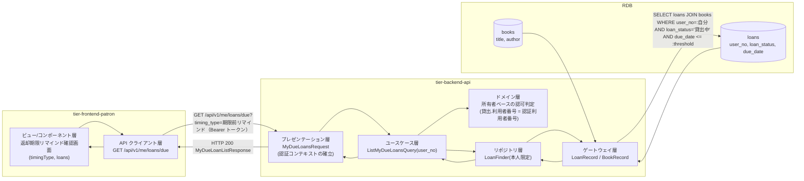
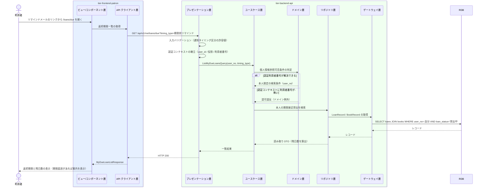

# 自分の返却期限を照会する

## 概要

利用者がリマインドメールを受けて、返却期限が近づいた自分の貸出を Web 画面で確認し、返却の準備をする。ログイン中の利用者本人に紐づく貸出のみを対象とし（個人情報参照可否条件）、返却期限と残日数を提示する。リマインドメールからの着地点となる画面である。

## データフロー



| レイヤー | データモデル | 変換内容 |
|---------|------------|---------|
| FE ビュー | 通知タイミング区分の選択、貸出一覧の表示 | メールのリンクパラメータを timingType に変換し、残日数を DueDateIndicator へ渡す |
| FE API クライアント | アクセストークンの付与、trace_id の発行 | 認証ヘッダを付与して照会 API を呼び出す |
| BE プレゼンテーション | MyDueLoansRequest(timing_type, page, per_page) | 許容値チェック + 認証コンテキスト（user_id / 役割 / 利用者番号）の確立 |
| BE ドメイン | 所有者ベースの認可判定 | 認証利用者番号と貸出の利用者番号の一致を強制する |
| BE リポジトリ | LoanFinder（本人限定の読み取り専用 finder） | 利用者番号で必ず絞り込む |
| Response | MyDueLoanListResponse(base_date, total, items[]) | 残日数つきの返却期限一覧として表示する |

## 処理フロー



## バリエーション一覧

| バリエーション名 | 値 | 処理内容 | 適用 tier | 適用箇所 |
|----------------|---|---------|----------|---------|
| 通知タイミング区分 | 期限前リマインド | 残日数がリマインド基準日数以内の貸出に絞り、見出しを「返却期限が近づいています」にする | tier-frontend-patron / tier-backend-api | 返却期限リマインド確認画面 / GET /api/v1/me/loans/due |
| 通知タイミング区分 | 期限当日 | 返却期限が当日の貸出に絞り、見出しを「本日が返却期限です」にする | tier-frontend-patron / tier-backend-api | 同上 |
| 貸出期間区分 | 標準 / 短期 / 長期 | 返却期限の算出済み値を表示するだけで分岐しない | tier-frontend-patron | 一覧の表示列 |

## 分岐条件一覧

| 条件名 | 判定ルール | 適用 tier | 適用箇所 | BDD Scenario |
|--------|----------|----------|---------|-------------|
| 個人情報参照可否条件 | 照会対象はログイン中の利用者本人に紐づく貸出のみ。他の利用者の貸出は表示しない | tier-backend-api（domain 層で判定） | ListMyDueLoansQuery / LoanFinder | 他の利用者の貸出は含まれない |
| 返却期限の接近判定 | 貸出状態が「貸出中」であり `0 <= (返却期限 - 基準日) <= リマインド基準日数` を満たす貸出を表示する | tier-backend-api | ListMyDueLoansQuery | 期限接近の貸出だけを表示する |
| 期限超過の扱い | 返却期限を超過した貸出（貸出状態が「延滞」）は本画面に含めず、延滞返却対象確認画面へ誘導する | tier-frontend-patron / tier-backend-api | 返却期限リマインド確認画面の Alert | 期限超過の貸出があるとき延滞画面へ誘導する |
| 本人限定の UI 制約 | 他利用者のデータへ到達する導線を画面上に置かない（arch SP-004） | tier-frontend-patron | 返却期限リマインド確認画面 | 他利用者への導線を持たない |

## 計算ルール一覧

| 計算名 | 入力情報 | 計算式/ロジック | 出力情報 | 適用 tier |
|--------|---------|---------------|---------|----------|
| 残日数の算出 | 貸出.返却期限、基準日 | `残日数 = 返却期限 - 基準日`（日単位） | 残日数（days_remaining） | tier-backend-api |
| 表示状態の決定 | 残日数、`remind_days`（API レスポンスの適用値） | `残日数 > remind_days` → `safe`、`0 < 残日数 <= remind_days` → `near`、`残日数 = 0` → `due-today`、`残日数 < 0` → `overdue`。閾値はハードコードせずレスポンスの `remind_days` を使う | DueDateIndicator の variant | tier-frontend-patron |
| 対象件数の集計 | 本人の期限接近貸出 | `total = count(対象貸出)` | 件数表示 | tier-backend-api |

## 状態遷移一覧

| 状態モデル | 遷移元 | 遷移先 | トリガー | 事前条件 | 事後処理 | 適用 tier |
|-----------|--------|--------|---------|---------|---------|----------|
| 貸出状態 | 貸出中 | 貸出中（遷移なし） | 自分の返却期限を照会する | 本人の貸出であること | 状態は変更しない（照会のみ） | tier-backend-api |

## 関連 RDRA モデル

| モデル種別 | 要素名 | 関連 |
|-----------|--------|------|
| 業務 | 貸出期限管理業務 | このUCが属する業務 |
| BUC | 返却期限をリマインドするフロー | このUCを含むBUC |
| アクター | 利用者 | 自分の返却期限を照会する（受益者） |
| 情報 | 貸出 | 照会対象。返却期限・貸出状態を参照する |
| 情報 | 書籍 | 貸出中の書籍のタイトル・著者を参照する |
| 情報 | 利用者アカウント | 役割と利用者番号から本人限定参照を判定する |
| 状態 | 貸出状態 | 「貸出中」の貸出のみを表示する |
| 条件 | 個人情報参照可否条件 | 本人限定参照の判定に適用する |
| バリエーション | 通知タイミング区分 | 期限前リマインド / 期限当日で表示を切り替える |
| 画面 | 返却期限リマインド確認画面 | 利用者が返却期限を確認する画面 |

## 受け入れ基準トレーサビリティ

| 受け入れ基準 ID | 役割 | 対応する BDD Scenario |
|---|---|---|
| SPEC-003-01#2 | 補助 | 返却期限が近づいた自分の貸出を確認する |

受け入れ基準 ID の定義は `_cross-cutting/traceability-matrix.md`「USDM 受け入れ基準 ↔ UC 対応表」を正本とする。

## E2E 完了条件（BDD）

### 正常系

```gherkin
Feature: 自分の返却期限を照会する

  Scenario: 返却期限が近づいた自分の貸出を確認する
    Given 利用者「田中太郎」（利用者番号 U-0001）が利用者ポータルにログインしている
    And 田中太郎の貸出「L-1001」が書籍「吾輩は猫である」・返却期限「2026-09-05」・貸出状態「貸出中」である
    When 田中太郎が返却期限リマインド確認画面を開く
    Then 「吾輩は猫である」が返却期限「2026/09/05」・「あと3日」として表示される

  Scenario: リマインドメールのリンクから期限当日の表示で着地する
    Given 利用者「田中太郎」の貸出「L-1002」の返却期限が「2026-09-02」である
    When 田中太郎がリマインドメールのリンク /loans/due?timing_type=期限当日 を開く
    Then 見出しに「本日が返却期限です」が表示され、貸出「L-1002」が返却期限「2026/09/02」・「本日が返却期限」として一覧に表示される
```

### 異常系

```gherkin
  Scenario: 他の利用者の貸出は表示しない
    Given 利用者「田中太郎」（利用者番号 U-0001）がログインしている
    And 利用者「佐藤花子」（利用者番号 U-0002）の貸出「L-2001」の返却期限が「2026-09-04」である
    When 田中太郎が返却期限リマインド確認画面を開く
    Then 貸出「L-2001」は一覧に表示されない

  Scenario: 対象の貸出が無いとき空状態を表示する
    Given 利用者「田中太郎」に返却期限が近い貸出が 1 件も無い
    When 田中太郎が返却期限リマインド確認画面を開く
    Then 「返却期限が近い貸出はありません」の EmptyState が表示される

  Scenario: 未ログインのとき照会できない
    Given ログインしていない状態でブラウザを開いている
    When /loans/due へアクセスする
    Then HTTP 401 が返りログイン画面へ誘導される

  Scenario: 期限を超過した貸出があるとき延滞画面へ誘導する
    Given 利用者「田中太郎」の貸出「L-1004」の貸出状態が「延滞」である
    When 田中太郎が返却期限リマインド確認画面を開く
    Then Alert(warning) に「返却期限を過ぎた貸出があります」と延滞返却対象確認画面への導線が表示される
```

## ティア別仕様

- [利用者ポータル](tier-frontend-patron.md)
- [バックエンド API](tier-backend-api.md)

### 統合 API Spec

- [OpenAPI Spec](../../_cross-cutting/api/openapi.yaml)（全 UC 統合、Contract First 開発用）
- [AsyncAPI Spec](../../_cross-cutting/api/asyncapi.yaml)（全 UC 統合、非同期イベントがある場合のみ）
