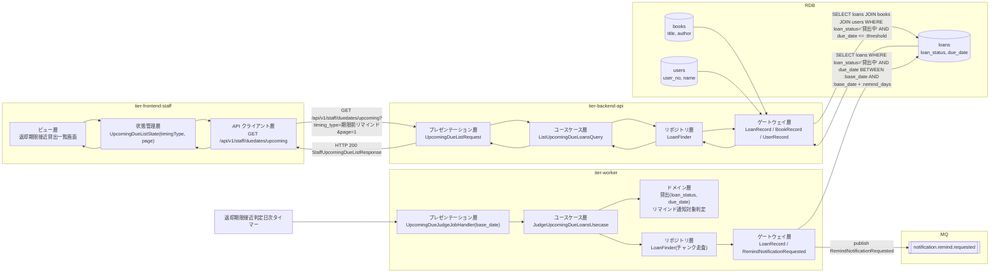
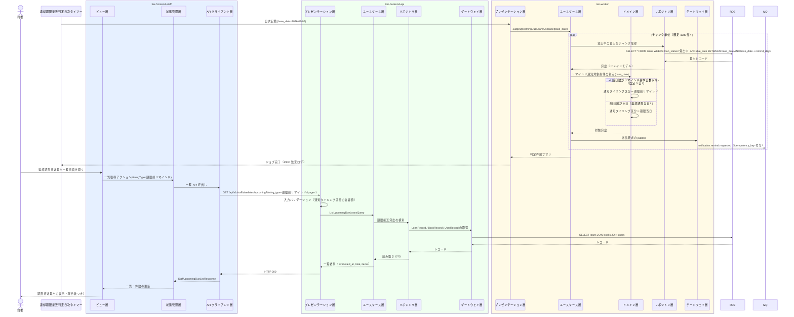

# 返却期限接近の貸出を判定する

## 概要

返却期限接近判定日次タイマーで貸出状態が「貸出中」の貸出を走査し、リマインド通知対象条件を満たす貸出（返却期限までの残日数が通知タイミング区分のリマインド基準日数以内）を抽出する。抽出結果から返却期限リマインドの通知送信要求を生成し、司書は返却期限接近貸出一覧画面で対象を確認する。返却済みの貸出は対象外とする。

## データフロー



| レイヤー | データモデル | 変換内容 |
|---------|------------|---------|
| Timer → WK プレゼンテーション | 実行パラメータ(base_date, chunk_size) | 未指定時は実行日をシステム日付から解決する |
| WK ユースケース | JudgeUpcomingDueLoansUsecase | チャンク単位で貸出を走査し、判定結果件数を集計する |
| WK ドメイン | 貸出(loan_status, due_date) | リマインド通知対象条件を適用し、対象/対象外を判定する |
| WK ゲートウェイ | RemindNotificationRequested | 対象貸出 1 件につき送信要求メッセージ 1 件へ変換して publish する |
| FE ビュー | 通知タイミング区分の選択、ページ操作 | ToggleGroup の選択値を timingType に変換する |
| BE プレゼンテーション | UpcomingDueListRequest(timing_type, page, per_page) | バリエーション値の許容値チェック + Query 変換 |
| BE リポジトリ | LoanFinder(読み取り専用 finder) | 貸出中かつ期限接近の貸出を JOIN で取得する |
| Response | StaffUpcomingDueListResponse(evaluated_at, total, items[]) | 残日数を算出して一覧表示に使う |

## 処理フロー



## バリエーション一覧

| バリエーション名 | 値 | 処理内容 | 適用 tier | 適用箇所 |
|----------------|---|---------|----------|---------|
| 通知タイミング区分 | 期限前リマインド | 返却期限までの残日数がリマインド基準日数以内の貸出を対象にする | tier-worker / tier-backend-api / tier-frontend-staff | JudgeUpcomingDueLoansUsecase / GET /api/v1/staff/duedates/upcoming / 返却期限接近貸出一覧画面のフィルター |
| 通知タイミング区分 | 期限当日 | 返却期限が当日の貸出を対象にする | tier-worker / tier-backend-api / tier-frontend-staff | 同上 |
| 通知種別 | 返却期限リマインド | 生成する送信要求の通知種別を固定する | tier-worker | RemindNotificationRequested |
| 貸出期間区分 | 標準 / 短期 / 長期 | 返却期限の算出済み値を参照するだけで、判定では分岐しない | tier-backend-api | 一覧の表示列 |

## 分岐条件一覧

| 条件名 | 判定ルール | 適用 tier | 適用箇所 | BDD Scenario |
|--------|----------|----------|---------|-------------|
| リマインド通知対象条件 | 貸出状態が「貸出中」であり、かつ返却期限までの残日数がリマインド基準日数（期限前リマインド: 既定 3 日、期限当日: 0 日）以内であること | tier-worker | JudgeUpcomingDueLoansUsecase / ドメイン層の判定 | 期限接近の貸出をリマインド対象として抽出する |
| リマインド通知対象条件（除外） | 貸出状態が「返却済み」の貸出は対象外とする | tier-worker / tier-backend-api | チャンク走査の SELECT 条件 / 一覧 API の検索条件 | 返却済みの貸出はリマインド対象にしない |
| リマインド通知対象条件（除外） | 貸出状態が「延滞」の貸出は返却期限を超過済みのためリマインド対象外とする（督促通知対象条件が扱う） | tier-worker | チャンク走査の SELECT 条件 | 延滞の貸出はリマインド対象にしない |
| 重複実行検知 | 同一 base_date のジョブ実行 ID が既に完了している場合は再実行せず終了する（arch SR-018） | tier-worker | UpcomingDueJudgeJobHandler | 同一日の再実行で通知送信要求を二重生成しない |

## 計算ルール一覧

| 計算名 | 入力情報 | 計算式/ロジック | 出力情報 | 適用 tier |
|--------|---------|---------------|---------|----------|
| 残日数の算出 | 貸出.返却期限、基準日（base_date） | `残日数 = 返却期限 - 基準日`（日単位） | 残日数（days_remaining） | tier-worker / tier-backend-api |
| リマインド対象判定 | 残日数、リマインド基準日数（外部設定） | `0 <= 残日数 <= リマインド基準日数` が真なら対象 | 通知対象フラグ | tier-worker |
| 通知タイミング区分の決定 | 残日数 | `残日数 = 0` なら「期限当日」、`0 < 残日数 <= リマインド基準日数` なら「期限前リマインド」 | 通知タイミング区分 | tier-worker |
| 冪等キーの生成 | 通知種別、対象貸出ID、通知タイミング区分 | `sha256(通知種別 + ':' + 対象貸出ID + ':' + 通知タイミング区分 + ':' + 基準日)` を決定的に生成する | 冪等キー（idempotency_key） | tier-worker |

日付・残日数の表記は `_cross-cutting/ux-ui/ui-design.md`「日付・期限の表示規約」を正本とする。API（`due_date` / `base_date`）は ISO 8601 `YYYY-MM-DD`、画面表示は `YYYY年M月D日`（一覧の列のみ `YYYY/MM/DD`）、残日数は `あと{N}日`、当日は `本日が返却期限`、超過は `{N}日超過` とする。

## 状態遷移一覧

| 状態モデル | 遷移元 | 遷移先 | トリガー | 事前条件 | 事後処理 | 適用 tier |
|-----------|--------|--------|---------|---------|---------|----------|
| 貸出状態 | 貸出中 | 貸出中（遷移なし） | 返却期限接近判定日次タイマー | 貸出状態が「貸出中」 | 通知送信要求を publish する（貸出状態は変更しない） | tier-worker |

## 関連 RDRA モデル

| モデル種別 | 要素名 | 関連 |
|-----------|--------|------|
| 業務 | 貸出期限管理業務 | このUCが属する業務 |
| BUC | 返却期限をリマインドするフロー | このUCを含むBUC |
| アクター | 司書 | 返却期限接近貸出一覧画面で判定結果を確認する（提供者） |
| 情報 | 貸出 | 判定対象。貸出状態・返却期限を参照する |
| 情報 | 利用者 | 通知宛先の特定に参照する |
| 情報 | 書籍 | 一覧表示のタイトル・著者を参照する |
| 状態 | 貸出状態 | 「貸出中」を対象条件に使う |
| 条件 | リマインド通知対象条件 | 抽出条件として適用する |
| バリエーション | 通知タイミング区分 | 期限前リマインド / 期限当日で基準日数を切り替える |
| 画面 | 返却期限接近貸出一覧画面 | 判定結果を司書が確認する画面 |
| タイマー | 返却期限接近判定日次タイマー | 判定処理の起動契機 |

## 受け入れ基準トレーサビリティ

| 受け入れ基準 ID | 役割 | 対応する BDD Scenario |
|---|---|---|
| SPEC-003-02#2 | 主担当 | 返却済みの貸出はリマインド対象にしない |
| SPEC-003-02#1 | 補助 | 返却期限 3 日前の貸出をリマインド対象として抽出する |

受け入れ基準 ID の定義は `_cross-cutting/traceability-matrix.md`「USDM 受け入れ基準 ↔ UC 対応表」を正本とする。

## E2E 完了条件（BDD）

### 正常系

```gherkin
Feature: 返却期限接近の貸出を判定する

  Scenario: 返却期限 3 日前の貸出をリマインド対象として抽出する
    Given 貸出「L-1001」の貸出状態が「貸出中」で返却期限が「2026-09-05」である
    And リマインド基準日数が「3」日に設定されている
    When 返却期限接近判定日次タイマーが「2026-09-02」に起動する
    Then 貸出「L-1001」の返却期限リマインド送信要求が通知タイミング区分「期限前リマインド」で生成される

  Scenario: 返却期限当日の貸出を期限当日区分で抽出する
    Given 貸出「L-1002」の貸出状態が「貸出中」で返却期限が「2026-09-02」である
    When 返却期限接近判定日次タイマーが「2026-09-02」に起動する
    Then 貸出「L-1002」の返却期限リマインド送信要求が通知タイミング区分「期限当日」で生成される

  Scenario: 司書が返却期限接近の貸出一覧を確認する
    Given 貸出「L-1001」が返却期限「2026-09-05」で貸出中である
    And 司書「山田司書」が司書ポータルにログインしている
    When 司書が返却期限接近貸出一覧画面を開き通知タイミング区分「期限前リマインド」を選択する
    Then 貸出「L-1001」が書籍タイトル・利用者名・返却期限「2026/09/05」・残日数「あと3日」とともに一覧に表示される
```

### 異常系

```gherkin
  Scenario: 返却済みの貸出はリマインド対象にしない
    Given 貸出「L-1003」の貸出状態が「返却済み」で返却期限が「2026-09-03」である
    When 返却期限接近判定日次タイマーが「2026-09-02」に起動する
    Then 貸出「L-1003」の返却期限リマインド送信要求は生成されない

  Scenario: 延滞の貸出はリマインド対象にしない
    Given 貸出「L-1004」の貸出状態が「延滞」で返却期限が「2026-08-28」である
    When 返却期限接近判定日次タイマーが「2026-09-02」に起動する
    Then 貸出「L-1004」の返却期限リマインド送信要求は生成されない

  Scenario: 同一日の再実行で送信要求を二重生成しない
    Given 「2026-09-02」の返却期限接近判定ジョブが完了済みである
    When 同じ base_date「2026-09-02」でジョブが再実行される
    Then 既存の冪等キーが検知され新たな送信要求は publish されない

  Scenario: 対象が 0 件のときは空一覧を表示する
    Given 返却期限が「2026-09-02」から「2026-09-05」までの貸出中の貸出が 1 件も存在しない
    When 司書が返却期限接近貸出一覧画面を開く
    Then 「対象の貸出はありません」の EmptyState が表示される
```

## ティア別仕様

- [司書ポータル](tier-frontend-staff.md)
- [バックエンド API](tier-backend-api.md)
- [バックエンドワーカー](tier-worker.md)

### 統合 API Spec

- [OpenAPI Spec](../../_cross-cutting/api/openapi.yaml)（全 UC 統合、Contract First 開発用）
- [AsyncAPI Spec](../../_cross-cutting/api/asyncapi.yaml)（全 UC 統合、非同期イベントがある場合のみ）
