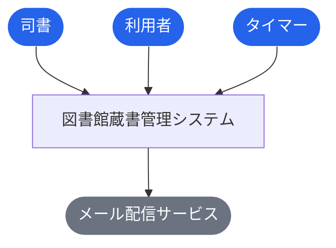
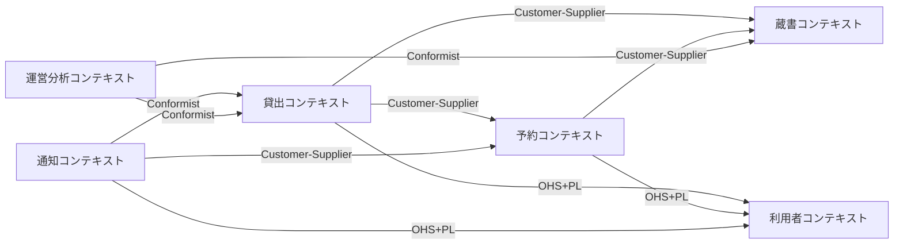
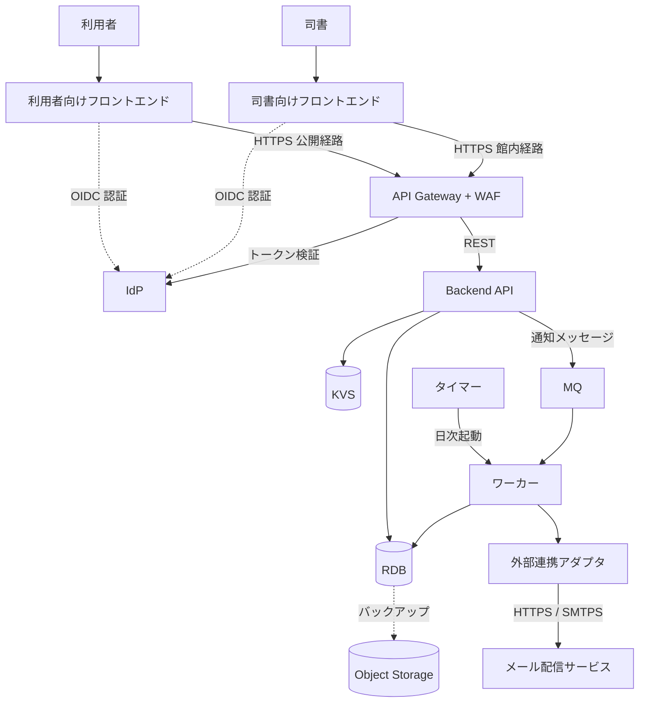
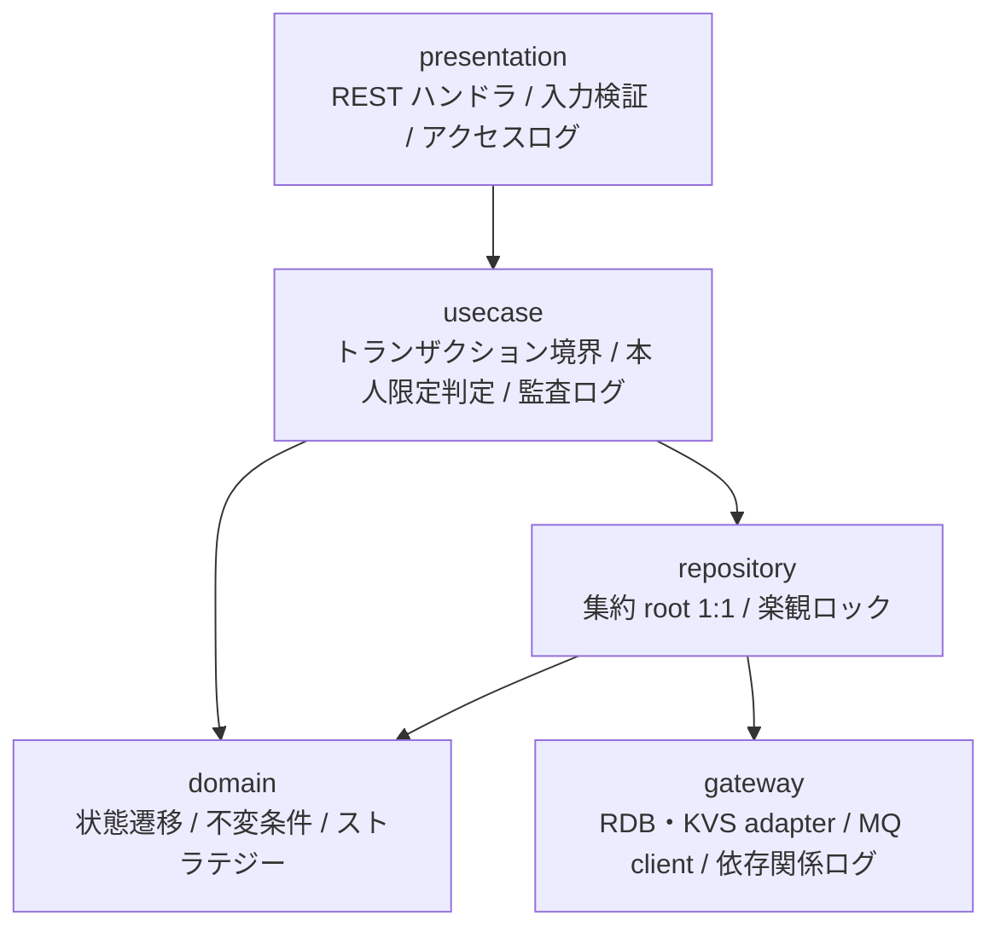
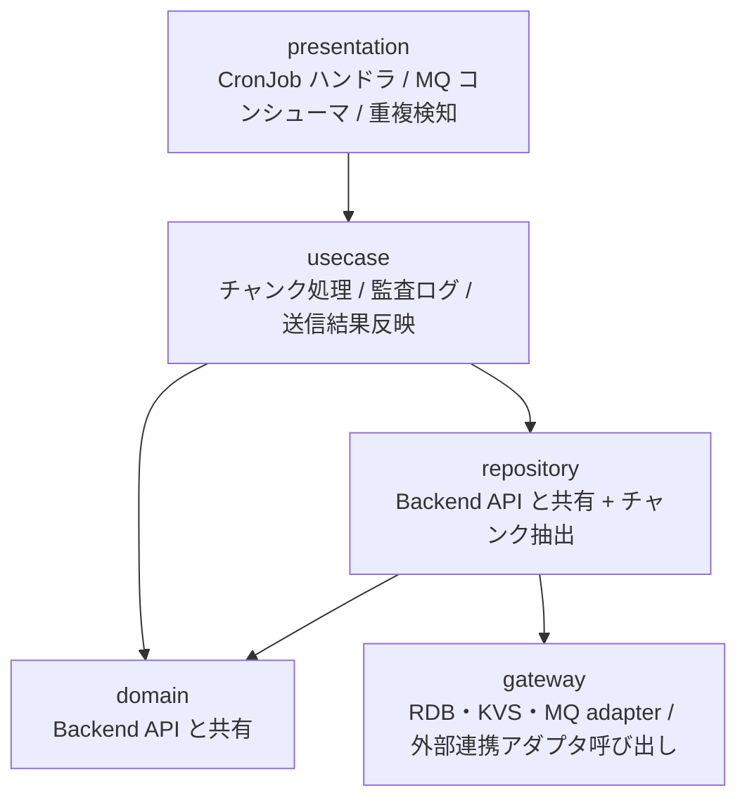
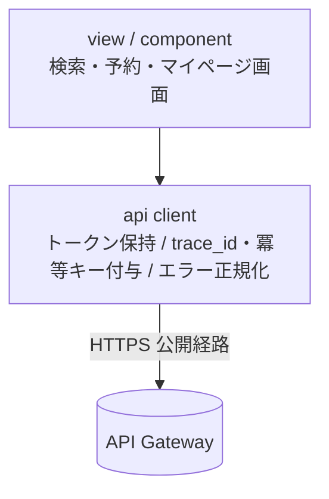
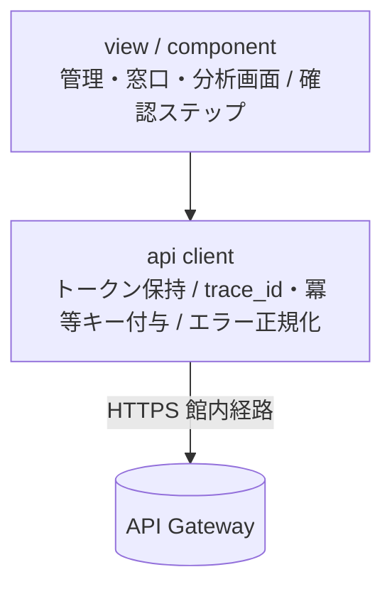
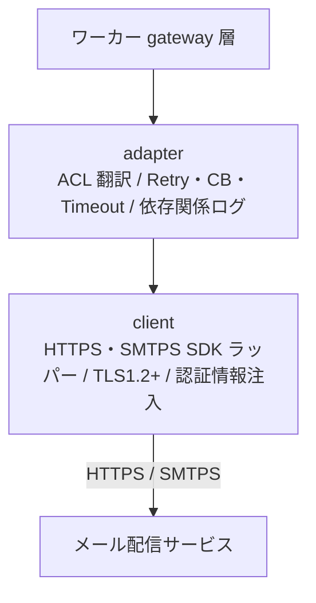

# 図書館蔵書管理システム

> 1館の図書館を対象に、紙台帳と表計算ファイルに分散していた蔵書情報と利用者情報を一元管理し、貸出・返却・予約をWeb画面から行えるようにするシステム。貸出時の返却期限自動設定、期限前リマインドと延滞督促のメール自動送信、返却時の予約者への通知により司書の手作業とミスを削減する。利用者は自分の貸出履歴と予約状況をWeb画面で確認でき、司書は在庫状況・人気書籍ランキング・期間別貸出統計をレポートとして把握できる。将来の電子書籍対応を見据え、書籍に媒体種別を持たせる。

**最終更新**: 2026-09-06 15:22:56 spec stories (design)

## 成果物一覧

| ドメイン | 最新 | イベント数 |
|---------|------|-----------:|
| [USDM（要求分解）](#usdm要求分解) | [usdm/latest/](usdm/latest/) | 2 |
| [RDRA（要件定義）](#rdra要件定義) | [rdra/latest/](rdra/latest/) | 2 |
| [NFR（非機能要求）](#nfr非機能要求) | [nfr/latest/](nfr/latest/) | 1 |
| [Arch（アーキテクチャ）](#archアーキテクチャ) | [arch/latest/](arch/latest/) | 3 |
| [Infra（インフラ設計）](#infraインフラ設計) | [infra/latest/](infra/latest/) | 1 |
| [Design（デザイン）](#designデザイン) | [design/latest/](design/latest/) | 3 |
| [Specs（詳細仕様）](#specs詳細仕様) | [specs/latest/](specs/latest/) | 1 |

## USDM（要求分解）

### 主要な成果物

- [requirements.md](usdm/latest/requirements.md)
- [requirements.yaml](usdm/latest/requirements.yaml)

| 項目 | 値 |
|------|-----|
| 要求数 | 7 |
| 仕様数 | 19 |

## RDRA（要件定義）

### 主要な成果物

- [アクター.tsv](rdra/latest/アクター.tsv)
- [外部システム.tsv](rdra/latest/外部システム.tsv)
- [情報.tsv](rdra/latest/情報.tsv)
- [状態.tsv](rdra/latest/状態.tsv)
- [条件.tsv](rdra/latest/条件.tsv)
- [バリエーション.tsv](rdra/latest/バリエーション.tsv)
- [BUC.tsv](rdra/latest/BUC.tsv)
- [関連データ.txt](rdra/latest/関連データ.txt)
- [ZeroOne.txt](rdra/latest/ZeroOne.txt)
- [システム概要.json](rdra/latest/システム概要.json)
- [views/（人間可読ビュー: Mermaid 図解つき Markdown）](rdra/latest/views/README.md)

| 項目 | 値 |
|------|-----|
| アクター | 3 |
| 外部システム | 1 |
| 情報 | 9 |
| 状態モデル | 3 |
| 条件 | 15 |
| バリエーション | 6 |
| 業務 | 6 |
| BUC | 10 |
| UC | 27 |

### 外部ツール連携

| ツール | データファイル | 手順 |
|--------|-------------|------|
| [RDRA Graph](https://vsa.co.jp/rdratool/graph/v0.94/) | [関連データ.txt](rdra/latest/関連データ.txt) | ファイル内容をコピーし、RDRA Graph に貼り付け |
| [RDRA Sheet](https://docs.google.com/spreadsheets/d/1h7J70l6DyXcuG0FKYqIpXXfdvsaqjdVFwc6jQXSh9fM/) | [ZeroOne.txt](rdra/latest/ZeroOne.txt) | ファイル内容をコピーし、テンプレートに貼り付け |

### システムコンテキスト図



## NFR（非機能要求）

### 主要な成果物

- [nfr-grade.md](nfr/latest/nfr-grade.md)
- [nfr-grade.yaml](nfr/latest/nfr-grade.yaml)

| 項目 | 値 |
|------|-----|
| モデルシステム | model2 |
| カテゴリ | 6 |
| 重要項目 | 81 |

## Arch（アーキテクチャ）

### 主要な成果物

- [arch-design.md](arch/latest/arch-design.md)
- [arch-design.yaml](arch/latest/arch-design.yaml)
- [coverage-report.md](arch/latest/coverage-report.md)

| 項目 | 値 |
|------|-----|
| 言語 | 未定（ユーザー希望なし。dist-impl の bootstrap 時に確定する） |
| サブドメイン | 5 |
| Bounded Context | 6 |
| コンテキストマップ関係 | 10 |
| ティア | 8 |
| ポリシー | 30 |
| ルール | 19 |
| エンティティ | 12 |

### ドメインアーキテクチャ（コンテキストマップ）



### コンテナ図（システム構成）



### コンポーネント図（レイヤー依存）

**tier-backend-api**



**tier-worker**



**tier-frontend-user**



**tier-frontend-staff**



**tier-external-integration**



## Infra（インフラ設計）

### 主要な成果物

- [_changes.md](infra/latest/_changes.md)
- [_inference.md](infra/latest/_inference.md)
- [infra-event.md](infra/latest/infra-event.md)
- [infra-event.yaml](infra/latest/infra-event.yaml)
- [product-input.yaml](infra/latest/product-input.yaml)

## Design（デザイン）

### 主要な成果物

- [design-event.md](design/latest/design-event.md)
- [design-event.yaml](design/latest/design-event.yaml)
- [assets/](design/latest/assets) (SVG 52 ファイル)

### ブランド

| 項目 | 値 |
|------|-----|
| 名称 | Libro |
| プライマリカラー | `#2563EB` |
| セカンダリカラー | `#334155` |
| トーン | 信頼・堅実。公共サービスとして丁寧だが冗長にしない。次に取る操作を必ず示す |

### Storybook

```bash
cd docs/design/latest/storybook-app && npm run storybook
```

Stories: 24 ファイル

## Specs（詳細仕様）

### 主要な成果物

- [spec-event.md](specs/latest/spec-event.md)
- [spec-event.yaml](specs/latest/spec-event.yaml)

| 項目 | 値 |
|------|-----|
| UC | 27 |
| API | 29 |
| 非同期イベント | 8 |

### 横断設計

| 仕様 | ファイル |
|------|---------|
| UX デザイン仕様 | [ux-ui/ux-design.md](specs/latest/_cross-cutting/ux-ui/ux-design.md) |
| UI デザイン仕様 | [ux-ui/ui-design.md](specs/latest/_cross-cutting/ux-ui/ui-design.md) |
| データ可視化仕様 | [ux-ui/data-visualization.md](specs/latest/_cross-cutting/ux-ui/data-visualization.md) |
| 共通コンポーネント設計 | [ux-ui/common-components.md](specs/latest/_cross-cutting/ux-ui/common-components.md) |
| OpenAPI 3.1 | [api/openapi.yaml](specs/latest/_cross-cutting/api/openapi.yaml) |
| AsyncAPI 3.0 | [api/asyncapi.yaml](specs/latest/_cross-cutting/api/asyncapi.yaml) |
| RDB スキーマ | [datastore/rdb-schema.yaml](specs/latest/_cross-cutting/datastore/rdb-schema.yaml) |
| KVS スキーマ | [datastore/kvs-schema.yaml](specs/latest/_cross-cutting/datastore/kvs-schema.yaml) |
| トレーサビリティマトリクス | [traceability-matrix.md](specs/latest/_cross-cutting/traceability-matrix.md) |

### 蔵書管理業務

**蔵書を管理するフロー**

- [書籍一覧を参照する](specs/latest/蔵書管理業務/蔵書を管理するフロー/書籍一覧を参照する/spec.md)
- [書籍を登録する](specs/latest/蔵書管理業務/蔵書を管理するフロー/書籍を登録する/spec.md)
- [書籍を編集する](specs/latest/蔵書管理業務/蔵書を管理するフロー/書籍を編集する/spec.md)
- [書籍を削除する](specs/latest/蔵書管理業務/蔵書を管理するフロー/書籍を削除する/spec.md)

**書籍を検索するフロー**

- [書籍を検索する](specs/latest/蔵書管理業務/書籍を検索するフロー/書籍を検索する/spec.md)
- [書籍詳細を参照する](specs/latest/蔵書管理業務/書籍を検索するフロー/書籍詳細を参照する/spec.md)

### 利用者管理業務

**利用者を管理するフロー**

- [利用者を登録する](specs/latest/利用者管理業務/利用者を管理するフロー/利用者を登録する/spec.md)
- [利用者を編集する](specs/latest/利用者管理業務/利用者を管理するフロー/利用者を編集する/spec.md)
- [利用者を削除する](specs/latest/利用者管理業務/利用者を管理するフロー/利用者を削除する/spec.md)
- [利用者一覧を参照する](specs/latest/利用者管理業務/利用者を管理するフロー/利用者一覧を参照する/spec.md)

### 貸出業務

**書籍を貸し出すフロー**

- [貸出を登録する](specs/latest/貸出業務/書籍を貸し出すフロー/貸出を登録する/spec.md)

**書籍を返却するフロー**

- [返却を登録する](specs/latest/貸出業務/書籍を返却するフロー/返却を登録する/spec.md)
- [返却通知を送信する](specs/latest/貸出業務/書籍を返却するフロー/返却通知を送信する/spec.md)

**書籍を予約するフロー**

- [予約を登録する](specs/latest/貸出業務/書籍を予約するフロー/予約を登録する/spec.md)
- [予約を取り消す](specs/latest/貸出業務/書籍を予約するフロー/予約を取り消す/spec.md)
- [予約一覧を参照する](specs/latest/貸出業務/書籍を予約するフロー/予約一覧を参照する/spec.md)

### 期限管理業務

**返却期限を通知するフロー**

- [リマインド対象を抽出する](specs/latest/期限管理業務/返却期限を通知するフロー/リマインド対象を抽出する/spec.md)
- [リマインドを送信する](specs/latest/期限管理業務/返却期限を通知するフロー/リマインドを送信する/spec.md)

**延滞者に督促するフロー**

- [延滞を判定する](specs/latest/期限管理業務/延滞者に督促するフロー/延滞を判定する/spec.md)
- [督促を送信する](specs/latest/期限管理業務/延滞者に督促するフロー/督促を送信する/spec.md)
- [延滞一覧を参照する](specs/latest/期限管理業務/延滞者に督促するフロー/延滞一覧を参照する/spec.md)

### 利用者サービス業務

**自分の利用状況を確認するフロー**

- [貸出履歴を参照する](specs/latest/利用者サービス業務/自分の利用状況を確認するフロー/貸出履歴を参照する/spec.md)
- [予約状況を参照する](specs/latest/利用者サービス業務/自分の利用状況を確認するフロー/予約状況を参照する/spec.md)
- [利用者の利用状況を参照する](specs/latest/利用者サービス業務/自分の利用状況を確認するフロー/利用者の利用状況を参照する/spec.md)

### 運営分析業務

**蔵書の利用状況を分析するフロー**

- [在庫状況一覧を参照する](specs/latest/運営分析業務/蔵書の利用状況を分析するフロー/在庫状況一覧を参照する/spec.md)
- [人気書籍ランキングを参照する](specs/latest/運営分析業務/蔵書の利用状況を分析するフロー/人気書籍ランキングを参照する/spec.md)
- [期間別貸出統計を参照する](specs/latest/運営分析業務/蔵書の利用状況を分析するフロー/期間別貸出統計を参照する/spec.md)

> 6 業務 / 10 BUC / 27 UC

## ADRs（設計判断記録）

全28件。ドメイン別の一覧から個別の判断記録を参照できます。

| ドメイン | 件数 | 一覧 |
|---------|-----:|------|
| Arch | 12 | [判断記録を開く](_indexes/adrs/arch.md) |
| Infra | 6 | [判断記録を開く](_indexes/adrs/infra.md) |
| Design | 8 | [判断記録を開く](_indexes/adrs/design.md) |
| Specs | 2 | [判断記録を開く](_indexes/adrs/specs.md) |

## イベント履歴

全13件。ドメイン別の履歴から個別のイベントを参照できます。

| ドメイン | 件数 | 履歴 |
|---------|-----:|------|
| USDM（要求分解） | 2 | [履歴を開く](_indexes/events/usdm.md) |
| RDRA（要件定義） | 2 | [履歴を開く](_indexes/events/rdra.md) |
| NFR（非機能要求） | 1 | [履歴を開く](_indexes/events/nfr.md) |
| Arch（アーキテクチャ） | 3 | [履歴を開く](_indexes/events/arch.md) |
| Infra（インフラ設計） | 1 | [履歴を開く](_indexes/events/infra.md) |
| Design（デザイン） | 3 | [履歴を開く](_indexes/events/design.md) |
| Specs（詳細仕様） | 1 | [履歴を開く](_indexes/events/specs.md) |

---

*このファイルは `generateReadme.js` により自動生成されています。手動編集しないでください。*
