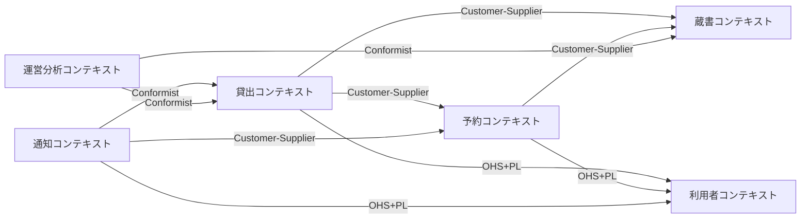
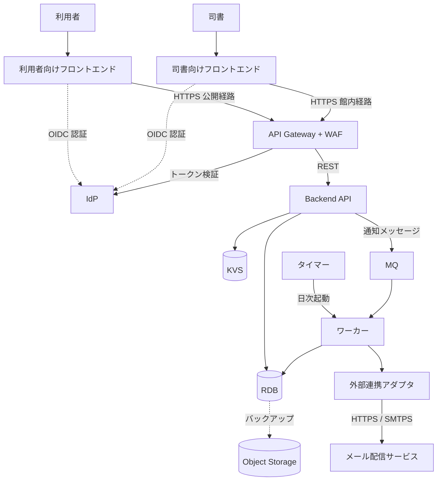
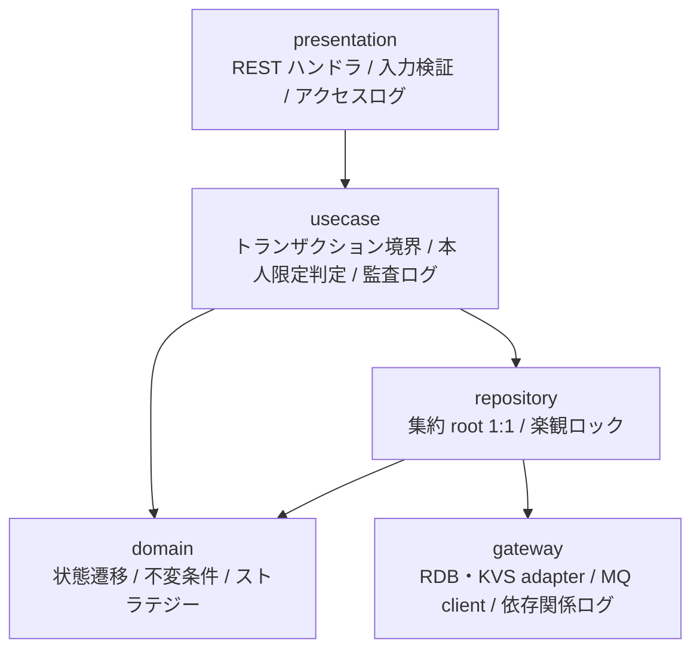
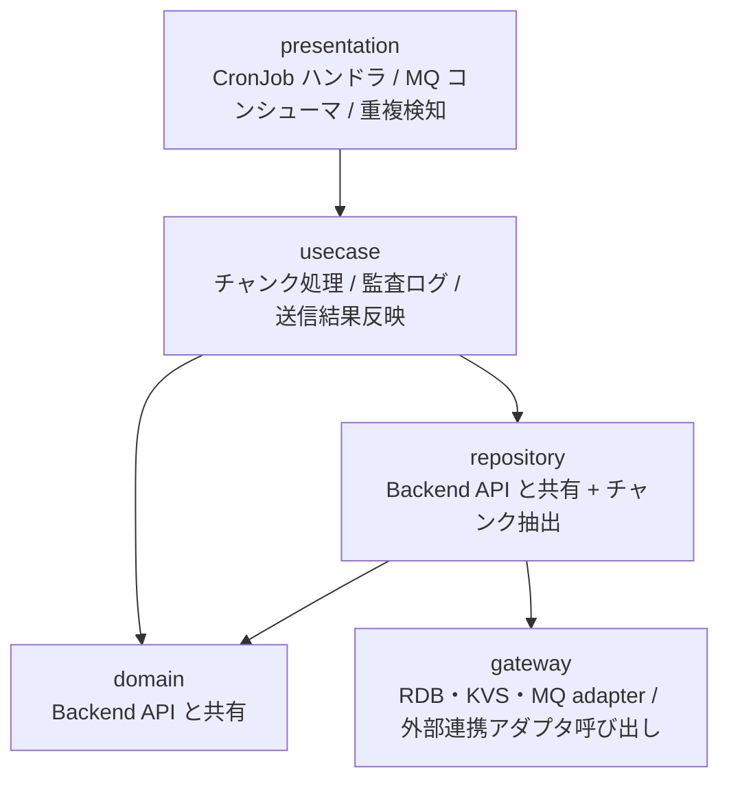
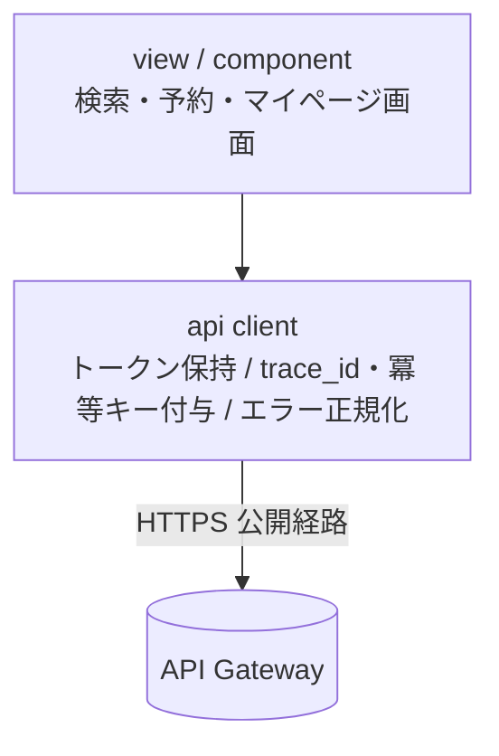
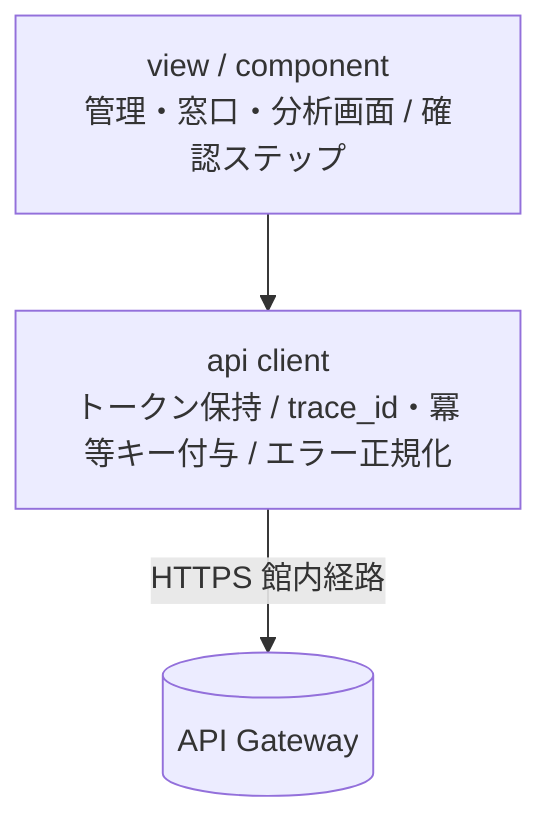
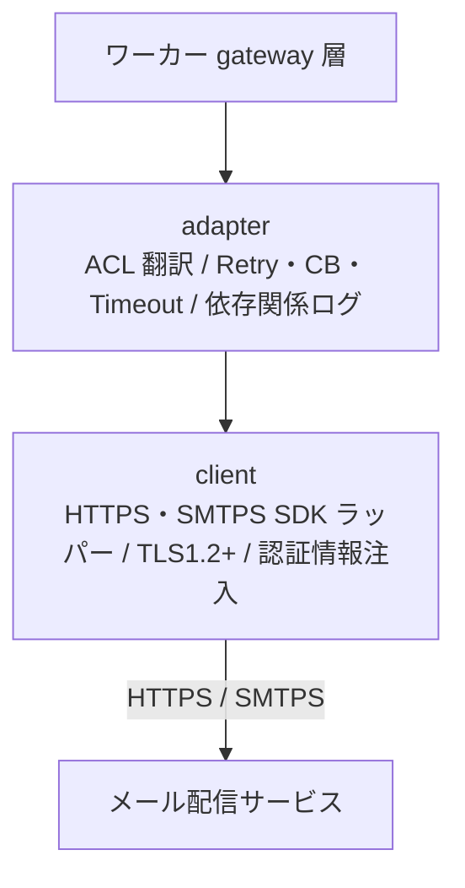
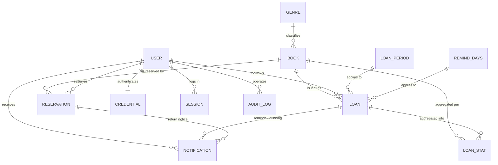

# アーキテクチャ設計書

## 概要

| 項目 | 内容 |
|------|------|
| イベントID | 20260906_132303_spec_storage_ownership |
| 作成日時 | 2026-09-06T13:23:03+09:00 |
| ソース | インフラ設計 20260903_040307_infra_product_design に基づくアーキテクチャフィードバック（trigger_event: infra:20260903_040307_infra_product_design） |
| 言語 | 未定（ユーザー希望なし。dist-impl の bootstrap 時に確定する） |
| フレームワーク | 未定（ユーザー希望なし。Web フロントエンドは SPA フレームワーク、バックエンドは REST + ORM を持つ汎用 Web フレームワークを想定） |
| 技術的制約 | クラウドベンダー未定・ベンダーニュートラル（CaaS(k8s) / RDB / KVS / MQ / Object Storage 等の汎用用語で設計し、ベンダー固有サービス名を使わない）, デプロイ先未定（クラウド / オンプレミスのいずれにも配置可能な構成とする。CaaS(k8s) を第一候補、コンテナ + LB を代替候補とする）, 1 館向けの小規模システム（NFR B.1.1.1 同時アクセス〜100）。モジュラモノリス + 単一 RDB で開始し、BC 境界をモジュールとして維持する, 利用者向け（公開経路）と司書向け（館内経路）の 2 系統フロントエンドを分離する（NFR E.5.3.1）, Backend API とワーカーは domain / repository / gateway を共有ライブラリとして共有する（モノレポ運用が前提） |

## ドメインアーキテクチャ

### コンテキストマップ図

### サブドメイン分類

| ID | 名前 | 分類 | 投資方針 | 関連 BUC | confidence | 根拠 |
|----|------|:----:|---------|---------|:----------:|------|
| SD-001 | 貸出・予約・期限管理 | core | 最優先で深いモデリングと継続的リファクタリングに投資。チーム最強の人材を配置 | BUC-004, BUC-005, BUC-006, BUC-007, BUC-008 | 中 | システム概要が「貸出・返却・予約を Web 画面から行う」「返却期限自動設定・リマインド・督促の自動送信で司書の手作業とミスを削減」をシステムの目的として明示。書籍/貸出/予約の 3 状態モデルが連動する最も複雑な業務領域。ただし「競争優位」「差別化」の明示キーワードは無く、Core 判定は経営判断のためユーザー確認必須 |
| SD-002 | 蔵書管理 | supporting | good enough な品質で安定運用。標準的なフレームワーク採用 | BUC-001, BUC-002 | 中 | 書籍・ジャンルの登録・編集・削除・検索は貸出・予約の前提となるマスタ管理業務。中核業務を支援するが差別化要因ではない。媒体種別（紙・電子）は将来拡張の起点 |
| SD-003 | 利用者管理 | supporting | good enough な品質で安定運用。標準的なフレームワーク採用 | BUC-003, BUC-009 | 中 | 利用者の登録・編集・削除と、利用者区分に基づく自分の利用状況の閲覧（利用状況閲覧範囲判定）は貸出・予約の主体を管理する支援業務。個人情報（氏名・連絡先）を扱うため感度は高いが差別化要因ではない |
| SD-004 | 運営分析 | supporting | good enough な品質で安定運用。標準的なフレームワーク採用 | BUC-010 | 中 | 在庫状況・人気書籍ランキング・期間別貸出統計は貸出記録の参照系集計であり、選書・運営改善の判断材料を提供する支援業務 |
| SD-005 | 通知配信 | generic | 外部 SaaS / ライブラリ採用、自作回避。コスト効率優先 | BUC-005, BUC-007, BUC-008 | 高 | 返却通知・リマインド・督促の 3 種のメール送信はすべて外部システム「メール配信サービス」経由。外部システム.tsv の通知系カテゴリと一致する汎用機能（該当 BUC は SD-001 と重複。送信 UC を含む BUC のみ列挙） |

### 境界づけられたコンテキスト (Bounded Context)

| ID | 名前 | 所属 SD | 所有 entity | 所有 BUC | チーム | confidence | 根拠 |
|----|------|:------:|-----------|---------|--------|:----------:|------|
| BC-001 | 蔵書コンテキスト | SD-002 | E-001, E-002 | BUC-001, BUC-002 | - | 中 | 情報.tsv のコンテキスト「蔵書管理」に対応。書籍の状態モデルを所有し、司書の登録・編集・削除と利用者・司書の検索という独立したアクター集合を持つ |
| BC-002 | 利用者コンテキスト | SD-003 | E-003, E-902, E-903 | BUC-003, BUC-009 | - | 中 | 情報.tsv のコンテキスト「利用者管理」に対応。条件.tsv で利用状況閲覧範囲判定が利用者管理コンテキストに置かれているため、利用者本人の利用状況参照（BUC-009）もこの BC が扱う。個人情報を集約して保護境界を明確化。認証情報（E-903）と操作者監査ログ（E-902）は利用者IDを扱う技術モデルとして本コンテキストが正本を所有する。他BCは監査記録の追記インターフェースを使用する。 |
| BC-003 | 貸出コンテキスト | SD-001 | E-004, E-005, E-006 | BUC-004, BUC-005, BUC-007, BUC-008 | - | 中 | 情報.tsv のコンテキスト「貸出管理」に対応。貸出の状態モデルと返却期限に関する業務パラメータを所有し、司書の貸出・返却登録とタイマーの日次バッチ（リマインド抽出・延滞判定）を扱う |
| BC-004 | 予約コンテキスト | SD-001 | E-007 | BUC-006 | - | 中 | 情報.tsv のコンテキスト「予約管理」に対応。予約の状態モデルと予約順位決定ルールを所有し、主アクターが利用者（予約登録・取消）と司書（予約一覧）で貸出コンテキストと異なる |
| BC-005 | 通知コンテキスト | SD-005 | E-008 | BUC-005, BUC-007, BUC-008 | - | 中 | 情報.tsv のコンテキスト「通知管理」に対応。外部システム「メール配信サービス」との連携領域を独立 BC として隔離し、通知記録を所有する。owned_buc_ids は送信 UC を含む BUC（貸出コンテキストと重複） |
| BC-006 | 運営分析コンテキスト | SD-004 | E-009 | BUC-010 | - | 中 | 情報.tsv のコンテキスト「運営分析管理」に対応。貸出・書籍を読み取り専用で集計する参照系で、他コンテキストの状態を変更しない |

#### ユビキタス言語

**BC-001 蔵書コンテキスト**

| 用語 | 定義 |
|------|------|
| 書籍 | 蔵書として一元管理する 1 冊の本。書籍 ID で識別し、タイトル・著者・ISBN・出版社・ジャンル・媒体種別を持つ。貸出・予約コンテキストからは書籍 ID と書籍の状態で参照される |
| 書籍の状態 | 在庫あり・貸出中・予約待ちの 3 値。蔵書コンテキストが所有し、貸出登録・返却登録・予約取消を契機に遷移する |
| ジャンル | 書籍を分類する区分（文学・社会科学・自然科学・技術・芸術・歴史・児童書・その他）。検索条件と分析単位に使う |
| 媒体種別 | 紙・電子の区別。初期リリースは紙のみ貸出・予約対象。電子は登録のみ可能 |

**BC-002 利用者コンテキスト**

| 用語 | 定義 |
|------|------|
| 利用者 | 図書館を利用する人。一意の利用者番号で識別し、氏名・連絡先・利用者区分を持つ。貸出・予約の主体であり通知の送信先 |
| 利用者番号 | 司書が登録時に付与する一意の識別子。他コンテキストは利用者番号で利用者を参照する |
| 利用者区分 | 司書・利用者の 2 値。操作範囲と利用状況の閲覧範囲（自分のみ / 任意の利用者）を切り替える |

**BC-003 貸出コンテキスト**

| 用語 | 定義 |
|------|------|
| 貸出 | 利用者に書籍を貸し出した記録。貸出日・返却期限・返却日と貸出の状態（貸出中・延滞・返却済み）を持つ |
| 返却期限 | 貸出日に貸出期間を加算して自動設定する日付。リマインド・延滞判定の基準 |
| 延滞 | 返却期限を超過して未返却の貸出の状態。日次バッチが判定し督促の送信対象とする |
| 貸出期間 | 返却期限算出に使う業務パラメータ（日数） |
| リマインド日数 | 返却期限の何日前からリマインド対象とするかを定める業務パラメータ |

**BC-004 予約コンテキスト**

| 用語 | 定義 |
|------|------|
| 予約 | 貸出中または予約待ちの書籍に対する利用者の予約記録。受付日時順の予約順位と予約の状態（予約中・通知済み・取消）を持つ |
| 予約順位 | 同一書籍に対する受付順の順位。取消時に後続を繰り上げる。順位 1 位が返却通知と貸出の対象 |
| 通知済み | 書籍返却時に順位 1 位の利用者へ返却通知を送った後の予約の状態。貸出登録で予約は完了して終了する |

**BC-005 通知コンテキスト**

| 用語 | 定義 |
|------|------|
| 通知 | 利用者に送信した返却通知・リマインド・督促のメール記録。送信先・件名・本文・送信日時・送信結果と対象貸出 ID / 対象予約 ID を持つ |
| 通知種別 | 返却通知・リマインド・督促の 3 値。送信契機（返却登録・期限接近・期限超過）と送信内容を切り替える |
| 送信結果 | メール配信サービスからの応答。通知の重複や漏れの防止と延滞一覧での督促送信状況の確認に使う |

**BC-006 運営分析コンテキスト**

| 用語 | 定義 |
|------|------|
| 貸出統計 | 貸出記録を集計期間種別（日・月・年）と書籍ごとに集計した情報。貸出回数・貸出件数・ランキング順位を持つ |
| 人気書籍ランキング | 書籍ごとの貸出回数の多い順に付与した順位 |
| 在庫状況 | 書籍の状態を一覧表示するための参照ビュー。蔵書コンテキストの書籍の状態を読み取り専用で利用する |

### コンテキストマップ

| ID | from BC | to BC | パターン | 方向 | 翻訳責務 | 統合イベント | confidence |
|----|---------|-------|:-------:|:----:|---------|--------------|:----------:|
| CM-001 | BC-003 | BC-001 | customer_supplier | downstream | 貸出コンテキストが書籍 ID で書籍を参照し、貸出登録・返却登録を契機に書籍の状態（在庫あり ⇄ 貸出中 / 予約待ち）の遷移を蔵書コンテキストに要求する。蔵書コンテキストは書籍の状態遷移 API を貸出の要件に合わせて提供する | - | 中 |
| CM-002 | BC-004 | BC-001 | customer_supplier | downstream | 予約コンテキストが書籍の状態（貸出中・予約待ち・在庫あり）を参照して予約可否を判定し、全予約取消時に書籍の状態を在庫ありへ戻すよう蔵書コンテキストに要求する | - | 中 |
| CM-003 | BC-003 | BC-002 | ohs | downstream | 利用者コンテキストが利用者番号による利用者照会（登録済み判定・連絡先取得）を公開ホストサービスとして提供し、貸出コンテキストは公開モデルをそのまま利用する | - | 中 |
| CM-004 | BC-004 | BC-002 | ohs | downstream | 予約コンテキストが利用者番号で予約主体を参照する。利用者コンテキストの公開ホストサービスを利用 | - | 中 |
| CM-005 | BC-003 | BC-004 | customer_supplier | downstream | 貸出コンテキストが返却登録時に予約中の予約の有無と予約順位 1 位を予約コンテキストに問い合わせ（返却後の書籍状態判定）、予約待ち書籍の貸出登録時は順位 1 位の利用者に限定し、貸出登録で該当予約を完了させるよう要求する | - | 中 |
| CM-006 | BC-005 | BC-003 | conformist | downstream | 通知コンテキストは貸出コンテキストが決めたリマインド対象・延滞判定結果（貸出 ID・利用者番号・返却期限）をそのまま受け取り、通知種別リマインド / 督促のメールを組み立てる。翻訳は行わない | - | 中 |
| CM-007 | BC-005 | BC-004 | customer_supplier | downstream | 通知コンテキストが返却通知対象（予約順位 1 位の予約）を予約コンテキストから取得し、送信後に予約の状態を予約中 → 通知済みへ遷移させるよう要求する | - | 中 |
| CM-008 | BC-005 | BC-002 | ohs | downstream | 通知コンテキストが利用者番号から送信先メールアドレスを利用者コンテキストの公開ホストサービス経由で取得する | - | 中 |
| CM-009 | BC-006 | BC-003 | conformist | downstream | 運営分析コンテキストが貸出記録（貸出日・書籍 ID）をそのまま読み取り、期間別貸出件数と書籍別貸出回数を集計する | - | 中 |
| CM-010 | BC-006 | BC-001 | conformist | downstream | 運営分析コンテキストが書籍の状態とジャンルをそのまま読み取り、在庫状況一覧とランキング表示に用いる | - | 中 |

### 集約境界の仮説

> 注: これらは戦略段階の仮説です。最終確定は dist-spec or ddd-tactical-implementation で行います。

| ID | BC | root entity | members | invariants | confidence | 備考 |
|----|----|-----------|---------|-----------|:----------:|------|
| AG-001 | BC-001 | E-001 | - | • 貸出中・予約待ちの書籍は削除できない • 媒体種別が電子の書籍は登録のみ可能で、貸出・予約の対象にできない（初期リリース） • 書籍の状態は在庫あり・貸出中・予約待ちのいずれか 1 つ | 低 | 仮説。ジャンル（E-002）は複数書籍から参照されるマスタのため集約外の参照とする。最終確定は dist-spec または ddd-tactical-implementation で行う |
| AG-002 | BC-002 | E-003 | - | • 利用者番号は一意 • 利用者区分が利用者の場合、自分の利用者番号に紐づく貸出履歴・予約状況のみ閲覧できる | 低 | 仮説。2 件目はアクセス制御ルールでもあるため Part 1 の認可設計と重複させて扱う。最終確定は dist-spec または ddd-tactical-implementation で行う |
| AG-003 | BC-003 | E-004 | - | • 書籍の状態が在庫あり、かつ貸出先が登録済みの利用者である場合のみ貸出できる • 予約待ちの書籍は予約順位 1 位の利用者に限り貸出できる • 返却期限は貸出日に貸出期間を加算した日付とする（必須・自動設定） • 貸出中で未返却かつ当日が返却期限を超過した貸出は延滞に遷移する • 返却済みの貸出は状態を変更しない | 低 | 仮説。貸出 1 件 = 書籍 1 冊 × 利用者 1 人の記録で強整合範囲が完結する。最終確定は dist-spec または ddd-tactical-implementation で行う |
| AG-004 | BC-003 | E-005 | E-006 | • 貸出期間・リマインド日数は適用開始日時点で有効な値が 1 つ存在する | 低 | 仮説。貸出期間とリマインド日数は返却期限に関する業務パラメータとして 1 集約（貸出ポリシー設定）にまとめたが、独立した 2 つの設定エンティティとして扱う選択肢もある。最終確定は dist-spec または ddd-tactical-implementation で行う |
| AG-005 | BC-004 | E-007 | - | • 書籍の状態が在庫ありの書籍には予約できない • 同一書籍の予約順位は受付日時の早い順に付与し、取消時は後続の予約中・通知済みの予約を繰り上げる • 取消・終了した予約は順位の管理対象から外す | 低 | 仮説。予約順位の繰り上げは同一書籍の予約集合にまたがる整合性のため、書籍単位の予約リスト（予約帳）を集約 root とする代替案がある。最終確定は dist-spec または ddd-tactical-implementation で行う |
| AG-006 | BC-005 | E-008 | - | • 同一契機（対象貸出 ID / 対象予約 ID × 通知種別）に対する通知の重複送信と漏れを防ぐ • 返却通知は予約中の予約がある場合のみ、予約順位 1 位の利用者に送信する | 低 | 仮説。通知は送信のたびに追記される記録（イベント寄り）で、単独集約として扱う。最終確定は dist-spec または ddd-tactical-implementation で行う |
| AG-007 | BC-006 | E-009 | - | - | 低 | 仮説。貸出統計は貸出記録からの派生データで不変条件を持たない。集約というより読み取りモデルとして扱う可能性が高い。最終確定は dist-spec または ddd-tactical-implementation で行う |

## システムアーキテクチャ

### システム構成図

### ティア構成

| ID | ティア名 | 説明 | テクノロジー候補 |
|-----|---------|------|----------------|
| tier-frontend-user | 利用者向けフロントエンド | 社外の利用者がインターネット経由で利用する Web UI。書籍検索・書籍詳細/在庫状況・予約申込/取消・マイ貸出履歴・マイ予約状況を提供する。管理機能は含めない | SPA, レスポンシブ Web UI, CDN |
| tier-frontend-staff | 司書向けフロントエンド | 館内ネットワークから司書が利用する管理 Web UI。蔵書管理・利用者管理・貸出/返却受付・返却通知送信・予約状況・延滞/督促状況・在庫状況/人気書籍ランキング/期間別貸出統計を提供する | SPA, レスポンシブ Web UI |
| tier-api-gateway | API Gateway | 2 系統のフロントエンドから Backend API への入口。TLS 終端、WAF、IdP 発行トークンの検証、粗粒度 RBAC、公開経路 / 館内経路の分離、レート制限を担う | API Gateway / リバースプロキシ, WAF, LB |
| tier-idp | IdP | 司書・利用者の認証を担うアイデンティティプロバイダー。ID/パスワード認証、パスワードポリシー、アカウントロック、OAuth2/OIDC によるトークン発行を行う | セルフホスト IdP, OAuth2/OIDC |
| tier-backend-api | Backend API | 蔵書 / 利用者 / 貸出 / 予約 / 通知 / 運営分析の 6 BC をモジュールとして内包するモジュラモノリス API。UC の同期処理、本人限定判定、3 状態モデルの遷移、通知メッセージの MQ 発行を担う | CaaS(k8s), コンテナ + LB |
| tier-worker | ワーカー | 日次バッチ（リマインド対象抽出・リマインド送信、延滞判定・督促送信）と、MQ から通知メッセージを受け取りメール配信サービス経由で送信する非同期ワーカー | CronJob(k8s), MQ, コンテナワーカー |
| tier-datastore | データストア | 業務データの正本となる RDB、冪等キー・セッション・参照系キャッシュを保持する KVS、バックアップの遠隔地保管に用いる Object Storage | RDB, KVS, Object Storage |
| tier-external-integration | 外部連携 | メール配信サービスへの送信を担うアダプタ。通知コンテキストの ACL としてメール配信サービスの API モデルを通知記録の語彙に翻訳し、回復性パターンを適用する | HTTPS API クライアント, SMTPS クライアント, ACL アダプタ |

### 利用者向けフロントエンド (tier-frontend-user) の方針・ルール

#### 方針

| ID | 方針名 | 内容 | 根拠 | RDRA/NFR 要素 | 確信度 |
|-----|---------|------|------|--------------|:------:|
| SP-001 | マルチ OS・マルチブラウザ・PC/タブレット対応 | Windows / macOS 上の Chrome / Edge / Safari 最新版と、PC およびタブレットの画面幅に対応するレスポンシブ UI を提供する。スマートフォン対応は要確認とする | 社外の利用者が自身の端末のブラウザから利用するため、単一 OS・単一ブラウザの指定は現実的でない | アクター: 利用者（社外）, NFR F.1.1.1, NFR F.1.1.2, NFR F.1.1.3 | 中 |
| SP-002 | 利用者向け画面のレスポンス目標 | 検索・予約・利用状況照会の画面操作は 5 秒以内に応答する。コード分割による初期ロード軽量化、静的資産の CDN 配信とブラウザキャッシュ、一覧のページネーションを標準とする | 一般利用者向け画面の応答基準 5 秒以内が NFR で定義されている | UC: 書籍を検索する / 予約を登録する / 貸出履歴を参照する, NFR B.2.1.1, NFR B.1.2.1 | 中 |
| SP-003 | 公開機能の限定 | インターネットへ公開するのは利用者向けの検索・予約・利用状況照会のみとする。蔵書・利用者の管理機能や貸出・返却登録は本ティアに含めない | 利用制限で司書向け管理機能は館内ネットワーク限定、利用者向け機能はインターネット公開と機能ごとに接続元を分ける方針が定められている | アクター: 司書（社内）/ 利用者（社外）, NFR E.5.3.1 | 中 |
| SP-004 | アクセシビリティ目標 | 利用者向け画面は JIS X 8341-3:2016 レベル AA 準拠を目標とし、キーボード操作・コントラスト・スクリーンリーダー対応を設計基準に含める | 社外の一般利用者向けに公開する図書館システムとして望ましいが、RDRA に明示はなく弱い推論 | アクター: 利用者（社外）, NFR F.3.1.2 | 低 |

#### ルール

| ID | ルール名 | 内容 | 根拠 | RDRA/NFR 要素 | 確信度 |
|-----|---------|------|------|--------------|:------:|
| SR-001 | API 経由のデータアクセス | フロントエンドからデータストアへの直接アクセスを禁止し、必ず API Gateway 経由で Backend API を呼び出す | セキュリティとデータ整合性の確保 | なし | デフォルト |
| SR-002 | ブラウザ側に個人情報・認証情報を永続化しない | 利用者の氏名・連絡先・貸出履歴やアクセストークンを localStorage 等に永続保存しない。トークンはメモリ保持または HttpOnly / Secure Cookie で扱う | 貸出履歴は思想信条を推知しうる要配慮情報に準じ、端末側への残留を避ける必要がある | 情報: 利用者 / 貸出, NFR E.1.2.1, NFR E.6.1.1 | 中 |
| SR-003 | Web アプリケーション脆弱性対策 | 出力エスケープによる XSS 対策、CSRF トークン、Content Security Policy をフレームワーク標準機能で適用し、リリース前に自動診断を実施する | 利用者入力（キーワード・ISBN 等）を扱う公開画面があるため | UC: 書籍を検索する, NFR E.10.2.1, NFR E.3.1.1 | 中 |

### 司書向けフロントエンド (tier-frontend-staff) の方針・ルール

#### 方針

| ID | 方針名 | 内容 | 根拠 | RDRA/NFR 要素 | 確信度 |
|-----|---------|------|------|--------------|:------:|
| SP-005 | 館内ネットワーク限定公開 | 司書向け画面は館内ネットワークからのみ到達可能とし、インターネットへ公開しない。API Gateway の経路制御と組み合わせて接続元を制限する | 司書は社内アクターであり、管理機能は館内限定で利用する方針が定められている | アクター: 司書（社内・提供者）, NFR E.5.3.1 | 中 |
| SP-006 | 窓口業務の操作効率と集計画面の応答目標 | 貸出受付・返却受付は利用者番号と書籍 ID の入力から最少操作で完了できる画面とする。在庫状況一覧・人気書籍ランキング・期間別貸出統計は集計要求から 10 秒以内に表示する | 貸出・返却は窓口のリアルタイム処理であり、集計画面は管理者向け基準 10 秒以内が定義されている | BUC: 書籍を貸し出すフロー / 書籍を返却するフロー / 蔵書の利用状況を分析するフロー, NFR B.2.1.3, NFR A.4.1.2 | 中 |

#### ルール

| ID | ルール名 | 内容 | 根拠 | RDRA/NFR 要素 | 確信度 |
|-----|---------|------|------|--------------|:------:|
| SR-004 | API 経由のデータアクセス | フロントエンドからデータストアへの直接アクセスを禁止し、必ず API Gateway 経由で Backend API を呼び出す | セキュリティとデータ整合性の確保 | なし | デフォルト |
| SR-005 | 状態変更操作の確認ステップとダブルサブミット防止 | 書籍削除・利用者削除・貸出登録・返却登録・返却通知送信は確認画面を経由し、送信中はボタンを無効化する。送信には冪等キーを付与する | RDRA に削除確認画面・返却通知送信確認画面が定義されており、状態遷移を伴う操作の重複を防ぐ必要がある | BUC: 蔵書を管理するフロー / 書籍を返却するフロー, 画面: 書籍削除確認画面 / 返却通知送信確認画面 | 中 |

### API Gateway (tier-api-gateway) の方針・ルール

#### 方針

| ID | 方針名 | 内容 | 根拠 | RDRA/NFR 要素 | 確信度 |
|-----|---------|------|------|--------------|:------:|
| SP-007 | 公開経路と館内経路の分離 | 利用者向け API（検索・予約・利用状況照会）はインターネットから、司書向け API（蔵書・利用者管理、貸出・返却登録、分析）は館内ネットワークからのみ受け付ける。経路ごとに接続元 IP 制限を設定する | 機能ごとに接続元を分ける利用制限と、DMZ / 内部セグメント分離の方針を入口で集約して実現する | アクター: 司書（社内）/ 利用者（社外）, NFR E.5.3.1, NFR E.8.3.1 | 中 |
| SP-008 | WAF マネージドルールの適用 | 公開経路の前段にマネージドルールセットのデフォルト適用による WAF を置く。カスタムルール運用は初期リリースでは行わない | 利用者向け検索・予約画面を社外へ公開するため WAF なしは避ける。小規模のためカスタムルール運用は過剰 | アクター: 利用者（社外）, NFR E.10.1.1 | 中 |
| SP-009 | トークン検証と粗粒度 RBAC | IdP が発行したアクセストークンを検証し、トークン内の利用者区分クレーム（司書 / 利用者）で API 経路単位の粗粒度アクセス制御を行う。本人限定などの細粒度判定は Backend API に委ねる | 利用者区分による役割別の操作範囲切替が RDRA と NFR の双方で明示されている | バリエーション: 利用者区分, 条件: 利用状況閲覧範囲判定, NFR E.5.2.1, NFR E.5.1.1 | 高 |
| SP-010 | レート制限 | 公開経路に接続元単位のレート制限を設定し、ピーク時（通常の 2 倍）を超える突発負荷と総当たり攻撃の緩和を行う。認証エンドポイントは IdP のアカウントロックと併用する | 返却通知直後の予約者アクセス集中と、Web ログインへの総当たり攻撃の基本対策が必要 | NFR B.1.2.1, NFR E.7.2.1 | 中 |

#### ルール

| ID | ルール名 | 内容 | 根拠 | RDRA/NFR 要素 | 確信度 |
|-----|---------|------|------|--------------|:------:|
| SR-006 | TLS 終端と内部通信の再暗号化 | API Gateway で TLS1.2 以上を終端し、Backend API への内部通信も TLS で再暗号化する | 内部通信を含む全通信暗号化が NFR で定義されている | NFR E.6.1.2, NFR F.1.2.1 | 高 |
| SR-007 | アクセスログの出力と trace_id の付与 | 全リクエストについて trace_id・認証主体（user_id）・経路・応答コード・処理時間をアクセスログとして構造化出力する。フロントエンドが trace_id を付与していない場合は Gateway で生成する | アクセスログ＋監査ログの取得と横断トレーサビリティの起点が必要 | NFR C.6.1.2, NFR E.7.1.1, NFR C.1.3.1 | 中 |

### IdP (tier-idp) の方針・ルール

#### 方針

| ID | 方針名 | 内容 | 根拠 | RDRA/NFR 要素 | 確信度 |
|-----|---------|------|------|--------------|:------:|
| SP-011 | パスワードポリシー付き ID/パスワード認証 | 利用者番号（または司書 ID）とパスワードによる認証を行い、複雑性・有効期限のパスワードポリシーを適用する。MFA および外部 IdP 連携は初期リリースでは採用しない | 本人限定の情報を Web で参照するためパスワードポリシー付き認証を要するが、外部 IdP 連携や MFA は RDRA になく過剰 | アクター: 司書 / 利用者, 条件: 利用状況閲覧範囲判定, NFR E.5.1.1 | 中 |
| SP-012 | ログイン失敗の連続検知とアカウントロック | 一定回数のログイン失敗でアカウントを一時ロックし、ロック・解除をログに記録する | 利用者番号とパスワードによる Web ログインへの総当たり攻撃の基本対策 | アクター: 利用者（社外）, NFR E.7.2.1 | 中 |
| SP-013 | 認証情報の保護 | パスワードはソルト付きハッシュで保管し、トークン署名鍵等の認証情報は暗号化して保管する | 認証情報は保管時暗号化の対象として明示されている | NFR E.6.1.1 | 高 |

#### ルール

| ID | ルール名 | 内容 | 根拠 | RDRA/NFR 要素 | 確信度 |
|-----|---------|------|------|--------------|:------:|
| SR-008 | ログイン / ログアウトの監査ログ | ログイン成功・失敗、ログアウト、パスワード変更、アカウントロックを user_id・接続元・時刻とともに監査ログに記録する | ログイン / ログアウト＋データアクセスログの監査ログ取得が定義されている | NFR E.7.1.1, NFR C.6.1.2 | 高 |
| SR-009 | 利用者区分クレームの発行 | 発行するトークンに主体識別子（利用者番号）と利用者区分（司書 / 利用者）をクレームとして含め、API Gateway と Backend API の認可判定に用いる | 利用者区分により操作範囲と閲覧範囲を切り替えるため、認証結果として役割を伝搬する必要がある | バリエーション: 利用者区分, 情報: 利用者, NFR E.5.2.1 | 中 |

### Backend API (tier-backend-api) の方針・ルール

#### 方針

| ID | 方針名 | 内容 | 根拠 | RDRA/NFR 要素 | 確信度 |
|-----|---------|------|------|--------------|:------:|
| SP-014 | モジュラモノリス構成 | 6 つの BC を 1 デプロイ単位内の独立モジュールとして実装し、モジュール間は公開インタフェース（コンテキストマップの OHS / Customer-Supplier に対応）経由でのみ依存する。媒体種別（電子書籍）を拡張点として設計する | 1 館・9 エンティティ・27 UC の小規模で分散化の根拠はないが、6 コンテキストへの分割と将来の電子書籍対応が拡張性要件として明示されている | BC: BC-001〜BC-006, バリエーション: 媒体種別, NFR F.2.2.1, NFR B.1.1.1 | 中 |
| SP-015 | ステートレスな水平スケールアウト構成 | API プロセスはセッション状態を持たず、N+1 の複数インスタンスを LB 配下で稼働させる。利用者増に対してはインスタンス追加でスケールアウトする | 社外公開のため利用者増に備えるスケールアウトと、サーバ内 N+1 冗長が定義されている | アクター: 利用者（社外）, NFR B.3.1.1, NFR A.2.1.1, NFR B.2.1.2 | 中 |
| SP-016 | 本人限定アクセスの Backend 作り込み | 利用者区分が利用者の場合、貸出履歴・予約状況・予約取消はトークンの利用者番号と対象データの利用者番号が一致する場合のみ許可する。司書は利用者番号を指定して任意の利用者を参照できる。個人情報を扱う利用者・通知モジュールは厳格側に倒し、判定結果をデータアクセスログに残す | 唯一のアクセス制御条件が所有権ベースであり、認可パターン数が少ないため Backend の作り込みで十分。ただし利用者・通知は個人情報の正本のため厳格認可を必須とする | 条件: 利用状況閲覧範囲判定, 情報: 利用者 / 通知, NFR E.5.2.1, NFR E.7.1.1 | 高 |
| SP-017 | メール送信の非同期化 | 返却通知の送信要求は通知レコードを作成して MQ へ発行し、API 応答は外部メール配信サービスの結果を待たない。送信結果はワーカーが通知レコードに反映する | 外部サービス呼び出しを同期にすると 5 秒以内の応答目標と可用性が外部サービスに依存するため | UC: 返却通知を送信する, 外部システム: メール配信サービス, NFR B.2.1.1, NFR A.1.2.1 | 中 |
| SP-018 | 越境状態遷移の同期トランザクション | 貸出登録・返却登録・予約取消など複数集約（書籍・貸出・予約）に波及する状態遷移は、単一 RDB トランザクション内で同期的に整合させる。結果整合（ドメインイベント）は採用しない | 1 館規模で同時更新競合は小さく、3 状態モデル間の不整合は窓口混乱と復旧作業の負担に直結する | 状態: 書籍の状態, 貸出の状態, 予約の状態, 条件: 返却後の書籍状態判定, NFR A.4.1.1, NFR C.3.3.1 | 中 |

#### ルール

| ID | ルール名 | 内容 | 根拠 | RDRA/NFR 要素 | 確信度 |
|-----|---------|------|------|--------------|:------:|
| SR-010 | データアクセス監査ログ | 利用者・貸出・予約・通知の参照と更新について、user_id・操作種別・対象エンティティ ID・認可判定結果を監査ログに記録する。本文や連絡先などの値自体は記録しない | 本人限定参照の逸脱を検知する監査ログが必要 | 条件: 利用状況閲覧範囲判定, NFR E.7.1.1, NFR C.6.1.2 | 高 |
| SR-011 | 入力検証とパラメータ化クエリ | 検索条件種別ごとに入力を検証し、DB アクセスは必ずパラメータ化クエリで行う | 利用者入力を検索条件に用いるためインジェクション対策が必須 | UC: 書籍を検索する, 条件: 書籍検索条件判定, NFR E.10.2.1 | 中 |
| SR-012 | 業務パラメータの外部化 | 貸出期間・リマインド日数はコードに埋め込まず、適用開始日つきの設定データとして RDB で管理し、返却期限算出・リマインド対象判定はその時点の有効値を参照する | 貸出期間・リマインド日数が業務パラメータとして情報モデルに定義されている | 情報: 貸出期間 / リマインド日数, 条件: 返却期限算出 / リマインド対象判定 | 高 |

### ワーカー (tier-worker) の方針・ルール

#### 方針

| ID | 方針名 | 内容 | 根拠 | RDRA/NFR 要素 | 確信度 |
|-----|---------|------|------|--------------|:------:|
| SP-019 | 日次バッチのスケジュール枠 | リマインド対象抽出・延滞判定は夜間〜早朝の 8 時間枠内に完了させ、バックアップ時間帯（1 時〜4 時）とは重ならない時刻に起動する。運用時間外（8 時〜9 時）の計画停止枠とも分離する | 日次バッチはリマインド・督促の当日送信に間に合えばよく、バックアップと時間帯を分離する方針が定められている | アクター: タイマー, BUC: 返却期限を通知するフロー / 延滞者に督促するフロー, NFR B.2.2.1, NFR C.1.1.2, NFR A.1.1.1 | 中 |
| SP-020 | Queue-Based Load Leveling と DLQ | メール送信は MQ を介したワーカーで処理し、送信失敗は指数バックオフで再試行、規定回数超過は DLQ へ退避して手動再処理する。ワーカーは Competing Consumers として水平スケール可能にする | バッチ起点の一括送信と返却通知の突発送信を平準化し、外部サービス障害時の送信漏れを防ぐ | BUC: 返却期限を通知するフロー / 延滞者に督促するフロー, 情報: 通知（送信結果）, NFR B.1.2.1, NFR B.2.2.2 | 中 |
| SP-021 | バッチ完了とキュー滞留の監視 | 日次バッチの開始・終了・処理件数・失敗件数を構造化ログとメトリクスで出力し、未完了・失敗・キュー滞留・DLQ 到達をアラート対象とする | 日次バッチの完了とメール送信結果をアプリケーション層で監視する必要がある | NFR C.1.3.1, NFR C.3.1.1, アクター: タイマー | 中 |
| SP-030 | 中断許容ワークロードとしてのコスト最適化 | キュー消費ワーカー・スケジュール実行ワーカーはスポット/プリエンプティブルインスタンスの利用を第一候補とする。中断時は SIGTERM 受信での可視性タイムアウト解放とリトライ、冪等消費（SR-013）・再実行可能性（SR-014）を前提に安全に再処理する | インフラ設計（MCL product-design）の結果に基づく: 通知送信・日次バッチは即時性要求が低く中断を許容できるため、コスト最適化の余地が大きい | infra: product-cost-hints.yaml → spot_candidates[worker_consumer, worker_scheduled] | 中 |

#### ルール

| ID | ルール名 | 内容 | 根拠 | RDRA/NFR 要素 | 確信度 |
|-----|---------|------|------|--------------|:------:|
| SR-013 | 通知の重複送信防止 | 対象貸出 ID / 対象予約 ID × 通知種別 × 送信日を一意キーとして通知レコードを作成してから送信し、MQ の MessageId とジョブ実行 ID で重複処理を検知する | 通知の重複や漏れを防ぐ要件が情報モデルに定義されている | 情報: 通知, 条件: リマインド対象判定 / 延滞判定, NFR B.1.1.4 | 高 |
| SR-014 | バッチの再実行可能性 | バッチは途中失敗時に未処理分のみを再処理できるよう、対象抽出と送信を分離し、処理済みを通知レコードで判定する。〜10 万件を想定してチャンク分割で処理する | 1 回あたり〜10 万件の走査を 8 時間枠内で完了させ、失敗時の再実行を安全にする | UC: リマインド対象を抽出する / 延滞を判定する, NFR B.1.1.4, NFR B.2.2.1 | 中 |

### データストア (tier-datastore) の方針・ルール

#### 方針

| ID | 方針名 | 内容 | 根拠 | RDRA/NFR 要素 | 確信度 |
|-----|---------|------|------|--------------|:------:|
| SP-022 | RDB を正本とする強整合 | 書籍・利用者・貸出・予約・通知・貸出統計・業務パラメータは RDB に保持し、3 状態モデルの遷移はトランザクションで整合させる。KVS は正本を持たず、冪等キー・セッション・キャッシュに限定する | 状態モデル間の整合性が求められ、金銭取引はないが当日の貸出・予約記録の消失は窓口混乱を招く | 情報: 書籍 / 貸出 / 予約 / 通知, 状態: 書籍の状態, 貸出の状態, 予約の状態, NFR B.1.1.2 | 高 |
| SP-023 | 冗長化・バックアップ・復旧目標 | RDB は N+1 冗長（手動切替、切替 60 分未満）とパリティ相当のストレージ冗長で構成し、日次フル＋差分バックアップにトランザクションログ退避を組み合わせて RPO 数時間・RTO 2 時間を満たす。バックアップは 7 世代を保持し、Object Storage で遠隔地に保管する。復旧後は平常時 80% 以上の処理能力を確保する | 可用性・回復性・災害対策・バックアップ方式の NFR を満たす最小構成 | NFR A.2.1.1, NFR A.2.5.1, NFR A.1.2.1, NFR A.4.1.1, NFR A.4.1.2, NFR A.4.1.3, NFR A.3.1.1, NFR A.3.1.2, NFR C.1.2.1, NFR C.1.2.2, NFR C.1.2.3 | 中 |
| SP-024 | 機密データの保管時暗号化 | 利用者の氏名・連絡先（メールアドレス・電話番号・住所）、認証情報、貸出履歴、通知の送信先・本文を保管時暗号化の対象とする。全データ暗号化は行わない | 個人情報を含む列に限定した保管時暗号化が定義されている | 情報: 利用者 / 貸出 / 通知, NFR E.6.1.1 | 高 |
| SP-025 | 内部セグメントへの配置 | RDB / KVS は内部セグメントに配置し、インターネットおよび DMZ から直接到達できないようにする。Backend API・ワーカーからのみ接続を許可する | 個人情報を保持する DB を社外の利用者から直接到達させない | 情報: 利用者, アクター: 利用者（社外）, NFR E.8.3.1 | 中 |
| SP-026 | ストレージのオンライン拡張 | RDB とバックアップ領域は無停止でボリューム追加できる構成とする。年間〜100 万件・総容量 100GB 未満を初期サイズとする | データ量は小規模だがオンライン拡張が定義されている | NFR B.3.3.1, NFR B.1.1.2 | デフォルト |

#### ルール

| ID | ルール名 | 内容 | 根拠 | RDRA/NFR 要素 | 確信度 |
|-----|---------|------|------|--------------|:------:|
| SR-015 | テスト・開発環境へのデータマスキング | 本番データをテスト環境・開発環境へ複製する際は、利用者の氏名・連絡先・通知の送信先/本文を匿名化データに置換する | 個人情報をテスト環境へそのまま複製しないための措置 | 情報: 利用者 / 通知, NFR E.6.2.1, NFR C.4.1.1, NFR C.4.2.1 | 中 |
| SR-016 | 初期データ移行 | 紙台帳・表計算ファイルの書籍・ジャンル・利用者データを休館日に一括移行する。ISBN・ジャンル・媒体種別・利用者区分の正規化と、ISBN 重複・メールアドレス欠損のクレンジングを移行前に行い、リハーサルを 1 回実施して件数一致とサンプル突合で判定する。失敗時は既存運用へ戻す | 移行元が紙台帳と表計算ファイルであり、一括移行・〜100GB・リハーサル 1 回が定義されている | システム概要: 紙台帳と表計算ファイル, 情報: 書籍 / ジャンル / 利用者, NFR D.1.1.1, NFR D.2.1.1, NFR D.4.1.1, NFR D.4.1.2, NFR D.4.1.3, NFR D.5.1.1, NFR D.5.1.2, NFR D.5.1.3 | 中 |

### 外部連携 (tier-external-integration) の方針・ルール

#### 方針

| ID | 方針名 | 内容 | 根拠 | RDRA/NFR 要素 | 確信度 |
|-----|---------|------|------|--------------|:------:|
| SP-027 | ACL によるドメインモデル保護 | メール配信サービスの宛先・件名・本文・送信結果の表現を通知コンテキストの語彙に翻訳し、外部サービス固有のモデルを Backend API・ワーカーのドメインへ持ち込まない。サービス差し替え時の影響を本ティアに閉じ込める | 外部システムは通知系のメール配信サービス 1 つであり、Generic サブドメインとして隔離する | 外部システム: メール配信サービス, BC: BC-005, 情報: 通知（送信結果） | 中 |
| SP-028 | Retry + Circuit Breaker + Timeout | 送信呼び出しにタイムアウトを設定し、一時障害は指数バックオフ＋Jitter で再試行、継続障害はサーキットブレーカーで遮断して通知レコードを送信失敗として保留する。Timeout はサーキットブレーカーの閾値時間より短くする | 外部サービス障害時に API・ワーカーへ障害を連鎖させず、サービス切替 60 分未満の可用性目標を守る | 外部システム: メール配信サービス, NFR A.1.2.1, NFR A.2.1.1 | 中 |
| SP-029 | 送信結果の記録と監視 | メール配信サービスからの応答を通知レコードの送信結果に反映し、失敗率とサーキットブレーカーの Open 状態をアプリケーション監視の対象とする | 送信結果と日次バッチの完了をアプリケーション層で監視する要件がある | 情報: 通知（送信結果）, NFR C.1.3.1, NFR C.3.1.1 | 中 |

#### ルール

| ID | ルール名 | 内容 | 根拠 | RDRA/NFR 要素 | 確信度 |
|-----|---------|------|------|--------------|:------:|
| SR-017 | 外部通信の暗号化 | メール配信サービスとの通信は HTTPS（TLS1.2 以上）または SMTPS に限定する | 外部システムとの通信を含む全通信暗号化と通信プロトコルが定義されている | NFR E.6.1.2, NFR F.1.2.1 | 高 |
| SR-018 | 再試行対象の限定 | 認証エラー・宛先不正などの 4xx 系エラーは再試行せず送信失敗として記録する。再試行は通知 ID を冪等キーとして行い、同一通知の二重送信を防ぐ | 恒久的な障害の再試行は無駄であり、冪等でない送信の重複は利用者への迷惑メールとなる | 情報: 通知, NFR A.1.2.1 | デフォルト |
| SR-019 | 外部サービス認証情報の秘匿 | メール配信サービスの API キー等はシークレット管理機構で保管し、コードやログに含めない | 認証情報の保管時暗号化が定義されている | NFR E.6.1.1 | デフォルト |

### ティア共通の方針

| ID | 方針名 | 内容 | 根拠 | RDRA/NFR 要素 | 確信度 |
|-----|---------|------|------|--------------|:------:|
| CTP-001 | 認証方式 | OAuth2/OIDC ベースの認証を全ティア共通で採用する。IdP が発行するアクセストークンを API Gateway で検証し、Backend API はトークンのクレームを信頼する。認証方式自体は ID/パスワード＋パスワードポリシー | 社外の利用者が本人限定の情報を Web で参照するため、標準プロトコルで認証結果をティア間で安全に伝搬する必要がある | アクター: 利用者（社外）/ 司書, 条件: 利用状況閲覧範囲判定, NFR E.5.1.1 | 高 |
| CTP-002 | 認可モデル | パターン A（RBAC + Backend 作り込み）を採用する。API Gateway で利用者区分（司書 / 利用者）による粗粒度 RBAC、Backend API で本人限定（所有権ベース）と状態ベースの判定を実装する。認可サービスティアは設けない。個人情報を扱う利用者・通知コンテキストは厳格認可（本人限定 + データアクセス監査ログ）を必須とし、貸出・予約は本人限定、蔵書・運営分析は司書のみ更新・参照は利用者も可とする | ロールは 2 値、所有権ベース条件は 1 パターン、条件ベースは 0 で認可パターンが少ない。ただし利用者・通知は個人情報の正本のためデータ感度ベースで厳格側に倒す | バリエーション: 利用者区分, 条件: 利用状況閲覧範囲判定, 情報: 利用者 / 通知, NFR E.5.2.1, NFR E.7.1.1 | 高 |
| CTP-003 | IdP 方式 | セルフホスト IdP を採用し、司書・利用者の両方を単一 IdP で管理する。利用者の ID は利用者番号とし、利用者登録時に司書が初期パスワードを発行する運用を前提とする | 外部 IdP 連携やソーシャルログインの要件は RDRA になく、社内外アクターの併用でも小規模のため単一のセルフホスト IdP で足りる | アクター: 司書（社内）/ 利用者（社外）, NFR E.5.1.1, NFR B.1.1.1 | 中 |
| CTP-004 | 冪等性方針 | フロントエンドは状態変更リクエストごとに冪等キー（UUID）を生成し X-Idempotency-Key ヘッダーに付与する。Backend API は冪等キーを KVS で管理し重複リクエストには前回レスポンスを返す。RDB では通知の一意キーに UNIQUE 制約を設定する。CronJob はジョブ実行 ID、MQ ワーカーは MessageId で重複処理を検知する | 社外の利用者による予約・取消のリトライと、司書の貸出・返却・削除登録の二重送信が状態遷移の重複を招く | アクター: 利用者（社外）, BUC: 書籍を予約するフロー / 書籍を貸し出すフロー / 書籍を返却するフロー, 状態: 書籍の状態, 貸出の状態, 予約の状態 | 高 |
| CTP-005 | 構造化ログとトレーサビリティ | 全ティアで JSON 構造化ログ（timestamp, level, trace_id, span_id, service, message, context）を stdout に出力する。フロントエンドが trace_id を生成し W3C Trace Context ヘッダーで伝搬、API Gateway / Backend API / ワーカーはティア単位で span_id を発行し MQ メッセージにも trace_id を伝播する。CronJob は実行ごとに新規 trace_id を生成する。認証済みリクエストは session_id / user_id、業務処理は書籍 ID / 貸出 ID / 予約 ID / 通知 ID を context に含める | アプリケーション監視・6 ヶ月のログ保管・監査ログの要件を満たし、フロントエンドからワーカー・外部連携まで横断でリクエストを追跡する | NFR C.6.1.1, NFR C.6.1.2, NFR C.1.3.1, NFR E.7.1.1 | 中 |
| CTP-006 | ヘルスチェック | API Gateway・IdP・Backend API・ワーカーにヘルスチェックエンドポイントを実装する。shallow（プロセス生存）と deep（RDB / KVS / MQ / メール配信サービス到達性）を分け、LB の振り分け判定には shallow、運用監視には deep を用いる | 9 時〜翌 8 時の稼働と外形監視を含む運用監視が定義されており、N+1 冗長の切替判定にも必要 | NFR A.1.1.1, NFR A.2.1.1, NFR C.1.3.1, NFR C.1.3.2, NFR C.1.3.3 | 中 |
| CTP-007 | i18n 方針 | 日本語のみ（i18n 対応不要）。テキストの外部化・ロケール解決・多言語カラムは設けない | アクター名・BUC・バリエーション・外部システム・システム概要・NFR のいずれにも多言語・海外・グローバルのシグナルがない | アクター: 司書 / 利用者 / タイマー, バリエーション: 全件, システム概要: 1館の図書館を対象 | 高 |
| CTP-008 | API スタイル | REST（JSON）を採用し、書籍検索・書籍詳細・在庫状況一覧・ランキング・期間別統計などの参照系は HTTP キャッシュヘッダーと KVS キャッシュ（Cache-Aside）でレスポンスを改善する。状態変更系はキャッシュしない | レスポンスタイム 5 秒以内・スループット 50 TPS の規模では REST + キャッシュで十分 | UC: 書籍を検索する / 在庫状況一覧を参照する / 人気書籍ランキングを参照する, NFR B.2.1.1, NFR B.2.1.2, NFR B.1.1.3 | 中 |
| CTP-009 | BC とティアの対応形態 | モジュラモノリスを採用する。BC-001 蔵書 / BC-002 利用者 / BC-003 貸出 / BC-004 予約 / BC-005 通知 / BC-006 運営分析は tier-backend-api 内のモジュール、BC-003 の日次バッチと BC-005 の送信処理は tier-worker、BC-005 のメール配信サービス連携は tier-external-integration に配置する。RDB は単一インスタンスを BC ごとのスキーマで論理分離する | BC は 6 個だが 1 館・同時アクセス〜100・27 UC の小規模でマイクロサービス化の根拠がなく、越境状態遷移を単一トランザクションで扱える利点が大きい | BC: BC-001〜BC-006, システム概要: 1館の図書館を対象, NFR B.1.1.1, NFR A.2.1.1, NFR F.2.2.1 | 中 |
| CTP-010 | 運用監視とアラート | 9 時〜翌 8 時をサーバ・ネットワーク・アプリケーションのエージェント型監視と利用者向け画面の外形監視の対象とし、5 分間隔のポーリングで異常検知時はメール＋チャットで図書館システム担当へ即時通知、保守ベンダへ 2 段エスカレーションする | 運用監視時間・監視範囲・監視方式・障害検知・障害通知の NFR に従う | NFR C.1.1.1, NFR C.1.3.1, NFR C.1.3.2, NFR C.1.3.3, NFR C.3.1.1, NFR C.3.2.1 | 中 |
| CTP-011 | 計画停止とパッチ適用 | 計画停止は事前通知 3 日前・1 回あたり最大 1 時間とし、8 時〜9 時または深夜 1 時〜4 時の枠で実施する。パッチは四半期ごと、バージョン棚卸しは年 1 回、EOL 6 ヶ月前に更改計画を立案する。無停止デプロイ（ローリング更新）を標準とし計画停止枠は DB 変更等に限定する | 1 時間程度の停止許容と計画停止・パッチ適用方針が定義されている | NFR A.1.1.3, NFR C.1.1.3, NFR C.2.1.1, NFR C.2.1.2, NFR C.2.2.1 | デフォルト |
| CTP-012 | セキュリティ管理方針 | 図書館を運営する組織のセキュリティポリシーと個人情報保護法・不正アクセス禁止法に準拠する。リリース前に脅威・脆弱性のリスク分析とツールによる自動診断を行い、年 1 回のリスク棚卸しとミドルウェア脆弱性の定期確認、インシデント対応手順書と定期訓練を整備する | 個人情報（要配慮情報に準じる貸出履歴を含む）を保持し Web 公開するシステムのため | 情報: 利用者 / 貸出, NFR E.1.1.1, NFR E.1.2.1, NFR E.2.1.1, NFR E.3.1.1, NFR E.4.1.1, NFR E.11.1.1 | 中 |
| CTP-013 | インフラ基盤の前提 | データセンタ（耐震・空調冗長・入退室管理）またはクラウド基盤上に構築し、ネットワーク機器・回線の一部冗長化、UPS、ステートフルインスペクションのファイアウォール、IDS による検知、ウイルス対策の自動更新と定期スキャン、省電力機器の選定を基盤要件とする。同一ベンダ内での移行可能性を保つためコンテナ標準を採用する | 物理・ネットワーク・マルウェア対策・環境の NFR はアプリケーション設計ではなく基盤要件として引き継ぐ | NFR A.2.3.1, NFR A.2.4.1, NFR A.2.6.1, NFR A.2.6.2, NFR A.2.2.1, NFR E.8.1.1, NFR E.8.2.1, NFR E.9.1.1, NFR F.2.1.1, NFR F.4.1.1, NFR F.4.1.2, NFR F.4.1.3, NFR F.5.1.1, NFR F.5.1.2, NFR F.1.2.2 | デフォルト |
| CTP-014 | 性能テスト | リリース前にピーク時（通常の 2 倍、同時 200 程度）を想定した負荷テストを本番縮小構成のテスト環境で実施し、レスポンス 5 秒・50 TPS・バッチ 8 時間枠を検証する | ピーク時想定の負荷テストが定義されている | NFR B.4.1.1, NFR B.1.2.1, NFR B.2.1.1, NFR B.2.1.2, NFR B.2.2.1, NFR C.4.1.1 | デフォルト |
| CTP-015 | サポート体制と夜間障害の扱い | サポートは営業時間内（9 時〜17 時）とし、夜間の日次バッチ失敗はアラート通知のうえ翌営業日の再実行で対応する。再実行で当日中の送信が間に合うようバッチの再実行可能性を担保する | 1 館運用で司書が主要オペレータであり夜間サポートは想定しないが、日次バッチが夜間に動くため翌営業日対応の運用設計が必要 | NFR C.5.1.1, NFR C.5.2.1, アクター: タイマー | 低 |
| CTP-016 | IdP 実現手段の方針 | IdP ティアの責務（司書・利用者の単一 IdP 管理、OAuth2/OIDC 境界）は CTP-003 の通り維持しつつ、実現手段はマネージド IdP を第一候補、セルフホスト IdP を代替候補とする。パッチ適用・冗長化・認証ログ保全をマネージドサービスに委ね、小規模運用体制での負担を下げる | インフラ設計（MCL product-design）の結果に基づく: 運用要員が司書中心の小規模体制で、IdP のパッチ適用・可用性維持・認証ログ保全を自前で負うことが難しい。マネージド IdP は OIDC/OAuth2・パスワードポリシー・アカウントロック・監査イベント出力を標準機能で満たせる | infra: product-decision-006 → decision.rationale | 中 |
| CTP-017 | API エッジの多層防御方針 | API エッジでの防御は WAF によるマネージドルール・レート制限を基本とし、トークン検証は Backend 最外周ミドルウェアで行う多層防御パターンを、エッジでの JWT 検証が構成上困難な場合の許容パターンとする。無効トークンの検証失敗率が閾値を超えた場合は WAF のレート制限を強化する | インフラ設計（MCL product-design）の結果に基づく: 常時稼働のコンテナ実行基盤と組み合わせた場合、リクエスト課金型のエッジ認証はベースライン負荷で割高になりうる。WAF のレート制限とマネージドルールで代替した際の残存リスク（無効トークンがバックエンドまで到達する）を明示し、監視・強化の運用方針とセットで許容する | infra: product-decision-002 / product-mapping-aws.yaml → api_edge (fidelity: partial) | 中 |
| CTP-018 | SLI/SLO ベースのオブザーバビリティ方針 | 可用性（フロントエンド・API）、性能（API 応答時間）、信頼性（API エラー率・通知送信成功率・日次バッチ完遂率）の SLI を定義し、アラートしきい値を SLO から導出する。SLI/SLO は運用監視（CTP-010）とアラート通知（CTR-002）の判定基準として用いる | インフラ設計（MCL product-design）の結果に基づく: オブザーバビリティ仕様で SLI/SLO が具体化されており、アーキテクチャレベルの方針として横断的に採用する | infra: product-observability.yaml → sli_slo[] / slo[] | 中 |

### ティア共通のルール

| ID | ルール名 | 内容 | 根拠 | RDRA/NFR 要素 | 確信度 |
|-----|---------|------|------|--------------|:------:|
| CTR-001 | 通信暗号化 | フロントエンド〜API Gateway、API Gateway〜Backend API、Backend API / ワーカー〜データストア、外部連携〜メール配信サービスの全通信を TLS1.2 以上で暗号化する | 内部通信を含む全通信暗号化が定義されている | NFR E.6.1.2, NFR F.1.2.1 | 高 |
| CTR-002 | エラー通知 | ERROR レベルのログ、ヘルスチェック失敗、バッチ失敗、DLQ 到達、サーキットブレーカー Open はアラート基盤経由で通知する | 監視ツールによる検知とアラート通知が定義されている | NFR C.3.1.1, NFR C.3.2.1, NFR C.1.3.1 | 中 |
| CTR-003 | API バージョニング | API は URL パスにメジャーバージョン（/v1）を含め、後方互換のない変更は新バージョンで提供する | フロントエンド 2 系統とワーカーが同一 API に依存するため互換性維持が必要 | なし | デフォルト |
| CTR-004 | トークンライフサイクル管理 | アクセストークンは短寿命（数十分）、リフレッシュトークンは有効期限とローテーションを設定し、ログアウト・パスワード変更・アカウントロック時に失効させる | セッションハイジャック防止と、IdP 導入時の標準的なトークン運用 | NFR E.5.1.1, NFR E.7.2.1 | 中 |
| CTR-005 | ログへの個人情報・認証情報の出力禁止 | パスワード・トークン・API キー、利用者の氏名・メールアドレス・電話番号・住所、通知本文をログに出力しない。必要時はマスキングまたはハッシュ化する | 個人情報を扱うシステムでログが漏えい経路になることを防ぐ | 情報: 利用者 / 通知, NFR E.6.1.1, NFR E.1.2.1 | 中 |
| CTR-006 | ログ保管期間と種別 | アクセスログ・操作ログ・エラーログ・監査ログを 6 ヶ月保管する。ローテーションはサイズ（100MB）と日次の併用とし、ログ収集・集約は基盤レイヤーの責務とする | ログ保管期間 6 ヶ月と 4 種別のログ取得が定義されている | NFR C.6.1.1, NFR C.6.1.2, NFR C.1.2.2 | 中 |
| CTR-007 | ISBN 準拠の書誌データ管理 | 書籍の ISBN は ISO 2108 に準拠した形式で検証・正規化して保持し、検索条件種別 ISBN の照合に用いる | 書誌識別子の標準準拠が必要 | 情報: 書籍（ISBN）, バリエーション: 検索条件種別, NFR F.3.1.1 | 中 |
| CTR-008 | 障害復旧手順と状態整合性確認 | バックアップからのリストア手順に、書籍の状態・貸出の状態・予約の状態の相互整合性を確認・補正する手順を含め、復旧後に実施する | 3 つの状態モデル間の整合性確認を伴う手動復旧が定義されている | 状態: 書籍の状態, 貸出の状態, 予約の状態, NFR C.3.3.1, NFR A.4.1.2 | デフォルト |

## アプリケーションアーキテクチャ

### tier-backend-api のレイヤー構成

#### レイヤー依存図

| ID | レイヤー名 | 責務 | 依存許可先 |
|-----|---------|------|----------|
| L-backend-api-presentation | プレゼンテーション層 | Driver Side の入出力。REST リクエスト/レスポンスの変換、入力バリデーション、トークンからの認可コンテキスト（user_id・利用者区分）抽出、アクセスログ出力と trace_id の後続伝播 | L-backend-api-usecase |
| L-backend-api-usecase | ユースケース層 | UC 単位のビジネスフロー制御。トランザクション境界、本人限定判定、監査ログ出力、エラーログの集約ポイント、通知メッセージの発行契機 | L-backend-api-domain, L-backend-api-repository |
| L-backend-api-domain | ドメイン層 | ビジネスルール、エンティティ、値オブジェクト、状態遷移、不変条件の検証、ドメイン例外。BC ごとのモジュールに分割し、ワーカーと共有する | - |
| L-backend-api-repository | リポジトリ層 | domain のデータアクセス方法。集約 root と 1:1 で定義し、gateway の adapter を組み合わせて永続化・取得を行う。技術例外をドメイン例外にラップする | L-backend-api-domain, L-backend-api-gateway |
| L-backend-api-gateway | ゲートウェイ層 | Driven Side の入出力。RDB / KVS の adapter（datastore model と 1:1）と MQ 発行 client、SDK ラッパー。依存関係ログと劣化兆候ログを出力する | - |

#### プレゼンテーション層 (L-backend-api-presentation) の方針・ルール

**方針**

| ID | 方針名 | 内容 | 根拠 | RDRA/NFR 要素 | 確信度 |
|-----|---------|------|------|--------------|:------:|
| LP-001 | API 境界での入力バリデーション | 検索条件種別・ISBN 形式・媒体種別・利用者番号・書籍 ID など全入力を API 境界でスキーマ検証する。ビジネスルール（貸出可否・予約可否など）は domain 層に委ね、ここでは型・形式・必須のみ検証する | 利用者入力を検索条件や登録値に用いる UC が多く、インジェクション対策と不正値の早期排除が必要 | 条件: 書籍検索条件判定 / 媒体種別判定 / 貸出可否判定, UC: 書籍を検索する / 書籍を登録する, NFR E.10.2.1 | 高 |
| LP-002 | アクセスログと trace_id 伝播 | 全リクエストのメソッド・パス・user_id・応答コード・処理時間を構造化アクセスログとして出力する。API Gateway が付与した trace_id を受け取り、無ければ生成して usecase 以降と MQ メッセージへ伝播する | アプリケーション監視とアクセスログ＋監査ログ種別が定義され、社外アクターからのリクエストを横断追跡する必要がある | アクター: 利用者（社外）, NFR C.1.3.1, NFR C.6.1.2 | 中 |
| LP-003 | 認可コンテキストの抽出 | 検証済みトークンから user_id（利用者番号 / 司書 ID）と利用者区分を取り出し、usecase の入力として明示的に渡す。presentation 層ではロール判定を行わず、本人限定の判定は usecase / domain に委ねる | 唯一のアクセス制御条件が所有権ベース（本人限定）であり、判定はデータを知る usecase 以降で行う設計とした | 条件: 利用状況閲覧範囲判定, バリエーション: 利用者区分, NFR E.5.2.1 | 高 |
| LP-004 | トークン期限接近ログ | 受信したアクセストークンの残有効期間がしきい値以下の場合に WARN レベルで劣化兆候ログを出力する。しきい値は設定ファイルから読み込む | 社外アクターが IdP 発行トークンで利用するため、期限切れ直前の失敗集中を検知したい。ただし運用上の必要性は弱い推論 | アクター: 利用者（社外）, NFR E.5.1.1 | 低 |

**ルール**

| ID | ルール名 | 内容 | 根拠 | RDRA/NFR 要素 | 確信度 |
|-----|---------|------|------|--------------|:------:|
| LR-001 | HTTP ステータス変換 | usecase から伝播した例外を HTTP ステータスに変換する（不変条件違反 = 409 / 422、本人限定違反 = 403、未存在 = 404、技術例外 = 500）。ログ出力はここでは行わない | エラーハンドリング伝播方針でログ出力の集約ポイントを usecase 層に置くため | なし | デフォルト |
| LR-002 | 冪等キーの受付 | 貸出登録・返却登録・返却通知送信・予約登録・予約取消の更新 API は X-Idempotency-Key ヘッダを必須とし、KVS で既処理を照合して同一キーには同一応答を返す | 確認画面からの再送・ダブルサブミットによる状態遷移の重複を防ぐ | 画面: 書籍削除確認画面 / 返却通知送信確認画面, 状態: 書籍の状態, 貸出の状態, 予約の状態 | 中 |

#### ユースケース層 (L-backend-api-usecase) の方針・ルール

**方針**

| ID | 方針名 | 内容 | 根拠 | RDRA/NFR 要素 | 確信度 |
|-----|---------|------|------|--------------|:------:|
| LP-005 | 越境状態遷移の単一トランザクション | 貸出登録・返却登録・予約取消のように書籍・貸出・予約の複数集約に波及する状態遷移は、1 つの usecase が 1 つの RDB トランザクション内で同期的に整合させる。集約ごとに repository を呼び、コミットは usecase が行う | 3 状態モデルが同期波及し、不整合は窓口混乱と復旧作業の負担に直結する。1 館規模で同時更新競合は小さい | 状態: 書籍の状態, 貸出の状態, 予約の状態, 条件: 返却後の書籍状態判定 / 予約順位決定, NFR A.4.1.1, NFR C.3.3.1 | 高 |
| LP-006 | 監査ログ（状態遷移とデータアクセス） | 状態遷移を伴う UC（貸出登録・返却登録・予約登録・予約取消・返却通知送信・書籍削除・利用者削除）と、利用者・貸出・予約・通知の参照 UC について、user_id・操作種別・対象エンティティ ID・遷移前後の状態・認可判定結果を監査ログに記録する。氏名・連絡先・本文などの値は記録しない | 監査ログ Lv2（ログイン＋データアクセスログ）と本人限定参照の逸脱検知が定義されている | 状態: 書籍の状態, 貸出の状態, 予約の状態, 条件: 利用状況閲覧範囲判定, NFR E.7.1.1, NFR C.6.1.2 | 高 |
| LP-007 | 本人限定判定の作り込み | 利用者区分が利用者の場合、貸出履歴・予約状況の参照と予約取消は対象データの利用者番号が認可コンテキストの user_id と一致する場合のみ許可する。司書は任意の利用者番号を指定できる。個人情報の正本である利用者・通知モジュールは判定を厳格側（不一致は 403 かつ監査ログ）に倒す | 認可パターン A（RBAC + Backend 作り込み）を採用し、所有権ベース条件を usecase で実装する | 条件: 利用状況閲覧範囲判定, 情報: 利用者 / 通知, NFR E.5.2.1, NFR E.7.1.1 | 高 |
| LP-008 | 通知メッセージの発行契機 | 返却通知の送信要求は usecase が通知レコード（送信待ち）を同一トランザクションで作成し、コミット後に gateway 経由で MQ へ発行する。外部メール配信サービスの結果は待たず、送信結果の反映はワーカーの責務とする | 外部サービス呼び出しを API 応答から切り離し、5 秒以内の応答目標と可用性を外部に依存させない | UC: 返却通知を送信する, 情報: 通知（送信結果）, NFR B.2.1.1, NFR A.1.2.1 | 中 |
| LP-009 | エラーログの集約ポイント | domain / repository から伝播した例外はこの層で 1 回だけ ERROR または WARN（不変条件違反は WARN）で構造化ログに出力し、cause chain を context に含めて presentation へ再スローする | 多重ログを防ぎ、UC 単位でエラーを一意に追跡できるようにする | NFR C.1.3.1, NFR C.6.1.2 | 中 |

**ルール**

| ID | ルール名 | 内容 | 根拠 | RDRA/NFR 要素 | 確信度 |
|-----|---------|------|------|--------------|:------:|
| LR-003 | モジュール間は公開インタフェース経由 | 他 BC モジュールのデータが必要な場合は、その BC の公開インタフェース（コンテキストマップの OHS / Customer-Supplier に対応する usecase API）を呼び出す。他モジュールの repository / adapter を直接参照しない | モジュラモノリスの境界を守り、将来の分割余地を残す | BC: BC-001〜BC-006, CM: CM-001〜CM-010, NFR F.2.2.1 | 中 |
| LR-004 | 業務パラメータはその時点の有効値を参照 | 返却期限算出・リマインド対象判定に用いる貸出期間・リマインド日数は、usecase が repository から処理日時点の有効値を取得して domain に渡す。domain 層はパラメータを自ら取得しない | 業務パラメータが適用開始日つきの設定データとして情報モデルに定義されている | 情報: 貸出期間 / リマインド日数, 条件: 返却期限算出 / リマインド対象判定 | 高 |

#### ドメイン層 (L-backend-api-domain) の方針・ルール

**方針**

| ID | 方針名 | 内容 | 根拠 | RDRA/NFR 要素 | 確信度 |
|-----|---------|------|------|--------------|:------:|
| LP-010 | 状態遷移の整合性保証 | 書籍の状態・貸出の状態・予約の状態の遷移はエンティティのメソッドとして実装し、許可されない遷移（例: 返却済みからの変更、在庫ありの書籍への予約）はドメイン例外とする。遷移表は状態.tsv と 1:1 で対応させる | 3 つの状態モデルと 17 の遷移が定義され、UC をまたいで同じ遷移規則を使うため | 状態: 書籍の状態, 貸出の状態, 予約の状態, 条件: 貸出可否判定 / 予約可否判定 / 返却後の書籍状態判定 | 高 |
| LP-011 | ログ出力禁止 | domain 層は直接ログ出力を行わない。状態変化はドメインイベントの発行または戻り値で、異常は例外のスローで通知する | ログ出力の責務をレイヤー境界に集約し、domain を純粋なロジックに保つ | なし | 高 |
| LP-012 | バリエーションのストラテジー化 | 検索条件種別（5 値）・通知種別（3 値）・集計期間種別（3 値）による処理の切り替えはストラテジーパターンで実装し、条件分岐の追加が既存コードの変更にならないようにする。媒体種別（紙・電子）は将来の電子書籍対応の拡張点として同様に扱う | バリエーションに応じて処理を切り替える条件が複数定義され、媒体種別は拡張起点と明示されている | バリエーション: 検索条件種別 / 通知種別 / 集計期間種別 / 媒体種別, 条件: 書籍検索条件判定 / 集計期間判定 / 媒体種別判定 | 中 |

**ルール**

| ID | ルール名 | 内容 | 根拠 | RDRA/NFR 要素 | 確信度 |
|-----|---------|------|------|--------------|:------:|
| LR-005 | 不変条件違反はドメイン例外 | 集約境界仮説の invariants（貸出中・予約待ちの書籍は削除不可、在庫ありの書籍には予約不可、返却期限は必須自動設定 等）は集約 root のメソッド内で検証し、違反は型付きドメイン例外としてスローする | ビジネスルールの違反を usecase / presentation で一意に扱えるようにする | AG: AG-001〜AG-006, 条件: 貸出可否判定 / 予約可否判定 / 返却期限算出 | 中 |
| LR-006 | 集約 root 経由の更新 | エンティティの状態変更は集約 root（書籍 / 利用者 / 貸出 / 貸出ポリシー設定 / 予約 / 通知）のメソッド経由でのみ行い、属性の直接更新を禁止する | 不変条件の検証点を root に集約する | AG: AG-001〜AG-007 | 中 |

#### リポジトリ層 (L-backend-api-repository) の方針・ルール

**方針**

| ID | 方針名 | 内容 | 根拠 | RDRA/NFR 要素 | 確信度 |
|-----|---------|------|------|--------------|:------:|
| LP-013 | 楽観ロックによる同時更新制御 | 状態モデルを持つ書籍・貸出・予約の保存時はバージョン列で楽観ロックを行い、競合は競合例外として usecase に伝える | 窓口の貸出/返却登録と利用者の予約操作が同一書籍に同時に及ぶ可能性があり、悲観ロックは小規模には過剰 | 情報: 書籍 / 貸出 / 予約, 状態: 書籍の状態, 貸出の状態, 予約の状態, NFR B.1.1.1 | 中 |

**ルール**

| ID | ルール名 | 内容 | 根拠 | RDRA/NFR 要素 | 確信度 |
|-----|---------|------|------|--------------|:------:|
| LR-007 | Aggregate Root 対応 | repository は domain の集約 root と 1:1 で定義する。複数テーブルにアクセスする場合は複数の gateway/adapter を利用する | DDD の集約パターンに従い、データアクセスの責務を明確化 | AG: AG-001〜AG-007 | デフォルト |
| LR-008 | Event/Snapshot 併用パターン | event_snapshot 型エンティティ（貸出・予約・通知が候補。確定は Part 3）の場合、repository.save(domain) は historyAdapter.insert + snapshotAdapter.upsert を実行する | イミュータブルデータモデルの永続化パターンを repository で隠蔽 | なし | デフォルト |
| LR-009 | メソッド命名規約 | method 名は JPA に寄せる: save, findById, findAll, deleteById など | 広く知られた命名規約に統一し、学習コストを低減 | なし | デフォルト |
| LR-010 | 技術例外のラップと再スロー | gateway から受けた技術例外はログ出力せず、cause を保持したドメイン例外（永続化失敗・競合など）にラップして再スローする | 多重ログの防止と、usecase が技術詳細に依存しないため | なし | デフォルト |

#### ゲートウェイ層 (L-backend-api-gateway) の方針・ルール

**方針**

| ID | 方針名 | 内容 | 根拠 | RDRA/NFR 要素 | 確信度 |
|-----|---------|------|------|--------------|:------:|
| LP-014 | MQ 発行の冪等性 | 通知メッセージの発行は通知 ID を MessageId / 重複排除キーとして行い、再送しても同一通知が二重処理されないようにする | 外部連携経路（MQ → ワーカー → メール配信サービス）の入口で冪等性を確保する | 外部システム: メール配信サービス, 情報: 通知, UC: 返却通知を送信する | 高 |
| LP-015 | 依存関係ログ | RDB / KVS / MQ への呼び出しについて開始・終了・処理時間・成否を構造化ログで出力する。SQL 本文やバインド値は出力しない | アプリケーション監視の範囲に依存先との通信状況を含める | NFR C.1.3.1, NFR C.6.1.2 | 中 |
| LP-016 | 劣化兆候ログ（リトライ・接続・プール） | RDB / KVS / MQ 接続のリトライ発生、コネクションプール逼迫、DNS/TLS ハンドシェイク遅延を WARN レベルで出力し、degradation_type・current_value・threshold・action_taken を context に含める。しきい値は設定ファイルから読み込む | N+1 冗長の手動切替を判断できるよう、障害前の劣化を検知する | NFR A.2.1.1, NFR C.3.1.1 | 中 |
| LP-017 | 参照系の Cache-Aside とキャッシュ劣化ログ | 書籍検索・書籍詳細・在庫状況一覧など参照系の結果を KVS に Cache-Aside で保持し、状態遷移時に該当書籍のキャッシュを無効化する。キャッシュミス率上昇を WARN レベルで出力する。更新系はキャッシュを経由しない | 利用者向け画面の 5 秒以内応答と、返却通知直後のアクセス集中への備え | UC: 書籍を検索する / 書籍詳細を参照する, NFR B.2.1.1, NFR B.1.2.1 | 中 |
| LP-018 | 楽観ロック競合ログ | 楽観ロック競合を WARN レベルで出力し、対象エンティティ ID と競合回数を context に含める | 同一書籍への同時操作の頻度を把握し、ロック方式見直しの判断材料にする | 情報: 書籍 / 貸出 / 予約, 状態: 書籍の状態, 貸出の状態, 予約の状態 | 中 |

**ルール**

| ID | ルール名 | 内容 | 根拠 | RDRA/NFR 要素 | 確信度 |
|-----|---------|------|------|--------------|:------:|
| LR-011 | Adapter の責務 | adapter は RDB テーブル / KVS キー空間などの datastore model と 1:1 で定義する。method 名は datastore の操作に寄せる: insert, update, delete, get, set など。ORM 利用時は自動生成コードの配置場所となる | datastore モデルとの対応を明確にし、変更影響範囲を限定する | なし | デフォルト |
| LR-012 | Client の責務 | client は datastore / MQ を操作する SDK のラッパー。接続設定・タイムアウト・リトライの共通ルールを一箇所に集約する | SDK の利用方法を一箇所に集約し、横断的な設定変更を容易にする | なし | デフォルト |
| LR-013 | パラメータ化クエリの強制 | DB アクセスは必ずパラメータ化クエリ（または ORM のバインド）で行い、文字列連結による SQL 組み立てを禁止する。検索条件種別ごとのクエリ切替も同様とする | 利用者入力を検索条件に用いるためインジェクション対策が必須 | UC: 書籍を検索する, 条件: 書籍検索条件判定, NFR E.10.2.1 | 中 |

#### レイヤー共通の方針

| ID | 方針名 | 内容 | 根拠 | RDRA/NFR 要素 | 確信度 |
|-----|---------|------|------|--------------|:------:|
| CLP-001 | IF なし（直接依存） | レイヤー間は直接依存とし、開発スピードを優先する。外部サービス API 変更や DB 製品乗り換え、チーム分割が必要になった時点で該当 gateway に IF を導入して凹型に移行する | 新規構築・小規模で外部サービスはメール配信 1 つのみ。IF による疎結合化は現時点では過剰 | なし | デフォルト |
| CLP-002 | エラーハンドリング伝播 | domain が発生源（ドメイン例外をスロー）、repository はラップして再スロー、usecase が集約ポイントとして 1 回だけログ出力し、presentation が HTTP ステータスに変換する。gateway は依存関係ログに記録後、技術例外としてスローする。cause chain を context に保持する | 多重ログの防止とレイヤー責務の分離 | アクター: 司書 / 利用者 | デフォルト |
| CLP-003 | レイヤー別ログカテゴリ | presentation = アクセスログ、usecase = 監査ログ + エラー集約、gateway = 依存関係ログ + 劣化兆候ログ、domain = 出力なし。全ログは JSON 構造化ログとし、timestamp（UTC）・level・trace_id・span_id・user_id・業務 ID（書籍 ID / 貸出 ID / 予約 ID / 通知 ID）を含める | アクセスログ＋操作ログ＋エラーログ＋監査ログの 4 種別とアプリケーション監視が定義されている | NFR C.1.3.1, NFR C.6.1.2, NFR C.6.1.1 | 中 |
| CLP-004 | ログ運用方針 | 非同期ログ出力を原則とし、DEBUG/TRACE は本番無効をデフォルトとする。ログ出力先は stdout/stderr に統一し、ローテーションはサイズ + 時間ベースの併用とする。保持期間はアクセス / 診断ログ 6 ヶ月、監査ログは 6 ヶ月以上とする。動的ログレベル変更は障害検知 Lv2 のため必須としないが、設定ファイル再読込で切り替えられる構成を推奨する | ログ保管期間 6 ヶ月と監査ログ Lv2 が定義され、応答時間目標へのログ出力の影響を抑える必要がある | NFR C.6.1.1, NFR E.7.1.1, NFR B.2.1.1, NFR C.3.1.1 | 中 |
| CLP-005 | BC 単位のモジュール分割 | 5 層は BC（蔵書 / 利用者 / 貸出 / 予約 / 通知 / 運営分析）ごとのモジュール内に持ち、モジュール間は usecase の公開インタフェースだけを依存点とする。domain / repository / gateway はワーカーと共有ライブラリとして同一リポジトリで管理する | モジュラモノリスの境界規律を実装レベルで担保し、ワーカーとの重複実装を避ける | BC: BC-001〜BC-006, NFR F.2.2.1, NFR B.1.1.1 | 中 |

#### レイヤー共通のルール

| ID | ルール名 | 内容 | 根拠 | RDRA/NFR 要素 | 確信度 |
|-----|---------|------|------|--------------|:------:|
| CLR-001 | ログアンチパターン防止 | 多重ログ禁止、catch 握り潰し禁止、機密情報マスキング必須、ループ内逐次ログ禁止（サマリログに置換）、構造化ログ強制、タイムスタンプは UTC 統一 | ログ品質と運用コストの均衡 | なし | デフォルト |
| CLR-002 | 個人情報・認証情報のログ出力禁止 | 氏名・メールアドレス・電話番号・住所・通知本文・アクセストークン・パスワードをどのレイヤーのログにも出力しない。識別には利用者番号・通知 ID などの ID のみを用いる | 個人情報を含むデータの保管時暗号化とログ 6 ヶ月保管が定義され、ログが漏えい経路にならないようにする | 情報: 利用者 / 通知, NFR E.6.1.1, NFR C.6.1.1 | 高 |
| CLR-003 | trace_id / span_id の全レイヤー伝播 | OpenTelemetry 互換の trace_id / span_id を presentation で受け取り、usecase・repository・gateway の全ログと MQ メッセージ属性に含める | API Gateway からワーカー・外部連携まで 1 リクエストを横断追跡する | NFR C.1.3.1, NFR C.6.1.2 | 中 |
| CLR-004 | 依存方向の静的検査 | allowed_dependencies に反する import（presentation → repository、domain → gateway、他モジュールの repository 参照 等）を lint / アーキテクチャテストで CI 時に検出する | IF なしの直接依存では依存方向の逸脱が起きやすいため機械的に防ぐ | なし | デフォルト |

### tier-worker のレイヤー構成

#### レイヤー依存図

| ID | レイヤー名 | 責務 | 依存許可先 |
|-----|---------|------|----------|
| L-worker-presentation | プレゼンテーション層（ジョブ / メッセージハンドラ） | Driver Side の入出力。CronJob の起動引数とジョブ実行 ID の受け取り、MQ メッセージのデシリアライズ、重複処理の検知、バッチ開始/終了サマリログとキュー劣化ログ | L-worker-usecase |
| L-worker-usecase | ユースケース層 | バッチ・非同期処理のフロー制御。チャンク単位のトランザクション境界、監査ログ、エラー集約ポイント、送信結果の反映 | L-worker-domain, L-worker-repository |
| L-worker-domain | ドメイン層（Backend API と共有） | Backend API と同一の domain モジュールを共有ライブラリとして利用する。リマインド対象判定・延滞判定・返却通知対象判定と貸出 / 予約の状態遷移を担う | - |
| L-worker-repository | リポジトリ層（Backend API と共有） | Backend API と同一の repository を共有する。集約 root 単位の取得・保存に加え、バッチ向けにチャンク単位の対象抽出メソッドを提供する | L-worker-domain, L-worker-gateway |
| L-worker-gateway | ゲートウェイ層 | Backend API と共有する RDB / KVS adapter と MQ consumer client に加え、外部連携ティア（メール配信 ACL アダプタ）を呼び出す。依存関係ログと劣化兆候ログを出力する | - |

#### プレゼンテーション層（ジョブ / メッセージハンドラ） (L-worker-presentation) の方針・ルール

**方針**

| ID | 方針名 | 内容 | 根拠 | RDRA/NFR 要素 | 確信度 |
|-----|---------|------|------|--------------|:------:|
| LP-019 | ジョブ実行 ID / MessageId によるトレース起点 | CronJob はジョブ実行 ID を、MQ コンシューマはメッセージ属性の trace_id を trace_id として採用し、以降の全ログに含める。メッセージに trace_id が無ければ生成する | API 側で発行した返却通知とワーカー側の送信結果を 1 つのトレースで追跡する | アクター: タイマー, UC: 返却通知を送信する, NFR C.1.3.1 | 中 |
| LP-020 | バッチ開始・終了サマリログ | 日次バッチの開始・終了・対象件数・処理件数・失敗件数を INFO のサマリログとメトリクスで出力する。件ごとの逐次ログは出力しない | 日次バッチの完了をアプリケーション層で監視し、未完了・失敗をアラート対象とする | アクター: タイマー, UC: リマインド対象を抽出する / 延滞を判定する, NFR C.1.3.1, NFR C.3.1.1 | 中 |
| LP-021 | キュー劣化ログ | キュー深度超過・処理遅延・DLQ 到達を WARN レベルで出力し、degradation_type・current_value・threshold を context に含める。しきい値は設定ファイルから読み込む | バッチ起点の一括送信でキューが滞留した場合に当日送信の遅れを早期検知する | BUC: 返却期限を通知するフロー / 延滞者に督促するフロー, NFR B.2.2.1, NFR C.3.1.1 | 中 |

**ルール**

| ID | ルール名 | 内容 | 根拠 | RDRA/NFR 要素 | 確信度 |
|-----|---------|------|------|--------------|:------:|
| LR-014 | 重複処理の検知 | MQ メッセージは MessageId（= 通知 ID）で、CronJob はジョブ実行 ID と対象日で既処理を KVS / 通知レコードから照合し、既処理は正常終了として読み飛ばす | at-least-once 配信と再実行で同一通知が二重送信されることを防ぐ | 情報: 通知, 条件: リマインド対象判定 / 延滞判定, NFR B.1.1.4 | 高 |
| LR-015 | ジョブ / メッセージ処理エラーへの変換 | usecase から伝播した例外は、CronJob ではジョブのチャンク失敗として記録して次チャンクへ進み、MQ ではリトライ可否を判定して再配信または DLQ へ送る。1 件の失敗でジョブ全体を停止しない | 〜10 万件の走査を 8 時間枠で完了させ、部分失敗を再実行で回収できるようにする | NFR B.2.2.1, NFR B.2.2.2 | 中 |

#### ユースケース層 (L-worker-usecase) の方針・ルール

**方針**

| ID | 方針名 | 内容 | 根拠 | RDRA/NFR 要素 | 確信度 |
|-----|---------|------|------|--------------|:------:|
| LP-022 | 抽出と送信の分離とチャンク単位トランザクション | リマインド対象抽出・延滞判定は対象を通知レコード（送信待ち）として確定するまでをチャンク単位のトランザクションで行い、送信は別の usecase（MQ コンシューマ）が通知レコード単位で行う。処理済みは通知レコードの状態で判定し、再実行時は未処理分のみを扱う | 途中失敗時の再実行可能性と 8 時間枠内の完了を両立する | UC: リマインド対象を抽出する / リマインドを送信する / 延滞を判定する / 督促を送信する, NFR B.1.1.4, NFR B.2.2.1 | 中 |
| LP-023 | 監査ログ（バッチ起因の状態遷移） | 延滞判定による貸出中 → 延滞、返却通知送信による予約中 → 通知済みの遷移を、user_id = system（ジョブ実行 ID 付き）・対象 ID・遷移前後の状態で監査ログに記録する | タイマー起因の状態遷移も誰が何をしたかを追跡できるようにする | 状態: 貸出の状態, 予約の状態, アクター: タイマー, NFR E.7.1.1 | 高 |
| LP-024 | 送信結果の反映 | 外部連携アダプタから返った送信結果（成功 / 一時失敗 / 恒久失敗）を通知レコードに反映し、恒久失敗は司書が延滞一覧で確認できる状態にする | 送信結果を通知記録に保持し、督促の送信状況を司書が確認する要件がある | 情報: 通知（送信結果）, UC: 延滞一覧を参照する, NFR C.1.3.1 | 中 |
| LP-025 | エラーログの集約ポイント | domain / repository / gateway から伝播した例外はこの層で 1 回だけ構造化ログに出力し、cause chain を含めて presentation へ再スローする | 多重ログの防止 | NFR C.6.1.2 | デフォルト |

**ルール**

| ID | ルール名 | 内容 | 根拠 | RDRA/NFR 要素 | 確信度 |
|-----|---------|------|------|--------------|:------:|
| LR-016 | Backend API と同じ公開インタフェース規律 | 他 BC のデータが必要な場合（利用者の連絡先取得・予約順位 1 位の特定など）は共有ライブラリ内の該当 BC の公開インタフェースを呼び、他 BC の repository を直接参照しない | ワーカーからもモジュール境界を守る | CM: CM-003 / CM-006 / CM-007 / CM-008, NFR F.2.2.1 | 中 |

#### ドメイン層（Backend API と共有） (L-worker-domain) の方針・ルール

**方針**

| ID | 方針名 | 内容 | 根拠 | RDRA/NFR 要素 | 確信度 |
|-----|---------|------|------|--------------|:------:|
| LP-026 | domain の共有 | ワーカー固有のドメインロジックを持たず、Backend API と同一の domain モジュール（貸出 / 予約 / 通知 BC）を参照する。判定ルールの二重実装を禁止する | 延滞判定・リマインド対象判定は貸出の状態モデルと不可分であり、API 側の遷移規則と一致させる必要がある | 条件: リマインド対象判定 / 延滞判定 / 返却通知対象判定, 状態: 貸出の状態, 予約の状態 | 高 |

**ルール**

| ID | ルール名 | 内容 | 根拠 | RDRA/NFR 要素 | 確信度 |
|-----|---------|------|------|--------------|:------:|
| LR-017 | ログ出力禁止 | domain 層は直接ログ出力を行わない（Backend API と同一ルール） | ログ出力の責務をレイヤー境界に集約する | なし | 高 |

#### リポジトリ層（Backend API と共有） (L-worker-repository) の方針・ルール

**ルール**

| ID | ルール名 | 内容 | 根拠 | RDRA/NFR 要素 | 確信度 |
|-----|---------|------|------|--------------|:------:|
| LR-018 | チャンク抽出メソッド | バッチ向けの対象抽出は findLoansForReminder(asOf, chunk) のようにカーソル / ページ指定で提供し、全件をメモリに載せない | 1 回あたり〜10 万件の走査をチャンク分割で処理する | UC: リマインド対象を抽出する / 延滞を判定する, NFR B.1.1.4, NFR B.2.2.2 | 中 |

#### ゲートウェイ層 (L-worker-gateway) の方針・ルール

**方針**

| ID | 方針名 | 内容 | 根拠 | RDRA/NFR 要素 | 確信度 |
|-----|---------|------|------|--------------|:------:|
| LP-027 | 外部送信は ACL アダプタ経由 | メール配信サービスへの送信は tier-external-integration のアダプタ（通知語彙の入出力）を経由し、ワーカーの gateway から外部 SDK を直接呼ばない | 外部サービス固有モデルを通知 BC の語彙に翻訳する責務を外部連携ティアに閉じ込める | 外部システム: メール配信サービス, BC: BC-005 | 中 |
| LP-028 | 依存関係ログと劣化兆候ログ | RDB / KVS / MQ / 外部連携アダプタ呼び出しの開始・終了・処理時間・成否を依存関係ログに出力する。リトライ発生・サーキットブレーカー状態遷移・DNS/TLS 遅延・コネクションプール逼迫は WARN レベルで劣化兆候ログに出力し、しきい値は設定ファイルから読み込む | メール配信サービスの障害を送信失敗として早期に検知し、N+1 冗長の切替判断に使う | 外部システム: メール配信サービス, NFR C.1.3.1, NFR A.2.1.1 | 中 |

**ルール**

| ID | ルール名 | 内容 | 根拠 | RDRA/NFR 要素 | 確信度 |
|-----|---------|------|------|--------------|:------:|
| LR-019 | 外部送信の冪等性 | 外部連携アダプタへの送信は通知 ID を冪等キーとして渡し、再試行時に同一通知が二重送信されないようにする | 再試行による重複メールは利用者への迷惑メールとなる | 情報: 通知, 外部システム: メール配信サービス, NFR A.1.2.1 | 高 |

#### レイヤー共通の方針

| ID | 方針名 | 内容 | 根拠 | RDRA/NFR 要素 | 確信度 |
|-----|---------|------|------|--------------|:------:|
| CLP-006 | IF なし（直接依存） | Backend API と同じく直接依存で開始する。共有ライブラリの domain / repository / gateway をそのまま参照し、ワーカー固有の IF は設けない | 共有ライブラリの再利用を優先し、抽象化は必要になった時点で導入する | なし | デフォルト |
| CLP-007 | エラーハンドリング伝播（ジョブ / メッセージ） | usecase を集約ポイントとして 1 回だけログ出力し、presentation でジョブのチャンク失敗またはメッセージ処理エラー（再配信 / DLQ）に変換する。恒久失敗は通知レコードに記録して処理を継続する | 部分失敗を再実行で回収し、バッチ全体の停止を避ける | NFR B.2.2.1, NFR C.3.3.1 | デフォルト |
| CLP-008 | レイヤー別ログカテゴリ（バッチ / コンシューマ） | presentation = ジョブ開始/終了サマリ + キュー劣化、usecase = 監査ログ + エラー集約、gateway = 依存関係ログ + 劣化兆候ログ、domain = 出力なし。全ログに trace_id（ジョブ実行 ID / MessageId）と通知 ID・貸出 ID・予約 ID を含める | 日次バッチの完了と送信結果をアプリケーション層で監視する | NFR C.1.3.1, NFR C.6.1.2 | 中 |
| CLP-009 | ログ運用方針 | Backend API と同一（非同期出力、stdout/stderr、6 ヶ月保持、監査ログは 6 ヶ月以上、DEBUG は本番無効） | ティア間でログ運用を統一する | NFR C.6.1.1, NFR E.7.1.1 | 中 |

#### レイヤー共通のルール

| ID | ルール名 | 内容 | 根拠 | RDRA/NFR 要素 | 確信度 |
|-----|---------|------|------|--------------|:------:|
| CLR-005 | ログアンチパターン防止 | 多重ログ禁止、catch 握り潰し禁止、機密情報マスキング必須、ループ内逐次ログ禁止（N 件中 M 件失敗のサマリに置換）、構造化ログ強制、UTC 統一 | 〜10 万件のループを扱うバッチで大量ログを防ぐ | NFR B.1.1.4 | デフォルト |
| CLR-006 | 個人情報・認証情報のログ出力禁止 | 送信先メールアドレス・件名・本文・氏名・外部サービス API キーをログに出力しない。通知 ID・利用者番号のみで識別する | 通知レコードは個人情報を含み、ワーカーは送信本文を扱うため漏えい経路になりやすい | 情報: 通知 / 利用者, NFR E.6.1.1, NFR C.6.1.1 | 高 |
| CLR-007 | 依存方向の静的検査 | Backend API と同一の lint / アーキテクチャテストを適用し、presentation → repository や他 BC の repository 直接参照を CI で検出する | 共有ライブラリ経由で境界が曖昧になりやすい | なし | デフォルト |

### tier-frontend-user のレイヤー構成

#### レイヤー依存図

| ID | レイヤー名 | 責務 | 依存許可先 |
|-----|---------|------|----------|
| L-frontend-user-view | ビュー / コンポーネント層 | 利用者向け画面（蔵書検索・書籍詳細/在庫状況・予約申込/取消・マイ貸出履歴・マイ予約状況）の描画、ユーザー操作のハンドリング、画面内状態の保持、エラーの利用者向けメッセージ変換 | L-frontend-user-apiclient |
| L-frontend-user-apiclient | API クライアント層 | API Gateway 経由の Backend API 呼び出し、認証トークンの取得・保持・更新、trace_id と冪等キーの付与、HTTP エラーの正規化 | - |

#### ビュー / コンポーネント層 (L-frontend-user-view) の方針・ルール

**方針**

| ID | 方針名 | 内容 | 根拠 | RDRA/NFR 要素 | 確信度 |
|-----|---------|------|------|--------------|:------:|
| LP-029 | クライアント側バリデーションは補助 | 検索条件・ISBN 形式などの入力チェックは操作性向上のためクライアント側でも行うが、正当性の最終判定は Backend API の検証結果に従う | API 境界での検証を正とし、フロントエンドの検証省略やバイパスを前提にする | 条件: 書籍検索条件判定, NFR E.10.2.1 | 中 |
| LP-030 | 本人データの画面内限定保持 | 貸出履歴・予約状況・氏名などの本人データは画面表示のためのメモリ内状態にのみ保持し、localStorage 等へ永続化しない。画面遷移で不要になった状態は破棄する | 貸出履歴は思想信条を推知しうる要配慮情報に準じ、端末側への残留を避ける | 情報: 利用者 / 貸出, UC: 貸出履歴を参照する, NFR E.6.1.1 | 中 |
| LP-031 | 利用者向けエラー表示 | api client が正規化したエラー（在庫ありの書籍には予約できない、他人の予約は取り消せない 等）を利用者向けの文言に変換して表示し、技術的詳細は表示しない | 社外の一般利用者が操作するため | アクター: 利用者（社外）, 条件: 予約可否判定 / 利用状況閲覧範囲判定 | デフォルト |

**ルール**

| ID | ルール名 | 内容 | 根拠 | RDRA/NFR 要素 | 確信度 |
|-----|---------|------|------|--------------|:------:|
| LR-020 | 出力エスケープと CSP | 検索結果・書籍情報などの表示はフレームワーク標準のエスケープに従い、生 HTML の挿入を禁止する。Content Security Policy をフレームワーク標準設定で適用する | 利用者入力を含むデータを表示する公開画面での XSS 対策 | UC: 書籍を検索する, NFR E.10.2.1 | 中 |
| LR-021 | ダブルサブミット防止 | 予約登録・予約取消は送信中にボタンを無効化し、api client が付与する冪等キーと組み合わせて重複登録を防ぐ | 予約順位に影響する状態遷移の重複を防ぐ | UC: 予約を登録する / 予約を取り消す, 状態: 予約の状態 | 中 |

#### API クライアント層 (L-frontend-user-apiclient) の方針・ルール

**方針**

| ID | 方針名 | 内容 | 根拠 | RDRA/NFR 要素 | 確信度 |
|-----|---------|------|------|--------------|:------:|
| LP-032 | 認証トークンの安全な保持 | IdP から取得したトークンはメモリ保持または HttpOnly / Secure Cookie で扱い、localStorage には保存しない。期限切れ時は再認証へ誘導する | 本人限定情報を扱う公開画面でトークン窃取のリスクを下げる | アクター: 利用者（社外）, NFR E.5.1.1, NFR E.6.1.1 | 中 |
| LP-033 | trace_id と冪等キーの付与 | 全リクエストに trace_id を発行して付与し、更新系（予約登録・取消）には操作ごとに生成した X-Idempotency-Key を付与する | 横断トレーサビリティの起点と、再送による重複防止 | NFR C.1.3.1, 状態: 予約の状態 | 中 |

**ルール**

| ID | ルール名 | 内容 | 根拠 | RDRA/NFR 要素 | 確信度 |
|-----|---------|------|------|--------------|:------:|
| LR-022 | API Gateway 経由のみ | Backend API・データストアへの直接アクセスを禁止し、公開経路の API Gateway エンドポイントのみを呼び出す | セキュリティとデータ整合性の確保 | なし | デフォルト |
| LR-023 | HTTP エラーの正規化 | HTTP ステータスと API のエラーコードをアプリケーション内の統一エラー型に変換して view へ返す。401 は再認証、403 は権限エラー、409 / 422 は業務エラーとして扱う | エラー変換の責務を view から分離する | なし | デフォルト |

#### レイヤー共通の方針

| ID | 方針名 | 内容 | 根拠 | RDRA/NFR 要素 | 確信度 |
|-----|---------|------|------|--------------|:------:|
| CLP-010 | 2 層構成（状態管理層なし） | 利用者向けは UC 6 件（検索・詳細・予約登録・予約取消・貸出履歴・予約状況）で画面間で共有する状態が認証状態程度のため、view / component → api client の 2 層とし独立した状態管理層は設けない。画面横断の状態が増えた時点で 3 層に拡張する | UC 数 20 未満で画面内状態で足りる | BUC: 書籍を検索するフロー / 書籍を予約するフロー / 自分の利用状況を確認するフロー | 中 |
| CLP-011 | エラーハンドリング伝播（フロントエンド） | api client が HTTP エラーを正規化して 1 回だけクライアントログ（PII なし）に記録し、view が利用者向けメッセージに変換する。未処理例外はグローバルハンドラで捕捉して汎用エラー画面を表示する | 多重ログの防止と利用者体験の統一 | アクター: 利用者（社外） | デフォルト |

#### レイヤー共通のルール

| ID | ルール名 | 内容 | 根拠 | RDRA/NFR 要素 | 確信度 |
|-----|---------|------|------|--------------|:------:|
| CLR-008 | ブラウザログへの個人情報・トークン出力禁止 | コンソールログやエラー収集に氏名・連絡先・貸出履歴・アクセストークンを含めない | 端末側で第三者に閲覧される経路を断つ | 情報: 利用者 / 貸出, NFR E.6.1.1 | 高 |

### tier-frontend-staff のレイヤー構成

#### レイヤー依存図

| ID | レイヤー名 | 責務 | 依存許可先 |
|-----|---------|------|----------|
| L-frontend-staff-view | ビュー / コンポーネント層 | 司書向け管理画面（蔵書・利用者管理、貸出/返却受付、返却通知送信、予約/延滞状況、窓口検索・照会、在庫状況/ランキング/期間別統計）の描画、ユーザー操作のハンドリング、確認ステップ、画面内状態の保持 | L-frontend-staff-apiclient |
| L-frontend-staff-apiclient | API クライアント層 | 館内経路の API Gateway 経由の Backend API 呼び出し、認証トークンの取得・保持・更新、trace_id と冪等キーの付与、HTTP エラーの正規化 | - |

#### ビュー / コンポーネント層 (L-frontend-staff-view) の方針・ルール

**方針**

| ID | 方針名 | 内容 | 根拠 | RDRA/NFR 要素 | 確信度 |
|-----|---------|------|------|--------------|:------:|
| LP-034 | 状態変更操作の確認ステップ | 書籍削除・利用者削除・貸出登録・返却登録・返却通知送信は確認画面（または確認ダイアログ）を経由し、送信中はボタンを無効化する | RDRA に削除確認画面・返却通知送信確認画面が定義され、状態遷移を伴う操作の誤操作・重複を防ぐ | 画面: 書籍削除確認画面 / 利用者削除確認画面 / 返却通知送信確認画面, 状態: 書籍の状態, 貸出の状態, 予約の状態 | 中 |
| LP-035 | 窓口業務の最少操作 | 貸出受付・返却受付は利用者番号と書籍 ID の入力から確認・完了まで最少のキーボード操作で完了できる画面とし、入力後に貸出可否・返却後の状態を即時表示する | 貸出・返却は窓口のリアルタイム処理で、司書の手作業とミスの削減がシステムの目的 | BUC: 書籍を貸し出すフロー / 書籍を返却するフロー, 条件: 貸出可否判定 / 返却後の書籍状態判定, NFR A.4.1.2 | 中 |
| LP-036 | 集計画面の段階表示とページネーション | 在庫状況一覧・人気書籍ランキング・期間別貸出統計は集計条件の指定後に非同期で取得し、一覧はページネーションで表示する。10 秒以内の表示を目標とする | 管理者向け集計画面のターンアラウンド 10 秒以内が定義されている | BUC: 蔵書の利用状況を分析するフロー, 条件: 人気書籍ランキング判定, 在庫状況判定, 集計期間判定, NFR B.2.1.3 | 中 |

**ルール**

| ID | ルール名 | 内容 | 根拠 | RDRA/NFR 要素 | 確信度 |
|-----|---------|------|------|--------------|:------:|
| LR-024 | 出力エスケープと CSP | 利用者情報・書籍情報の表示はフレームワーク標準のエスケープに従い、生 HTML の挿入を禁止する。Content Security Policy を適用する | 館内限定でも入力値を表示する画面での XSS 対策 | NFR E.10.2.1 | 中 |
| LR-025 | 個人情報の画面内限定保持 | 利用者一覧・利用状況照会で取得した氏名・連絡先は画面表示のためのメモリ内状態にのみ保持し、永続化しない | 個人情報の端末残留を避ける | 情報: 利用者, NFR E.6.1.1 | 中 |

#### API クライアント層 (L-frontend-staff-apiclient) の方針・ルール

**方針**

| ID | 方針名 | 内容 | 根拠 | RDRA/NFR 要素 | 確信度 |
|-----|---------|------|------|--------------|:------:|
| LP-037 | 認証トークンの安全な保持 | IdP から取得したトークンはメモリ保持または HttpOnly / Secure Cookie で扱い、localStorage には保存しない。窓口端末は共用の可能性があるため、無操作タイムアウトで再認証を要求する | 司書アカウントは全利用者の個人情報に到達できるため | アクター: 司書（社内）, 情報: 利用者, NFR E.5.1.1, NFR E.7.1.1 | 中 |
| LP-038 | trace_id と冪等キーの付与 | 全リクエストに trace_id を発行して付与し、更新系（貸出登録・返却登録・返却通知送信・登録/編集/削除）には操作ごとに生成した X-Idempotency-Key を付与する | 横断トレーサビリティの起点と、確認画面からの再送による重複防止 | NFR C.1.3.1, 画面: 返却通知送信確認画面 | 中 |

**ルール**

| ID | ルール名 | 内容 | 根拠 | RDRA/NFR 要素 | 確信度 |
|-----|---------|------|------|--------------|:------:|
| LR-026 | API Gateway 経由のみ | Backend API・データストアへの直接アクセスを禁止し、館内経路の API Gateway エンドポイントのみを呼び出す | セキュリティとデータ整合性の確保 | なし | デフォルト |
| LR-027 | HTTP エラーの正規化 | HTTP ステータスと API のエラーコードを統一エラー型に変換して view へ返す。409 / 422 の業務エラー（貸出不可・削除不可 等）は理由コードを保持して画面に表示できるようにする | 窓口で司書が利用者に理由を案内できるようにする | 条件: 貸出可否判定, UC: 貸出を登録する / 書籍を削除する | デフォルト |

#### レイヤー共通の方針

| ID | 方針名 | 内容 | 根拠 | RDRA/NFR 要素 | 確信度 |
|-----|---------|------|------|--------------|:------:|
| CLP-012 | 2 層構成（状態管理層なし） | 司書向けは UC 18 件で 20 件未満のため view / component → api client の 2 層で開始する。窓口画面間で共有する状態（選択中の利用者・書籍）が増えた場合は状態管理層を追加して 3 層に拡張する | UC 数が判定境界に近く、拡張余地を残した保守的な選択 | BUC: 蔵書を管理するフロー / 利用者を管理するフロー / 書籍を貸し出すフロー / 書籍を返却するフロー / 延滞者に督促するフロー / 蔵書の利用状況を分析するフロー | 中 |
| CLP-013 | エラーハンドリング伝播（フロントエンド） | api client が HTTP エラーを正規化して 1 回だけクライアントログ（PII なし）に記録し、view が司書向けメッセージ（理由コード付き）に変換する。未処理例外はグローバルハンドラで捕捉する | 多重ログの防止と窓口対応の統一 | アクター: 司書（社内） | デフォルト |

#### レイヤー共通のルール

| ID | ルール名 | 内容 | 根拠 | RDRA/NFR 要素 | 確信度 |
|-----|---------|------|------|--------------|:------:|
| CLR-009 | ブラウザログへの個人情報・トークン出力禁止 | コンソールログやエラー収集に氏名・連絡先・通知本文・アクセストークンを含めない | 共用の可能性がある窓口端末での漏えい経路を断つ | 情報: 利用者 / 通知, NFR E.6.1.1 | 高 |

### tier-external-integration のレイヤー構成

#### レイヤー依存図

| ID | レイヤー名 | 責務 | 依存許可先 |
|-----|---------|------|----------|
| L-external-integration-adapter | ACL アダプタ層 | 通知コンテキストの語彙（通知 ID・送信先・件名・本文・送信結果）とメール配信サービスの API モデルの相互翻訳。Retry + Circuit Breaker + Timeout の適用、依存関係ログと劣化兆候ログの出力 | L-external-integration-client |
| L-external-integration-client | 外部 SDK クライアント層 | メール配信サービスの HTTPS API / SMTPS 接続の SDK ラッパー。TLS 設定、認証情報の注入、タイムアウト設定の一元化 | - |

#### ACL アダプタ層 (L-external-integration-adapter) の方針・ルール

**方針**

| ID | 方針名 | 内容 | 根拠 | RDRA/NFR 要素 | 確信度 |
|-----|---------|------|------|--------------|:------:|
| LP-039 | ACL によるモデル翻訳 | 入力は通知 BC の送信要求（通知 ID・通知種別・送信先・件名・本文）、出力は送信結果（成功 / 一時失敗 / 恒久失敗 + 外部メッセージ ID）に限定し、メール配信サービス固有の型・エラーコードを呼び出し側へ露出しない | 外部システムは通知系 1 つで Generic サブドメインとして隔離し、サービス差し替えの影響を本ティアに閉じ込める | 外部システム: メール配信サービス, BC: BC-005, 情報: 通知（送信結果） | 中 |
| LP-040 | Retry + Circuit Breaker + Timeout | 送信呼び出しにタイムアウトを設定し、一時障害（5xx・タイムアウト・接続失敗）は指数バックオフ + Jitter で再試行、継続障害はサーキットブレーカーで遮断して一時失敗を返す。Timeout はサーキットブレーカーの閾値時間より短くし、各しきい値は設定ファイルから読み込む | 外部サービス障害をワーカーへ連鎖させず、サービス切替 60 分未満の可用性目標を守る | 外部システム: メール配信サービス, NFR A.1.2.1, NFR A.2.1.1 | 中 |
| LP-041 | 依存関係ログと劣化兆候ログ | 外部呼び出しの開始・終了・処理時間・HTTP ステータス・外部メッセージ ID を依存関係ログに出力する。リトライ発生・サーキットブレーカー状態遷移・DNS/TLS ハンドシェイク遅延は WARN レベルで劣化兆候ログに出力し、degradation_type・current_value・threshold・action_taken を context に含める | 送信結果の失敗率とサーキットブレーカーの Open 状態を監視対象とする | 情報: 通知（送信結果）, NFR C.1.3.1, NFR C.3.1.1, NFR A.2.1.1 | 中 |

**ルール**

| ID | ルール名 | 内容 | 根拠 | RDRA/NFR 要素 | 確信度 |
|-----|---------|------|------|--------------|:------:|
| LR-028 | 再試行対象の限定と冪等キー | 認証エラー・宛先不正などの 4xx 系は再試行せず恒久失敗として返す。再試行は通知 ID を冪等キー（外部サービスが対応する場合は冪等ヘッダ）として行う | 恒久障害の再試行は無駄であり、重複送信は利用者への迷惑メールとなる | 情報: 通知, NFR A.1.2.1 | デフォルト |
| LR-029 | アダプタでの例外変換 | client の技術例外は依存関係ログに記録した後、送信結果（一時失敗 / 恒久失敗）に変換して返し、例外のまま呼び出し側へ伝播させない | ワーカーが送信結果を通知レコードに反映する設計と整合させる | 情報: 通知（送信結果） | デフォルト |

#### 外部 SDK クライアント層 (L-external-integration-client) の方針・ルール

**方針**

| ID | 方針名 | 内容 | 根拠 | RDRA/NFR 要素 | 確信度 |
|-----|---------|------|------|--------------|:------:|
| LP-042 | 暗号化通信の強制 | メール配信サービスとの通信は HTTPS（TLS1.2 以上）または SMTPS に限定し、平文プロトコルへのフォールバックを行わない | 外部システムとの通信を含む全通信暗号化が定義されている | 外部システム: メール配信サービス, NFR E.6.1.2 | 高 |

**ルール**

| ID | ルール名 | 内容 | 根拠 | RDRA/NFR 要素 | 確信度 |
|-----|---------|------|------|--------------|:------:|
| LR-030 | 認証情報の秘匿 | API キー・SMTP 認証情報はシークレット管理機構から実行時に注入し、コード・設定ファイル・ログに含めない | 認証情報の保管時暗号化が定義されている | NFR E.6.1.1 | デフォルト |
| LR-031 | 接続設定の外部化 | エンドポイント・タイムアウト・コネクションプールサイズは設定ファイル / 環境変数から読み込み、コードにハードコードしない | 環境ごとの切替と運用中のチューニングを容易にする | なし | デフォルト |

#### レイヤー共通の方針

| ID | 方針名 | 内容 | 根拠 | RDRA/NFR 要素 | 確信度 |
|-----|---------|------|------|--------------|:------:|
| CLP-014 | ワーカーの gateway から利用するライブラリとして配置 | 外部連携ティアは独立プロセスではなく、通知 BC のゲートウェイ実装としてワーカーと同一デプロイ単位に同梱するライブラリとする。Backend API からは直接参照しない（送信は MQ 経由でワーカーに委ねる） | 外部連携はメール送信 1 種のみで独立プロセス化の根拠がなく、呼び出し元がワーカーに限られる | 外部システム: メール配信サービス, UC: 返却通知を送信する / リマインドを送信する / 督促を送信する, NFR B.1.1.1 | 中 |
| CLP-015 | エラーハンドリング（結果型で返す） | 本ティア内では client の技術例外を adapter が捕捉して依存関係ログに記録し、送信結果の型に変換して返す。呼び出し側（ワーカー usecase）は結果型で成否を判定する | 外部障害を通常のフロー（送信結果の記録）として扱い、例外による制御を避ける | 情報: 通知（送信結果） | デフォルト |

#### レイヤー共通のルール

| ID | ルール名 | 内容 | 根拠 | RDRA/NFR 要素 | 確信度 |
|-----|---------|------|------|--------------|:------:|
| CLR-010 | 送信先・本文のログ出力禁止 | 送信先メールアドレス・件名・本文をどのログにも出力しない。識別には通知 ID と外部メッセージ ID のみを用いる | 通知は個人情報を含み、外部通信の記録が漏えい経路になりやすい | 情報: 通知, NFR E.6.1.1, NFR C.6.1.1 | 高 |

## データアーキテクチャ

### ER 図

### エンティティ一覧

#### E-001: 書籍

- **参照元**: 情報: 書籍
- **モデル種別**: イベント+スナップショット

| 属性名 | 型 | 説明 | NULL | PK |
|--------|-----|------|:----:|:--:|
| book_id | string | 書籍ID | No | Yes |
| title | string | タイトル | No |  |
| author | string | 著者 | No |  |
| isbn | string | ISBN（移行時に重複・欠損を名寄せする。NFR D.4.1.3） | Yes |  |
| publisher | string | 出版社 | Yes |  |
| genre_id | string | ジャンルID（E-002 への参照） | No |  |
| media_type | string | 媒体種別（enum: 紙・電子。初期リリースは紙のみ貸出・予約対象） | No |  |
| current_status | string | 書籍の状態（enum: 在庫あり・貸出中・予約待ち）。スナップショットのキャッシュ的ステータス。遷移はイベント（登録・貸出・返却・予約取消・削除）で記録する | No |  |
| version | integer | 楽観ロック用バージョン | No |  |
| updated_at | datetime | スナップショット最終更新日時。情報.tsv の登録日・更新日は登録イベント / 最新イベントの occurred_at で管理する | No |  |

**リレーション**

| 対象エンティティ | カーディナリティ | 説明 |
|-----------------|:---------------:|------|
| E-002 | N:1 | 書籍はジャンルに属する（ジャンルは複数書籍から参照されるマスタ） |
| E-004 | 1:N | 書籍は複数の貸出記録を持つ |
| E-007 | 1:N | 書籍は複数の予約を持つ（受付順に予約順位を付与） |
| E-009 | 1:N | 書籍ごとに集計期間別の貸出統計を持つ |

#### E-002: ジャンル

- **参照元**: 情報: ジャンル
- **モデル種別**: リソース

| 属性名 | 型 | 説明 | NULL | PK |
|--------|-----|------|:----:|:--:|
| genre_id | string | ジャンルID | No | Yes |
| genre_name | string | ジャンル名（文学・社会科学・自然科学・技術・芸術・歴史・児童書・その他） | No |  |
| description | text | 説明 | Yes |  |

**リレーション**

| 対象エンティティ | カーディナリティ | 説明 |
|-----------------|:---------------:|------|
| E-001 | 1:N | ジャンルは複数の書籍を分類する |

#### E-003: 利用者

- **参照元**: 情報: 利用者
- **モデル種別**: イベント+スナップショット

| 属性名 | 型 | 説明 | NULL | PK |
|--------|-----|------|:----:|:--:|
| user_number | string | 利用者番号（司書が登録時に付与する一意の識別子） | No | Yes |
| name | string | 氏名（個人情報。保管時暗号化対象 NFR E.6.1.1、テスト環境マスキング対象 NFR E.6.2.1） | No |  |
| email | string | メールアドレス（通知の送信先。移行時に欠損を補完する NFR D.4.1.3。個人情報） | No |  |
| phone | string | 電話番号（個人情報） | Yes |  |
| address | string | 住所（個人情報） | Yes |  |
| user_type | string | 利用者区分（enum: 司書・利用者）。RBAC のロール源泉（NFR E.5.2.1） | No |  |
| version | integer | 楽観ロック用バージョン | No |  |
| updated_at | datetime | スナップショット最終更新日時。登録日・更新日は登録 / 属性変更イベントの occurred_at で管理する | No |  |

**リレーション**

| 対象エンティティ | カーディナリティ | 説明 |
|-----------------|:---------------:|------|
| E-004 | 1:N | 利用者は複数の貸出を持つ |
| E-007 | 1:N | 利用者は複数の予約を持つ |
| E-008 | 1:N | 利用者は複数の通知の送信先になる |
| E-903 | 1:1 | 利用者は 1 件の認証情報を持つ（派生エンティティ。NFR E.5.1.1） |

#### E-004: 貸出

- **参照元**: 情報: 貸出
- **モデル種別**: イベント+スナップショット

| 属性名 | 型 | 説明 | NULL | PK |
|--------|-----|------|:----:|:--:|
| loan_id | string | 貸出ID | No | Yes |
| book_id | string | 書籍ID（E-001 への参照） | No |  |
| user_number | string | 利用者番号（E-003 への参照。貸出履歴は要配慮情報に準じる NFR E.1.2.1 / E.6.1.1） | No |  |
| loaned_on | date | 貸出日（貸出登録イベントの発生日。INSERT 時に確定） | No |  |
| due_date | date | 返却期限（貸出日 + 貸出期間で自動設定。条件: 返却期限算出） | No |  |
| current_status | string | 貸出の状態（enum: 貸出中・延滞・返却済み）。返却日（情報.tsv）は nullable 日時のため排除し、返却登録イベントの occurred_at で管理する | No |  |
| recorded_by | string | 記録した司書（利用者区分=司書の利用者番号。E-003 への参照） | No |  |
| version | integer | 楽観ロック用バージョン | No |  |
| updated_at | datetime | スナップショット最終更新日時 | No |  |

**リレーション**

| 対象エンティティ | カーディナリティ | 説明 |
|-----------------|:---------------:|------|
| E-001 | N:1 | 貸出は 1 冊の書籍に紐づく |
| E-003 | N:1 | 貸出は 1 人の利用者に紐づく（記録した司書も E-003 を参照） |
| E-008 | 1:N | 貸出はリマインド・督促の通知を複数持つ |
| E-009 | 1:N | 貸出記録は貸出統計の集計元（FK ではなく派生関係） |
| E-005 | N:1 | 貸出日時点で有効な貸出期間を返却期限算出に適用する（世代参照） |
| E-006 | N:1 | 判定日時点で有効なリマインド日数をリマインド対象判定に適用する（世代参照） |

#### E-005: 貸出期間

- **参照元**: 情報: 貸出期間
- **モデル種別**: リソース(SCD2)

| 属性名 | 型 | 説明 | NULL | PK |
|--------|-----|------|:----:|:--:|
| loan_period_id | string | 貸出期間設定ID（世代ごとに採番） | No | Yes |
| loan_days | integer | 貸出期間（日数） | No |  |
| valid_from | date | 適用開始日 | No |  |
| valid_to | date | 適用終了日（現行世代は NULL） | Yes |  |
| updated_at | datetime | 更新日時 | No |  |

**リレーション**

| 対象エンティティ | カーディナリティ | 説明 |
|-----------------|:---------------:|------|
| E-004 | 1:N | 適用期間内に登録された貸出の返却期限算出に用いる |

#### E-006: リマインド日数

- **参照元**: 情報: リマインド日数
- **モデル種別**: リソース(SCD2)

| 属性名 | 型 | 説明 | NULL | PK |
|--------|-----|------|:----:|:--:|
| remind_days_id | string | リマインド日数設定ID（世代ごとに採番） | No | Yes |
| remind_days | integer | リマインド日数（返却期限の何日前か） | No |  |
| valid_from | date | 適用開始日 | No |  |
| valid_to | date | 適用終了日（現行世代は NULL） | Yes |  |
| updated_at | datetime | 更新日時 | No |  |

**リレーション**

| 対象エンティティ | カーディナリティ | 説明 |
|-----------------|:---------------:|------|
| E-004 | 1:N | 日次バッチのリマインド対象判定で貸出に適用する |

#### E-007: 予約

- **参照元**: 情報: 予約
- **モデル種別**: イベント+スナップショット

| 属性名 | 型 | 説明 | NULL | PK |
|--------|-----|------|:----:|:--:|
| reservation_id | string | 予約ID | No | Yes |
| book_id | string | 書籍ID（E-001 への参照） | No |  |
| user_number | string | 利用者番号（E-003 への参照） | No |  |
| accepted_at | datetime | 受付日時（予約登録イベントの発生日時。予約順位の決定基準） | No |  |
| queue_position | integer | 予約順位（同一書籍内の受付順。取消時に繰り上げる。条件: 予約順位決定） | No |  |
| current_status | string | 予約の状態（enum: 予約中・通知済み・取消・終了）。取消日時（情報.tsv）は nullable 日時のため排除し、取消イベントの occurred_at で管理する | No |  |
| version | integer | 楽観ロック用バージョン | No |  |
| updated_at | datetime | スナップショット最終更新日時 | No |  |

**リレーション**

| 対象エンティティ | カーディナリティ | 説明 |
|-----------------|:---------------:|------|
| E-001 | N:1 | 予約は 1 冊の書籍に紐づく |
| E-003 | N:1 | 予約は 1 人の利用者に紐づく |
| E-008 | 1:N | 予約は返却通知を持つ（取消・繰り上げで複数回送られうる） |

#### E-008: 通知

- **参照元**: 情報: 通知
- **モデル種別**: イベント

| 属性名 | 型 | 説明 | NULL | PK |
|--------|-----|------|:----:|:--:|
| notification_id | string | 通知ID | No | Yes |
| user_number | string | 利用者番号（E-003 への参照） | No |  |
| notification_type | string | 通知種別（enum: 返却通知・リマインド・督促） | No |  |
| recipient_email | string | 送信先メールアドレス（送信時点の値のコピー。個人情報。NFR E.6.1.1） | No |  |
| subject | string | 件名 | No |  |
| body | text | 本文 | No |  |
| sent_at | datetime | 送信日時（イベント発生日時 occurred_at） | No |  |
| send_result | string | 送信結果（enum: 成功・失敗。メール配信サービスの応答を ACL で翻訳した値） | No |  |
| target_loan_id | string | 対象貸出ID（リマインド・督促のとき。E-004 への参照。返却通知では NULL） | Yes |  |
| target_reservation_id | string | 対象予約ID（返却通知のとき。E-007 への参照。リマインド・督促では NULL） | Yes |  |

**リレーション**

| 対象エンティティ | カーディナリティ | 説明 |
|-----------------|:---------------:|------|
| E-003 | N:1 | 通知は 1 人の利用者に送信される |
| E-004 | N:1 | リマインド・督促は対象貸出に紐づく |
| E-007 | N:1 | 返却通知は対象予約に紐づく |

#### E-009: 貸出統計

- **参照元**: 情報: 貸出統計
- **モデル種別**: リソース

| 属性名 | 型 | 説明 | NULL | PK |
|--------|-----|------|:----:|:--:|
| stat_id | string | 集計ID | No | Yes |
| period_type | string | 集計期間種別（enum: 日・月・年） | No |  |
| period_start | date | 集計対象期間 開始日 | No |  |
| period_end | date | 集計対象期間 終了日 | No |  |
| book_id | string | 書籍ID（E-001 への参照） | No |  |
| loan_count | integer | 貸出回数（書籍ごと。人気書籍ランキングの基準） | No |  |
| loan_total | integer | 貸出件数（集計期間内の合計） | No |  |
| ranking | integer | ランキング順位 | No |  |
| aggregated_at | datetime | 集計日時（再集計のたびに更新） | No |  |

**リレーション**

| 対象エンティティ | カーディナリティ | 説明 |
|-----------------|:---------------:|------|
| E-001 | N:1 | 貸出統計は書籍ごとに集計する |
| E-004 | N:1 | 貸出記録を集計した派生データ（Materialized View。FK ではない） |

#### E-901: セッション

- **参照元**: 情報: なし（派生。アクター: 利用者（社外）/ 司書、NFR E.5.1.1 認証方式、NFR E.7.1.1 監査ログ）
- **モデル種別**: リソース

| 属性名 | 型 | 説明 | NULL | PK |
|--------|-----|------|:----:|:--:|
| session_id | string | セッションID | No | Yes |
| user_number | string | ログイン利用者の利用者番号（E-003 への参照） | No |  |
| role | string | ロール（利用者区分のコピー: 司書・利用者。RBAC 判定用） | No |  |
| issued_at | datetime | 発行日時 | No |  |
| expires_at | datetime | 有効期限（TTL で失効） | No |  |

**リレーション**

| 対象エンティティ | カーディナリティ | 説明 |
|-----------------|:---------------:|------|
| E-003 | N:1 | セッションはログイン中の利用者に紐づく |

#### E-902: 監査ログ

- **参照元**: 情報: なし（派生。NFR E.7.1.1 監査ログ Lv2: ログイン/ログアウト + データアクセスログ、条件: 利用状況閲覧範囲判定）
- **モデル種別**: イベント

| 属性名 | 型 | 説明 | NULL | PK |
|--------|-----|------|:----:|:--:|
| audit_id | string | 監査ログID | No | Yes |
| occurred_at | datetime | 発生日時 | No |  |
| actor_user_number | string | 操作者の利用者番号（バッチはタイマーの固定 ID） | No |  |
| action_type | string | 操作種別（enum: ログイン・ログアウト・ログイン失敗・データ参照・データ更新） | No |  |
| target_entity | string | 対象エンティティ（E-xxx） | No |  |
| target_id | string | 対象レコード ID（利用状況閲覧範囲判定の検証に使う） | No |  |
| result | string | 結果（enum: 成功・拒否・失敗） | No |  |

**リレーション**

| 対象エンティティ | カーディナリティ | 説明 |
|-----------------|:---------------:|------|
| E-003 | N:1 | 監査ログは操作者（利用者）に紐づく |

#### E-903: 認証情報

- **参照元**: 情報: なし（派生。NFR E.5.1.1 ID/パスワード認証 + パスワードポリシー、NFR E.7.2.1 ログイン失敗の連続検知とアカウントロック、NFR E.6.1.1 認証情報の暗号化）
- **モデル種別**: リソース

| 属性名 | 型 | 説明 | NULL | PK |
|--------|-----|------|:----:|:--:|
| user_number | string | 利用者番号（E-003 と 1:1） | No | Yes |
| password_hash | string | パスワードハッシュ（平文保持禁止。ソルト付きハッシュ） | No |  |
| password_updated_at | datetime | パスワード最終更新日時（有効期限ポリシーの判定基準） | No |  |
| failed_attempts | integer | 連続ログイン失敗回数 | No |  |
| locked_until | datetime | アカウントロック解除日時（未ロックは NULL） | Yes |  |

**リレーション**

| 対象エンティティ | カーディナリティ | 説明 |
|-----------------|:---------------:|------|
| E-003 | 1:1 | 認証情報は利用者と 1:1 |

### ストレージマッピング

| エンティティID | ストレージ種別 | 根拠 | 確信度 |
|---------------|:------------:|------|:------:|
| E-001 | RDB | 状態モデル「書籍の状態」を持ち、貸出・予約と外部キー関係を持つ。イベントテーブル + スナップショットを同一 RDB に配置し 1 トランザクションで二重書き込みする。NFR A.4.1.1 RPO 数時間・NFR A.3.1.1 遠隔地バックアップの対象。NFR D.1.1.1 / D.4.1.2 の初期データ投入先 | 高 |
| E-002 | RDB | 書籍から参照されるマスタ。移行対象（NFR D.4.1.1） | 高 |
| E-002 | キャッシュ | 検索条件・一覧表示で参照頻度が高い 8 値の固定マスタ。NFR B.2.1.1 レスポンス 5 秒以内を満たすため Cache-Aside（TTL ベース無効化）で RDB と二重マッピング | 高 |
| E-003 | RDB | 個人情報の正本。貸出・予約・通知と外部キー関係。氏名・連絡先は保管時暗号化（NFR E.6.1.1）、テスト環境ではマスキング（NFR E.6.2.1）、DMZ から直接到達不可の内部セグメントに配置（NFR E.8.3.1）。移行対象（NFR D.4.1.1 / D.4.1.3） | 高 |
| E-004 | RDB | 状態モデル「貸出の状態」を持つ進行中取引。貸出登録・返却登録で書籍・予約と同一トランザクションで更新する。当日の貸出記録消失を防ぐ NFR A.4.1.1 RPO 数時間の主対象。貸出履歴は暗号化対象（NFR E.6.1.1 / E.1.2.1）。日次バッチの走査対象（NFR B.1.1.4 / B.2.2.1） | 高 |
| E-005 | RDB | 適用開始日で世代管理する業務パラメータ（SCD2）。貸出との期間結合を SQL で行う | 高 |
| E-005 | キャッシュ | 貸出登録のたびに参照する現行世代 1 件のパラメータ。Cache-Aside で RDB と二重マッピング（更新時に無効化）。NFR B.2.1.1 | 高 |
| E-006 | RDB | 適用開始日で世代管理する業務パラメータ（SCD2） | 高 |
| E-006 | キャッシュ | 日次バッチ起動時に現行世代 1 件を参照。Cache-Aside で RDB と二重マッピング。NFR B.2.2.1 | 高 |
| E-007 | RDB | 状態モデル「予約の状態」を持ち、同一書籍内の予約順位の整合性（繰り上げ）にトランザクションが必要。NFR A.4.1.1 RPO 数時間の対象 | 高 |
| E-008 | RDB | INSERT のみの送信記録。同一契機の重複送信防止（対象貸出ID / 対象予約ID × 通知種別の一意制約）と延滞一覧での結合参照のため RDB。送信先メールアドレス・本文は個人情報のため暗号化対象（NFR E.6.1.1）。年間明細 NFR B.1.1.2 の範囲内。同じE-008の技術投影としてnotification_outboxをBC-005 / SD-005で所有する。通知要求の永続化を貸出・予約更新と同一RDBトランザクションに含め、コミット後にMQへ公開する。公開失敗は未公開行を再処理し、通知IDで重複を排除する。 | 高 |
| E-009 | RDB | 貸出記録からの派生集計（Materialized View）。書籍・ジャンルと結合して表示するため同一 RDB に配置。NFR B.2.1.3 ターンアラウンド 10 秒以内を事前集計で満たす | 高 |
| E-901 | キャッシュ | TTL 付きセッション。社外の利用者と司書の Web ログイン（NFR E.5.1.1）を KVS で保持し、スケールアウト（NFR B.3.1.1）時にサーバ間で共有する | 高 |
| E-902 | RDB | ログイン/ログアウト + データアクセスログ（NFR E.7.1.1）。INSERT のみで UPDATE/DELETE 禁止。1 日 1 万リクエスト規模（NFR B.1.1.3）では RDB で十分。運用で量が増えれば nosql へ分離 | 高 |
| E-903 | RDB | 認証情報（NFR E.5.1.1 / E.7.2.1）。利用者と 1:1 でトランザクション更新。パスワードハッシュは暗号化対象（NFR E.6.1.1） | 高 |

## 凡例

### 確信度

| 確信度 | 意味 |
|:------:|------|
| 高 | RDRA/NFR モデルから明確に推論 |
| 中 | RDRA/NFR モデルから間接推論 |
| 低 | 弱い根拠での推論 |
| デフォルト | 一般的なベストプラクティスを適用 |
| ユーザー指定 | 対話でユーザーが指定 |
