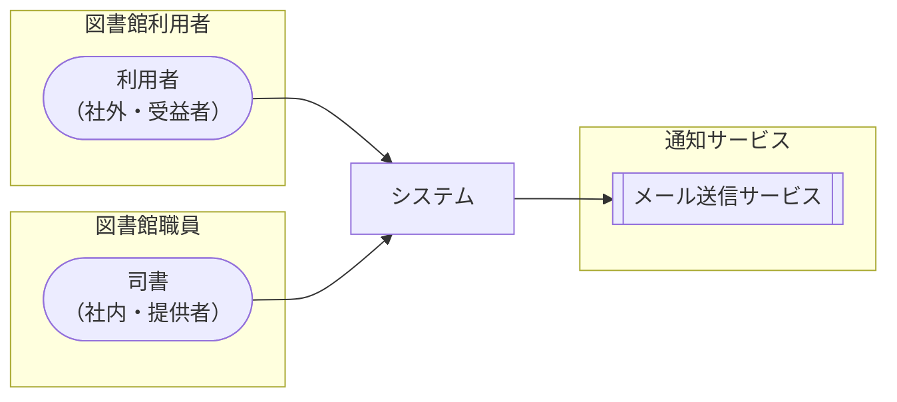

<!-- generateRdraMd.js による自動生成ファイル。手動編集しないこと。元データ: docs/rdra/latest/*.tsv -->

# システムコンテキスト

RDRA システム価値レイヤー。システムに関わるアクターと外部システムの全体像。

> 凡例: `(丸角)` アクター / `[四角]` システム / `[[二重枠]]` 外部システム

## アクター

| アクター群 | アクター | 役割 | 社内外 | 立場 | 主担当業務 |
|---|---|---|---|---|---|
| 図書館利用者 | 利用者 | 書籍の検索・貸出・返却・予約を行い、自身の貸出履歴や予約状況を確認する | 社外 | 受益者 |  |
| 図書館職員 | 司書 | 蔵書の登録・管理、利用者管理、在庫状況確認、統計レポートの閲覧を行う | 社内 | 提供者 | 蔵書管理フロー |

## 外部システム

| 外部システム群 | 外部システム | 役割 |
|---|---|---|
| 通知サービス | メール送信サービス | 貸出期限リマインドや延滞督促通知を利用者にメールで送信する |
