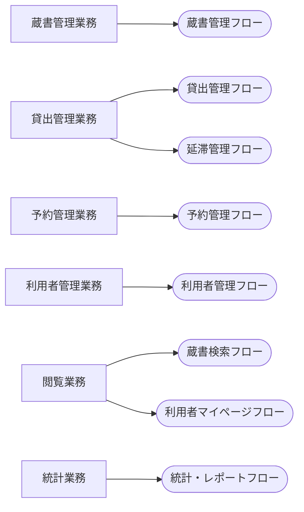

<!-- generateRdraMd.js による自動生成ファイル。手動編集しないこと。元データ: docs/rdra/latest/*.tsv -->

# 業務構成

RDRA システム外部環境レイヤー。業務とビジネスユースケース（BUC）の構成。

> 凡例: `[四角]` 業務 / `(丸角)` BUC

## BUC 一覧

| 業務 | BUC | アクティビティ数 | UC 数 |
|---|---|---|---|
| 蔵書管理業務 | 蔵書管理フロー | 3 | 3 |
| 貸出管理業務 | 貸出管理フロー | 3 | 3 |
| 貸出管理業務 | 延滞管理フロー | 2 | 2 |
| 予約管理業務 | 予約管理フロー | 3 | 3 |
| 利用者管理業務 | 利用者管理フロー | 2 | 2 |
| 閲覧業務 | 蔵書検索フロー | 1 | 1 |
| 閲覧業務 | 利用者マイページフロー | 2 | 2 |
| 統計業務 | 統計・レポートフロー | 2 | 2 |
