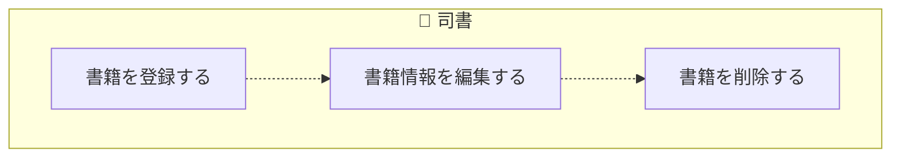
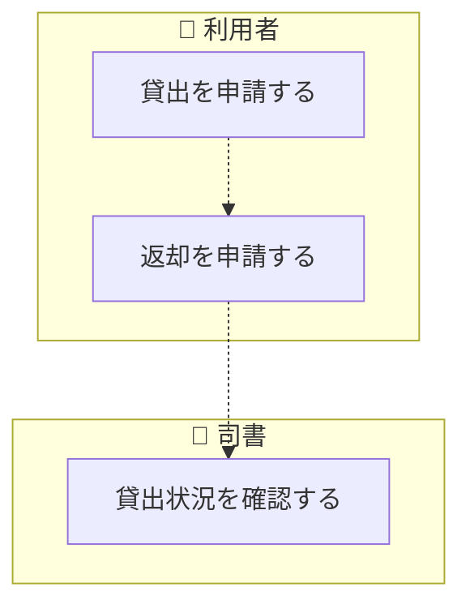
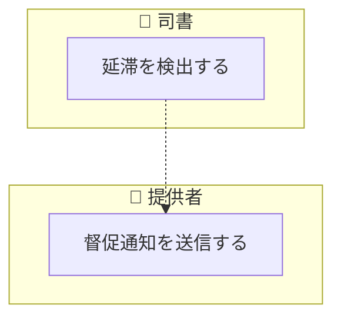
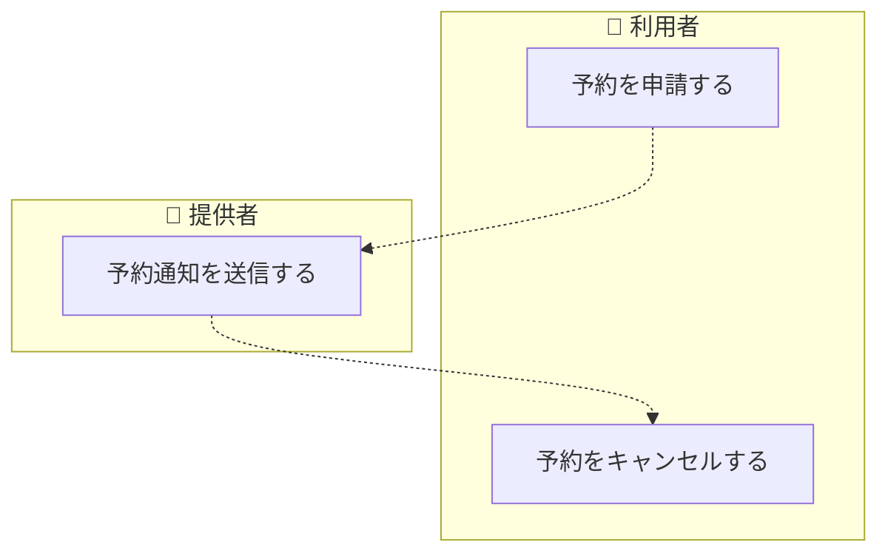
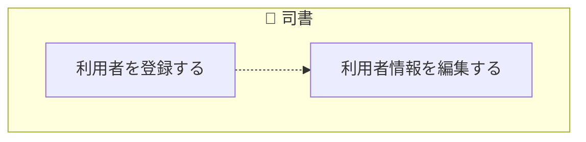
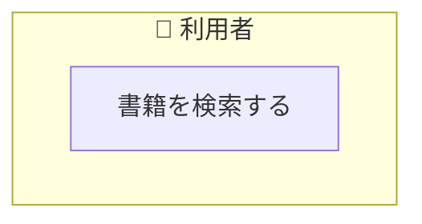
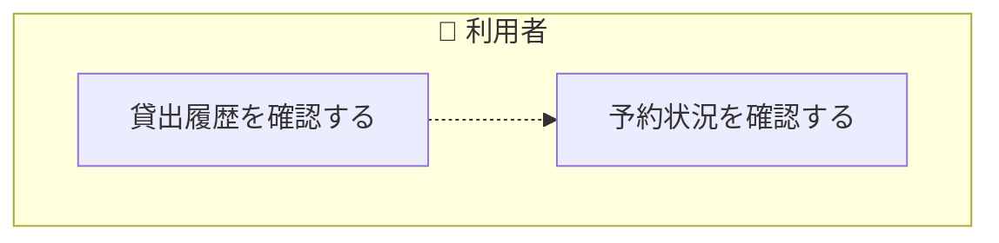
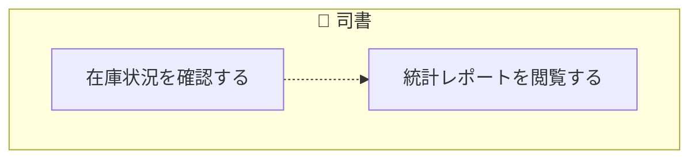

<!-- generateRdraMd.js による自動生成ファイル。手動編集しないこと。元データ: docs/rdra/latest/*.tsv -->

# 業務フロー

RDRA システム外部環境レイヤー。BUC ごとのアクティビティの流れ。
担当（アクター）ごとのレーンに分けて表示する。

## 蔵書管理業務

### 蔵書管理フロー

> 点線矢印は TSV の行順にもとづく推定順序（`先`/`次` 未指定のため）。

| アクティビティ | 担当 | UC | 説明 |
|---|---|---|---|
| 書籍を登録する | 司書 | 書籍を登録する | 新規書籍の情報を入力し蔵書として登録する |
| 書籍情報を編集する | 司書 | 書籍情報を編集する | 既存書籍の情報を修正・更新する |
| 書籍を削除する | 司書 | 書籍を削除する | 不要な書籍を蔵書から除外する |

## 貸出管理業務

### 貸出管理フロー

> 点線矢印は TSV の行順にもとづく推定順序（`先`/`次` 未指定のため）。

| アクティビティ | 担当 | UC | 説明 |
|---|---|---|---|
| 貸出を申請する | 利用者 | 書籍を貸出する | 利用者が書籍の貸出手続きを行う |
| 返却を申請する | 利用者 | 書籍を返却する | 利用者が書籍の返却手続きを行う |
| 貸出状況を確認する | 司書 | 貸出状況を確認する | 司書が貸出中の書籍一覧を確認する |

### 延滞管理フロー

> 点線矢印は TSV の行順にもとづく推定順序（`先`/`次` 未指定のため）。

| アクティビティ | 担当 | UC | 説明 |
|---|---|---|---|
| 延滞を検出する | 司書 | 延滞を検出する | 返却期限超過の貸出を自動検出する |
| 督促通知を送信する | 提供者 | 督促通知を送信する | 延滞者にメールで督促通知を自動送信する |

## 予約管理業務

### 予約管理フロー

> 点線矢印は TSV の行順にもとづく推定順序（`先`/`次` 未指定のため）。

| アクティビティ | 担当 | UC | 説明 |
|---|---|---|---|
| 予約を申請する | 利用者 | 書籍を予約する | 貸出中書籍への予約手続きを行う |
| 予約通知を送信する | 提供者 | 予約通知を送信する | 予約書籍が返却された際に予約者へ通知する |
| 予約をキャンセルする | 利用者 | 予約をキャンセルする | 利用者が予約を取り消す |

## 利用者管理業務

### 利用者管理フロー

> 点線矢印は TSV の行順にもとづく推定順序（`先`/`次` 未指定のため）。

| アクティビティ | 担当 | UC | 説明 |
|---|---|---|---|
| 利用者を登録する | 司書 | 利用者を登録する | 新規利用者の情報を入力し登録する |
| 利用者情報を編集する | 司書 | 利用者情報を編集する | 既存利用者の情報を修正・更新する |

## 閲覧業務

### 蔵書検索フロー

| アクティビティ | 担当 | UC | 説明 |
|---|---|---|---|
| 書籍を検索する | 利用者 | 書籍を検索する | キーワードやジャンル等の条件で書籍を検索する |

### 利用者マイページフロー

> 点線矢印は TSV の行順にもとづく推定順序（`先`/`次` 未指定のため）。

| アクティビティ | 担当 | UC | 説明 |
|---|---|---|---|
| 貸出履歴を確認する | 利用者 | 貸出履歴を確認する | 自分の過去と現在の貸出一覧を確認する |
| 予約状況を確認する | 利用者 | 予約状況を確認する | 自分の現在の予約一覧と予約順を確認する |

## 統計業務

### 統計・レポートフロー

> 点線矢印は TSV の行順にもとづく推定順序（`先`/`次` 未指定のため）。

| アクティビティ | 担当 | UC | 説明 |
|---|---|---|---|
| 在庫状況を確認する | 司書 | 在庫状況を確認する | 全書籍の在庫状態を一覧で確認する |
| 統計レポートを閲覧する | 司書 | 統計レポートを閲覧する | 貸出回数ランキングや期間別統計を確認する |
