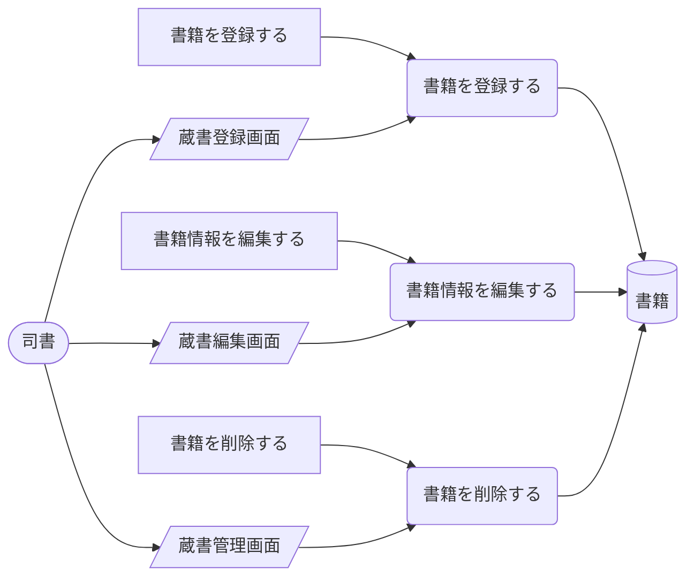
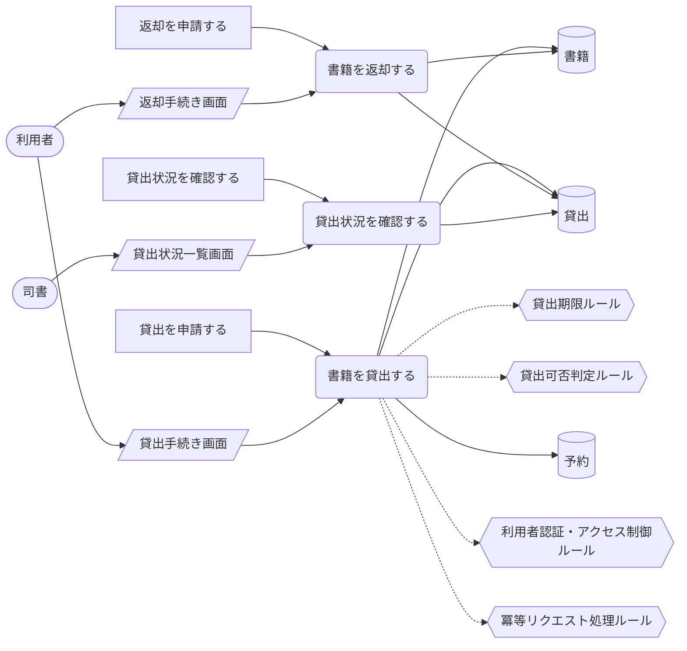
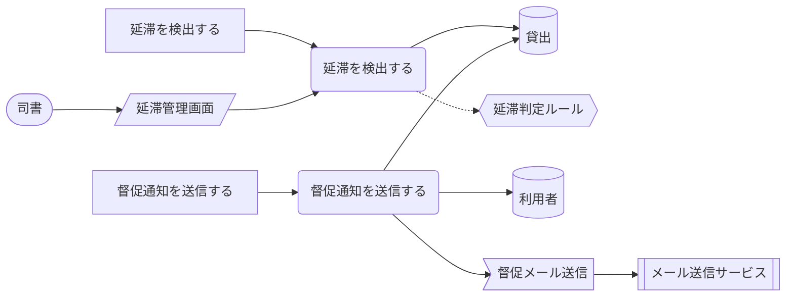
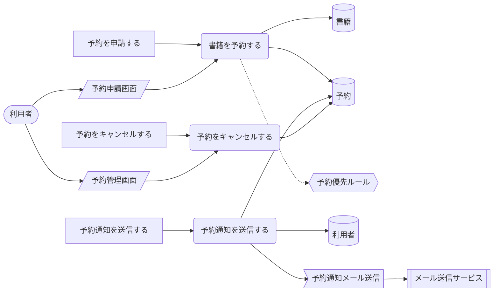
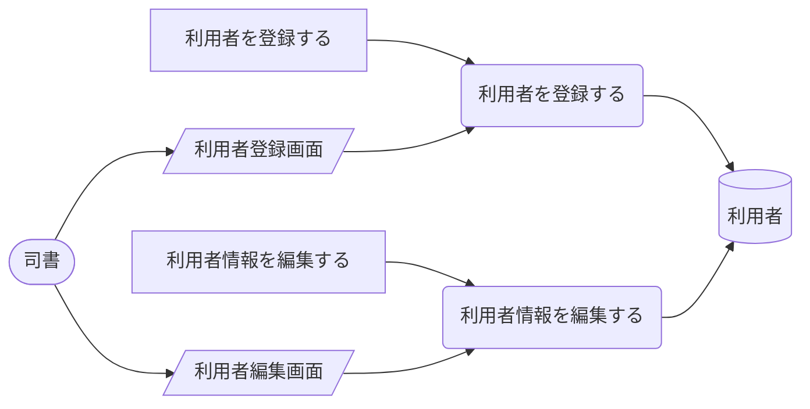
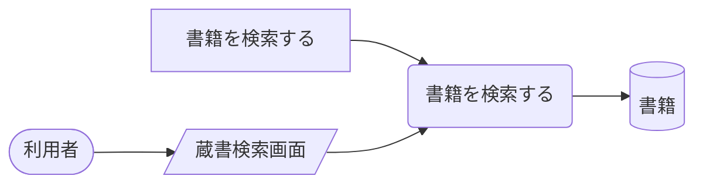
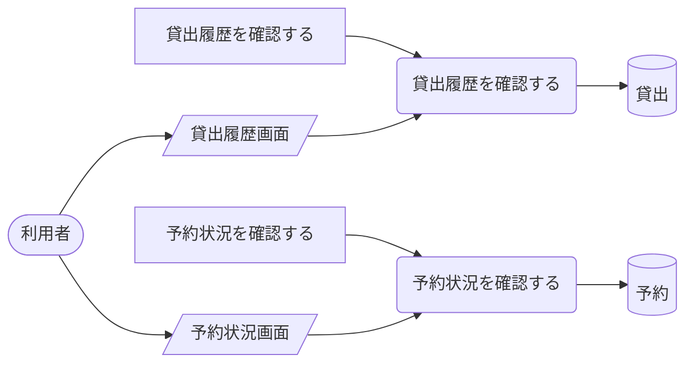
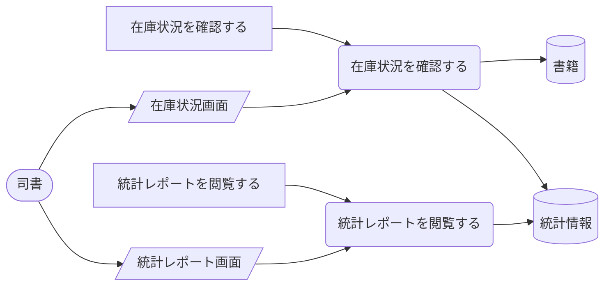

<!-- generateRdraMd.js による自動生成ファイル。手動編集しないこと。元データ: docs/rdra/latest/*.tsv -->

# UC複合図

RDRA システム境界レイヤー。BUC ごとに、アクティビティ・UC・画面・イベント・
情報・条件・外部システムの関係を表す。

## 蔵書管理業務

### 蔵書管理フロー

> 凡例: `(丸角)` アクター・UC / `[四角]` アクティビティ / `[/斜め/]` 画面 / `[(円柱)]` 情報 / `{{六角}}` 条件 / `>旗]` イベント / `[[二重枠]]` 外部システム。点線は条件参照。

| UC | アクティビティ | 画面 | 情報 | 条件 | イベント | 説明 |
|---|---|---|---|---|---|---|
| 書籍を登録する | 書籍を登録する | 蔵書登録画面 | 書籍 |  |  | 新規書籍の情報を入力し蔵書として登録する |
| 書籍情報を編集する | 書籍情報を編集する | 蔵書編集画面 | 書籍 |  |  | 既存書籍の情報を修正・更新する |
| 書籍を削除する | 書籍を削除する | 蔵書管理画面 | 書籍 |  |  | 不要な書籍を蔵書から除外する |

## 貸出管理業務

### 貸出管理フロー

> 凡例: `(丸角)` アクター・UC / `[四角]` アクティビティ / `[/斜め/]` 画面 / `[(円柱)]` 情報 / `{{六角}}` 条件 / `>旗]` イベント / `[[二重枠]]` 外部システム。点線は条件参照。

| UC | アクティビティ | 画面 | 情報 | 条件 | イベント | 説明 |
|---|---|---|---|---|---|---|
| 書籍を貸出する | 貸出を申請する | 貸出手続き画面 | 書籍、貸出、予約 | 貸出期限ルール、貸出可否判定ルール、利用者認証・アクセス制御ルール、冪等リクエスト処理ルール |  | 利用者が書籍の貸出手続きを行う |
| 書籍を返却する | 返却を申請する | 返却手続き画面 | 書籍、貸出 |  |  | 利用者が書籍の返却手続きを行う |
| 貸出状況を確認する | 貸出状況を確認する | 貸出状況一覧画面 | 貸出 |  |  | 司書が貸出中の書籍一覧を確認する |

### 延滞管理フロー

> 凡例: `(丸角)` アクター・UC / `[四角]` アクティビティ / `[/斜め/]` 画面 / `[(円柱)]` 情報 / `{{六角}}` 条件 / `>旗]` イベント / `[[二重枠]]` 外部システム。点線は条件参照。

| UC | アクティビティ | 画面 | 情報 | 条件 | イベント | 説明 |
|---|---|---|---|---|---|---|
| 延滞を検出する | 延滞を検出する | 延滞管理画面 | 貸出 | 延滞判定ルール |  | 返却期限超過の貸出を自動検出する |
| 督促通知を送信する | 督促通知を送信する |  | 貸出、利用者 |  | 督促メール送信 | 延滞者にメールで督促通知を自動送信する |

## 予約管理業務

### 予約管理フロー

> 凡例: `(丸角)` アクター・UC / `[四角]` アクティビティ / `[/斜め/]` 画面 / `[(円柱)]` 情報 / `{{六角}}` 条件 / `>旗]` イベント / `[[二重枠]]` 外部システム。点線は条件参照。

| UC | アクティビティ | 画面 | 情報 | 条件 | イベント | 説明 |
|---|---|---|---|---|---|---|
| 書籍を予約する | 予約を申請する | 予約申請画面 | 書籍、予約 | 予約優先ルール |  | 貸出中書籍への予約手続きを行う |
| 予約通知を送信する | 予約通知を送信する |  | 予約、利用者 |  | 予約通知メール送信 | 予約書籍が返却された際に予約者へ通知する |
| 予約をキャンセルする | 予約をキャンセルする | 予約管理画面 | 予約 |  |  | 利用者が予約を取り消す |

## 利用者管理業務

### 利用者管理フロー

> 凡例: `(丸角)` アクター・UC / `[四角]` アクティビティ / `[/斜め/]` 画面 / `[(円柱)]` 情報 / `{{六角}}` 条件 / `>旗]` イベント / `[[二重枠]]` 外部システム。点線は条件参照。

| UC | アクティビティ | 画面 | 情報 | 条件 | イベント | 説明 |
|---|---|---|---|---|---|---|
| 利用者を登録する | 利用者を登録する | 利用者登録画面 | 利用者 |  |  | 新規利用者の情報を入力し登録する |
| 利用者情報を編集する | 利用者情報を編集する | 利用者編集画面 | 利用者 |  |  | 既存利用者の情報を修正・更新する |

## 閲覧業務

### 蔵書検索フロー

> 凡例: `(丸角)` アクター・UC / `[四角]` アクティビティ / `[/斜め/]` 画面 / `[(円柱)]` 情報 / `{{六角}}` 条件 / `>旗]` イベント / `[[二重枠]]` 外部システム。点線は条件参照。

| UC | アクティビティ | 画面 | 情報 | 条件 | イベント | 説明 |
|---|---|---|---|---|---|---|
| 書籍を検索する | 書籍を検索する | 蔵書検索画面 | 書籍 |  |  | キーワードやジャンル等の条件で書籍を検索する |

### 利用者マイページフロー

> 凡例: `(丸角)` アクター・UC / `[四角]` アクティビティ / `[/斜め/]` 画面 / `[(円柱)]` 情報 / `{{六角}}` 条件 / `>旗]` イベント / `[[二重枠]]` 外部システム。点線は条件参照。

| UC | アクティビティ | 画面 | 情報 | 条件 | イベント | 説明 |
|---|---|---|---|---|---|---|
| 貸出履歴を確認する | 貸出履歴を確認する | 貸出履歴画面 | 貸出 |  |  | 自分の過去と現在の貸出一覧を確認する |
| 予約状況を確認する | 予約状況を確認する | 予約状況画面 | 予約 |  |  | 自分の現在の予約一覧と予約順を確認する |

## 統計業務

### 統計・レポートフロー

> 凡例: `(丸角)` アクター・UC / `[四角]` アクティビティ / `[/斜め/]` 画面 / `[(円柱)]` 情報 / `{{六角}}` 条件 / `>旗]` イベント / `[[二重枠]]` 外部システム。点線は条件参照。

| UC | アクティビティ | 画面 | 情報 | 条件 | イベント | 説明 |
|---|---|---|---|---|---|---|
| 在庫状況を確認する | 在庫状況を確認する | 在庫状況画面 | 書籍、統計情報 |  |  | 全書籍の在庫状態を一覧で確認する |
| 統計レポートを閲覧する | 統計レポートを閲覧する | 統計レポート画面 | 統計情報 |  |  | 貸出回数ランキングや期間別統計を確認する |
