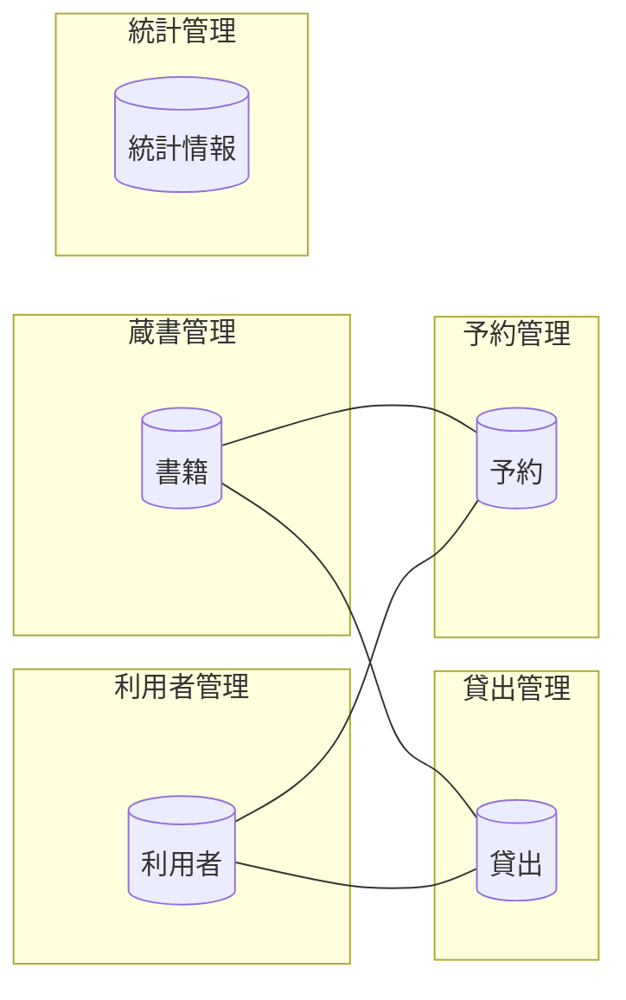

<!-- generateRdraMd.js による自動生成ファイル。手動編集しないこと。元データ: docs/rdra/latest/*.tsv -->

# 情報モデル

RDRA システム内部レイヤー。コンテキストごとの情報と情報間の関連。

> 凡例: `[(円柱)]` 情報 / `[四角]` 情報.tsv 未定義の参照。実線は関連情報。

## 情報一覧

| コンテキスト | 情報 | 属性 | 状態モデル | バリエーション | 説明 |
|---|---|---|---|---|---|
| 蔵書管理 | 書籍 | 書籍ID、タイトル、著者、ISBN、出版社、ジャンル、資料種別、配架場所 | 書籍貸出状態 | 資料種別、書籍ジャンル | 図書館が所蔵する書籍の基本情報 |
| 利用者管理 | 利用者 | 利用者番号、氏名、連絡先、メールアドレス、利用者種別、登録日 |  | 利用者種別 | 図書館の利用者情報 |
| 貸出管理 | 貸出 | 貸出ID、貸出日、返却期限、返却日、延滞フラグ |  |  | 書籍の貸出記録 |
| 予約管理 | 予約 | 予約ID、予約日、予約順、予約状態 | 予約状態 |  | 貸出中書籍への予約情報 |
| 統計管理 | 統計情報 | 集計期間、貸出回数、人気書籍ランキング |  |  | 貸出データから集計した統計レポート用データ |
