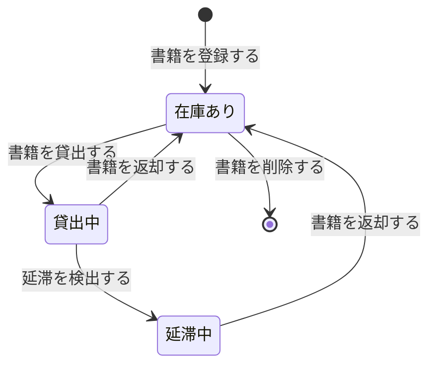
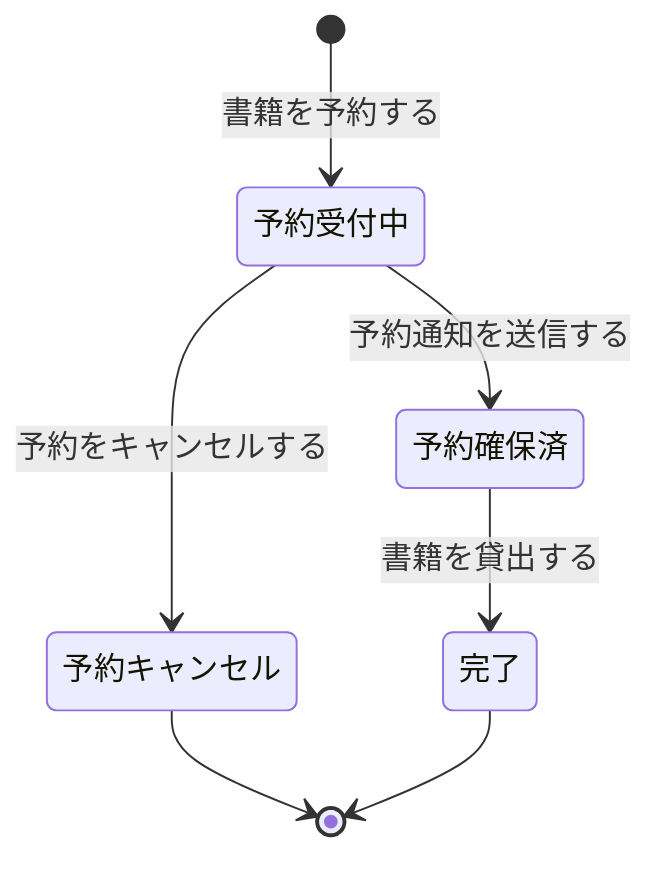

<!-- generateRdraMd.js による自動生成ファイル。手動編集しないこと。元データ: docs/rdra/latest/*.tsv -->

# 状態モデル

RDRA システム内部レイヤー。状態モデルごとの状態遷移。遷移ラベルは UC。

## 書籍貸出状態（蔵書管理）

| 状態 | 遷移UC | 遷移先状態 | 説明 |
|---|---|---|---|
|  | 書籍を登録する | 在庫あり | 書籍が登録されると在庫あり状態になる |
| 在庫あり | 書籍を貸出する | 貸出中 | 利用者が書籍を貸出すると貸出中になる |
| 貸出中 | 延滞を検出する | 延滞中 | 返却期限を超過すると延滞中になる |
| 貸出中 | 書籍を返却する | 在庫あり | 利用者が書籍を返却すると在庫ありに戻る |
| 延滞中 | 書籍を返却する | 在庫あり | 延滞書籍が返却されると在庫ありに戻る |
| 在庫あり | 書籍を削除する |  | 書籍が除籍されると終了 |

## 予約状態（予約管理）

| 状態 | 遷移UC | 遷移先状態 | 説明 |
|---|---|---|---|
|  | 書籍を予約する | 予約受付中 | 利用者が予約を申請すると予約受付中になる |
| 予約受付中 | 予約通知を送信する | 予約確保済 | 予約書籍が返却され予約者に確保される |
| 予約受付中 | 予約をキャンセルする | 予約キャンセル | 利用者が予約をキャンセルする |
| 予約確保済 | 書籍を貸出する | 完了 | 予約者本人が貸出手続きを完了すると予約が完了状態に遷移する |
| 予約キャンセル |  |  | 予約キャンセルで終了 |
| 完了 |  |  | 予約が完了すると終了。予約レコードは履歴として保持される |
