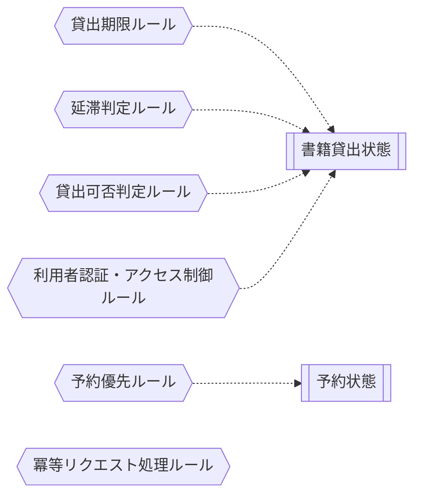

<!-- generateRdraMd.js による自動生成ファイル。手動編集しないこと。元データ: docs/rdra/latest/*.tsv -->

# 条件・バリエーション

RDRA システム内部レイヤー。判断条件（ビジネスルール）と区分・種別の一覧。

## 条件（ビジネスルール）

> 凡例: `{{六角}}` 条件 / `[[二重枠]]` 状態モデル / `[/斜め/]` バリエーション

| コンテキスト | 条件 | 条件の説明 | バリエーション | 状態モデル |
|---|---|---|---|---|
| 貸出管理 | 貸出期限ルール | 貸出日から一定期間を返却期限として設定する |  | 書籍貸出状態 |
| 貸出管理 | 延滞判定ルール | 返却期限を超過した貸出を延滞として判定する |  | 書籍貸出状態 |
| 予約管理 | 予約優先ルール | 同一書籍への予約は申込日時順に優先される |  | 予約状態 |
| 貸出管理 | 貸出可否判定ルール | その書籍に対する予約受付中の予約がない場合に貸出可能。ただし予約者本人（予約確保済）の場合は貸出可能とする |  | 書籍貸出状態 |
| 貸出管理 | 利用者認証・アクセス制御ルール | 状態変更を伴うAPIは、利用者ID受け渡し用の認証ヘッダ（暫定: X-User-Id）により呼び出し元利用者を識別し、ロール（claim）に基づくアクセス制御（RBAC）を行う。認証ヘッダの欠落・不正時は401エラー（RFC 7807形式）を返す |  | 書籍貸出状態 |
| 貸出管理 | 冪等リクエスト処理ルール | 冪等キー（Idempotency-Key）が重複したリクエストは、対象APIのエラー応答仕様（tier-*.md のエラー表）を優先して判定する。全API共通のキャッシュ済みレスポンス再送は行わない |  |  |

## バリエーション

| コンテキスト | バリエーション | 値 | 説明 |
|---|---|---|---|
| 蔵書管理 | 資料種別 | 紙書籍、電子書籍 | 書籍の形態を区分する。将来的に電子書籍にも対応するための区分。API連携時は英語識別子（x-enum-varnames）を持つ |
| 蔵書管理 | 書籍ジャンル | 文学、理工、児童書、社会科学、自然科学、芸術、その他 | 書籍を分類するためのカテゴリ。API連携時は英語識別子（x-enum-varnames）を持つ |
| 利用者管理 | 利用者種別 | 一般、学生、児童 | 利用者の区分。貸出条件が異なる可能性がある |
