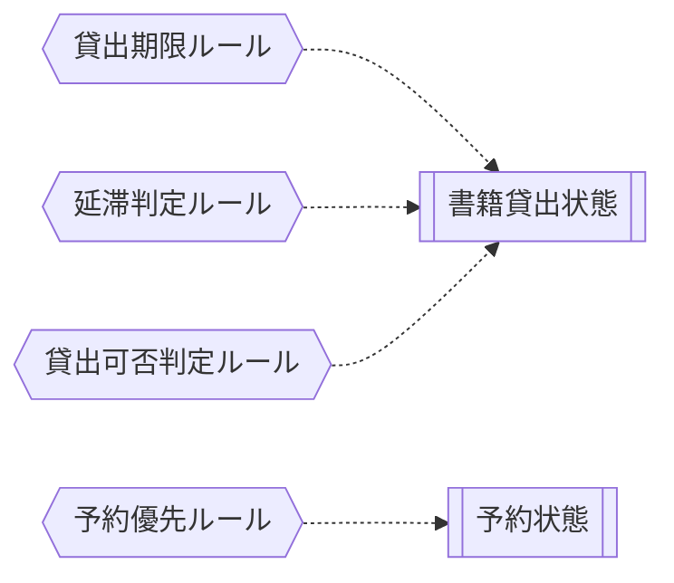

<!-- generateRdraMd.js による自動生成ファイル。手動編集しないこと。元データ: docs/rdra/latest/*.tsv -->

# 条件・バリエーション

RDRA システム内部レイヤー。判断条件（ビジネスルール）と区分・種別の一覧。

## 条件（ビジネスルール）

> 凡例: `{{六角}}` 条件 / `[[二重枠]]` 状態モデル / `[/斜め/]` バリエーション

| コンテキスト | 条件 | 条件の説明 | バリエーション | 状態モデル |
|---|---|---|---|---|
| 貸出管理 | 貸出期限ルール | 貸出日から一定期間を返却期限として設定する |  | 書籍貸出状態 |
| 貸出管理 | 延滞判定ルール | 返却期限を超過した貸出を延滞として判定する |  | 書籍貸出状態 |
| 予約管理 | 予約優先ルール | 同一書籍への予約は申込日時順に優先される |  | 予約状態 |
| 貸出管理 | 貸出可否判定ルール | 書籍が在庫ありかつ予約がない場合に貸出可能とする |  | 書籍貸出状態 |

## バリエーション

| コンテキスト | バリエーション | 値 | 説明 |
|---|---|---|---|
| 蔵書管理 | 資料種別 | 紙書籍、電子書籍 | 書籍の形態を区分する。将来的に電子書籍にも対応するための区分 |
| 蔵書管理 | 書籍ジャンル | 文学、理工、児童書、社会科学、自然科学、芸術、その他 | 書籍を分類するためのカテゴリ |
| 利用者管理 | 利用者種別 | 一般、学生、児童 | 利用者の区分。貸出条件が異なる可能性がある |
