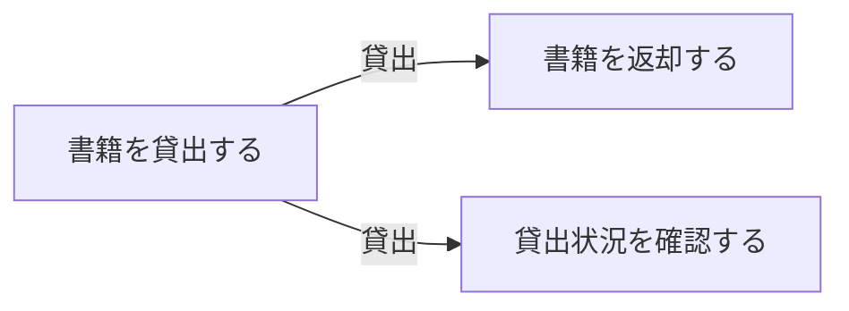
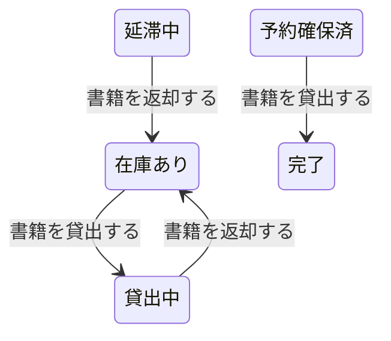

# 貸出管理フロー

## 概要

貸出管理業務における貸出管理フローの俯瞰仕様。所属 UC 間のデータフロー、状態遷移の全体像を示す。

## 所属 UC 一覧

| UC名 | アクター | 主な操作 | 関連情報 |
|------|---------|---------|---------|
| [書籍を貸出する](書籍を貸出する/spec.md) | 利用者 | 書籍の貸出手続き | 書籍, 貸出 |
| [書籍を返却する](書籍を返却する/spec.md) | 利用者 | 書籍の返却手続き | 書籍, 貸出 |
| [貸出状況を確認する](貸出状況を確認する/spec.md) | 司書 | 貸出中書籍の一覧確認 | 貸出 |

## UC 横断データフロー

### データフロー図

### 情報 CRUD マトリクス

| 情報名 | 書籍を貸出する | 書籍を返却する | 貸出状況を確認する |
|--------|:---:|:---:|:---:|
| 書籍 | RU | RU | R |
| 貸出 | C | U | R |
| 予約 | RU | - | - |

## 状態遷移全体図

### 状態遷移 UC マッピング

| 状態モデル | 遷移元 | 遷移先 | 担当 UC |
|-----------|--------|--------|---------|
| 書籍貸出状態 | 在庫あり | 貸出中 | 書籍を貸出する |
| 書籍貸出状態 | 貸出中 | 在庫あり | 書籍を返却する |
| 書籍貸出状態 | 延滞中 | 在庫あり | 書籍を返却する |
| 予約状態 | 予約確保済 | 完了 | 書籍を貸出する（予約者本人による貸出成立時。予約状態モデル自体は予約管理業務/予約管理フロー BUC が所有するが、この遷移のトリガー UC は本 BUC 内の「書籍を貸出する」のため俯瞰のため記載） |

## BUC 内共有条件一覧

| 条件名 | 説明 | 適用 UC |
|--------|------|--------|
| 貸出期限ルール | 貸出日から14日間を返却期限として設定 | 書籍を貸出する |
| 貸出可否判定ルール | その書籍に対する予約受付中の予約がない場合に貸出可能。ただし予約者本人（予約確保済）の場合は貸出可能とする | 書籍を貸出する |
| 利用者認証・アクセス制御ルール | 状態変更を伴うAPIは、利用者ID受け渡し用の認証ヘッダ（暫定: X-User-Id）により呼び出し元利用者を識別し、ロール（claim）に基づくアクセス制御（RBAC）を行う。認証ヘッダの欠落・不正時は401エラー（RFC 7807形式）を返す | 書籍を貸出する |
| 冪等リクエスト処理ルール | 冪等キー（Idempotency-Key）が重複したリクエストは、対象APIのエラー応答仕様（tier-*.md のエラー表）を優先して判定する。全API共通のキャッシュ済みレスポンス再送は行わない | 書籍を貸出する |

## BUC 内共有バリエーション一覧

この BUC に関連する RDRA 定義バリエーションはない。
