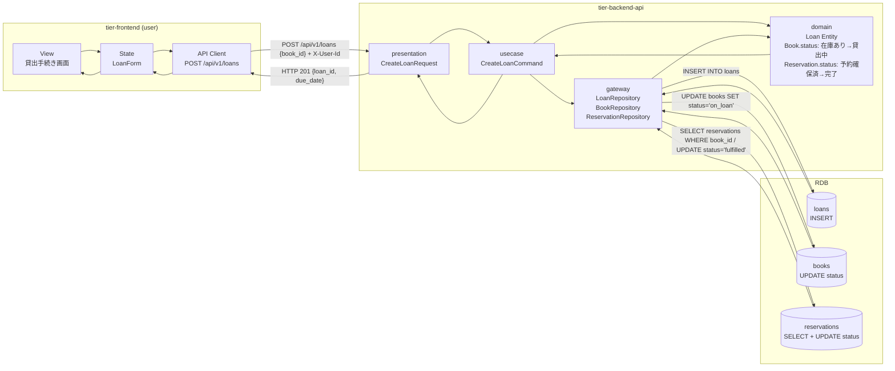
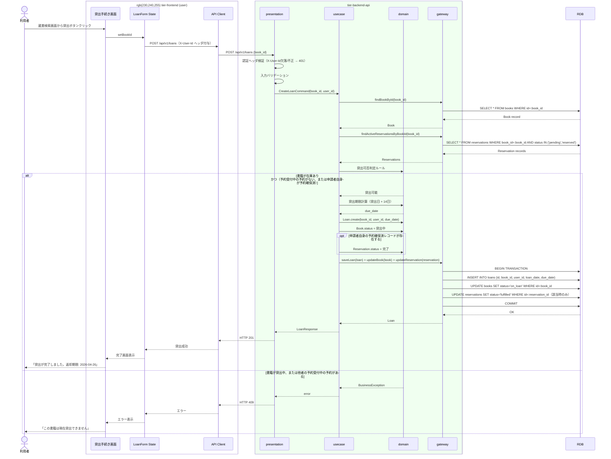

# 書籍を貸出する

## 概要

利用者が書籍の貸出手続きを行う。貸出可否判定ルール（在庫あり・予約なし。ただし予約者本人の場合は例外）を適用し、貸出期限ルールに基づいて返却期限を設定する。貸出完了時に書籍の状態が「在庫あり」から「貸出中」に遷移する。予約確保済の予約者本人が貸出した場合は、対応する予約レコードを完了状態に更新する。

## データフロー



| レイヤー | データモデル | 変換内容 |
|---------|------------|---------|
| FE View | 書籍情報表示 + 貸出ボタン | BookCard で書籍情報表示、ボタンクリック → API |
| BE presentation | CreateLoanRequest(book_id) | user_id は認証ヘッダ（X-User-Id）から取得。バリデーション + Command |
| BE domain | Loan.create + Book.status 遷移 + Reservation.status 遷移（該当時） | 貸出可否判定（予約参照含む） + 貸出期限計算 + 状態遷移 |
| BE gateway | INSERT loans + UPDATE books + SELECT/UPDATE reservations | トランザクション内でテーブル更新 |
| Response | LoanResponse(loan_id, book_title, due_date) | 貸出完了・返却期限表示 |

## 処理フロー



## バリエーション一覧

| バリエーション名 | 値 | 処理内容 | 適用 tier | 適用箇所 |
|----------------|---|---------|----------|---------|
| 利用者種別 | 一般 | 貸出期限14日 | tier-backend-api | 貸出期限計算 |
| 利用者種別 | 学生 | 貸出期限14日 | tier-backend-api | 貸出期限計算 |
| 利用者種別 | 児童 | 貸出期限14日 | tier-backend-api | 貸出期限計算 |

## 分岐条件一覧

| 条件名 | 判定ルール | 適用 tier | 適用箇所 | BDD Scenario |
|--------|----------|----------|---------|-------------|
| 貸出可否判定ルール | その書籍に対する予約受付中の予約がない場合に貸出可能。ただし予約者本人（予約確保済）の場合は貸出可能とする | tier-backend-api | CreateLoanCommand | 貸出可能な書籍の貸出 / 予約確保済書籍の貸出 / 貸出不可書籍の拒否 / 他者の予約がある書籍の貸出拒否 |
| 貸出期限ルール | 貸出日から14日間を返却期限として設定 | tier-backend-api | Loan.create | 正常な貸出 |
| 利用者認証・アクセス制御ルール | 状態変更を伴うAPIは、利用者ID受け渡し用の認証ヘッダ（暫定: X-User-Id）により呼び出し元利用者を識別し、ロール（claim）に基づくアクセス制御（RBAC）を行う。認証ヘッダの欠落・不正時は401エラー（RFC 7807形式）を返す | tier-backend-api | POST /api/v1/loans | 認証ヘッダ欠落時のアクセス拒否 |
| 冪等リクエスト処理ルール | 冪等キー（Idempotency-Key）が重複したリクエストは、対象APIのエラー応答仕様（tier-*.md のエラー表）を優先して判定する。全API共通のキャッシュ済みレスポンス再送は行わない | tier-backend-api | CreateLoanCommand | 冪等キー重複での二重貸出防止 |

## 計算ルール一覧

| 計算名 | 入力情報 | 計算式/ロジック | 出力情報 | 適用 tier |
|--------|---------|---------------|---------|----------|
| 返却期限計算 | 貸出日（現在日） | 貸出日 + 14日 | 返却期限 | tier-backend-api |

## 状態遷移一覧

| 状態モデル | 遷移元 | 遷移先 | トリガー | 事前条件 | 事後処理 | 適用 tier |
|-----------|--------|--------|---------|---------|---------|----------|
| 書籍貸出状態 | 在庫あり | 貸出中 | 書籍を貸出する | 貸出可否判定ルールが真 | loans テーブルにレコード作成 | tier-backend-api |
| 予約状態 | 予約確保済 | 完了 | 書籍を貸出する（予約者本人による） | 予約確保済の予約者本人がこの書籍を貸出 | 予約レコードを完了（fulfilled）に更新。予約は履歴として保持される | tier-backend-api |

## 関連 RDRA モデル

| モデル種別 | 要素名 | 関連 |
|-----------|--------|------|
| 業務 | 貸出管理業務 | このUCが属する業務 |
| BUC | 貸出管理フロー | このUCを含むBUC |
| アクター | 利用者 | 操作するアクター |
| 情報 | 書籍 | 貸出対象の書籍 |
| 情報 | 貸出 | 作成する貸出記録 |
| 情報 | 予約 | 予約者本人による貸出可否判定のため、対象書籍の予約情報（予約受付中・予約確保済）を参照する |
| 条件 | 貸出期限ルール | 返却期限の設定 |
| 条件 | 貸出可否判定ルール | 貸出可否の判定（予約者本人の例外を含む） |
| 条件 | 利用者認証・アクセス制御ルール | 状態変更APIの認証ヘッダ・RBAC・401応答 |
| 条件 | 冪等リクエスト処理ルール | 冪等キー重複時の判定はエラー応答仕様（tier-*.md）を優先 |
| 状態 | 書籍貸出状態 | 在庫あり → 貸出中 |
| 状態 | 予約状態 | 予約確保済 → 完了 |

## E2E 完了条件（BDD）

### 正常系

```gherkin
Feature: 書籍を貸出する

  Scenario: 貸出可能な書籍の貸出
    Given 利用者「田中太郎」がログイン済み
    And 「在庫あり」状態で予約なしの書籍「吾輩は猫である」が存在する
    When 貸出手続き画面で「吾輩は猫である」の「貸出する」ボタンをクリックする
    Then 「貸出が完了しました。返却期限: 2026-04-26」が表示される
    And 書籍「吾輩は猫である」の状態が「貸出中」に変わる

  Scenario: 予約確保済書籍の貸出
    Given 利用者「田中太郎」がログイン済み
    And 利用者「田中太郎」の予約が「予約確保済」の書籍「こころ」が存在する
    When 貸出手続き画面で「こころ」の「貸出する」ボタンをクリックする
    Then 「貸出が完了しました。返却期限: 2026-04-26」が表示される
```

（本UCの画面には予約状態を表示する要素がないため、E2Eシナリオの検証対象は貸出完了メッセージの表示に限定する。予約レコードが完了（fulfilled）状態に更新されたことの検証は、DBレベルで観測可能な `tier-backend-api.md` の Scenario「予約確保済本人による貸出で予約が完了状態に更新される」に委ねる）

### 異常系

```gherkin
  Scenario: 貸出中書籍の貸出拒否
    Given 利用者「田中太郎」がログイン済み
    And 「貸出中」状態の書籍「坊っちゃん」が存在する
    When 書籍「坊っちゃん」の貸出を試みる
    Then 「この書籍は現在貸出できません」エラーが表示される

  Scenario: 他者の予約がある書籍の貸出拒否
    Given 利用者「田中太郎」がログイン済み
    And 「在庫あり」状態だが利用者「佐藤次郎」の予約がある書籍「三四郎」が存在する
    When 利用者「田中太郎」が書籍「三四郎」の貸出を試みる
    Then 「この書籍は現在貸出できません」エラーが表示される

  Scenario: 認証ヘッダ欠落時のアクセス拒否
    Given 利用者がログインしていない、または認証ヘッダ（X-User-Id）が付与されていない
    And 「在庫あり」状態の書籍「三四郎」が存在する
    When POST /api/v1/loans に book_id を送信する
    Then HTTP 401 エラー（RFC 7807形式）が返却される
    And 貸出は成立しない
```

## ティア別仕様

- [フロントエンド](tier-frontend.md)
- [バックエンドAPI](tier-backend-api.md)
