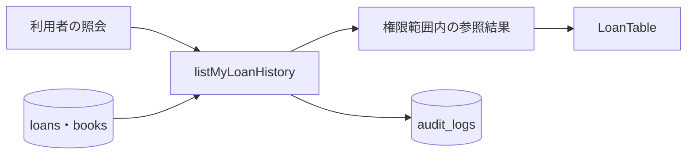
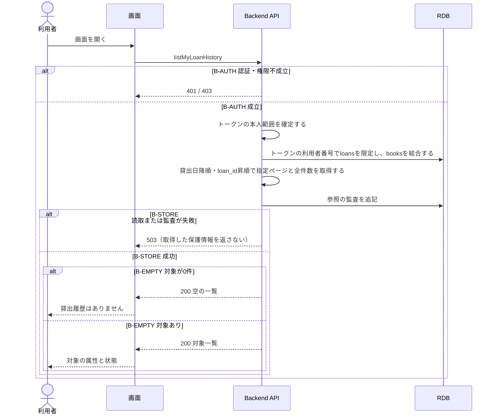

# 貸出履歴を参照する

## 概要

利用者は自分の貸出履歴を開き、書籍ごとの貸出日・返却期限・返却日と現在状態を確認する。

## データフロー



## シーケンス



## 分岐条件の接続

| 分岐ID | 条件の正本 | 行先 |
|---|---|---|
| B-AUTH | [TR-AUTH](../../../_cross-cutting/technical-rules.md#TR-AUTH)、[利用状況閲覧範囲判定](../../../../../../rdra/latest/条件.tsv) | 不成立は401/403、成立は参照処理 |
| B-STORE | [TR-AUDIT](../../../_cross-cutting/technical-rules.md#TR-AUDIT)、[保存境界](tier-backend-api.md#read-transaction) | 失敗は503、成功は確定した参照結果 |
| B-EMPTY | [空結果](tier-backend-api.md#empty-result) | 0件は空状態、それ以外は一覧 |

## 関連 RDRA モデル

| 対象 | 参照 |
|---|---|
| 所属業務・UC | [BUC.tsv](../../../../../../rdra/latest/BUC.tsv)の利用者サービス業務 / 自分の利用状況を確認するフロー / 貸出履歴を参照する |
| 業務条件 | [利用状況閲覧範囲判定](../../../../../../rdra/latest/条件.tsv) |
| 情報 | [情報.tsv](../../../../../../rdra/latest/情報.tsv)の利用者・貸出・予約・書籍 |
| 状態の表示 | [状態.tsv](../../../../../../rdra/latest/状態.tsv)の貸出の状態。参照操作による状態遷移はない |

## E2E完了条件

```gherkin
Feature: 貸出履歴を参照する
  Scenario: 本人の履歴だけを表示する
    Given U1の貸出L1とU2の貸出L2が存在する
    When U1が貸出履歴を開く
    Then 利用者U1のL1だけが表示され、利用者U2のL2は表示されない

  Scenario: 許可されない主体へ情報を返さない
    Given 認証が失効した利用者
    When listMyLoanHistoryを要求する
    Then 401となり本人の履歴を返さない
```

## ティア別仕様

- [画面との接続](tier-frontend-user.md)
- [APIと参照処理](tier-backend-api.md)
