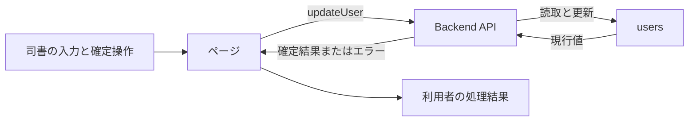
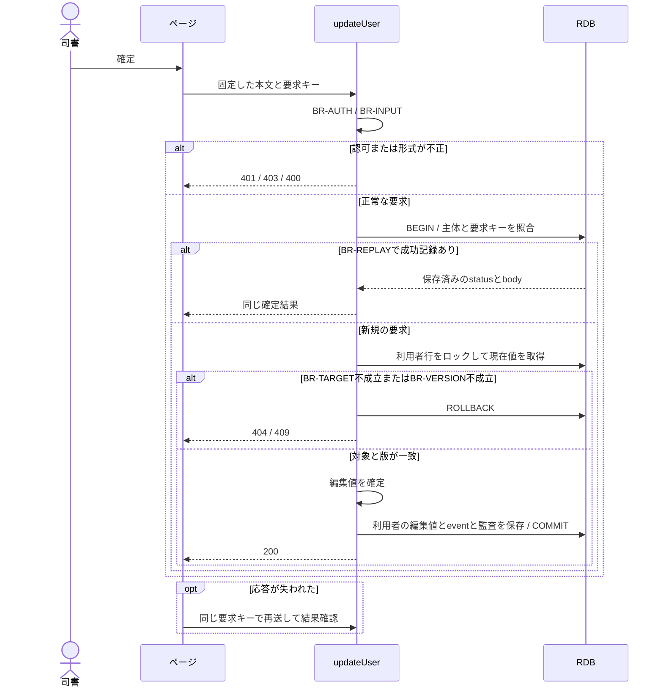

# 利用者を編集する

## 概要

司書が利用者番号に対応する氏名、連絡先、利用者区分を修正する。

## データフロー



## シーケンス



## 分岐の接続

| 分岐ID | 条件の正本 | 成立時 | 不成立時 |
|---|---|---|---|
| BR-AUTH | [TR-AUTH](../../../_cross-cutting/technical-rules.md#tr-auth-認証と参照範囲)とupdateUserの許可ロール | 利用者の更新へ進む | 認証不成立401、許可外403 |
| BR-INPUT | [分割契約](../../../_cross-cutting/api/openapi.yaml)のupdateUser | 対象の確認へ進む | 400 INVALID_INPUT、業務変更なし |
| BR-TARGET | 利用者の識別子が一致しdeleted=false | 対象を処理する | 404 NOT_FOUND、業務変更なし |
| BR-REPLAY | [TR-IDEMP](../../../_cross-cutting/technical-rules.md#tr-idemp-再送と結果の回復) | 同じ要求の成功結果を返す | 未処理は新規実行、異なるhashは409 |
| BR-VERSION | If-Matchが利用者のversionと一致 | 版を更新してcommitする | 409 VERSION_CONFLICT、業務変更なし |

## 状態遷移参照

[情報](../../../../../../rdra/latest/情報.tsv)の「利用者」を参照する。
本UCは貸出と予約の業務状態を変更しない。

永続化対象は[_model-summary.yaml](_model-summary.yaml)の操作を参照する。

## 関連RDRAモデル

| 種類 | 要素の参照先 |
|---|---|
| 情報 | [利用者](../../../../../../rdra/latest/情報.tsv) の「利用者」 |
| 画面 | [利用者編集画面](../../../../../../rdra/latest/BUC.tsv) の「利用者編集画面」 |
| アクター | [司書](../../../../../../rdra/latest/アクター.tsv) |

## E2E完了条件

```gherkin
Feature: 利用者を編集する
  Scenario: 利用者を編集するの業務結果
    Given 利用者U-001のversionが3でメールアドレスが「old@example.com」である
    When メールを「new@example.com」に変更して保存する
    Then 同じ利用者番号のメールが更新され、貸出と予約の参照先はU-001のまま維持される

  Scenario: 利用者を編集するの不成立時
    Given 取得後に別の司書がversionを4へ更新する
    When メールを「new@example.com」に変更して保存する
    Then 古いversionによる保存は409となり、先行更新を上書きしない

  Scenario: 利用者番号と登録日時を維持する
    Given 利用者番号U-001のregistered_atが2026-09-01T01:00:00Zである
    When 2026-09-06T01:00:00Zにメールアドレスを更新する
    Then 利用者番号とregistered_atは維持されupdated_atが2026-09-06T01:00:00Zになる
```

## ティア別仕様

- [tier-frontend-staff](tier-frontend-staff.md)
- [tier-backend-api](tier-backend-api.md)
