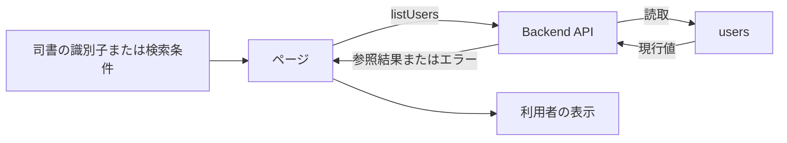
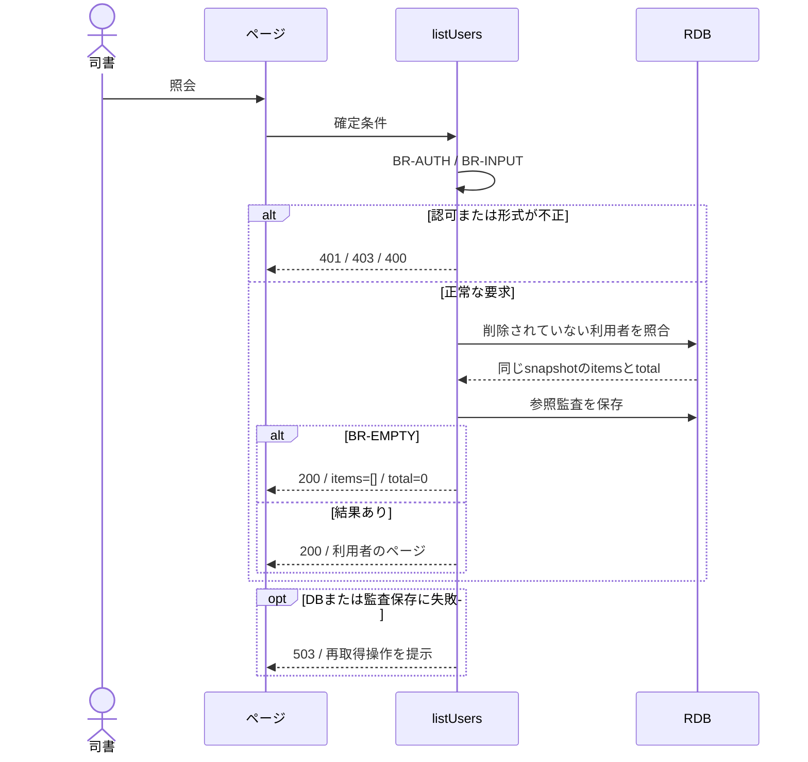

# 利用者一覧を参照する

## 概要

司書が利用者番号、氏名、連絡先を一覧で確認し、編集や利用状況照会の対象を選ぶ。

## データフロー



## シーケンス



## 分岐の接続

| 分岐ID | 条件の正本 | 成立時 | 不成立時 |
|---|---|---|---|
| BR-AUTH | [TR-AUTH](../../../_cross-cutting/technical-rules.md#tr-auth-認証と参照範囲)とlistUsersの許可ロール | 利用者の照会へ進む | 認証不成立401、許可外403 |
| BR-INPUT | [分割契約](../../../_cross-cutting/api/openapi.yaml)のlistUsers | 対象の確認へ進む | 400 INVALID_INPUT、業務変更なし |
| BR-FILTER | Backendの利用者番号と氏名の照合 | 一致する利用者を結果へ含める | 一致しない利用者を除外する |
| BR-EMPTY | 同じ検索条件の総件数が0件 | 200、items=[]、total=0 | 200、指定ページと総件数 |

## 状態遷移参照

[情報](../../../../../../rdra/latest/情報.tsv)の「利用者」を参照する。
本UCは貸出と予約の業務状態を変更しない。

永続化対象は[_model-summary.yaml](_model-summary.yaml)の操作を参照する。

## 関連RDRAモデル

| 種類 | 要素の参照先 |
|---|---|
| 情報 | [利用者](../../../../../../rdra/latest/情報.tsv) の「利用者」 |
| 画面 | [利用者一覧画面](../../../../../../rdra/latest/BUC.tsv) の「利用者一覧画面」 |
| アクター | [司書](../../../../../../rdra/latest/アクター.tsv) |

## E2E完了条件

```gherkin
Feature: 利用者一覧を参照する
  Scenario: 利用者一覧を参照するの業務結果
    Given 利用者U-001「山田花子」とU-002「佐藤太郎」が登録されている
    When 利用者一覧を表示してU-001の利用状況を選択する
    Then U-001を含むルートへ遷移し、選択した利用者の利用状況を照会する

  Scenario: 利用者一覧を参照するの不成立時
    Given 利用者が0件である
    When 利用者一覧を表示してU-001の利用状況を選択する
    Then 空状態が表示され、利用者登録への操作を利用できる

  Scenario: 検索対象の利用者を特定する
    Given U-001の氏名が山田花子でU-002の氏名が佐藤太郎である
    When 利用者番号U-001で検索する
    Then U-001だけが表示され、選択する編集対象もU-001になる
```

## ティア別仕様

- [tier-frontend-staff](tier-frontend-staff.md)
- [tier-backend-api](tier-backend-api.md)
