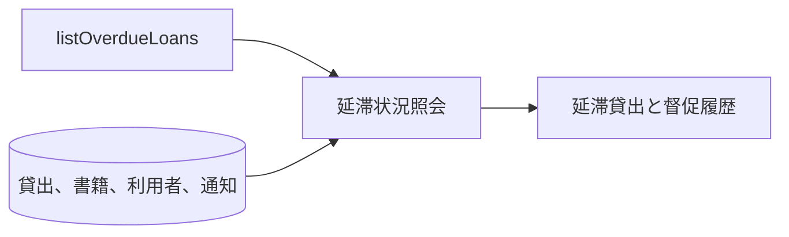
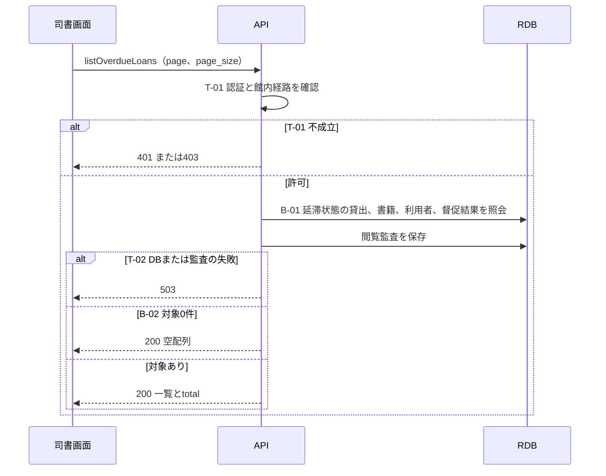

# 延滞一覧を参照する

## 概要

司書が延滞中の貸出と督促の送信結果を一覧で確認する。
利用者を選択して窓口利用状況照会へ進む。

## データフロー



## シーケンス



## 分岐条件の接続

| 分岐ID | 正本 | 結果 |
|---|---|---|
| B-01 | [条件](../../../../../../rdra/latest/条件.tsv)の延滞判定、[状態](../../../../../../rdra/latest/状態.tsv)の貸出の状態 | 延滞状態の貸出を表示し、返却済みを除く |
| B-02 | API仕様の照会条件 | 0件なら200の空一覧 |
| T-01 | [TR-AUTH](../../../_cross-cutting/technical-rules.md#TR-AUTH) | 認証不成立401、権限または経路違反403 |
| T-02 | [TR-AUDIT](../../../_cross-cutting/technical-rules.md#TR-AUDIT) | DBまたは監査失敗は503、部分結果なし |

## 関連 RDRA モデル

| モデル | 要素 | 対応 |
|---|---|---|
| [BUC](../../../../../../rdra/latest/BUC.tsv) | 期限管理業務 / 延滞者に督促するフロー | 所属 |
| [情報](../../../../../../rdra/latest/情報.tsv) | 貸出、書籍、利用者、通知 | 一覧の結合元 |
| [アクター](../../../../../../rdra/latest/アクター.tsv) | 司書 | 閲覧主体 |

## E2E 完了条件（BDD）

```gherkin
Feature: 延滞一覧を参照する
  Scenario: 延滞と督促結果を確認する
    Given L-001が延滞で、最新の督促結果が失敗である
    When 司書が延滞一覧を開く
    Then L-001と対象利用者、返却期限、最終督促の失敗を表示する

  Scenario: 返却済みを除く
    Given L-001が返却済みで、他に延滞貸出がない
    When 司書が延滞一覧を再取得する
    Then 延滞中の貸出はありませんと表示する
```

## ティア別仕様

- [API仕様](tier-backend-api.md)
- [司書画面](tier-frontend-staff.md)
- [API索引](_api-summary.yaml)のlistOverdueLoans
