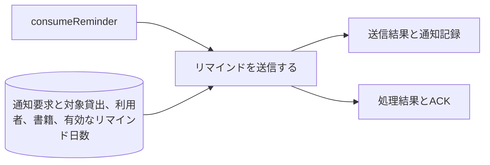
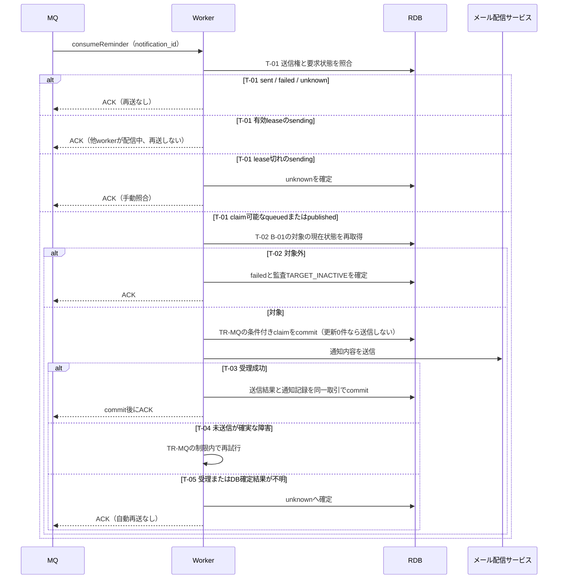

# リマインドを送信する

## 概要

日次抽出で作成した要求に基づき、利用者へ返却期限のリマインドメールを配信する。送信時に返却済みになった貸出は配信対象から外す。

## データフロー



## シーケンス



## 分岐条件の接続

| 分岐ID | 正本 | 結果 |
|---|---|---|
| B-01 | [条件](../../../../../../rdra/latest/条件.tsv)のリマインド対象判定 | 抽出時の業務対象を決める |
| T-01 | [TR-MQ](../../../_cross-cutting/technical-rules.md#TR-MQ) | 確定済み・有効lease→ACK、lease切れ→unknown、claim可能→状態再確認 |
| T-02 | worker仕様の送信対象 | 対象→送信権取得、対象外→送信抑止してACK |
| T-03/T-04/T-05 | [TR-MQ](../../../_cross-cutting/technical-rules.md#TR-MQ) | 受理成功→結果保存、確実な未送信→限定再試行、不明→自動送信停止 |

## 関連 RDRA モデル

| モデル | 要素 | 適用箇所 |
|---|---|---|
| [BUC](../../../../../../rdra/latest/BUC.tsv) | 期限管理業務 / 返却期限を通知するフロー / リマインドを送信する | 日次起動と処理責任 |
| [情報](../../../../../../rdra/latest/情報.tsv) | 貸出, 利用者, 通知, 書籍 | 取得と保存 |
| [外部システム](../../../../../../rdra/latest/外部システム.tsv) | メール配信サービス | 配信workerの外部送信 |

## E2E 完了条件（BDD）

```gherkin
Feature: リマインドを送信する
  Scenario: リマインドを配信する
    Given L-001が未返却の貸出中でリマインド対象、N-001がqueuedである
    When N-001を受信し配信サービスがメールを受理する
    Then 成功通知を1件保存し、N-001をsentにしてACKする

  Scenario: 返却後は配信しない
    Given L-001が返却済みになった後、N-001がMQから届いた
    When workerが送信前に現在状態を読む
    Then メールを送らず、対象外の処理結果を記録してACKする

  Scenario: 重複メッセージを受ける
    Given N-001はsentである
    When 同じN-001が再配信される
    Then 送信と通知記録を増やさずACKする
```

## ティア別仕様

- [worker仕様](tier-worker.md)
- [契約索引](_api-summary.yaml)のconsumeReminder

## 配信権の完了条件

```gherkin
Feature: リマインドを送信するの配信権
  Scenario: 配信中の通知を別workerが受信する
    Given N-001はsendingでlease_untilが現在時刻より後である
    When 別workerが同じN-001を受信する
    Then 外部送信せずACKし、先行workerのclaimを維持する

  Scenario: 対象外抑止後に再配信される
    Given N-001は対象外としてfailedと監査TARGET_INACTIVEが保存済みである
    When 同じN-001を受信する
    Then メールと通知履歴を増やさずACKする
```
