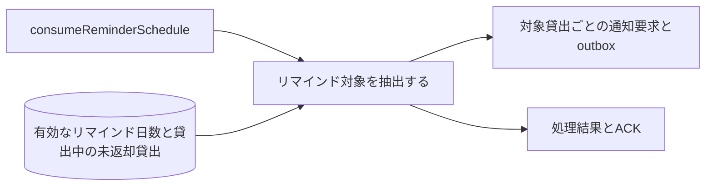
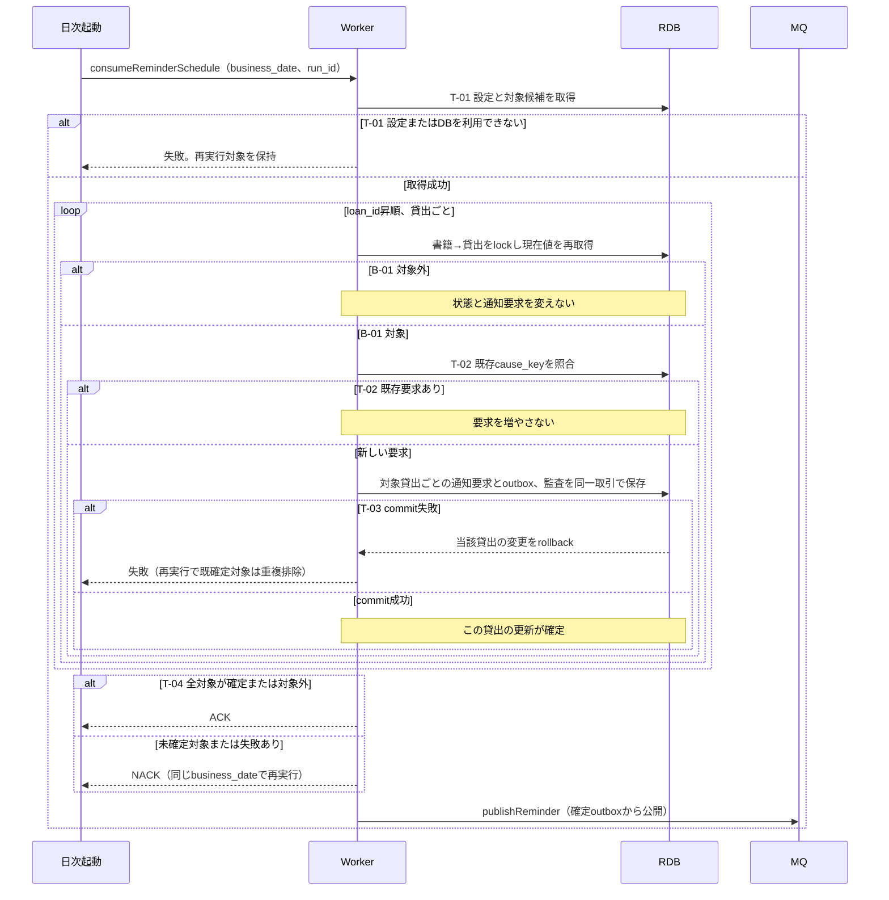

# リマインド対象を抽出する

## 概要

日次処理が未返却貸出とリマインド日数を照合し、対象利用者への通知要求を保存する。過去に同じ貸出へ作成した要求は増やさない。

## データフロー



## シーケンス



## 分岐条件の接続

| 分岐ID | 正本 | 結果 |
|---|---|---|
| B-01 | [条件](../../../../../../rdra/latest/条件.tsv)のリマインド対象判定 | 成立→要求保存、不成立→当該貸出をスキップ |
| T-01 | [TR-PARAM](../../../_cross-cutting/technical-rules.md#TR-PARAM)、[TR-DATE](../../../_cross-cutting/technical-rules.md#TR-DATE) | 設定不足や重複→処理失敗、正常→走査 |
| T-02 | [TR-MQ](../../../_cross-cutting/technical-rules.md#TR-MQ)のcause_key | 既存あり→追加なし、なし→要求作成 |
| T-04 | worker仕様の再開 | 全対象確定または対象外→ACK、失敗あり→NACK |
| T-03 | [TR-TX](../../../_cross-cutting/technical-rules.md#TR-TX) | 失敗→当該取引rollback、成功→次の対象 |

## 関連 RDRA モデル

| モデル | 要素 | 適用箇所 |
|---|---|---|
| [BUC](../../../../../../rdra/latest/BUC.tsv) | 期限管理業務 / 返却期限を通知するフロー / リマインド対象を抽出する | 日次起動と処理責任 |
| [情報](../../../../../../rdra/latest/情報.tsv) | 貸出, リマインド日数, 利用者 | 取得と保存 |
| [外部システム](../../../../../../rdra/latest/外部システム.tsv) | メール配信サービス | 配信workerの外部送信 |

## E2E 完了条件（BDD）

```gherkin
Feature: リマインド対象を抽出する
  Scenario: 期限が近い貸出を抽出する
    Given business_date=2026-09-06、有効なremind_days=3、返却期限2026-09-09の貸出L-001が貸出中である
    When 日次リマインド抽出を実行する
    Then L-001のリマインド要求を1件保存する

  Scenario: 期間外を除外する
    Given business_date=2026-09-06、有効なremind_days=3、返却期限2026-09-10の貸出L-002が貸出中である
    When 日次リマインド抽出を実行する
    Then L-002の通知要求を作らない

  Scenario: 再実行しても要求を増やさない
    Given L-001のリマインド要求が既に保存されている
    When 同じ日付または翌日の抽出を再実行する
    Then 同じ貸出IDと通知種別の要求は1件のままである
```

## ティア別仕様

- [worker仕様](tier-worker.md)
- [契約索引](_api-summary.yaml)のconsumeReminderSchedule
