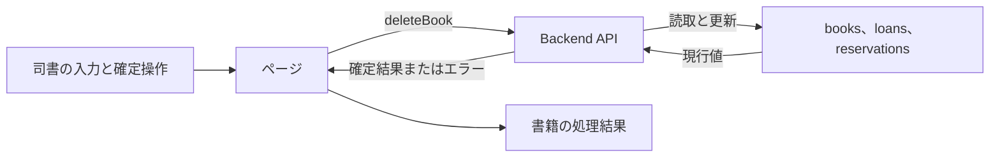
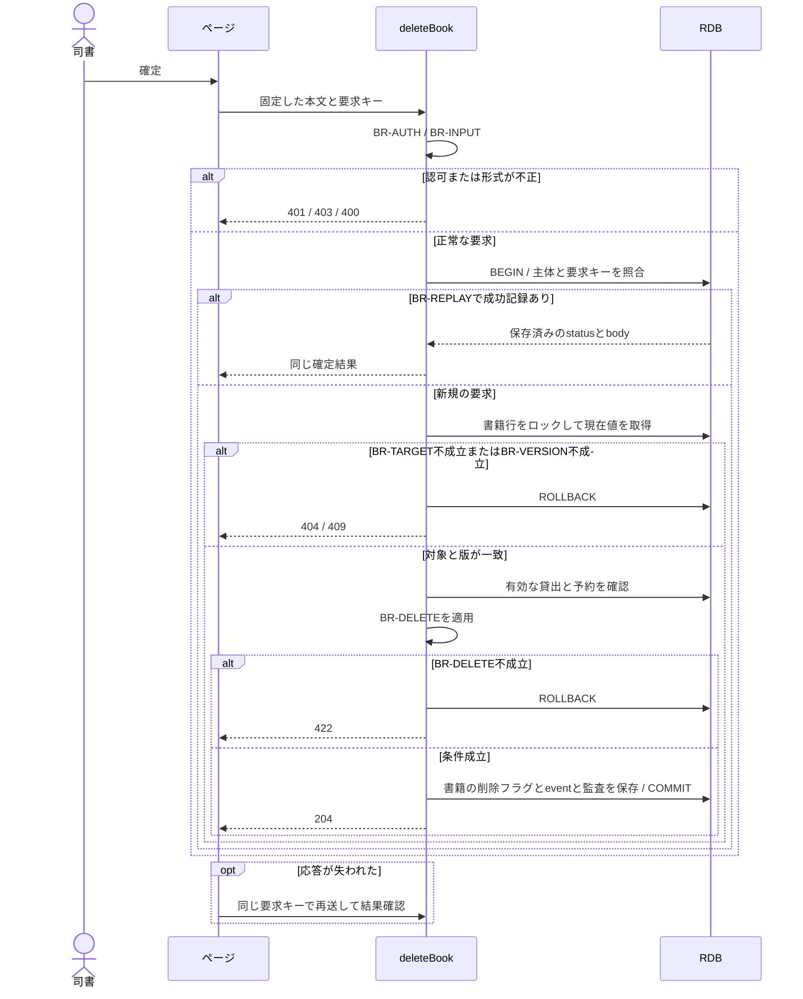

# 書籍を削除する

## 概要

司書が対象書籍を確認して蔵書から除外する。
貸出と予約の処理が継続する書籍には削除を適用しない。

## データフロー



## シーケンス



## 分岐の接続

| 分岐ID | 条件の正本 | 成立時 | 不成立時 |
|---|---|---|---|
| BR-AUTH | [TR-AUTH](../../../_cross-cutting/technical-rules.md#tr-auth-認証と参照範囲)とdeleteBookの許可ロール | 書籍の更新へ進む | 認証不成立401、許可外403 |
| BR-INPUT | [分割契約](../../../_cross-cutting/api/openapi.yaml)のdeleteBook | 対象の確認へ進む | 400 INVALID_INPUT、業務変更なし |
| BR-TARGET | 書籍の識別子が一致しdeleted=false | 対象を処理する | 404 NOT_FOUND、業務変更なし |
| BR-DELETE | [状態](../../../../../../rdra/latest/状態.tsv)の書籍の状態／書籍を削除する | 有効な取引がない対象を削除する | 422 BUSINESS_RULE_VIOLATION、削除なし |
| BR-REPLAY | [TR-IDEMP](../../../_cross-cutting/technical-rules.md#tr-idemp-再送と結果の回復) | 同じ要求の成功結果を返す | 未処理は新規実行、異なるhashは409 |
| BR-VERSION | If-Matchが書籍のversionと一致 | 版を更新してcommitする | 409 VERSION_CONFLICT、業務変更なし |

## 状態遷移参照

[状態](../../../../../../rdra/latest/状態.tsv)の状態モデル「書籍の状態」、遷移UC「書籍を削除する」を適用する。

永続化対象は[_model-summary.yaml](_model-summary.yaml)の操作を参照する。

## 関連RDRAモデル

| 種類 | 要素の参照先 |
|---|---|
| 情報 | [書籍](../../../../../../rdra/latest/情報.tsv) の「書籍」 |
| 画面 | [書籍削除確認画面](../../../../../../rdra/latest/BUC.tsv) の「書籍削除確認画面」 |
| アクター | [司書](../../../../../../rdra/latest/アクター.tsv) |

## E2E完了条件

```gherkin
Feature: 書籍を削除する
  Scenario: 書籍を削除するの業務結果
    Given 在庫ありの書籍B-001に未返却貸出と有効予約が存在しない
    When 削除確認画面で確定する
    Then B-001が蔵書一覧と検索から除外され、既存の返却済み貸出履歴は保持される

  Scenario: 書籍を削除するの不成立時
    Given 書籍B-002が貸出中である
    When 削除確認画面で確定する
    Then 削除は422となり、書籍と貸出が維持される

  Scenario: 予約待ちの書籍を保持する
    Given B-001は予約待ちで通知済み予約が1件ある
    When 削除を要求する
    Then 422となり、書籍と予約の状態は変わらない
```

## ティア別仕様

- [tier-frontend-staff](tier-frontend-staff.md)
- [tier-backend-api](tier-backend-api.md)
