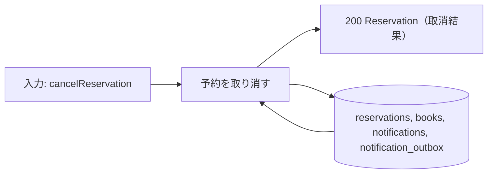
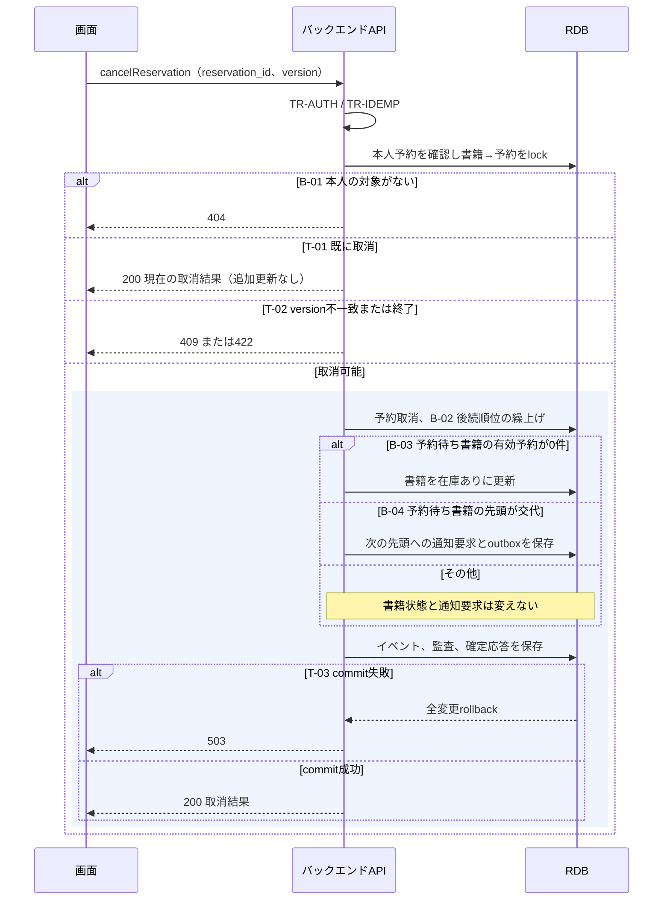

# 予約を取り消す

## 概要

利用者が自分の予約を選んで取り消す。後続の予約順位を繰り上げ、先頭の取消による書籍状態と次の通知要求を確定する。

## データフロー



## シーケンス



## 分岐条件の接続

| 分岐ID | 条件の正本 | 結果 |
|---|---|---|
| B-01 | [利用状況閲覧範囲判定](../../../../../../rdra/latest/条件.tsv) | 本人→取消判定、本人外→404 |
| B-02 | [予約順位決定](../../../../../../rdra/latest/条件.tsv) | 有効な後続予約を繰り上げる |
| B-03 | [書籍の状態、遷移UC「予約を取り消す」](../../../../../../rdra/latest/状態.tsv) | 予約待ちの有効予約0件→在庫あり |
| B-04 | [予約の状態、通知済みから取消](../../../../../../rdra/latest/状態.tsv) | 先頭交代→次の先頭へ通知要求、交代なし→要求なし |
| T-01 | [TR-IDEMP](../../../_cross-cutting/technical-rules.md#TR-IDEMP) | 取消済み→200で現在値、追加更新なし |
| T-02 | [TR-TX](../../../_cross-cutting/technical-rules.md#TR-TX) | version不一致→409、終了→422 |
| T-03 | [TR-TX](../../../_cross-cutting/technical-rules.md#TR-TX) | 成功→200、失敗→rollbackして503 |

## 状態遷移参照

[状態](../../../../../../rdra/latest/状態.tsv)の予約の状態、書籍の状態、遷移UC「予約を取り消す」を参照する。
原子的な更新は[_model-summary.yaml](_model-summary.yaml)の操作を参照する。

## 関連 RDRA モデル

| モデル | 要素 | 適用箇所 |
|---|---|---|
| [BUC](../../../../../../rdra/latest/BUC.tsv) | 貸出業務 / 書籍を予約するフロー / 予約を取り消す | 所属と入力契機 |
| [アクター](../../../../../../rdra/latest/アクター.tsv) | 利用者 | 操作主体 |
| [情報](../../../../../../rdra/latest/情報.tsv) | 予約, 書籍 | データ操作と契約 |

## E2E 完了条件（BDD）

```gherkin
Feature: 予約を取り消す
  Scenario: 通知済みの先頭を取り消す
    Given 予約待ち書籍B-000101の先頭R-001が本人の通知済み予約で、R-002が後続にある
    When 利用者がR-001を取り消す
    Then R-001は取消、R-002は順位1になり、R-002の返却通知要求が1件保存される

  Scenario: 最後の予約を取り消す
    Given 書籍が予約待ちで、本人のR-001だけが有効予約である
    When 本人がR-001を取り消す
    Then R-001は取消になり、書籍は在庫ありになる

  Scenario: 他人の予約を指定する
    Given R-001はU-000124の予約である
    When U-000123がR-001の取消を要求する
    Then 404を返し、予約の存在や個人情報を返さず、順位も変えない
```

## ティア別仕様

- [tier-backend-api.md](tier-backend-api.md)
- [tier-frontend-user.md](tier-frontend-user.md)
- [API索引](_api-summary.yaml)のcancelReservation
