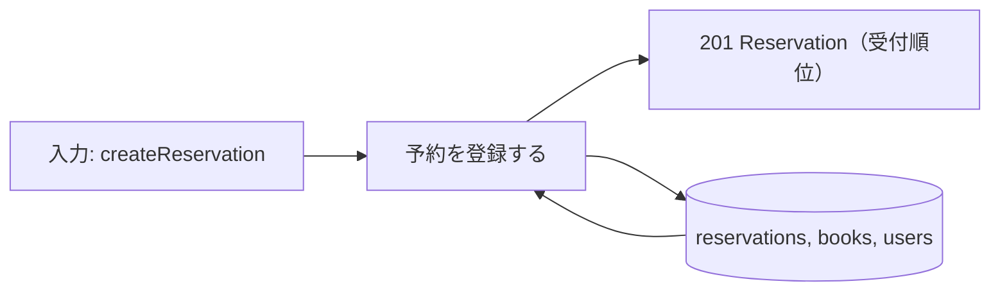
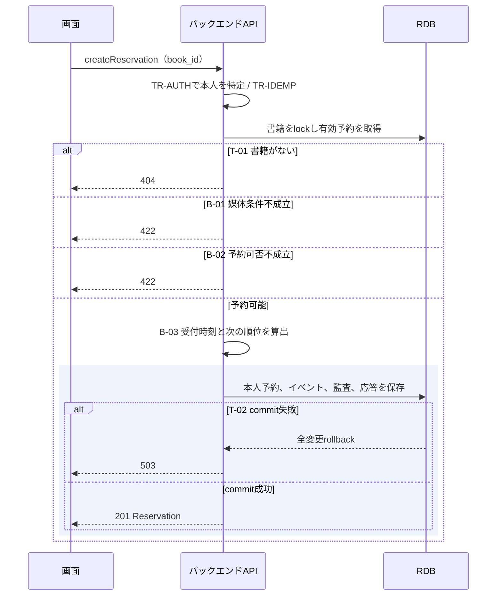

# 予約を登録する

## 概要

利用者が書籍詳細から予約を申し込む。受付順の順位を付けた本人の予約を作成し、結果を表示する。

## データフロー



## シーケンス



## 分岐条件の接続

| 分岐ID | 条件の正本 | 結果 |
|---|---|---|
| B-01 | [媒体種別判定](../../../../../../rdra/latest/条件.tsv) | 成立→B-02、不成立→422 |
| B-02 | [予約可否判定](../../../../../../rdra/latest/条件.tsv) | 成立→順位算出、不成立→422 |
| B-03 | [予約順位決定](../../../../../../rdra/latest/条件.tsv) | 受付順の次順位を割り当てて保存 |
| T-01 | [TR-ERROR](../../../_cross-cutting/technical-rules.md#TR-ERROR) | 不存在→404 |
| T-02 | [TR-TX](../../../_cross-cutting/technical-rules.md#TR-TX) | 成功→201、失敗→rollbackして503 |

## 状態遷移参照

[状態](../../../../../../rdra/latest/状態.tsv)の予約の状態、遷移UC「予約を登録する」を参照する。
原子的な更新は[_model-summary.yaml](_model-summary.yaml)の操作を参照する。

## 関連 RDRA モデル

| モデル | 要素 | 適用箇所 |
|---|---|---|
| [BUC](../../../../../../rdra/latest/BUC.tsv) | 貸出業務 / 書籍を予約するフロー / 予約を登録する | 所属と入力契機 |
| [アクター](../../../../../../rdra/latest/アクター.tsv) | 利用者 | 操作主体 |
| [情報](../../../../../../rdra/latest/情報.tsv) | 予約, 書籍, 利用者 | データ操作と契約 |

## E2E 完了条件（BDD）

```gherkin
Feature: 予約を登録する
  Scenario: 予約待ちの紙書籍を予約する
    Given 紙の書籍B-000101が予約待ちで、既存の有効予約が2件ある
    When 利用者U-000123が予約する
    Then 本人の予約を順位3で作成し、書籍は予約待ちのままである

  Scenario: 電子書籍を拒否する
    Given 書籍B-000102の媒体は電子である
    When 利用者が予約する
    Then 422を返し、予約と順位は変わらない

  Scenario: 受付を同時に行う
    Given 紙の貸出中書籍の有効予約が2件ある
    When 二人の利用者が同時に予約する
    Then ロック取得後の受付順に順位3と4を付け、順位の重複を作らない
```

## ティア別仕様

- [tier-backend-api.md](tier-backend-api.md)
- [tier-frontend-user.md](tier-frontend-user.md)
- [API索引](_api-summary.yaml)のcreateReservation

## 同時更新の完了条件

```gherkin
Feature: 予約を登録すると利用者削除
  Scenario: 利用者削除が先に確定する
    Given 対象利用者の削除が利用者行lockを取得して確定した
    When 新規取引が同じ利用者行lockを取得する
    Then deleted=trueを検出して404を返し、有効取引を作らない

  Scenario: 新規取引が先に確定する
    Given 新規取引が利用者行lockを取得して確定した
    When 利用者削除が同じlockを取得する
    Then 有効取引を検出して削除を422で拒否する
```
