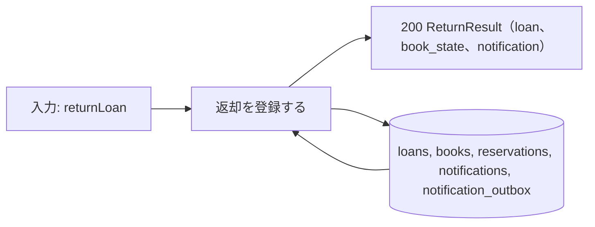
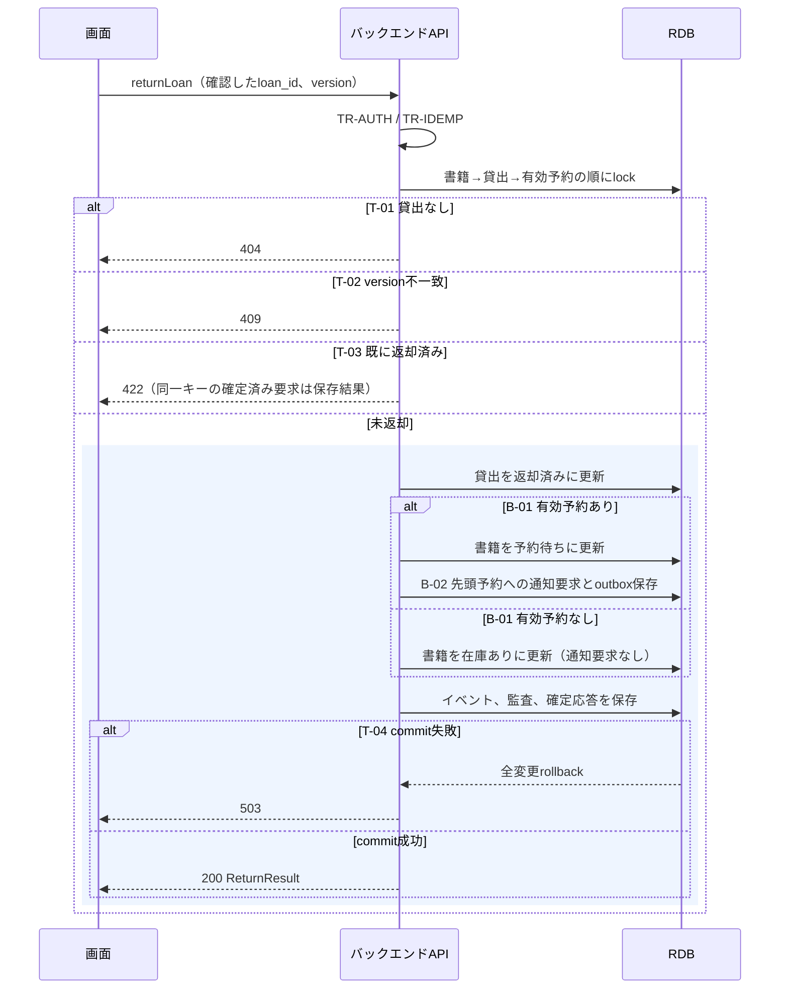

# 返却を登録する

## 概要

司書が書籍IDから貸出を確認し、返却を確定する。貸出を返却済みにし、予約の有無に応じて書籍状態と返却通知要求を保存する。

## データフロー



## シーケンス



## 分岐条件の接続

| 分岐ID | 条件の正本 | 結果 |
|---|---|---|
| B-01 | [返却後の書籍状態判定](../../../../../../rdra/latest/条件.tsv) | 予約あり→予約待ち、なし→在庫あり。どちらも返却成功 |
| B-02 | [返却通知対象判定](../../../../../../rdra/latest/条件.tsv) | 予約あり→先頭への要求、なし→要求なし |
| T-01 | [TR-ERROR](../../../_cross-cutting/technical-rules.md#TR-ERROR) | 不存在→404 |
| T-02 | [TR-TX](../../../_cross-cutting/technical-rules.md#TR-TX) | version不一致→409 |
| T-03 | [TR-IDEMP](../../../_cross-cutting/technical-rules.md#TR-IDEMP) | 同一キー→保存応答、新しいキーの返却済み→422 |
| T-04 | [TR-TX](../../../_cross-cutting/technical-rules.md#TR-TX) | 成功→200、失敗→rollbackして503 |

## 状態遷移参照

[状態](../../../../../../rdra/latest/状態.tsv)の書籍の状態、貸出の状態、遷移UC「返却を登録する」を参照する。
原子的な更新は[_model-summary.yaml](_model-summary.yaml)の操作を参照する。

## 関連 RDRA モデル

| モデル | 要素 | 適用箇所 |
|---|---|---|
| [BUC](../../../../../../rdra/latest/BUC.tsv) | 貸出業務 / 書籍を返却するフロー / 返却を登録する | 所属と入力契機 |
| [アクター](../../../../../../rdra/latest/アクター.tsv) | 司書 | 操作主体 |
| [情報](../../../../../../rdra/latest/情報.tsv) | 貸出, 書籍, 予約 | データ操作と契約 |

## E2E 完了条件（BDD）

```gherkin
Feature: 返却を登録する
  Scenario: 予約のある返却
    Given B-000101の貸出L-001が貸出中でversion=1、先頭予約R-001が予約中である
    When 司書がL-001をversion=1で返却する
    Then 貸出は返却済み、書籍は予約待ちになり、R-001の返却通知要求が1件保存される

  Scenario: 予約のない延滞返却
    Given 貸出L-002が延滞でversion=2、対象書籍に有効予約がない
    When 司書がL-002をversion=2で返却する
    Then 貸出は返却済み、書籍は在庫ありになり、通知要求は増えない

  Scenario: commit後に応答が失われる
    Given 返却と通知要求をcommitした直後に接続が切れた
    When 司書画面が同一キーと同一入力で再送する
    Then 前回のReturnResultを返し、返却イベントと通知要求は各1件のままである
```

## ティア別仕様

- [tier-backend-api.md](tier-backend-api.md)
- [tier-frontend-staff.md](tier-frontend-staff.md)
- [API索引](_api-summary.yaml)のreturnLoan
